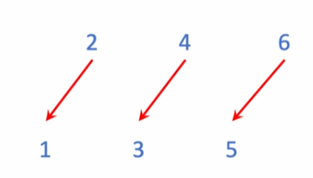
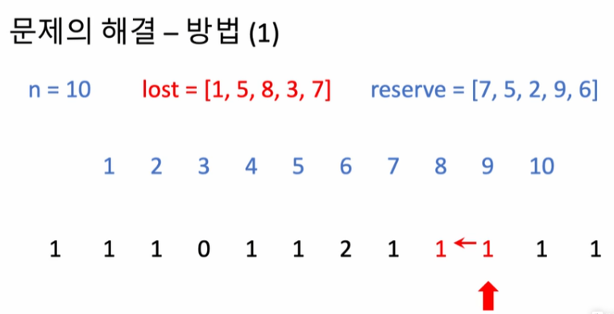
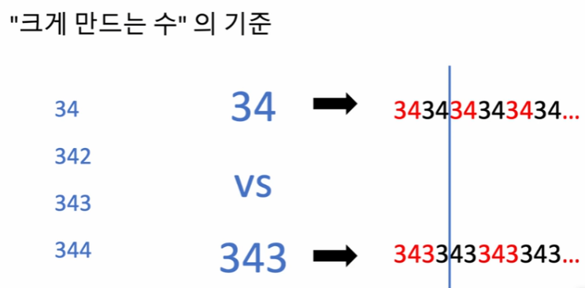

## <u>step 1: 해시(Hash) 문제 풀이</u>

- ### 자료구조(와 알고리즘)의 선택

1.  만약 이름 대신 번호가 주어졌다면?

    - -> _선형배열(linear array)_
    - 번호 말고 다른 것(예:문자열)로 접근할 수 있는 좋은 자료구조?

---

2. 해시 테이블에 같은 칸에 사상(매핑)되면 <u>충돌(collision)</u>

- 정렬을 이용한다면?   
  

  ***

  - 테스트는 통과하지만 <u>O(nlogn)</u>

## <u>step 2: 탐욕법(Greedy) 문제 풀이</u>

- ### 탐욕법(Greedy Algorithm)
  - 알고리즘의 각 단계에서 그 순간에 최적이라고 생각되는 것을 선택
  - (탐욕법으로 최적해를 찾을 수 있는 문제): **현재의 선택이 마지막 해답의 최적성을 해치지 않을 때**
  - 빌려줄 학생들을 "정해진 순서"로 살피고 "정해준 순서"에 따라 우선하여 빌려줄 방향을 정해야 함 
    
  - 왼쪽 먼저 방식 채택하여 시뮬레이션
  ***
   
    
    
    
    ---
- 알고리즘 복잡도
  - 주어진 배열 길이에 비례: O(n)
- 방법(2)
  - 만약 전체 학생 수가 매우 크다면?: 하지만 문제의 설질상 O(n)보다 낮은 복잡도 알고리즘은 어렵다
  - 그런데 여벌의 체육복을 가져온 학생이 매우 적다면?: 
    - 여벌의 체육복을 가져온 학생들의 번호(reserve)를 정렬(O(nlogn))하고, 이것을 하나하나 순서대로 살펴보면서 빌려줄 수 있는 다른 학생을 찾아서(해시적용 상수 시간에 처리) 처리
- 알고리즘 복잡도
  - 여벌의 체육복을 가져온 학생들의 번호(reserve)를 정렬  
    -> O(klogk)
  - 체육복을 빌려줄 수 있는 학생을 찾아 처리  
    -> O(k) x O(1) = O(k)
  - 전체: O(klogk)

## <u>step 3: 정렬(Sort) 문제 풀이</u>

- 가장 큰 수
  - 문제 해결 방법
     
  1. 빈 문자열로 수를 초기화한다.
  2. 가장 크게 만들 수 있는 수를 고른다.
  3. 그 수를 현재 수에 이어 붙임
  4. 모든 수를 다 사용할 때까지 반복

  
 
 
 
 
 
 
 
 
 
 
 
 
 
 
 
 
 

## <u>step 4: 탐욕법(Sort) 문제 풀이</u>

- 큰 수 만들기 - 원칙
  - 앞 자리에 큰 수가 오는 것이 전체를 크게 만듬
     -> 큰 것을 우선해서 골라 담자
  - 방법
    - 앞자리에서부터 하나씩 골라서 담되,
    - 지금 담으려는 것보다 작은 것들은 도로 뺀다! 단, k 횟수가 남아있을 때까지

---

---

- 주어진 숫자로부터 하나씩 꺼내 모으되
  - 이 때, 이미 모아둔 것중 지금 등장한 것보다 작은 것들은 빼낸다.
  - 이것은 어디서 어떻게??
- 이렇게 모은 숫자들을 자릿수 맞추어 반환
  - 아직 뺄 개수(k)를 채우지 못한 경우
  - 자릿수는 어떻게 계산??
- 복잡도
  - 가장 단순한 방법은 어떤 것일까?
  - 설계한 알고리즘의 복잡도는?
    - ~~O(n^2)~~
    - O(n)
-
