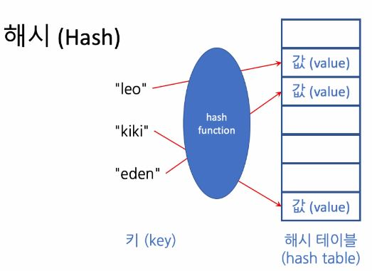
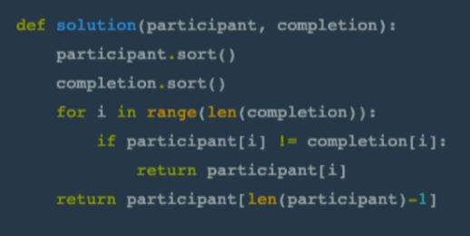

## <u>step 1: 해시(Hash) 문제 풀이</u>

- ### 자료구조(와 알고리즘)의 선택

1.  만약 이름 대신 번호가 주어졌다면?

    - -> _선형배열(linear array)_
    - 번호 말고 다른 것(예:문자열)로 접근할 수 있는 좋은 자료구조?

---

2. 해시 테이블에 같은 칸에 사상(매핑)되면 <u>충돌(collision)</u>

- 정렬을 이용한다면?   
  

  ***

  - 테스트는 통과하지만 <u>O(nlogn)</u>

## <u>step 2: 탐욕법(Greedy) 문제 풀이</u>

- ### 탐욕법(Greedy Algorithm)
  - 알고리즘의 각 단계에서 그 순간에 최적이라고 생각되는 것을 선택
  - (탐욕법으로 최적해를 찾을 수 있는 문제): **현재의 선택이 마지막 해답의 최적성을 해치지 않을 때**
  - 빌려줄 학생들을 "정해진 순서"로 살피고 "정해준 순서"에 따라 우선하여 빌려줄 방향을 정해야 함 
  
  - 왼쪽 먼저 방식 채택하여 시뮬레이션
  ***
   
    
    
    
    ---
- 알고리즘 복잡도
  - 주어진 배열 길이에 비례: O(n)
  -
