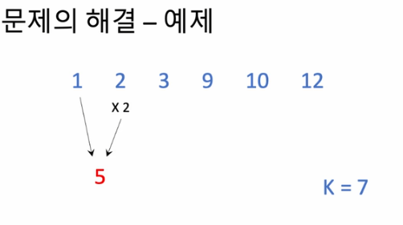
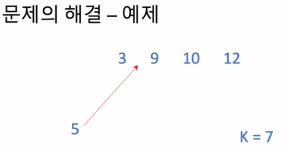
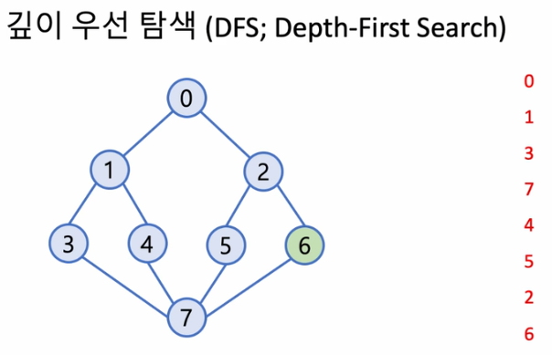
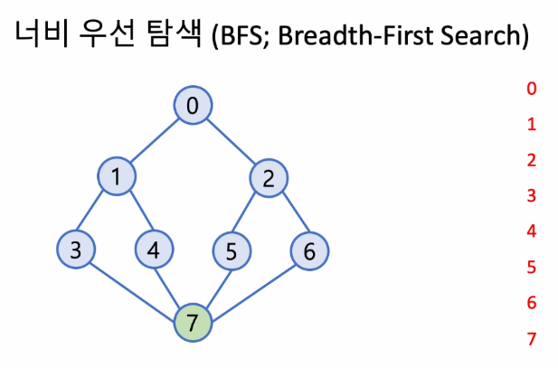
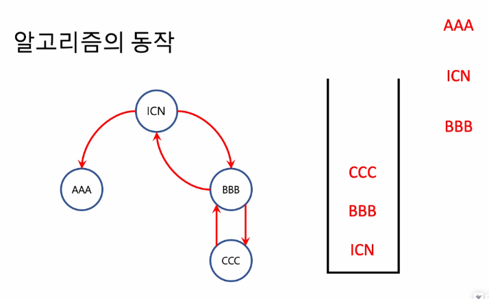
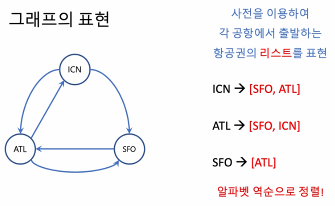
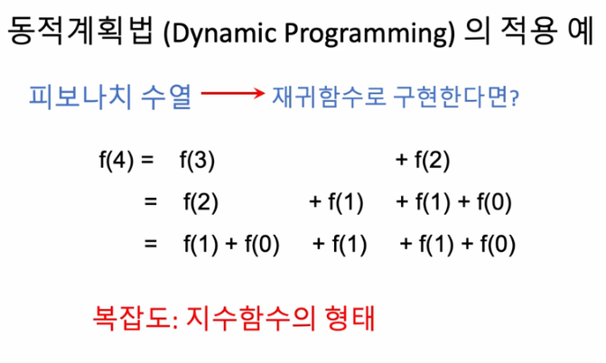
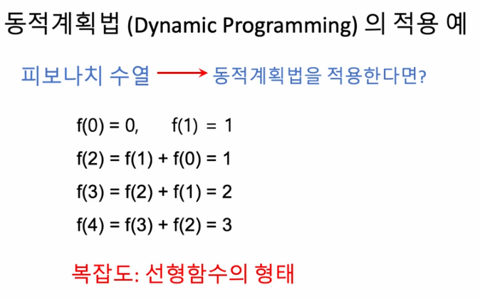

## <u>step 5-1: 힙(Heap) 문제 풀이</u>

- 문제: 더 맵게

  
  

- 배열 내 모든 원소가 k보다 클 때까지 반복

---

- 복잡도
  - 최악의 경우:
    - 수가 하나 남을 때까지 섞어야하는 경우 (n-1회)
    -

---

<br>
추가

<br>

---

<br>

## <u>step 5-2: 힙(Heap) 문제 풀이</u>

- Python에서 힙

```python
import heapq
heap.heapify(L)   # 리스트 L로부터 min heap 구성
m = heapq.heappop(L)  # min heap L에서 최소값 삭제(반환)
heapq.heappush(L,x) # min heap L에 원소 x삽입

```

- 알고리즘 복잡도 : <span style="color:red">O(nlogn)</span>

<br>
<br>

## <u>step 7-1~2: 깊이/너비 우선 탐색(DFS/BFS) 문제 풀이</u>

- 배경지식
  - 그래프(graphs)
    - 정점(vertex, node)과 간선(edge,link)
    - 유향(directed)그래프와 무향(undirected)그래프
- 스택(stack)(LIFO)
- 큐(queue)(FIFO)

- 깊이 우선 탐색(DFS; Depth-First Search)
  - 한 정점에서 인접한 모든 (아직 방문하지 않은)정점을 방문하되, 각 인접
    정점을 기준으로 깊이 우선 탐색을 끝낸 후 다음 정점으로 진행
    
    <span style="color:red">스택</span>을 이용: 어느 정점에서 DFS를 하고
    있는지를 기억하고 되돌아감

<br>

- 깊이 우선 탐색(DFS; Depth-First Search)

  - 한 정점에서 인접한 모든(아직 방문하지 않은)정점을 방문하고, 방문한 각
    인접 정점을 기준으로 (방문한 순서에 따라) 또다시 너비 우선 탐색을 행함
    
    <span style="color:red">큐</span>을 이용: 어느 정점에서 BFS를 해야 하는지를 기록하고 진행함

- 문제 해결 - DFS 응용
  - 한 붓 그리기!
    - 이것이 가능함은 문제에서 보장
  - 시작 정점은 언제나 "ICN"
  - 모든 정점 방문이 아니고, 모든 간선을 거쳐야
    - 언젠가는 한 번 가야하는데, 그 순서를 결정하라
  - 한 정점에서 택할 수 있는 간선이 두개 이상인 경우?
    - 공항 이름의 알파벳 순서를 따른다.
- 알고리즘의 동작
   |
  --- | --- |
  <br>

- 요약
  - 재귀적인 성질을 가진 "한 붓 그리기" 문제
    -> 재귀적인 성질을 가진
    "그래프의 깊이 우선 탐색"을 응용
- 코드 구현
  

<br>
<br>

## <u>step 6-1~2: 동적계획법(Dynamic Programming) 문제 풀이</u>

- 주어진 최적화 문제를 재귀적인 방식으로 보다 작은 부분 문제로 나누어
  부분 문제를 풀어서, 이 해를 조합하여 전체 문제의 해답에 이르는 방식

- 알고리즘의 진행에 따라 <span style="color:red">탐색해야 할 범위를 동적으로 결정</span>함으로써 탐색
  범위를 한정할 수 있음

|  |  |
| -------------------------- | -------------------------- |

<br>
<br>
<br>
<br>
<br>
<br>
<br>
<br>
