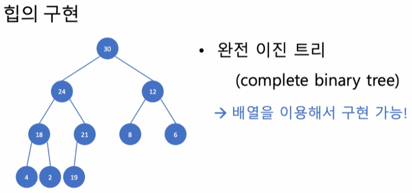
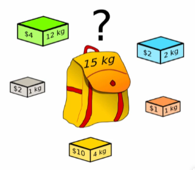
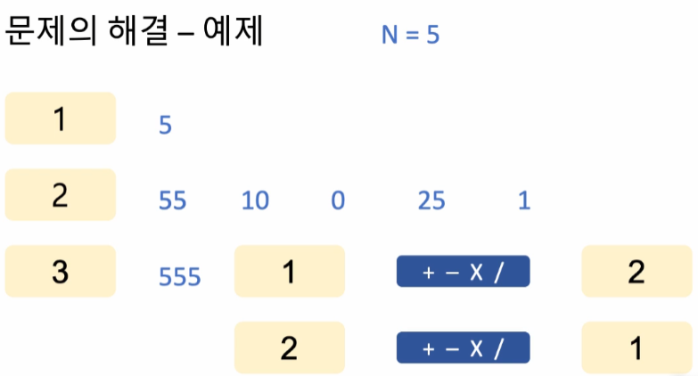
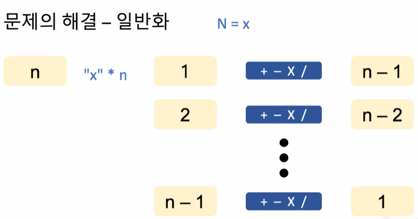

## <u>step 5-1: 힙(Heap) 문제 풀이</u>

- 문제: 더 맵게

  
  

- 배열 내 모든 원소가 k보다 클 때까지 반복

---

- 복잡도

  - 최악의 경우:
    - 수가 하나 남을 때까지 섞어야하는 경우 (n-1회)
  - 각 단계("섞는 일")에서 요구되는 계산량:
    - 정렬된 리스트에 순서 맞추어 원소 삽입
    - O(n)

- 방법: max heap, min heap을 고려할 것
- heap: 최대/최소 원소를 빠르게 찾을 수 있음(상수시간)

  - 힙 구성(heapify) ${\color{red}O(NlogN)}$
  - 삽입(insert) ${\color{red}O(logN)}$
  - 삭제(remove) ${\color{red}O(logN)}$

<br>


<br>

- 최대 힙: 부모 노드의 키 값이 자식 노드의 키 값보다 크거나 같은
  완전 이진 트리

* 노드 관계
  - 0-base
    - 왼쪽 자식: (부모 index) x 2 + 1
    - 오른쪽 자식: (부모 index) x 2 + 2
    - 부모: (자식 index) / 2 - 1
  - 편의상 0번째 배열 사용 x
  - 1-base
    - 왼쪽 자식: (부모 index) x 2
    - 오른쪽 자식: (부모 index) x 2 + 1
    - 부모: (자식 index) / 2

<br>

[출처] = https://velog.io/@redgem92/%EC%9E%90%EB%A3%8C%EA%B5%AC%EC%A1%B0-%ED%9E%99-%ED%8A%B8%EB%A6%ACHeap-Tree

---

- 힙의 응용
  - 정렬(heapsort)
  - 우선 순위 큐(priority queue)

<br>

## <u>step 5-2: 힙(Heap) 문제 풀이</u>

- Python에서 힙

```python
import heapq
heap.heapify(L)   # 리스트 L로부터 min heap 구성
m = heapq.heappop(L)  # min heap L에서 최소값 삭제(반환)
heapq.heappush(L,x) # min heap L에 원소 x삽입

```

- 알고리즘 복잡도 : ${\color{red}O(nlogn)}$

<br>
<br>

## <u>step 7-1~2: 깊이/너비 우선 탐색(DFS/BFS) 문제 풀이</u>

- 배경지식
  - 그래프(graphs)
    - 정점(vertex, node)과 간선(edge,link)
    - 유향(directed)그래프와 무향(undirected)그래프
- 스택(stack)(LIFO)
- 큐(queue)(FIFO)

- 깊이 우선 탐색(DFS; Depth-First Search)

  - 한 정점에서 인접한 모든 (아직 방문하지 않은)정점을 방문하되, 각 인접
    정점을 기준으로 깊이 우선 탐색을 끝낸 후 다음 정점으로 진행
    

    ${\color{red}스택}$을 이용: 어느 정점에서 DFS를 하고
    있는지를 기억하고 되돌아감

<br>

- 깊이 우선 탐색(DFS; Depth-First Search)

  - 한 정점에서 인접한 모든(아직 방문하지 않은)정점을 방문하고, 방문한 각
    인접 정점을 기준으로 (방문한 순서에 따라) 또다시 너비 우선
    탐색을 행함

    

    ${\color{red}큐}$를 이용: 어느 정점에서 BFS를 해야 하는지를 기록하고 진행함

- 문제 해결 - DFS 응용
  - 한 붓 그리기!
    - 이것이 가능함은 문제에서 보장
  - 시작 정점은 언제나 "ICN"
  - 모든 정점 방문이 아니고, 모든 간선을 거쳐야
    - 언젠가는 한 번 가야하는데, 그 순서를 결정하라
  - 한 정점에서 택할 수 있는 간선이 두개 이상인 경우?
    - 공항 이름의 알파벳 순서를 따른다.
- 알고리즘의 동작
   |
  --- | --- |
  <br>

- 요약
  - 재귀적인 성질을 가진 "한 붓 그리기" 문제
    -> 재귀적인 성질을 가진
    "그래프의 깊이 우선 탐색"을 응용
- 코드 구현
  

<br>
<br>

## <u>step 6-1~2: 동적계획법(Dynamic Programming) 문제 풀이</u>

- 주어진 최적화 문제를 재귀적인 방식으로 보다 작은 부분 문제로 나누어
  부분 문제를 풀어서, 이 해를 조합하여 전체 문제의 해답에 이르는 방식

- 알고리즘의 진행에 따라 ${\color{red}탐색해야 할 범위를 동적으로 결정}$함으로써 탐색
  범위를 한정할 수 있음

|  |  |
| -------------------------- | -------------------------- |

- DP의 대표 예) Knapsack Problem

  |  |
  | --------------------------- |

- \*실습(N으로 표현)
  
  <br>

  - 같은 부분 있는 것 착안

  <br>

  - **일반화**

    

<br>
  
- 요약
  - 문제의 성질에 따라,
    DP로 풀어냄으로써 탐색해야 하는 범위를 효과적으로 줄일 수 있을 
    때 DP를 고려해볼 것

<br>

---

- 문제 풀이

- [특강]ChatGPT 활용하기
  - 학습하는데 사용해보자
    - 기술적 이야기
      - LLM과 GPT와 ChatGPT 소개
      - 문서 파싱으로 모델 러닝 패턴 분석 (자연스럽게
        따라나오는 것)
      - 사실을 기반으로 한 정보 입력이 중요하다
  - 구글이 많은 기여
    - 하둡 - 스카프
- ChatGPT
  - Prompts 엔지니어링 -> 질문의 중요성으로 대두
  - 첫 질답에 이어서 다듬는 질문을 하면 원하는 것에 도달할 수
    있음(단발성 질문 x)
  - 생산성 증대 툴
  - ${\color{red} 학습 커리큘럼에 활용}$해보자(참고 자료(문서, 링크)를 요구)

<br>

**1. 이론 강의 추가할 부분 추가 진행** <br>
**2. 선택 강의 문제 풀이 진행**
