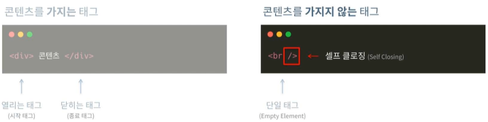

## <u>Part01 개요</u>

### Part01 - 개요

### Part02 - HTML

### Part03 - CSS

### Part04 - 반응형

### Part05 - End

1. 윈도우 환경 실습

- VSCode 설치
- VSCode 기본 세팅 진행
- 설정: Compact Folders 해제
- Extensions 추가
  1. Material Icon Theme
  2. indent-rainbow
  3. Live Server
  4.

- 배열 내 모든 원소가 k보다 클 때까지 반복

---

 

**1. 이론 강의 추가할 부분 추가 진행**  
**2. 선택 강의 문제 풀이 진행**
