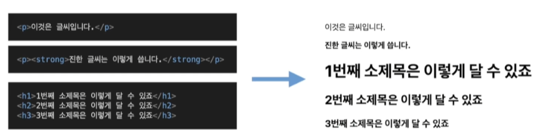
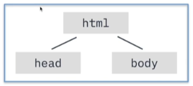
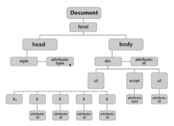

## <u>1-1. 인터넷 사용자간의 약속, HTTP</u>

1. 인터넷과 웹

- 두 컴퓨터를 연결해보면 어떨까?

  -> 연결하는 **네트워크(Network)** 탄생

- 이 네트워크를 묶어 **근거리 지역 네트워크(Local Area Network, LAN)** 탄생
- LAN들을 묶어서 **Internet** 탄생
- Web?? -> 인터넷에서 정보를 교환할 수 있는 환경 WWW(World Wide Web)
  -> Web은 인터넷 상에서 정보를 교환하기 위한 시스템

2. 웹에서 정보 주고받기

- 정보를 요청 <--> 정보를 제공
   
  (Client) <--> (Server)

1.  클라이언트가 서버에게 정보를 ${\color{red}요청}$
2.  요청에 대해서 서버가 작업을 ${\color{red}수행}$
3.  수행한 작업의 결과를 클라이언트에게 ${\color{red}응답}$

 

3.  HTTP의 구조

    - 웹상에서 정보를 주고 받기 위한 **약속**
       

      a. HTTP요청(Request) - b. HTTP응답(Response) - c. HTTP도 요청/응답에 대한 정보를 담는 **Head**와 내용물인 **Body**로 나뉜다!

 

- HTTP로 정보 요청하기
- <_HTTP Request_>
   
  GET / HTTP 1.1
   
  Host: www.programmers.com
   
  User-Agent: Mozilla/5.0

- <_HTTP Response_>
   
  HTTP/1.1 200 OK
   
  ...
   
  <_html_>정보 또는 상태코드 ...<_/html_>
   

 

## <u>1-2. 웹페이지와 HTML</u>

1. 웹 사이트와 웹 페이지
   - 웹 속에 있는 문서 하나는 **웹 페이지**
   - 웹 페이지의 모음 -> **웹 사이트**
      
     HTTP/1.1 200 OK
      
     ...
      
     **<_html_>정보 또는 상태코드 ...<_/html_>**
     -> HTTP 응답의 Body
      

- 웹 브라우저는 HTML요청을 보내고, HTTP 응답에 담긴  
  HTML문서를 우리가 보기 쉬운 형태로
  **화면을 그려주는** 역할을 담당

- 웹 페이지는 HTML이라는 형식으로 되어있고, 웹 브라우저는
  우리가 HTTP요청을 보내고, 응답받은 HTML코드를 렌더링
  해주었습니다.

2. HTML의 구조

   - HTML의 여러 특징들
   - <_!DOCTYPE html_>를 통해서 HTML5임를 명시
   - 가장 바깥에 <_html_>태그로 감싸져있다
   - 크게 <_head_>, <_body_>로 나뉨
   - **Head**는 문서에 대한 정보(제목,언어 등)을 작성한다.
   - **Body**는 문서의 내용(글,이미지,동영상 등)을 작성한다.
   - HTML은 여러 **태그(Tag)** 로 감싼 **요소(Element)** 의 집합으로 이루어져있다!

   

 
 

## <u>1-3. 나의 첫 HTTP 통신 코드</u>

- Python을 이용해서 HTTP 통신하기

- ### 실습 진행(jupyer nb)

 
 

## <u>1-4. 윤리적으로 웹 스크래핑, 크롤링 진행하기</u>

1. 웹 크롤링과 웹 스크래핑
   - 차이는?
     - 웹 스크래핑은 웹 페이지들로부터 우리가 원하는 정보를 **추출**이 목적
       - 특정한 목적으로 특정 웹 페이지에서 데이터를 추출하는 것 - **데이터 추출**
         - e.g. 날씨 데이터 가져오기, 주식 데이터 가지오기 ...
     - 웹 크롤링은 크롤러(Crawler)를 이용해서 웹 페이지의 정보를 **인덱싱**
       - URL을 타고다니며 반복적으로 데이터를 가져오는 과정 - **데이터 색인**
         - e.g. 검색 엔진의 웹 크롤러

 

2. 올바르게 HTTP 요청하기

   - 고려해야할 것들 : **어떤 목적**을 달성하고자 하는가? (수익성? - 저작권 생각)
   - 나의 웹 스크래핑/크롤링이 **서버에 영향을** 미치지 않는가?

   - 로봇 배제 프로토콜(REP)
     - Robot Exclusion Protocol
     - robot.txt 예시
       - User-agent: \*
       - Disallow: /
       - -> user-agent에 대해서 접근을 거부
       - User-agent: \*
       - Allow: /
       - -> user-agent에 대해서 접근을 허가
       - User-agent: Mussgbot
       - Disallow: /
       - -> 특정 user-agent에 대해서 접근을 불허

 

- ### 실습 진행(jupyer nb)
 
 

## <u>2-1. 웹 브라우저가 HTML을 다루는 방법</u>

1. DOM(Document Object Model)

- 문서를 렌더링하는 가장 최초의 단계 1. 브라우저의 렌더링 엔진은 웹 문서를 로드한 후, **파싱**을 진행
  
  ---
   

2. 브라우저에 대한 넓고 얕은 지식

- DOM의 목적

  

  - 각 노드를 **객체**로 생각하면 문서를 더욱 편리하게 관리할 수 있다.
  - DOM Tree를 순회해서 특정 원소를 **추가**할 수 있다
  - DOM Tree를 순회해서 특정 원소를 **찾을 수 있다**

 
 

- DOM으로 바꾸면 좋은 점?
  - 원하는 요소를 동적으로 변경, 찾을 수 있다.
  - 브라우저는 HTML을 파싱해서 DOM을 생성한다.
  - 파이썬으로 HTML을 분석하는 **HTML Parser**가 필요해!

 
 

## <u>2-2. HTML을 분석해주는 BeautifulSoup</u>

- ### 실습 진행(jupyer nb)

 
 

## <u>2-3. 원하는 요소 가져오기 I</u>

- ### 실습 진행(jupyer nb)

 
 

 

 
 
 
 
 
 
 
 
 
 
 
 

---

**1. 이론 강의 추가할 부분 추가 진행**  
**2. 선택 강의 문제 풀이 진행**
