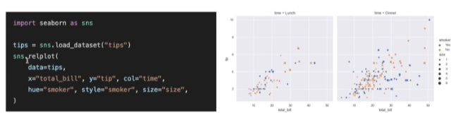

## <u>4-1. 시각화 라이브러리, Seaborn</u>

- 실습의 결과는 대부분 텍스트
  - 스크래핑의 결과가 너무 분산되어있어 한 눈에 보기 어려움 ->시각화(Visualization)
  - Seaborn: matplotlib을 기반으로 하는 시각화 라이브러리
    - 다양한 그래프를 고수준에서 쉽게 그릴 수 있다.
      

<br>

- ### 실습 진행(jupyer nb)

  - [Github : 4-1](https://github.com/pjw74/HTTP_Study/blob/main/4-1.%20%EC%8B%9C%EA%B0%81%ED%99%94%20%EB%9D%BC%EC%9D%B4%EB%B8%8C%EB%9F%AC%EB%A6%AC%20Seaborn.ipynb)

- Keyword: matplotlib, Seaborn, lineplot(x,y), barplot(x,y)

<br>
<br>
<br>

## <u>4-2. 스크래핑 결과 시각화하기 I</u>

- ### 실습 진행(jupyer nb)

  - [Github : 4-2](https://github.com/pjw74/HTTP_Study/blob/main/4-2.%20%EC%8A%A4%ED%81%AC%EB%9E%98%ED%95%91%20%EA%B2%B0%EA%B3%BC%20%EC%8B%9C%EA%B0%81%ED%99%94%ED%95%98%EA%B8%B0%20I%20-%20%EA%B8%B0%EC%83%81%EC%B2%AD%20%EB%82%A0%EC%94%A8%20%EC%A0%95%EB%B3%B4.ipynb)

<br>

- time(), driver.implicitly_wait(1) 잘 이용할 것(no search element 오류시)

<br>
<br>
<br>

## <u>4-3. 스크래핑 결과 시각화하기 II</u>

- ### 실습 진행(jupyer nb)

  - [Github : 4-3](https://github.com/pjw74/HTTP_Study/blob/main/4-3.%20%EC%8A%A4%ED%81%AC%EB%9E%98%ED%95%91%20%EA%B2%B0%EA%B3%BC%20%EC%8B%9C%EA%B0%81%ED%99%94%ED%95%98%EA%B8%B0%20II%20-%20%ED%95%B4%EC%8B%9C%EC%BD%94%EB%93%9C%20%EC%A7%88%EB%AC%B8%ED%83%9C%EA%B7%B8%20%EB%B9%88%EB%8F%84.ipynb)

<br>

```python
import matplotlib.pyplot as plt
```

<br>
<br>
<br>
<br>
<br>
<br>
<br>
<br>
<br>
<br>
<br>
<br>

- <특강>

  - 좋은 코드를 작성하려면? (f.맥스)
    - github, CI/CD
    - github 사용법 중요(협업의 관점)
    1. 코딩 규칙, 모범 사례, 리뷰, Unit Test
    2. 소스 버전 관리 툴(git, github)
    3. CI/CD 프로세스
    4. 추천 자료

  1. 좋은 개발자(행동, 스킬)

     - 긍정적, 팀플레이어로서, 남과 비교 x, 커리어 길게, 질문 잘하기, 면접의 느낌(회사 크기 x)
     - 파이썬, 자바, 스칼라 / 구문 및 데이터 유형 이해하기
     - 깔끔하고 읽기 쉬운 코드 작성(실제 프로젝트를 하면서)
       - 팀 시니어 없으면 오픈소스 코드 보기
     - 생산성 툴 익히기
       - Git과 Github
         - a. 커멘드라인에서 자유롭게 커밋하고 브랜치 만들고 PR만드릭
       - IDE(VS Code)
         - a. 단축키 많이 사용해보기
         - b. 플러그인 많이 사용해보기

  2. 좋은 코드

     - 읽기 쉽고, 이해, 수정하기 쉬움
     - - 코드 작성 원칙
         - DRY
           - 1. 반복되는 작업이라면 함수로 만들 것
           - 2. 동일한 일이 반복된다면 루프로 만들 것
           - 3. 비슷한 클래스를 반복해서 만든다면 클래스 계승 구조를 사용해볼 것
         - KISS

  3.

  - <br>
    <br>
    <br>
    <br>
    <br>
    <br>
    <br>
    <br>
    <br>
    <br>
    <br>
    <br>
    <br>
    <br>
    <br>
    <br>

---

**1. 이론 강의 추가할 부분 추가 진행** <br>

- 추가할 부분: day 02 ~ 06까지 확인

**2. 선택 강의 문제 풀이 진행**
