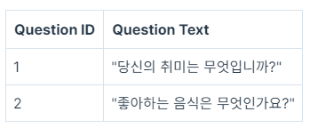
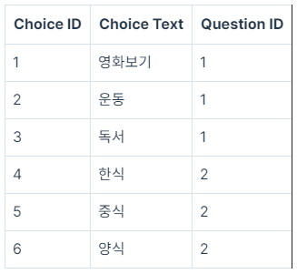

## <u>1. Django Project 생성하기</u>

- ### 실습 진행(VScode)

  - [Django : 1]()추가추가

- Keyword:

 
 
 

## <u>2. Django App 생성하기</u>

- git bash로 업로드 -> src refspec main does not match any 오류
- [참고1](https://star992411.tistory.com/54)
- [참고2](https://daily50.tistory.com/334)

- git desktop 로컬 폴더 연결하기

- ### 실습 진행(VScode)

  - [Django : 2]()추가추가

 
 
 

## <u>3. URL 경로(path) 설정하기</u>

- ### 실습 진행(VScode)

  - [Django : 3]()추가추가

- **관계형 데이터베이스(RDB)** 는 데이터를 행과 열로 이루어진 테이블의 형태로 구성하고, 테이블 간의 관계를 정의하는 데이터베이스입니다.
- 간단한 설문조사 어플리케이션의 예시를 통해 관계형 데이터베이스에서 각각의 용어들이 어떤 의미를 가지는지 살펴본다.
- **테이블**이란 데이터베이스에서 행과 열로 구성되어 있는 데이터의 집합을 의미합니다.
  설문조사 어플리케이션을 만들기 위해서는 두가지 테이블이 필요합니다.

1. 질문을 저장하는 테이블 Question
2. 선택지를 저장하는 테이블 Choice

- **열(column)**: 테이블에 존재하는 필드(${\color{red}field}$)

  - _Question 테이블_

    - 각 질문들을 식별할 수 있는 Question ID(${\color{red}primary \space key}$)
    - 필드와 질문의 내용에 해당하는 Question Text 필드, 총 두 가지의 필드가 존재

  - _Choice 테이블_

    - 각 선택지들을 식별할 수 있는 Choice ID(${\color{red}primary \space key}$) 필드와
    - 선택지의 내용에 해당하는 Choice Text 필드 그리고
    - 해당 선택지가 어떤 질문에 속한 것인지 알려주는 Question ID (${\color{red}foreign \space key}$) 필드

  - primary key는 테이블의 각 행(row)을 고유하게 식별할 수 있는 열(column)을 의미
  - foreign key는 다른 테이블의 primary key를 참조하는 열(column)을 의미
  - Choice 테이블의 Question ID는 Question 테이블의 primary key인 Question ID를 참조하는 foreign key 입니다. 이를 통해 각 선택지가 어떤 질문에 대한 선택지인지 그 포함 관계를 파악할 수 있습니다.

 

- **행(row)**: 테이블에 저장된 데이터 레코드(${\color{red}Record}$) 를 의미

  - 각 레코드는 고유한 값을 가지는 Primary Key로 식별되는데, Question 테이블에서의 Primary Key는 Question ID입니다.

  - 경우에 따라서 레코드들의 Question Text 내용이 중복되는 상황이 발생할 수 있지만 , 그럴때마다 Question ID를 이용하면 각 레코드를 식별할 수 있습니다.

    

  ***

  - Choice 테이블에서는 Choice ID를 통해 각 선택지들을 식별합니다.
    그리고 foreign key인 Question ID를 통해 각 선택지 레코드들이 어떤 질문에 속한 것인지 포함관계를 나타내고 있습니다.

    

  ***

  - 모델은 데이터베이스에서 테이블(Table)에 해당하며, 각 모델은 필드(Field)를 가지고 있습니다.

 
 
 

## <u>4. 모델 만들기</u>

- ### 실습 진행(VScode)

  - [Github : 4]()추가추가

 

- Keyword:

 
 
 

## <u>5. 장고의 다양한 모델 필드 활용하기</u>

- [Django 모델 필드](https://docs.djangoproject.com/en/4.2/ref/models/fields/)

- ### 실습 진행(VScode)

  - [Github : 5]()추가추가

 

- Keyword: BooleanField, CharField, DateField, DateTimeField, FloatField, JSONField, TextField, sqlite3 환경변수 편집,
- python 가상환경 생성: py -m venv project-name,
- 가상환경 활성: project-name\Scripts\activate.bat

 
 
 

## <u>5. 장고의 다양한 모델 필드 활용하기</u>

- [Django 모델 필드](https://docs.djangoproject.com/en/4.2/ref/models/fields/)

- ### 실습 진행(VScode)

  - [Github : 5]()추가추가

 

- Keyword: BooleanField, CharField, DateField, DateTimeField, FloatField, JSONField, TextField, sqlite3 환경변수 편집,
- python 가상환경 생성: py -m venv project-name,
- 가상환경 활성: project-name\Scripts\activate.bat

 
 
 
