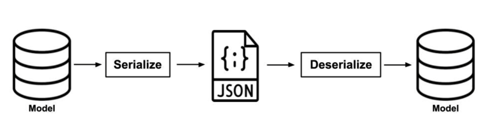
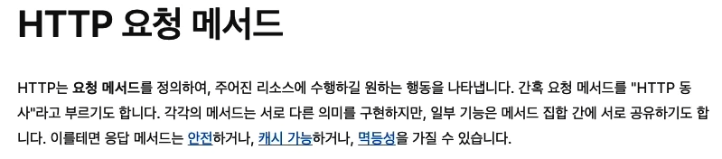

## <u>1. Serilaizer</u>

- _Serilaizer_: **모델 인스턴스**나 **QuerySet**과 같은 데이터를 **JSON 형식의 파일**로 **변환**하는 작업

- _Deserilaizer_: **JSON 형식**의 데이터를 정의된 포맷에 맞추어 다시 **모델 인스턴스**로 **변환**하는 작업

  

  ***

- polls_api/serializers.py

```python
from rest_framework import serializers
from polls.models import Question

class QuestionSerializer(serializers.Serializer):
    id = serializers.IntegerField(read_only=True)
    question_text = serializers.CharField(max_length=200)
    pub_date = serializers.DateTimeField(read_only=True)

    def create(self, validated_data):
        return Question.objects.create(**validated_data)

    def update(self, instance, validated_data):
        instance.question_text = validated_data.get('question_text', instance.question_text)
        instance.save()
        return instance
```

<br>
<br>
<br>

## <u>2. Django Shell에서 Serializer 사용하기</u>

- polls_api/serializers.py

```python
from rest_framework import serializers
from polls.models import Question

class QuestionSerializer(serializers.Serializer):
    id = serializers.IntegerField(read_only=True)
    question_text = serializers.CharField(max_length=200)
    pub_date = serializers.DateTimeField(read_only=True)

    def create(self, validated_data):
        return Question.objects.create(**validated_data)

    def update(self, instance, validated_data):
        instance.question_text = validated_data.get('question_text', instance.question_text) + '[시리얼라이저에서 업데이트]'
        instance.save()
        return instance
```

- Django Shell

```python
# Serialize
>>> from polls.polls_api.serializers import QuestionSerializer
>>> q = Question.objects.first()
>>> serializer = QuestionSerializer(q)
>>> serializer.data
{'id': 1, 'question_text': '휴가를 어디서 보내고 싶으세요?', 'pub_date': '2023-04-24T06:48:53Z'}

>>> from rest_framework.renderers import JSONRenderer
>>> json_str = JSONRenderer().render(serializer.data)
>>> json_str
b'{"id":1,"question_text":"\xed\x9c\xb4\xea\xb0\x80\xeb\xa5\xbc \xec\x96\xb4\xeb\x94\x94\xec\x84\x9c \xeb\xb3\xb4\xeb\x82\xb4\xea\xb3\xa0 \xec\x8b\xb6\xec\x9c\xbc\xec\x84\xb8\xec\x9a\x94?","pub_date":"2023-04-24T06:48:53Z"}'

# Deserialize
>>> import json
>>> data = json.loads(json_str)
>>> data
{'id': 1, 'question_text': '휴가를 어디서 보내고 싶으세요?', 'pub_date': '2023-04-24T06:48:53Z'}

>>> serializer = QuestionSerializer(data=data)
>>> serializer.is_valid()
True

>>> serializer.validated_data
OrderedDict([('question_text', '휴가를 어디서 보내고 싶으세요?')])

>>> new_question = serializer.save()
>>> new_question
<Question: 제목: 휴가를 어디서 보내고 싶으세요?, 날짜: 2023-04-26 04:53:39.073214+00:00>

>>> data={'question_text': '제목수정'}
>>> serializer = QuestionSerializer(new_question, data=data)
>>> serializer.is_valid()
True

>>> serializer.save()
<Question: 제목: 제목수정[시리얼라이저에서 업데이트], 날 짜: 2023-04-26 04:53:39.073214+00:00>


#Validation이 통과하지 않는 경우
>>> long_text = "abcd"*300
>>> data = {'question_text':long_text}
>>> serializer = QuestionSerializer(data=data)
>>> serializer.is_valid()
False
>>> serializer.errors
{'question_text': [ErrorDetail(string='Ensure this field has no more than 200 characters.', code='max_length')]}
```

<br>
<br>
<br>

## <u>3. ModelSerializer</u>

- polls_api/serializers.py

```python
from rest_framework import serializers
from polls.models import Question

class QuestionSerializer(serializers.ModelSerializer):
    class Meta:
        model = Question
        fields = ['id','question_text', 'pub_date']
```

```python
>>> from polls.polls_api.serializers import QuestionSerializer
>>> print(QuestionSerializer())
QuestionSerializer():
    id = IntegerField(read_only=True)
    question_text = CharField(max_length=200)
    pub_date = DateTimeField(read_only=True)

>>> serializer = QuestionSerializer(data={'question_text':'모델시리얼라이저로 만들어 봅니다.'})
>>> serializer.is_valid()
True

>>> serializer.save()
<Question: 제목: 모델시리얼라이저로 만들어 봅니다., 날짜: 2023-04-26 05:06:22.062716+00:00>
```

<br>
<br>
<br>

## <u>4. GET</u>

- polls_api/views.py

```python
from polls.models import Question
from polls_api.serializers import QuestionSerializer
from rest_framework.response import Response
from rest_framework.decorators import api_view

@api_view()
def question_list(request):
    questions = Question.objects.all()
    serializer = QuestionSerializer(questions, many = True)
    return Response(serializer.data)
```

- polls_api/urls.py

```python
from django.urls import path
from .views import *

urlpatterns = [
    path('question/', question_list, name='question-list')
]
```

- mysite/urls.py

```python
from django.urls import include, path
from django.contrib import admin

urlpatterns = [
    path('admin/', admin.site.urls),
    path('polls/', include('polls.urls')),
    path('rest/', include('polls_api.urls')),
]
```

<br>
<br>
<br>

## <u>5. HTTP Methods</u>

- [HTTP Methods 참고 링크](https://developer.mozilla.org/ko/docs/Web/HTTP/Methods)

  

  ***

- 데이터 생성(Create) : **POST**
- 데이터 조회(Read) : **GET**
- 데이터 업데이트(Update) : **PUT**
- 데이터 삭제(Delete) : **DELETE**
  - 크롬 - 개발자 도구(Network항목)를 사용하여 Request Method로 확인 가능

<br>
<br>
<br>

## <u>6. POST</u>

- 200번대: 정상적인 결과
  - 200 OK
  - 201 CREATED
- 400번대: 사용자의 잘못된 요청
  - 400 BAD REQUEST
  - 404 NOT FOUND
- 500번대: 서버 내부의 오류

- polls_api/views.py

```python
from rest_framework.decorators import api_view
from polls.models import Question
from polls_api.serializers import QuestionSerializer
from rest_framework.response import Response
from rest_framework import status


@api_view(['GET','POST'])
def question_list(request):
    if request.method == 'GET':
        questions = Question.objects.all()
        serializer = QuestionSerializer(questions, many = True)
        return Response(serializer.data)

    if request.method == 'POST':
        serializer = QuestionSerializer(data=request.data)
        if serializer.is_valid():
            serializer.save()
            return Response(serializer.data, status=status.HTTP_201_CREATED)
        else:
            return Response(serializer.errors, status=status.HTTP_400_BAD_REQUEST)
```

<br>
<br>
<br>

## <u>7. PUT / DELETE</u>

- polls_api/views.py

```python
from django.shortcuts import get_object_or_404

@api_view(['GET', 'PUT', 'DELETE'])
def question_detail(request, id):
    question = get_object_or_404(Question, pk=id)

    if request.method == 'GET':
        serializer = QuestionSerializer(question)
        return Response(serializer.data)

    if request.method == 'PUT':
        serializer = QuestionSerializer(question, data=request.data)
        if serializer.is_valid():
            serializer.save()
            return Response(serializer.data, status=status.HTTP_200_OK)
        else:
            return Response(serializer.errors, status=status.HTTP_400_BAD_REQUEST)

    if request.method == 'DELETE':
        question.delete()
        return Response(status=status.HTTP_204_NO_CONTENT)
```

- polls_api/urls.py

```python
from django.urls import path
from .views import *

urlpatterns = [
    path('question/', question_list, name='question-list'),
    path('question/<int:id>/', question_detail, name='question-detail')
]
```

<br>
<br>
<br>

## <u>8. Class 기반의 뷰(Views)</u>

- polls_api/views.py

```python
from rest_framework.views import APIView

class QuestionList(APIView):
    def get(self, request):
        questions = Question.objects.all()
        serializer = QuestionSerializer(questions, many=True)
        return Response(serializer.data)

    def post(self, request):
        serializer = QuestionSerializer(data=request.data)
        if serializer.is_valid():
            serializer.save()
            return Response(serializer.data, status=status.HTTP_201_CREATED)
        else:
            return Response(serializer.errors, status=status.HTTP_400_BAD_REQUEST)

class QuestionDetail(APIView):
    def get(self, request, id):
        question = get_object_or_404(Question, pk=id)
        serializer = QuestionSerializer(question)
        return Response(serializer.data)

    def put(self, request, id):
        question = get_object_or_404(Question, pk=id)
        serializer = QuestionSerializer(question, data=request.data)
        if serializer.is_valid():
            serializer.save()
            return Response(serializer.data, status=status.HTTP_200_OK)
        else:
            return Response(serializer.errors, status=status.HTTP_400_BAD_REQUEST)

    def delete(self, request, id):
        question = get_object_or_404(Question, pk=id)
        question.delete()
        return Response(status=status.HTTP_204_NO_CONTENT)
```

- polls_api/urls.py

```python
from django.urls import path
from .views import *

urlpatterns = [
    path('question/', QuestionList.as_view(), name='question-list'),
    path('question/<int:id>/', QuestionDetail.as_view(), name='question-detail'),
]
```

<br>
<br>
<br>

## <u>9. Mixin</u>

- polls_api/views.py

```python
from polls.models import Question
from polls_api.serializers import QuestionSerializer
from rest_framework import mixins
from rest_framework import generics

class QuestionList(mixins.ListModelMixin, mixins.CreateModelMixin, generics.GenericAPIView):
    queryset = Question.objects.all()
    serializer_class = QuestionSerializer

    def get(self, request, *args, **kwargs):
        return self.list(request, *args, **kwargs)

    def post(self, request, *args, **kwargs):
        return self.create(request, *args, **kwargs)


class QuestionDetail(mixins.RetrieveModelMixin, mixins.UpdateModelMixin, mixins.DestroyModelMixin, generics.GenericAPIView):
    queryset = Question.objects.all()
    serializer_class = QuestionSerializer

    def get(self, request, *args, **kwargs):
        return self.retrieve(request, *args, **kwargs)

    def put(self, request, *args, **kwargs):
        return self.update(request, *args, **kwargs)

    def delete(self, request, *args, **kwargs):
        return self.destroy(request, *args, **kwargs)
```

- polls_api/urls.py

```python
from django.urls import path
from .views import *

urlpatterns = [
    path('question/', QuestionList.as_view(), name='question-list'),
    path('question/<int:pk>/', QuestionDetail.as_view(), name='question-detail'),
]
```

<br>
<br>
<br>

## <u>10. Generic API View</u>

- polls_api/views.py

```python
from polls.models import Question
from polls_api.serializers import QuestionSerializer
from rest_framework import generics

class QuestionList(generics.ListCreateAPIView):
    queryset = Question.objects.all()
    serializer_class = QuestionSerializer

class QuestionDetail(generics.RetrieveUpdateDestroyAPIView):
    queryset = Question.objects.all()
    serializer_class = QuestionSerializer
```

<br>
<br>
<br>
<br>
<br>
<br>
<br>
<br>
<br>
<br>
<br>
<br>
<br>
<br>
<br>
<br>
<br>

---

**1. 이론 강의 추가할 부분 추가 진행**

- 추가할 부분: day 02 ~ 11까지 확인

**2. 선택 강의 문제 풀이 진행**
