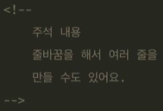
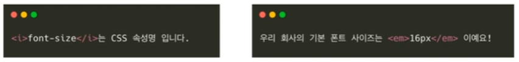
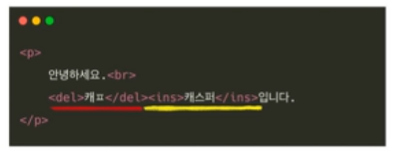
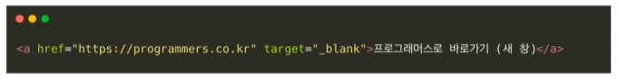
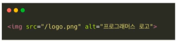
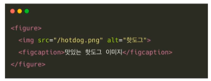
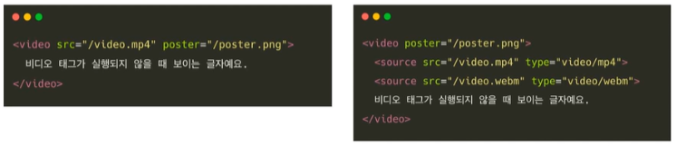
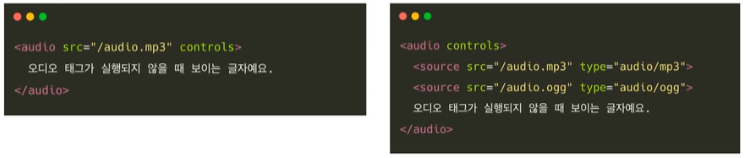
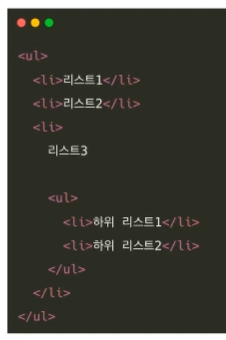
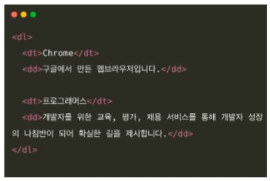

## <u>Part01 개요</u>

### <u>Part02 HTML</u>

#### <u>Part03 CSS</u>

##### <u>Part04 반응형</u>

###### <u>Part05 End</u>

1. 윈도우 환경 실습

- VSCode 설치
- VSCode 기본 세팅 진행
- 설정: Compact Folders 해제
- Extensions 추가
  1. Material Icon Theme
  2. indent-rainbow
  3. Live Server

 

## <u>2-1. HTML</u>

 

- HTML(Hypertext Markup Language): 웹 브라우저가 이해할 수 있는 "언어"
- CSS(Cascading Style Sheets): 문서를 예쁘게 "꾸미는" 언어
- JavaScript: 문서에 "기능"을 만들어주는 언어

1. <_HTML_>
2. <_HEAD_>
3. <_BODY_>
4. 레이아웃
5. 콘텐츠
6. 양식 태그
7. 주의사항

- Chapter 01 - HTML

1. HTML 기본 문법
2. 속성과 값
3. HTML 기본 문서
4. 부모요소 자식요소
5. 주석

- 콘텐츠를 가지는 태그: 열리는 태그(시작태그), 닫히는 태그가 있음(종료태그)

---

- 가지지 않는 태그가 있음 단일 태그(Empty Element)
  

---

- 속성(Attribute)과 값(Value), 콘텐츠(Content)

  

---

- 부모요소 자식요소

  - 코드라인의 depth를 지킬 것!

    

---

- 주석

- 주석 내 또 다른 주석 불가능

---

## <u>2-2. HEAD</u>

- head: 사람 눈에 보이지 않는 "문서의 정보"가 담기는 영역

  1. 타이틀
  2. 메타 데이터

     1. 인코딩 정보: "charset"은 문서에서 허용하는 문자의 집합이다. 이 규칙에 따라 문서에서 사용할 수 있는 문제가 제한된다.

     2. 문서 설명
     3. 문서 작성자

  3. CSS, Script

Section 02 - style, link, script: 문서 내용의 외형에
영향을 주는 태그들

- script
  

  - 꼭 종료 태그 넣어야됨(셀프태그x)

---

## <u>2-3. BODY</u>

1. body: 사람 눈에 실제로 보이는 콘텐츠 영역
2. block, inline, inline-block
    
   1. **block** (블록 레벨 요소)
   - 레고 블록처럼 차곡차곡 쌓이고 화면 너비가 차는 요소
   - 블록의 크기와 내/외부에 여백 지정 가능, 일반적으로 페이지의 구조적 요소를 나타낸다.
   - 인라인 요소를 포함할 수 있으나, 인라인 요소에 포함될 수 없다.
   - **대표적인 블록 레벨 요소**
   - <_div_>,<_article_>,<_section_>, ...
      
      
   2. **inline** (인라인 레벨 요소)
   - 블록 요소 내에 포함되는 요소.
     - 주로 문장, 단어 같은 작은 부분에 사용되며 한 줄에 나열
     - 좌/우 여백을 넣는 것만 허용된다.
   - **대표적인 블록 레벨 요소**
   - <_span_>,<_a_>,<_strong_>, ...
      
      
   3. **inline-block**
   - 글자처럼 취급되나, block 태그의 성질을 가지는 요소.
     - block과 마찬가지로 크기와 내/외부 여백을 지정할 수 있다.
     - **CSS로 성질을 바꾼 것** 이기 때문에 의미상 **인라인 레벨 요소**이다.

 

## <u>2-4. 레이아웃</u>

1. 콘텐츠 분할 요소(div)
    
   -> 가장 흔히 사용되는 레이아웃 태그로 단순히 **구역을 나누기 위한** 태그
2. 레이아웃 태그 #1(header, footer, main)
    
   **<_head_>** -> 블로그 글 제목, 작성일 등의 **주요 정보를 담는** 태그
    
   **<_footer_>** -> 페이지의 바닥줄에 사용되며 저작권 정보, 연락처 등 **부차적인 정보를 담는** 태그
    
   **<_main_>** -> 페이지의 가장 큰 부분으로 사이트의 내용 즉, **주요 콘텐츠를 담는** 태그
    

3. 레이아웃 태그 #2(section, article, aside)
      
   **<_section_>** -> **콘텐츠의 구역을 나누는** 태그, 신문지에서 여러 기사가 각자의 구역에서 각자의
   정보를 전달하는 의미와 비슷한 역할을 하는 태그
    
   **<_article_>** -> 블로그 포스트, 뉴스 기사와 같은
   독립적인 **문서를 전달하는** 태그
    
   **<_aside_>** -> 문서의 주요 내용에 **간접적인 정보를 전달하는** 태그, 쇼핑몰의 오른쪽에 따라다니는 "오늘 본 상품"같은
   것으로도 사용할 수 있다.

- 레이아웃 태그를 왜 알아야 하나?
  - HTML5부터 태그를 의미 있게 사용하기 위해 **"Semantic(시멘틱)""** 태그를 사용하여 문서 구조를 작성
  - 단순히 의미 구분자인 <_div_>를 남발하지 않고 적절한 태그를 사용하여 웹 문서가 담은 정보와 구조를 의미있게 전달
  - 시멘틱하게 마크업 함으로써 검색엔진의 검색 순위에 가산점을 얻거나 홈페이지의 로딩 속도를 높임

## <u>2-5. 콘텐츠</u>

1. 제목 태그(h1~h6)
2. 문단 태그(p)
3. 서식 태그(b/strong,i/em,s/del)
4. 링크 이동(a)
5. 멀티미디어
6. 리스트
7. 표(table)
8. 외부 콘텐츠(iframe)

- <_h1_> ~ <_h6_>
   
  -> 문서 **구획 제목**을 나타내는 태그로 Heading(헤딩) 태그라고 부른다.

  - h1부터 h6까지 사용 가능.
  - h1 태그는 페이지 내에 **"한번만"** 사용되어야 하고 **"구획의 순서"** 는 지켜져야한다.
     
    

  ***

   

- <_p_>
   
  -> 문서에서 하나의 **문단**(Paragraph)을 나타내는 태그이다. - 제목 태그와 함께 사용되기도 하고 단독으로 사용되기도 한다.
  

  ***

   

- <_b_>, <_strong_>
   
  -> 글씨의 **두께**를 조절할 수 있다.

  - <_b_>태그는 의미를 가지지 않고 단순히 굵은 글씨
  - <_strong_>태그는 굵은 글씨로 변경 후 "강조"의 의미를 부여
     
    !! <_b_>와 <_strong_>은 시각적으로 굵은 효과는 같지만 의미가 다름으로 사용에 주의

   

- <_i_>, <_em_>
   
  -> 글씨의 **기울기**를 조절할 수 있다.

  - <_i_>태그는 기울임과 동시에 텍스트가 문단의 내용과 구분되어야 하는 경우 사용할 수 있다.
    - ex) 등장인물, 외국어 구절, 기술 용어 등
  - <_em_>태그는 기울임과 내용에 **강조**를 타나낸다.
     
    !! <_i_>와 <_em_>은 시각적으로 기울림은 같지만 의미가 다름으로 사용에 주의
    

   

- <_u_>
   
  -> 글씨에 **밑줄**을 넣고 주석을 가지는 단어임을 나타냄

  - CSS로 스타일링 하여 빨간 밑줄을 넣는 것으로 "오타"를 나타내는 것 처럼 사용할 수 있다.
  - 단순하게 "밑줄"만 긋는 용도로는 사용하면 안된다.

   

- <_s_>, <_del_>
   
  -> 글씨에 **취소선**을 추가

  - <_s_>태그는 단순히 시각적인 취소선만 추가되고 접근성 기기에 취소에 대한 안내는 하지 않음.
  - <_del_>태그는 문서에서 제거된 텍스트를 나타낼 수 있다.
    <_ins_>태그를 함께 사용하면 제거된 텍스트 옆에 추가된 텍스트를 표현할 수 있다.
    

   

- <_a_>
   
  -> 클릭하면 **페이지를 이동**할 수 있는 링크 요소를 만들 수 있다.

  - href 속성을 사용해서 이동하고자 하는 파일 혹은 URL을 작성한다.
  - target 속성을 사용해서 이동해야 할 링크를 새 창(\_blank),
    현재창(\_self) 등 원하는 타겟을 지정할 수 있다.
    

   

 
 
 

## <u>2-5. 콘텐츠 2 - 멀티미디어</u>

1. 이미지
2. 비디오, 오디오
3. SVG(**S**calable**V**ector**G**raphics)

- <_img_>
   
  -> 문서 내에 **이미지**를 넣을 수 있는 태그

  - 가장 기본적인 이미지 넣는 방법
  - "src" 속성을 사용해 이미지의 경로를 넣으면 이미지가 출력됨
  - "alt" 속성을 사용해 이미지 로딩에 문제가 발생했을 때 텍스트를 띄울 수 있음

    

   

- <_figure_>, <_figcaption_>
   
  -> 하나의 **독립적인 콘텐츠**로 분리하고 그에 대한 설명을 넣을 수 있는 태그

  - <_figcaption_>태그를 사용해 콘텐츠의 설명 혹은 범례를 추가할 수 있고 제일 처음이나 제일 아래에 추가해서 사용할 수 있다.
  - 보통 이미지를 넣는데 인용문, 비디오/오디오 등 **문서의 흐름에 참조는 되지만 독립적으로 분리되어도 되는 내용**을 담을 수 있다.

    

   

- <_video_>
   
  -> 문서 내에 **영상**을 첨부할 수 있는 태그

  - "src" 속성을 사용해 비디오를 문서 내에 첨부할 수 있다.
  - "poster" 속성을 사용하면 비디오가 로드되기 전에 포스터를 보여줄 수 있다.
  - <_source_> 태그를 사용하면 여러 타입의 비디오를 제공할 수 있다.
  - _다른 속성도 있다_
    

   

- <_audio_>
   
  -> 문서 내에 **소리**를 첨부할 수 있는 태그

  - "src" 속성을 사용해 소리를 문서 내에 첨부할 수 있다.
  - <_source_> 태그를 사용하면 여러 타입의 소리를 제공할 수 있다.
  - "controls" 속성을 사용하면 재생/정지 버튼 등이 있는 컨트롤러를 띄울 수 있다.

    

   

- <_svg_>
   
  -> 그래픽으로 만들어진 이미지
  - 일반 이미지(래터스 이미지)와 다르게 수학 공식을 사용하여 그려지기 때문에 해상도의 영향을 받지 않아 확대/축소가 자유롭다.
  - 주로 크기를 자주 바꾸어야 하는 작은 아이콘에서 많이 사용됨
  - 해상도가 다양하게 변화하는 최근 기기들로 인해 아이콘 외에 로고 등 주요 이미지에도 사용되고 있다.
  - <_img_>태그처럼 svg파일을 불러올 수도 있고 태그를 그대로 사용할 수도 있다.(더 많은 사용 방식 존재)
  - 코드로 이루어져 있기 때문에 스타일을 변경하거나 자바스크립트를 사용해 간단한 기능을 추가할 수도 있다.

 
 
 

## <u>2-5. 콘텐츠 3 - 리스트</u>

- 리스트?

  - 정렬되지 않은 (순서가 없는) 목록
  - 정렬된 (순서가 있는) 목록
  - 설명 목록

- <_ul_>, <_li_>
   
  -> **정렬되지 않은 목록** 태그

  - 기본 불릿(bullet) 형식으로 목록을 그린다.
  - <_li_> 태그를 사용하면 목록을 구성할 수 있고 다양한 태그를 포함할 수 있다.
  - <_ul_> 태그의 자식요소로는 <_li_> 태그만 들어와야 한다.
    하위 리스트를 만드려면 <_li_>태그 안에 <_ul_>,<_ol_>태그를 사용하면 된다.

    

   

- <_ul_>, <_li_>
   
  -> **정렬된 목록** 태그

  - 기본 숫자(1,2,3,...) 형식으로 목록을 그린다.

   

- <_dl_>, <_dt_>, <_dd_>
   
  -> **설명 목록** 태그

  - <_dt_>태그에 사용된 단어 혹은 내용의 설명을 <_dd_>태그에 작성할 수 있다.
  - 주로 용어사전이나 "키-값"이 있는 쌍의 목록을 나타낼 때 사용한다.
  - <_dt_>태그를 여러개 작성하고 하나의 <_dd_>태그를 작성하는 것으로 여러 개의 용어를 설명할 수 있다.
  - 위와 반대로, <_dt_>태그 하나에 여러개의 <_dd_>태그를 가질 수 있다.

    

   

- <_dl_>, <_dt_>, <_dd_>
   
  -> **설명 목록** 태그

  - <_dt_>태그에 사용된 단어 혹은 내용의 설명을 <_dd_>태그에 작성할 수 있다.
  - 주로 용어사전이나 "키-값"이 있는 쌍의 목록을 나타낼 때 사용한다.
  - <_dt_>태그를 여러개 작성하고 하나의 <_dd_>태그를 작성하는 것으로 여러 개의 용어를 설명할 수 있다.
  - 위와 반대로, <_dt_>태그 하나에 여러개의 <_dd_>태그를 가질 수 있다.

    

   

 
 
 

## <u>2-5. 콘텐츠 4 - 표</u>

 
 
 

## <u>2-5. 콘텐츠 5 - 아이프레임</u>

 
 
 

## <u>2-6. 양식 태그 1 - form</u>

 
 
 

## <u>2-5. 양식 태그 2 - 설명과 입력(label), 버튼</u>

 
 
 

## <u>2-5. HTML 주의사항</u>

 
 
 
 
 
 
 
 
 
 
 
 

---

- **같은 줄 잡을 때 ctrl+d / d 여러번 여러줄 잡아짐**

**1. 이론 강의 추가할 부분 추가 진행**  
**2. 선택 강의 문제 풀이 진행**
