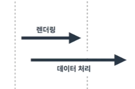

## <u>2-4. HTML의 Locator로 원하는 요소 찾기</u>

- ### 실습 진행(jupyer nb)

  - [Github : 2-4](https://github.com/pjw74/HTTP_Study/blob/main/2-4.%20HTML%EC%9D%98%20Locator%EB%A1%9C%20%EC%9B%90%ED%95%98%EB%8A%94%20%EC%9A%94%EC%86%8C%20%EC%B0%BE%EA%B8%B0.ipynb)

- 태그는 자신의 이름 뿐만 아니라 고유한 속성 또한 가질 수 있습니다.
- 이 중에서 id와 class는 Locator로서, 특정 태그를 지칭하는 데에 사용됩니다.

  - tagname: 태그의 이름
  - id: 하나의 고유 태그를 가리키는 라벨
  - class: 여러 태그를 묶는 라벨

<br>
<br>

## <u>2-5. 원하는 요소 가져오기 II</u>

- ### 실습 진행(jupyer nb)

  - [Github : 2-5](https://github.com/pjw74/HTTP_Study/blob/main/2-5.%20%EC%9B%90%ED%95%98%EB%8A%94%20%EC%9A%94%EC%86%8C%20%EA%B0%80%EC%A0%B8%EC%98%A4%EA%B8%B0%20II%20-%20Hashcode%20%EC%A7%88%EB%AC%B8%20%EA%B0%80%EC%A0%B8%EC%98%A4%EA%B8%B0.ipynb)

<br>
<br>

## <u>3-1. 동적 웹 페이지와의 만남</u>

1. 정적 웹 사이트와 동적 웹 사이트

   - HTML 내용이 고정된 **정적(static) 웹 사이트**
     - HTML문서가 완전하게 응답된다.
   - HTML 내용이 변하는 **동적(dynamic) 웹 사이트**
     - HTML이 렌더링 될 때까지의 **지연시간**이 존재!
   - **동기 처리**: 요청에 따른 응답을 ${\color{violet}기다린다}$

     

   ***

   <br>

   - **비동기 처리** : 요청에 따른 응답을 ${\color{violet}기다리지\space않는다}$

     

   ***

   <br>

   - 비동기 처리된 경우, 상황에 따라서 데이터가 ${\color{violet}완전하지\space않은\space경우}$가 발생 한다.

- 스크래퍼의 문제점

  - 데이터 처리 중일 때 요청을 보내면 **불완전한 응답**을 받게된다.

    - -> 임의로 시간을 **지연**한 후, 데이터 처리가 끝난 후 정보를 가져오면 된다.

  - 키보드 입력, 마우스 클릭 등을 requests로는 진행하기 어렵다.
    - -> 웹 브라우저를 **파이썬으로 조작**하자
      - 웹 브라우저를 자동화하는 라이브러리 **Selenium**

<br>
<br>

## <u>3-2. 브라우저 자동화하기, Selenium</u>

- ### 실습 진행(jupyer nb)

  - [Github : 3-2](https://github.com/pjw74/HTTP_Study/blob/main/3-2.%20%EB%B8%8C%EB%9D%BC%EC%9A%B0%EC%A0%80%20%EC%9E%90%EB%8F%99%ED%99%94%ED%95%98%EA%B8%B0%2C%20Selenium.ipynb)

<br>

- selenium은 Python을 이용해서 웹 브라우저를 조작할 수 있는 자동화 프레임워크
- 웹 브라우저와 연동을 위해서는 WebDriver가 필요

<br>
<br>

## <u>3-3. Wait and Call</u>

- ### 실습 진행(jupyer nb)

  - [Github : 3-3](https://github.com/pjw74/HTTP_Study/blob/main/3-3.%20Wait%20and%20Call.ipynb)

- Implicit / Explicit Wait

  - Selenium은 동적 웹 사이트에 대한 지원을 진행하기 위해 명시적 기다림(Explicit Wait) 과 암묵적 기다림(Implicit Wait) 을 지원.

  - **Implicit Wait**: 특정 요소에 대한 제약을 통한 기다림
    (e.g. 이 태그를 가져올 수 있을 때까지 기다려!)
  - **Explicit Wait**: 다 로딩이 될 때까지 지정한 시간 동안 기다림
    (e.g. 다 로딩이 될 때까지 5초동안 기다려!)

<br>

- wait 활용 비동기
- **Implicit Wait**; 최대 몇초까지 기다리는 인자
- **Explicit Wait**; 특정 드라이버에 대해서 기다리는데 until or until not을 통해서 조건을 만족할 때까지 기다림
- XPATH;
  <br>
  <br>

## <u>3-4. 마우스 이벤트 처리하기</u>

- ### 실습 진행(jupyer nb)

  - [Github : 3-4](https://github.com/pjw74/HTTP_Study/blob/main/3-4.%20%EB%A7%88%EC%9A%B0%EC%8A%A4%20%EC%9D%B4%EB%B2%A4%ED%8A%B8%20%EC%B2%98%EB%A6%AC%ED%95%98%EA%B8%B0.ipynb)

- 프로그래머스 사이트 변경 -> XPATH로 해결

<br>
<br>

## <u>3-5. 키보드 이벤트 처리하기</u>

- ### 실습 진행(jupyer nb)

  - [Github : 3-5](https://github.com/pjw74/HTTP_Study/blob/main/3-5.%20%ED%82%A4%EB%B3%B4%EB%93%9C%20%EC%9D%B4%EB%B2%A4%ED%8A%B8%20%EC%B2%98%EB%A6%AC%ED%95%98%EA%B8%B0.ipynb)

- 실제 예제와 좀 달라서 헤맸지만 XPATH로 완료
- 참고 : [Selenium](https://www.selenium.dev/documentation/webdriver/elements/finders/)

<br>
<br>
<br>

## <u>준비운동. Appendix Jupyter Lab 시작하기</u>

- Jupyter Lab
  - 다양한 Text Editor, IDE 등을 통해 개발 진행
  - Interactive한 Python 코드 작성 / 공유를 위한 개발 도구
    - 데엔/인공지능 주로 사용
  - 터미널 환경에서 pip 이용
  - 기본적인 2가지 모드(명령:command, 입력모드:edit, 모드 변경 단축키: **Enter, ESC**)
  - Code cell, MarkDown cell, 모드 변경 단축키: **M, Y**
  - Cell 추가 명령모드에서 위에 생성 Above, 밑에 Below, 단축키: **A, B**
  - Cell 삭제, 되돌리기, 단축키: **dd, z**
  - 현재 Cell 실행, 단축키: **ctrl/cmd + Enter**

<br>

- MarkDown: 일반 텍스트 서식이 있는 문서 사용 가능

  1. Header(#,##,###,...6개 까지)
  2. Italic(_..._,_..._)
  3. Bold(**...**,**...\_**)
  4. Strikethrough(~...~)
  5. Unordered List(-..., \*...)
  6. Ordered List(1. ..,2. ..)
  7. Code

  ```python
  print("hello")
  ```

  8. 줄바꿈: 행 끝에서 스페이스 2번

  - ### 실습 진행(jupyer nb)

    - [Github : 3-6](https://github.com/pjw74/Web_Crawling/blob/main/3-6.%20Appendix.%20Jupyter%20Lab%20%EC%8B%9C%EC%9E%91%ED%95%98%EA%B8%B0.ipynb)

  <br>
  <br>
  <br>
  <br>
  <br>
  <br>

---

**1. 이론 강의 추가할 부분 추가 진행** <br>

- 추가할 부분: day 02 ~ 06까지 확인

**2. 선택 강의 문제 풀이 진행**
