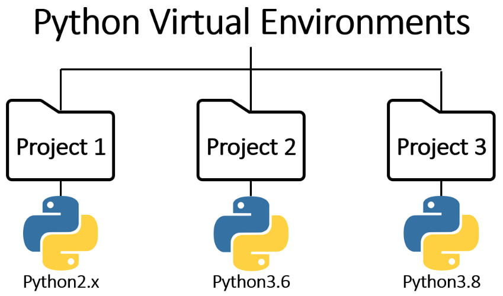
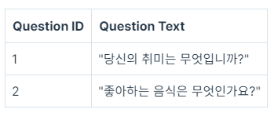
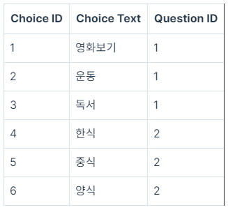

## <u>1. Django Project 생성하기</u>

- 서로 다른 유형과 목적의 프로젝트들을 한 공간에 넣어서 관리한다면, 매번 하나의 프로젝트를 실행할 때마다 그에 맞춰서 환경을 체크하고 변경해주어야 하며 심한 경우에는 프로젝트 간의 충돌이 발생할 수도 있기 때문입니다.
- 따라서 이와 같은 문제점들을 방지하고, Python 프로젝트들을 각각의 목적에 맞게 효율적으로 관리할 수 있다는 측면에서 Python 프로젝트를 다룰 때에는 가상환경을 만들어 사용하는 방법이 권장

  

- ### 실습 진행(VScode)

- Python 가상 환경을 생성

```
py -m venv project-name
```

- 가상환경을 활성화

```
project-name\Scripts\activate.bat
```

- 가상환경을 비활성화

```
deactivate
```

- 가상환경을 활성화시키고 그 상태에서 명령 프롬프트창에 아래와 같은 코드를 입력

```
py -m pip install Django
```

- Django가 올바르게 설치되었는지 체크

```
django-admin –version
```

- 새로운 Django 프로젝트 생성하기

```
$ django-admin startproject mysite
```

- 생성한 프로젝트를 서버에서 실행하기

```
$ python manage.py runserver
```

<br>

- _Keyword_: Django 설치 및 가상환경 세팅

<br>
<br>
<br>

## <u>2. Django App 생성하기</u>

- git bash로 업로드 -> src refspec main does not match any 오류

  - [참고1](https://star992411.tistory.com/54)
  - [참고2](https://daily50.tistory.com/334)

- git desktop 로컬 폴더 연결하기

- ### 실습 진행(VScode)

- polls 앱 생성하기

```
$ python manage.py startapp polls
```

- polls/views.py

```python
from django.http import HttpResponse

def index(request):
    return HttpResponse("Hello, world.")
```

<br>

- mysite/urls.py

```python
from django.contrib import admin
from django.urls import path, include

urlpatterns = [
    path("admin/", admin.site.urls),
    path("polls/", include('polls.urls'))
]
```

<br>

- polls/urls.py

```python
from django.urls import path
from . import views

urlpatterns = [
    path('',views.index, name='index')
]
```

<br>

- _Keyword_:

<br>
<br>
<br>

## <u>3. URL 경로(path) 설정하기</u>

- ### 실습 진행(VScode)

- polls/views.py

```python
from django.http import HttpResponse

def index(request):
    return HttpResponse("Hello, world.")

def some_url(request):
    return HttpResponse("Some ulr을 구현해 봤습니다.")
```

<br>

- polls/urls.py

```python
from django.urls import path
from . import views

urlpatterns = [
    path('',views.index, name='index')
    path('some_url',views.some_url)
]
```

<br>

- **관계형 데이터베이스(RDB)** 는 데이터를 행과 열로 이루어진 테이블의 형태로 구성하고, 테이블 간의 관계를 정의하는 데이터베이스입니다.
- 간단한 설문조사 어플리케이션의 예시를 통해 관계형 데이터베이스에서 각각의 용어들이 어떤 의미를 가지는지 살펴본다.
- **테이블**이란 데이터베이스에서 행과 열로 구성되어 있는 데이터의 집합을 의미합니다.
  설문조사 어플리케이션을 만들기 위해서는 두가지 테이블이 필요합니다.

1. 질문을 저장하는 테이블 Question
2. 선택지를 저장하는 테이블 Choice

- **열(column)**: 테이블에 존재하는 필드(${\color{red}field}$)

  - _Question 테이블_

    - 각 질문들을 식별할 수 있는 Question ID(${\color{red}primary \space key}$)
    - 필드와 질문의 내용에 해당하는 Question Text 필드, 총 두 가지의 필드가 존재

  - _Choice 테이블_

    - 각 선택지들을 식별할 수 있는 Choice ID(${\color{red}primary \space key}$) 필드와
    - 선택지의 내용에 해당하는 Choice Text 필드 그리고
    - 해당 선택지가 어떤 질문에 속한 것인지 알려주는 Question ID (${\color{red}foreign \space key}$) 필드

  - primary key는 테이블의 각 행(row)을 고유하게 식별할 수 있는 열(column)을 의미
  - foreign key는 다른 테이블의 primary key를 참조하는 열(column)을 의미
  - Choice 테이블의 Question ID는 Question 테이블의 primary key인 Question ID를 참조하는 foreign key 입니다. 이를 통해 각 선택지가 어떤 질문에 대한 선택지인지 그 포함 관계를 파악할 수 있습니다.

<br>

- **행(row)**: 테이블에 저장된 데이터 레코드(${\color{red}Record}$) 를 의미

  - 각 레코드는 고유한 값을 가지는 Primary Key로 식별되는데, Question 테이블에서의 Primary Key는 Question ID입니다.

  - 경우에 따라서 레코드들의 Question Text 내용이 중복되는 상황이 발생할 수 있지만 , 그럴때마다 Question ID를 이용하면 각 레코드를 식별할 수 있습니다.

    

  ***

  - Choice 테이블에서는 Choice ID를 통해 각 선택지들을 식별합니다.
    그리고 foreign key인 Question ID를 통해 각 선택지 레코드들이 어떤 질문에 속한 것인지 포함관계를 나타내고 있습니다.

    

  ***

  - 모델은 데이터베이스에서 테이블(Table)에 해당하며, 각 모델은 필드(Field)를 가지고 있습니다.

<br>

- _Keyword_:

<br>
<br>
<br>

## <u>4. 모델 만들기</u>

- ### 실습 진행(VScode)

- mysite/settings.py

```python
...
# Application definition

INSTALLED_APPS = [
    'django.contrib.admin',
    'django.contrib.auth',
    'django.contrib.contenttypes',
    'django.contrib.sessions',
    'django.contrib.messages',
    'django.contrib.staticfiles',
    'polls.apps.PollsConfig',
]
...
```

<br>

- polls/models.py

```python
from django.db import models

class Question(models.Model):
    question_text = models.CharField(max_length=200)
    pub_date = models.DateTimeField('date published')

class Choice(models.Model):
    question = models.ForeignKey(Question, on_delete=models.CASCADE)
    choice_text = models.CharField(max_length=200)
    votes = models.IntegerField(default=0)
```

<br>

- migration 파일 생성하기

```python
$ python manage.py makemigrations polls
```

<br>

- migration으로 실행될 SQL 문장 살펴보기

```python
$ python manage.py sqlmigrate polls 0001
```

<br>

- migration 실행하기

```python
$ python manage.py migrate
```

<br>

- _Keyword_:

<br>
<br>
<br>

## <u>5. 장고의 다양한 모델 필드 활용하기</u>

- [Django 모델 필드](https://docs.djangoproject.com/en/4.2/ref/models/fields/)

- ### 실습 진행(VScode)

- polls/models.py

```python
from django.db import models

class Question(models.Model):
    question_text = models.CharField(max_length=200)
    pub_date = models.DateTimeField('date published')
    #is_something = models.BooleanField(default=False)
    #average_score = models.FloatField(default=0.0)

class Choice(models.Model):
    question = models.ForeignKey(Question, on_delete=models.CASCADE)
    choice_text = models.CharField(max_length=200)
    votes = models.IntegerField(default=0)
```

<br>

- Django에서 기본으로 제공하는 SQLite 데이터베이스 파일

```python
>>> sqlite3 db.sqlite3
```

<br>

- 마이그레이션 롤백

```python
#마이그레이션을 0001버전으로 다시 롤백하기
>>>python manage.py migrate polls 0001
```

<br>

- _Keyword_: BooleanField, CharField, DateField, DateTimeField, FloatField, JSONField, TextField, sqlite3 환경변수 편집,
- python 가상환경 생성: py -m venv project-name,
- 가상환경 활성: project-name\Scripts\activate.bat

<br>
<br>
<br>

## <u>6. Django Admin - 관리자 계정 생성하고 접속하기</u>

- ### 실습 진행(VScode)

- Django Admin(관리자) 계정 생성하기

```
$ python manage.py createsuperuser
```

<br>

- _Keyword_: CRUD, Django Admin

<br>
<br>
<br>

## <u>7. Django Admin - 모델 등록하기</u>

- ### 실습 진행(VScode)

- polls/admin.py

```python
from django.contrib import admin
from .models import *

#Register your models here
admin.site.register(Question)
admin.site.register(Choice)
```

<br>

- polls/models.py

```python
from django.db import models

class Question(models.Model):
    question_text = models.CharField(max_length=200)
    pub_date = models.DateTimeField('date published')

    def __str__(self):
        return f'제목: {self.question_text}, 날짜: {self.pub_date}'

class Choice(models.Model):
    question = models.ForeignKey(Question, on_delete=models.CASCADE)
    choice_text = models.CharField(max_length=200)
    votes = models.IntegerField(default=0)
```

<br>

- _Keyword_:

<br>
<br>
<br>

## <u>8. Django Shell 사용하기</u>

- ### 실습 진행(VScode)

- polls/models.py

```python
from django.db import models

class Question(models.Model):
    question_text = models.CharField(max_length=200)
    pub_date = models.DateTimeField('date published')

    def __str__(self):
        return f'제목: {self.question_text}, 날짜: {self.pub_date}'

class Choice(models.Model):
    question = models.ForeignKey(Question, on_delete=models.CASCADE)
    choice_text = models.CharField(max_length=200)
    votes = models.IntegerField(default=0)

    def __str__(self):
        return self.choice_text
```

<br>

- Django Shell 실행하기

```
$ python manage.py shell
```

<br>

- Django Shell

```python
#models.py 파일에 정의된 모든 모델 가져오기
>>> from polls.models import *
>>> Question


#모든 Question,Choice 오브젝트 가져오기
>>> Question.objects.all()
>>> Choice.objects.all()

#첫번째 Choice 오브젝트 가져오기
>>> choice = Choice.objects.all()[0]
>>> choice.id
>>> choice.choice_text
>>> choice.votes

#첫번째 Choice와 연결된 Question 가져오기
>>> choice.question
>>> choice.question.pub_date
>>> choice.question.id


#해당 Question과 연결되어 있는 모든 Choice 가져오기
>>> question.choice_set.all()
```

<br>

- _Keyword_: Django Shell: python manage.py shell, Question.objects.all()

<br>
<br>
<br>

## <u>9. Django Shell - 현재 시간 구하기</u>

- ### 실습 진행(VScode)

- datetime을 활용하여 현재 날짜와 시간 구하기

```python
>>> from datetime import datetime
>>> datetime.now()
```

<br>

- timezone을 활용하여 현재 날짜와 시간구하기

```python
>>> from django.utils import timezone
>>> timezone.now()
```

<br>

- Django Shell:
  - from datetime import datetime
    - datetime.now()
      - datetime.datetime(2023, 4, 24, 18, 51, 6, 173891)
  - from django.utils import timezone
    - timezone.now()
      - datetime.datetime(2023, 4, 24, 9, 51, 28, 42511, tzinfo=datetime.timezone.utc)

<br>

- _Keyword_:

<br>
<br>
<br>

## <u>10. Django Shell - 레코드 생성하기</u>

- ### 실습 진행(VScode)

- Django Shell

```python
>>> from polls.models import *

#"커피 vs 녹차" 라는 내용의 새로운 Question 오브젝트를 생성하고 'q1'이라는 변수에 저장하기
>>> q1 = Question(question_text = "커피 vs 녹차")

#tiemzone을 활용하여 새로운 오브젝트 'q1'의 생성시각을 설정하기
>>> from django.utils import timezone
>>> q1.pub_date = timezone.now()

#새로운 Question 오브젝트 'q1'을 데이터베이스에 저장하기
>>> q1.save()

>>> q3 = Question(question_text = "abc")
>>> q3.pub_date = timezone.now()
>>> q3.save()
>
#create() 메서드를 활용하여 q3와 연결된 새로운 Choice 오브젝트를 생성하고, choice_text 필드에 값을 넣어주기
>>> q3.choice_set.create(choice_text = "b")

#새로운 Choice 오브젝트를 생성하고 question 필드에 q3 값을 넣어 연결하기
>>> choice_c = Choice(choice_text='c', question=q3)

#새로운 Choice 오브젝트를 데이터베이스에 저장하기
>>> choice_c.save()
```

<br>

- _Keyword_: shell을 통해 값을 추가

<br>
<br>
<br>

## <u>11. Django Shell - 레코드 수정 및 삭제 하기</u>

- ### 실습 진행(VScode)

- Django Shell

```python
>>> from polls.models import *

#Question 오브젝트 중 가장 마지막으로 만들어진 것을 가져오기
>>> q = Question.objects.last()

#해당 오브젝트의 question_text에 새로운 내용을 더해 수정하기
>>> q.question_text = q.question_text + '???'

#Choice 오브젝트 중 가장 마지막으로 만들어진 것을 가져오기
>>> choice = Question.objects.last()

#해당 오브젝트에 연결된 Question을 통해서 choice set을 가져오기
>>> choice.queston.choice_set.all()

#해당 오브젝트를 삭제하기
>>> choice.delete()
```

<br>

- _Keyword_:

<br>
<br>
<br>

## <u>12. Django Shell - 모델 필터링(Model Filtering)</u>

- ### 실습 진행(VScode)

- Django Shell

```python
>>> from polls.models import *

#get() 메서드를 사용하여 조건에 해당하는 오브젝트를 필터링하기
>>> Question.objects.get(id=1)
>>> q = Question.objects.get(question_text__startswith='휴가를')
>>> Question.objects.get(pub_date__year=2023) #get으로 여러가지 오브젝트를 가져오려고 한다면 에러발생
polls.models.Question.MultipleObjectsReturned: get() returned more than one Question

#filter() 메서드를 사용하여 조건에 해당하는 오브젝트를 필터링하기
>>> Question.objects.filter(pub_date__year=2023)
<QuerySet [<Question: 제목: 휴가를 어디서 보내고 싶으세요?, 날짜: 2023-02-05 18:52:59+00:00>, <Question: 제목: 가장 좋아하는 디저트는?, 날짜: 2023-02-05 18:53:27+00:00>, ...]>
>>> Question.objects.filter(pub_date__year=2023).count()

#쿼리셋의 SQL 쿼리 살펴보기
>>> Question.objects.filter(pub_date__year=2023).query
>>> print(Question.objects.filter(pub_date__year=2023).query)
SELECT "polls_question"."id", "polls_question"."question_text", "polls_question"."pub_date" FROM "polls_question" WHERE "polls_question"."pub_date" BETWEEN 2023-01-01 00:00:00 AND 2023-12-31 23:59:59.999999

>>> Question.objects.filter(question_text__startswith='휴가를').query
>>> print(Question.objects.filter(question_text__startswith='휴가를').query)
SELECT "polls_question"."id", "polls_question"."question_text", "polls_question"."pub_date" FROM "polls_question" WHERE "polls_question"."question_text" LIKE 휴가를% ESCAPE '\'

>>> q = Question.objects.get(pk=1)
>>> q.choice_set.all()
>>> print(q.choice_set.all().query)
SELECT "polls_choice"."id", "polls_choice"."question_id", "polls_choice"."choice_text", "polls_choice"."votes" FROM "polls_choice" WHERE "polls_choice"."question_id" = 1
```

<br>

- _Keyword_:

<br>
<br>
<br>

## <u>13. 모델 필터링 (Model Filtering) 2</u>

- ### 실습 진행(VScode)

- Django Shell

```python
>>> from polls.models import *

#startswith 연산자를 활용하여 오브젝트를 필터링하기
>>> q = Question.objects.filter(question_text__startswith='휴가를')
>>> q2 = Question.objects.filter(pub_date__year=2023)

#contains 연산자를 활용하여 오브젝트를 필터링하기
>>> Question.objects.filter(question_text__contains='휴가')

>>> Choice.objects.all()
>>> Choice.objects.filter(votes__gt=0)

#해당 쿼리셋에 대한 SQL 쿼리를 생성하기
>>> Choice.objects.filter(votes__gt=0).query
>>> print(Choice.objects.filter(votes__gt=0).query)
SELECT "polls_choice"."id", "polls_choice"."question_id", "polls_choice"."choice_text", "polls_choice"."votes" FROM "polls_choice" WHERE "polls_choice"."votes" > 0

>>> choice=Choice.objects.first()
>>> choice.votes=5
>>> choice.save()

#정규표현식을 활용하여 조건에 해당하는 오브젝트들을 필터링하기
>>> Question.objects.filter(question_text__regex=r'^휴가.*어디')
>>> print(Question.objects.filter(question_text__regex=r'^휴가.*어디').query)
SELECT "polls_question"."id", "polls_question"."question_text", "polls_question"."pub_date", "polls_question"."owner_id" FROM "polls_question" WHERE "polls_question"."question_text" REGEXP ^휴가.*어디
```

<br>

- _Keyword_:

<br>
<br>
<br>

## <u>14. Django 모델 관계기반 필터링</u>

- ### 실습 진행(VScode)

- polls/models.py

```python
from django.db import models

class Question(models.Model):
    question_text = models.CharField(max_length=200)
    pub_date = models.DateTimeField('date published')

    def __str__(self):
        return f'제목: {self.question_text}, 날짜: {self.pub_date}'

class Choice(models.Model):
    question = models.ForeignKey(Question, on_delete=models.CASCADE)
    choice_text = models.CharField(max_length=200)
    votes = models.IntegerField(default=0)
    def __str__(self):
        return f'[{self.question.question_text}] {self.choice_text}'
```

<br>

- Django Shell

```python
>>> from polls.models import *

#Question의 question_text 필드 값이 '휴가'로 시작하는 모든 Choice 오브젝트를 필터링하기
>>> Choice.objects.filter(question__question_text__startswith='휴가')

#exclude() 메서드를 사용하여 question_text 필드 값이 '휴가'로 시작하는 모든 Choice 오브젝트를 제외하고 필터링하기
>>> Question.objects.exclude(question_text__startswith='휴가')
```

<br>

- _Keyword_:

<br>
<br>
<br>

## <u>15. Django Shell - 모델 메소드</u>

- ### 실습 진행(VScode)

- polls/modes.py

```python
from django.utils import timezone
import datetime

class Question(models.Model):
    question_text = models.CharField(max_length=200)
    pub_date = models.DateTimeField('date published')

    def was_published_recently(self):
        return self.pub_date >= timezone.now() - datetime.timedelta(days=1)

    def __str__(self):
        if self.was_published_recently():
            new_badge = 'NEW!!!'
        else:
            new_badge = ''
        return f'{new_badge} 제목: {self.question_text}, 날짜: {self.pub_date}'
```

<br>

- _Keyword_:

<br>
<br>
<br>

<br>
<br>
<br>
<br>
<br>
<br>
<br>
<br>
<br>
<br>
<br>
<br>
<br>
<br>

---

**1. 이론 강의 추가할 부분 추가 진행**

- 추가할 부분: day 02 ~ 12까지 확인

**2. 선택 강의 문제 풀이 진행**
