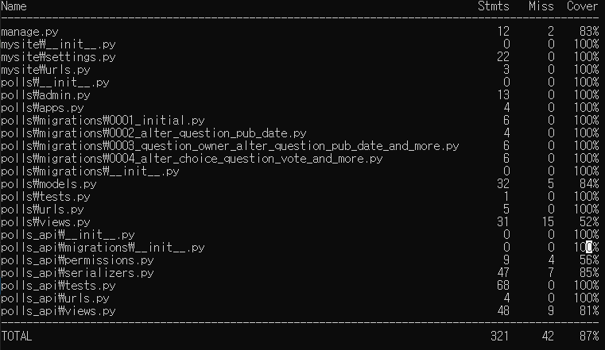

## <u>16. RelatedField</u>

- polls_api/serializers.py

```python
class ChoiceSerializer(serializers.ModelSerializer):
    class Meta:
        model = Choice
        fields = ['choice_text', 'votes']

class QuestionSerializer(serializers.ModelSerializer):
    owner = serializers.ReadOnlyField(source='owner.username')
    choices = ChoiceSerializer(many=True, read_only=True)

    class Meta:
        model = Question
        fields = ['id', 'question_text', 'pub_date', 'owner', 'choices']

class UserSerializer(serializers.ModelSerializer):
    #questions = serializers.PrimaryKeyRelatedField(many=True, queryset=Question.objects.all())
    #questions = serializers.StringRelatedField(many=True, read_only=True)
    #questions = serializers.SlugRelatedField(many=True, read_only=True, slug_field='pub_date')
    questions = serializers.HyperlinkedRelatedField(many=True, read_only=True, view_name='question-detail')

    class Meta:
        model = User
        fields = ['id', 'username', 'questions']
```

<br>

- polls_api/urls.py

```python
from django.urls import path,include
from .views import *

urlpatterns = [
    path('question/', QuestionList.as_view(), name='question-list'),
    path('question/<int:pk>/', QuestionDetail.as_view(),name='question-detail'),
    path('users/', UserList.as_view(),name='user-list'),
    path('users/<int:pk>/', UserDetail.as_view()),
    path('register/', RegisterUser.as_view()),
    path('api-auth/', include('rest_framework.urls'))

]
```

<br>

- polls/models.py

```python
...
class Choice(models.Model):
    question = models.ForeignKey(Question, related_name='choices', on_delete=models.CASCADE)
    choice_text = models.CharField(max_length=200)
    votes = models.IntegerField(default=0)

    def __str__(self):
        return self.choice_text
```

<br>

- **Keyword**:

<br>
<br>
<br>

## <u>17. 투표(Votes) 기능 구현하기 1 - Models</u>

- polls/models.py

```python
from django.contrib.auth.models import User

class Vote(models.Model):
    question = models.ForeignKey(Question, on_delete=models.CASCADE)
    choice = models.ForeignKey(Choice, on_delete=models.CASCADE)
    voter = models.ForeignKey(User, on_delete=models.CASCADE)

    class Meta:
        constraints = [
            models.UniqueConstraint(fields=['question', 'voter'], name='unique_voter_for_questions')
        ]
```

<br>

- polls_api/serializers.py

```python
class ChoiceSerializer(serializers.ModelSerializer):
    votes_count = serializers.SerializerMethodField()

    class Meta:
        model = Choice
        fields = ['choice_text', 'votes_count']

    def get_votes_count(self, obj):
        return obj.vote_set.count()
```

<br>

- Django Shell

```python
>>> from polls.models import *
>>> question = Question.objects.first()
>>> choice = question.choices.first()
>>> from django.contrib.auth.models import User
>>> user= User.objects.get(username='luke')
>>> Vote.objects.create(voter=user,question=question,choice=choice)
<Vote: Vote object (1)>
>>> question.id
1
```

<br>

- **Keyword**:

<br>
<br>
<br>

## <u>18. 투표(Votes) 기능 구현하기 2 - Serializers & Views</u>

- polls_api/serializers.py

```python
from polls.models import Question,Choice, Vote

class VoteSerializer(serializers.ModelSerializer):
    voter = serializers.ReadOnlyField(source='voter.username')

    class Meta:
        model = Vote
        fields = ['id', 'question', 'choice', 'voter']
```

<br>

- polls_api/views.py

```python
from polls.models import Question,Choice, Vote
from polls_api.serializers import VoteSerializer
from .permissions import IsOwnerOrReadOnly , IsVoter

class VoteList(generics.ListCreateAPIView):
    serializer_class = VoteSerializer
    permission_classes = [permissions.IsAuthenticated]

    def get_queryset(self, *args, **kwargs):
        return Vote.objects.filter(voter=self.request.user)

    def perform_create(self, serializer):
        serializer.save(voter=self.request.user)

class VoteDetail(generics.RetrieveUpdateDestroyAPIView):
    queryset = Vote.objects.all()
    serializer_class = VoteSerializer
    permission_classes = [permissions.IsAuthenticatedOrReadOnly, IsVoter]
```

<br>

- polls_api/permissions.py

```python
class IsVoter(permissions.BasePermission):
    def has_object_permission(self, request, view, obj):
        return obj.voter == request.user
```

<br>

- polls_api/urls.py

```python
from django.urls import path, include
from .views import VoteList, VoteDetail

urlpatterns = [
    ...
    path('vote/', VoteList.as_view()),
    path('vote/<int:pk>/', VoteDetail.as_view()),
]
```

<br>

- **Keyword**:

<br>
<br>
<br>

## <u>19. Validation</u>

- polls_api/serializers.py

```python
from rest_framework.validators import UniqueTogetherValidator

class VoteSerializer(serializers.ModelSerializer):
    def validate(self, attrs):
        if attrs['choice'].question.id != attrs['question'].id:
            raise serializers.ValidationError("Question과 Choice가 조합이 맞지 않습니다.")

        return attrs

    class Meta:
        model = Vote
        fields = ['id', 'question', 'choice', 'voter']
        validators = [
            UniqueTogetherValidator(
                queryset=Vote.objects.all(),
                fields=['question', 'voter']
            )
        ]
```

<br>

- polls_api/views.py

```python
from rest_framework import status
from rest_framework.response import Response

class VoteList(generics.ListCreateAPIView):
    serializer_class = VoteSerializer
    permission_classes = [permissions.IsAuthenticated]

    def get_queryset(self, *args, **kwargs):
        return Vote.objects.filter(voter=self.request.user)

    def create(self, request, *args, **kwargs):
        new_data = request.data.copy()
        new_data['voter'] = request.user.id
        serializer = self.get_serializer(data=new_data)
        serializer.is_valid(raise_exception=True)
        self.perform_create(serializer)
        headers = self.get_success_headers(serializer.data)
        return Response(serializer.data, status=status.HTTP_201_CREATED, headers=headers)

class VoteDetail(generics.RetrieveUpdateDestroyAPIView):
    queryset = Vote.objects.all()
    serializer_class = VoteSerializer
    permission_classes = [permissions.IsAuthenticated, IsVoter]

    def perform_update(self, serializer):
        serializer.save(voter=self.request.user)

```

<br>

- **Keyword**: UniqueTogetherValidator, validate 오버라이딩

<br>
<br>
<br>

## <u>20. Testing</u>

- polls_api/tests.py

```python
from django.test import TestCase
from polls_api.serializers import QuestionSerializer

class QuestionSerializerTestCase(TestCase):
    def test_with_valid_data(self):
        serializer = QuestionSerializer(data={'question_text': 'abc'})
        self.assertEqual(serializer.is_valid(), True)
        new_question = serializer.save()
        self.assertIsNotNone(new_question.id)

    def test_with_invalid_data(self):
        serializer = QuestionSerializer(data={'question_text': ''})
        self.assertEqual(serializer.is_valid(), False)
```

<br>

- 테스트 실행하기

```python
python manage.py test
```

<br>

- **Keyword**: 쉽게 테스트 가능

<br>
<br>
<br>

## <u>21. Testing Serializers</u>

- polls_api/tests.py

```python

from polls_api.serializers import QuestionSerializer, VoteSerializer
from django.contrib.auth.models import User
from polls.models import Question, Choice, Vote

class VoteSerializerTest(TestCase):
    def setUp(self):
        self.user = User.objects.create(username='testuser')
        self.question = Question.objects.create(
            question_text='abc',
            owner=self.user,
        )
        self.choice = Choice.objects.create(
            question=self.question,
            choice_text='1'
        )

    def test_vote_serializer(self):
        self.assertEqual(User.objects.all().count(), 1)
        data = {
            'question': self.question.id,
            'choice': self.choice.id,
            'voter': self.user.id,
        }
        serializer = VoteSerializer(data=data)
        self.assertTrue(serializer.is_valid())
        vote = serializer.save()

        self.assertEqual(vote.question, self.question)
        self.assertEqual(vote.choice, self.choice)
        self.assertEqual(vote.voter, self.user)

    def test_vote_serializer_with_duplicate_vote(self):
        self.assertEqual(User.objects.all().count(), 1)
        choice1 = Choice.objects.create(
            question=self.question,
            choice_text='2'
        )
        Vote.objects.create(question=self.question, choice=self.choice, voter=self.user)

        data = {
            'question': self.question.id,
            'choice': choice1.id,
            'voter': self.user.id,
        }
        serializer = VoteSerializer(data=data)
        self.assertFalse(serializer.is_valid())

    def test_vote_serilaizer_with_unmatched_question_and_choice(self):
        question2 = Question.objects.create(
            question_text='abc',
            owner=self.user,
        )

        choice2 = Choice.objects.create(
            question=question2,
            choice_text='1'
        )
        data = {
            'question': self.question.id,
            'choice': choice2.id,
            'voter': self.user.id,
        }
        serializer = VoteSerializer(data=data)
        self.assertFalse(serializer.is_valid())
```

<br>

- **Keyword**: TestCase - serializer test

<br>
<br>
<br>

## <u>22. Testing Views</u>

- polls_api/tests.py

```python
from rest_framework.test import APITestCase
from django.urls import reverse
from rest_framework import status
from django.utils import timezone

class QuestionListTest(APITestCase):
    def setUp(self):
        self.question_data = {'question_text': 'some question'}
        self.url = reverse('queston-list')

    def test_create_question(self):
        user =User.objects.create(username='testuser', password='testpass')
        self.client.force_authenticate(user=user)
        response = self.client.post(self.url, self.question_data)
        self.assertEqual(response.status_code, status.HTTP_201_CREATED)
        self.assertEqual(Question.objects.count(), 1)
        question = Question.objects.first()
        self.assertEqual(question.question_text, self.question_data['question_text'])
        self.assertEqual((timezone.now() - question.pub_date).total_seconds(), 1)

    def test_create_question_without_authentication(self):
        response = self.client.post(self.url, self.question_data)
        self.assertEqual(response.status_code, status.HTTP_403_FORBIDDEN)

    def test_list_question(self):
        question = Question.objects.create(question_text='Question1')
        choice = Choice.objects.create(question=question, choice_text='choice1')
        Question.objects.create(question_text='Question2')
        response = self.client.get(self.url)
        self.assertEqual(response.status_code, status.HTTP_200_OK)
        self.assertEqual(len(response.data), 2)
        self.assertEqual(response.data[0]['choices'][0]['choice_text'], choice.choice_text)
```

<br>

- Python 코드 커버리지 라이브러리 설치하기

```python
pip install coverage
```

<br>

- Python 코드 커버리지 라이브러리 실행하기

```python
coverage run manage.py test
```

<br>

- 커버리지 결과 확인

```python
coverage report
```



---

- cover 항목 100% 채우는 테스트 케이스 만들어보기

<br>

- **Keyword**: APITestCase - view test, coverage

<br>
<br>
<br>
<br>
<br>
<br>
<br>
<br>
<br>
<br>
<br>
<br>
<br>
<br>
<br>

### **Summary**:

<br>

- [실습 링크](https://github.com/pjw74/DjangoProject/tree/main/mysite)

- 전체 코드 복습할 것

<br>
<br>
<br>
<br>
<br>
<br>

---

**1. 이론 강의 추가할 부분 추가 진행**

- 추가할 부분: day 02~06까지 확인
- 보충: day 07~13

**2. 선택 강의 문제 풀이 진행**
