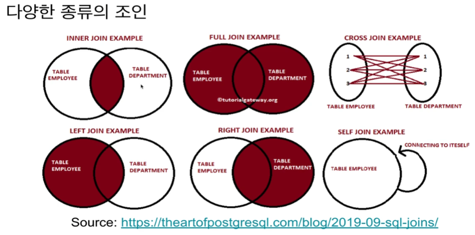

## <u>SQL_Analysis_Day 4-1</u>

- ### <u>SQL - JOIN</u>

- #### JOIN이란?

  - SQL 조인은 두개 혹은 그 이상의 테이블들을 공통 필드를 가지고 머지하는데 사용된다.   이는 스타 스키마로 구성된 테이블들로 분산되어 있던 정보를 통합하는데 사용된다.
  - 왼쪽 테이블을 LEFT, 오른쪽 RIGHT라고 하자. JOIN의 결과는 방식에 상관없이 양쪽의 필드를 모두 가진 새로운 테이블을 만들어내게 된다. 조인의 방식에 따라 다음 두 가지가 달라진다:

    - 1. 어떤 레코드들이 선택되는지?
    - 2. 어떤 필드들이 채워지는지?

      

      ***

   

   

 
 
 
 

- **Keyword**:

 
 
 
 
 
 
 
 
 
 
 
 
 
 
 

### **Summary**:

 

- [실습 링크](https://github.com/pjw74/DjangoProject/tree/main/mysite)

- 전체 코드 복습할 것

 
 
 
 
 
 

---

**1. 이론 강의 추가할 부분 추가 진행**

- 추가할 부분: day 02~06까지 확인
- 보충: day 07~13

**2. 선택 강의 문제 풀이 진행**
