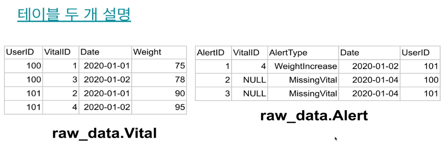
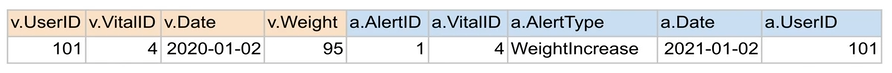
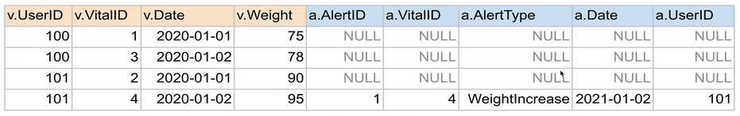
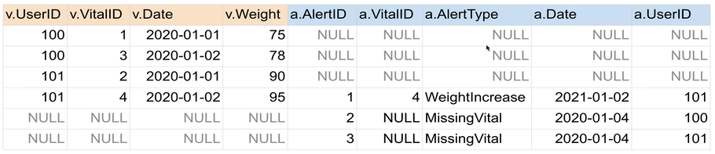
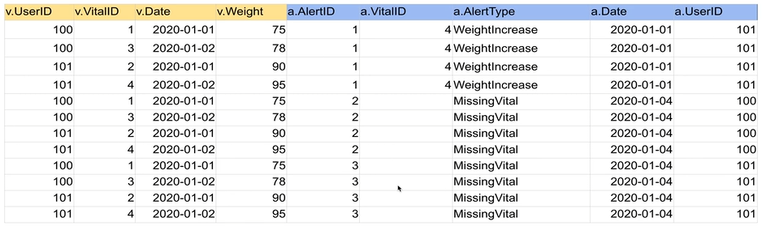
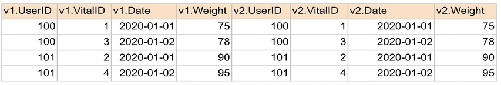
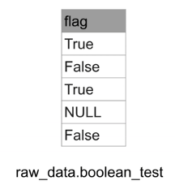
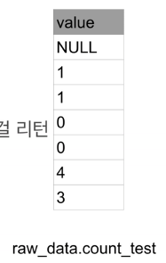

## <u>SQL_Analysis_Day 4-1</u>

- ### <u>SQL - JOIN</u>

- #### JOIN이란?

  - SQL 조인은 두개 혹은 그 이상의 테이블들을 공통 필드를 가지고 머지하는데 사용된다. <br> 이는 스타 스키마로 구성된 테이블들로 분산되어 있던 정보를 통합하는데 사용된다.
  - 왼쪽 테이블을 LEFT, 오른쪽 RIGHT라고 하자. JOIN의 결과는 방식에 상관없이 양쪽의 필드를 모두 가진 새로운 테이블을 만들어내게 된다. 조인의 방식에 따라 다음 두 가지가 달라진다:

    - 1. 어떤 레코드들이 선택되는지?
    - 2. 어떤 필드들이 채워지는지?

      

    <br>

- #### JOIN시 고려해야할 점
  - 먼저 중복 레코드가 없고 Primary Key의 uniqueness가 보장됨을 체크
    - 아주 중요!
  - 조인하는 테이블들간의 관계를 명확하게 정의
    - One to one
      - 완전한 one to one: user_session_channel & session_timestamp
      - 한쪽이 부분집합인 one to one: user_session_channel & session_transaction
    - One to many? (order vs order_items)
      - 이 경우 중복이 더 큰 문제됨 -> 증폭!
    - Many to one?
      - 방향만 바꾸면 One yo many로 보는 것과 사실상 동일.
    - Many to many?
      - 이런 경우는 많지 않으며 이는 one to one이나 one to many로 바꾸는 것이 가능하다면 변환하여 조인하는 것이 덜 위험
  - 어느 테이블을 베이스로 잡을지(From에 사용할지) 결정해야 함

<br>

- #### JOIN의 종류

  

- **INNER JOIN**

  1. 양쪽 테이블에서 매치가 되는 레코드들만 리턴함
  2. 양쪽 테이블의 필드가 모두 채워진 상태로 리턴됨

  ```SQL
  SELECT * FROM raw_data.Vital v
  JOIN raw_data.Alert a ON v.vitalID = a.vitalID;
  ```

  

<br>

- **LEFT JOIN**
  1. 왼쪽 테이블(Base)의 모든 레코드들을 리턴함
  2. 오른쪽 테이블의 필드는 왼쪽 레코드와 매칭되는 경우에만 채워진 상태로 리턴됨
  ```SQL
  SELECT * FROM raw_data.Vital v
  LEFT JOIN raw_data.Alert a ON v.vitalID = a.vitalID;
  ```
  

<br>

- **FULL JOIN**

  1. 왼쪽 테이블과 오른쪽 테이블의 모든 레코드들을 리턴함
  2. 매칭되는 경우에만 양쪽 테이블들의 모든 필드들이 채워진 상태로 리턴됨

  ```SQL
  SELECT * FROM raw_data.Vital v
  FULL JOIN raw_data.Alert a ON v.vitalID = a.vitalID;
  ```

  

<br>

- **CROSS JOIN**

  1. 왼쪽 테이블과 오른쪽 테이블의 모든 레코드들의 조합을 리턴함

  ```SQL
  SELECT * FROM raw_data.Vital v CROSS JOIN raw_data.Alert a;
  ```

  

<br>

- **SELF JOIN**
  1. 동일한 테이블을 alias를 달리해서 자기 자신과 조인함
  ```SQL
  SELECT * FROM raw_data.Vital v1
  JOIN raw_data.Vital v2 ON v1.vitalID = v2.vitalID;
  ```
  

<br>
<br>
<br>

## <u>SQL_Analysis_Day 4-2</u>

- ### <u>3일차 숙제 리뷰</u>
  - 채널별 월별 매출액 테이블 만들기
    - session_timestamp,user_session_channel,session_transaction 사용
      - 아래와 같은 필드로 구성
        - month
        - channel
        - uniqueUsers(총방문 사용자)
        - paidUsers(구매 사용자: refund한 경우도 판매로 고려)
        - conversionRate(구매사용자/총방문 사용자)
        - grossRevenue(refund 포함)
        - netRevenue(refund 제외)

<br>

- #### BOOLEAN 타입 처리
  - True or False
  - 다음 2개는 동일한 표현
    - flag = True
    - flag is True
  - 다음 2개는 동일한 표현인가?
    - flag is True
    - flag is not False

<br>



```SQL
SELECT
  COUNT(CASE WHEN flag = True THEN 1 END) true_cnt1,
  COUNT(CASE WHEN flag is True THEN 1 END) true_cnt2,
  COUNT(CASE WHEN flag is not False THEN 1 END) not_false_cnt
FROM raw_data.boolean_test;
-- result: 2, 2, 3
```

<br>

- #### NULL 비교

  - NULL 비교는 항상 IS 혹은 IS NOT으로 수행
  - NULL 비교를 = 혹은 != 혹은 <>으로 수행하면 잘못된 결과가 나옴

  ```SQL
  SELECT COUNT(1)
  FROM raw_data.boolean_test
  WHERE flag is NULL;
  -- 1
  SELECT COUNT(1)
  FROM raw_data.boolean_test
  WHERE flag = NULL;
  -- 0
  ```

<br>

- #### 숙제풀이 (1)

  - 채널별 월 매출액 테이블 만들기 - 먼저 유일한 사용자 수부터 세보자
    ```SQL
    SELECT LEFT(ts,7) "month",
      usc.channel,
      COUNT(DISTINCT userid) uniqueUsers
    FROM raw_data.user_session_channel usc
    JOIN raw_data.session_timestamp t ON t.sessionid = usc.sessionid
    GROUP BY 1, 2
    ORDER BY 1, 2;
    ```
  - 복잡한 JOIN시 먼저 JOIN 전략부터 수립

    1. raw_data.user_session_channel
    2. raw_data.session_timestamp
    3. raw_data.session_transaction

    - 위의 3개 테이블 모두 sessionid를 기반으로 조인을 해야함
    - user_session_channel과 session_timestamp는 일대일로 조인가능: INNER JOIN
    - 하지만 session_transaction의 경우에는 모든 sessionid가 존재하지 않음
      - LEFT JOIN (혹은 RIGHT JOIN)
      - FORM에 사용하는 테이블은 user_session_channel 혹은 session_timestamp가 되어야함

<br>

- #### 숙제풀이 (2)

  - 채널별 월 매출액 테이블 만들기 - 이제 session_transaction테이블을 추가해보자
    ```SQL
    SELECT LEFT(ts,7) "month",
      usc.channel,
      COUNT(DISTINCT userid) uniqueUsers
    FROM raw_data.user_session_channel usc
    JOIN raw_data.session_timestamp t ON t.sessionid = usc.sessionid
    LEFT JOIN raw_data.session_transaction st ON st.sessionid = usc.sessionid
    GROUP BY 1, 2
    ORDER BY 1, 2;
    ```
    <br>

- #### 숙제풀이 (3)

  - 채널별 월 매출액 테이블 만들기 - 이제 paidUsers를 추가해보자
    ```SQL
    SELECT LEFT(ts,7) "month",
      usc.channel,
      COUNT(DISTINCT userid) uniqueUsers,
      COUNT(DISTINCT CASE WHEN amount > 0 THEN usc.userid END) paidUsers,
    FROM raw_data.user_session_channel usc
    JOIN raw_data.session_timestamp t ON t.sessionid = usc.sessionid
    LEFT JOIN raw_data.session_transaction st ON st.sessionid = usc.sessionid
    GROUP BY 1, 2
    ORDER BY 1, 2;
    ```
    <br>

- #### 숙제풀이 (4)

  - 채널별 월 매출액 테이블 만들기 - 이제 conversionRate 추가해보자

    - 첫 번째 시도:
      - paidUsers/uniqueUsers AS conversionRate
    - 두 번째 시도:
      - paidUsers::float/uniqueUsers AS conversionRate
    - 세 번째 시도:
      - ROUND(paidUsers\*100.0/uniqueUsers,2) AS conversionRate
    - 네 번째 시도:
      - ROUND(paidUsers\*100.0/NULLIF(uniqueUsers,0),2) AS conversionRate

  - **NULLIF** - paidUsers/uniqueUsers - 0으로 나누는 경우 divide by 0 에러 발생 - 이를 어떻게 방지? NULLIF를 사용하여 0을 NULL로 변경 - paidUsers/NULLIF(uniqueUsers, 0) - 다시 한번 사칙연산에 NULL이 들어가면 결과도 NULL이 됨을 기억!
    <br>

- #### 숙제풀이 (5)

  - 채널별 월 매출액 테이블 만들기

    ```SQL
    SELECT LEFT(ts,7) "month",
      channel,
      COUNT(DISTINCT usc.userid) uniqueUsers,
      COUNT(DISTINCT CASE WHEN amount > 0 THEN usc.userid END) paidUsers,
      ROUND(paidUsers::float*100/NULLIF(uniqueUsers,0),2) conversionRate,
      SUM(amount) grossRevenue,
      SUM(CASE WHEN refunded is False THEN amount END) netRevenue
    FROM raw_data.user_session_channel usc
    JOIN raw_data.session_timestamp t ON t.sessionid = usc.sessionid
    LEFT JOIN raw_data.session_transaction st ON st.sessionid = usc.sessionid
    GROUP BY 1, 2
    ORDER BY 1, 2;
    ```

    <br>

  - **COALESCE**

    - NULL 값을 다른 값으로 바꿔주는 함수
      - 즉 NULL 대신에 다른 백업값을 리턴해주는 함수
    - COALESCE(exp1, exp2, exp3, ...)

      - exp1부터 인자를 하나씩 살펴서 NULL이 아닌 값이 나오면 그걸 리턴
      - 끝까지 갔는데도 모두 NULL이면 최종적으로 NULL을 리턴

        

        ```SQL
        SELECT
          value,
          COALESCE(value, 0) -- value가 NULL이면 0을 리턴
        FROM raw_data.count_test;
        ```

  - **공백 혹은 예약키워드를 필드 이름으로 사용하려면?**
    - ""로 둘러싸서 사용
    ```SQL
    CREATE TABLE jungwoo.test(
      group int primary key,
      'mailing address' varchar(32)
    );
    -- "group", "mailing address" 이렇게 하면 사용가능
    ```

<br>

- #### 숙제풀이 (6)

  - 채널별 월 매출액 테이블 만들기

  ```SQL
  DROP TABLE IF EXISTS adhoc.jungwoo_montly_channel_summary;
  CREATE TABLE adhoc.jungwoo_montly_channel_summary AS
    SELECT LEFT(ts,7) "month",
      channel,
      COUNT(DISTINCT usc.userid) uniqueUsers,
      COUNT(DISTINCT CASE WHEN amount > 0 THEN usc.userid END) paidUsers,
      ROUND(paidUsers::float*100/NULLIF(uniqueUsers,0),2) conversionRate,
      SUM(amount) grossRevenue,
      SUM(CASE WHEN refunded is False THEN amount END) netRevenue
    FROM raw_data.user_session_channel usc
    JOIN raw_data.session_timestamp t ON t.sessionid = usc.sessionid
    LEFT JOIN raw_data.session_transaction st ON st.sessionid = usc.sessionid
    GROUP BY 1, 2;
  ```

<br>

- **CTAS는 ORDER BY 무시**

<br>

- 숙제 1: 사용자별로 처음 채널과 마지막 채널 알아내기

  - ROW_NUMBER vs FIRST_VALUE/LAST_VALUE
  - 사용자 251번의 시간순으로 봤을 때 첫 번째 채널과 마지막 채널은 무엇인가?
    - 노가다를 하자면 아래 쿼리를 실행해서 처음과 마지막 채널을 보면 된다.
    ```SQL
    SELECT ts, channel
    FROM raw_data.user_session_channel usc
    JOIN raw_data.session_timestamp st ON usc.sessionid = st.sessionid
    WHERE userid = 251
    ORDER BY 1
    ```
  - ROW_NUMBER를 이용해서 해보자

    ```SQL
    ROW_NUMBER() OVER (PARTITION BY field1 ORDER BY field2) nn
    ```

    

    1. 사용자별로 시간순으로 일련번호를 매기고 싶다면?
    2. 새로운 컬럼 추가!!
       - 사용자별로 레코드를 모으고 그 안에서 시간순으로 소팅한 후 사용자별로 1부터 번호 부여
    3. ROW_NUMBER를 쓰면 2를 구현 가능
       ROW_NUMBER OVER (partition by userid order by ts) seq

<br>

- 숙제 2: Gross Revenue가 가장 큰 UserID 10개 찾기

  - user_session_channel과 session_transaction과 session_timestamp테이블 사용
  - Gross revenue: Refund 포함한 매출

- 숙제 3: raw_data.nps테이블을 바탕으로 월별 NPS 계산
  - 고객들이 0(의향 없음)에서 10(의향 아주 높음)
  - **detractor (비추천자)**: 0 에서 6
  - **passive (소극자)**: 7 에서 8
  - **promoter (홍보자)**: 9 에서 10
  - NPS = promoter 퍼센트 - detractor 퍼센트

<br>
<br>

- **Keyword**:

<br>
<br>
<br>
<br>
<br>
<br>
<br>
<br>
<br>
<br>
<br>
<br>
<br>
<br>
<br>

### **Summary**:

<br>

- [실습 링크](https://github.com/pjw74/DjangoProject/tree/main/mysite)

- 전체 코드 복습할 것

<br>
<br>
<br>
<br>
<br>
<br>

---

**1. 이론 강의 추가할 부분 추가 진행**

- 추가할 부분: day 02~06까지 확인
- 보충: day 07~13

**2. 선택 강의 문제 풀이 진행**
