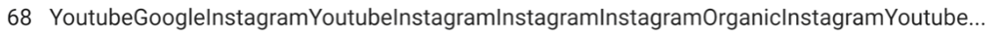
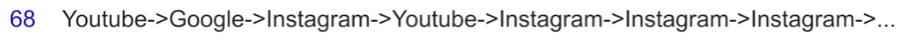
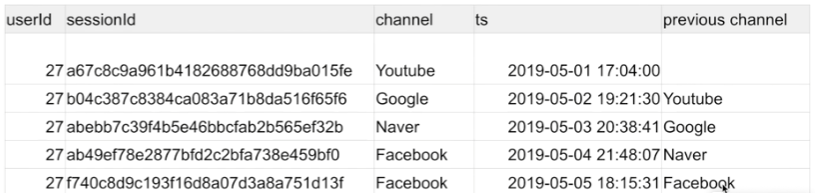
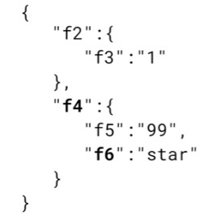

## <u>SQL_Analysis_Day 5-1</u>

### 숙제 리뷰

- 숙제 1: 사용자별로 처음 채널과 마지막 채널 알아내기

  - 해설 (1) - CTE를 빌딩블록으로 사용

    ```SQL
    WITH first AS (
      SELECT userid, ts, channel, ROW_NUMBER() OVER(PARTITION BY userid ORDER BY ts) seq
      FROM raw_data.user_session_channel usc
      JOIN raw_data.session_timestamp st ON usc.sessionid = st.sessionid
    ), last AS (
      SELECT userid, ts, channel, ROW_NUMBER() OVER(PARTITION BY userid ORDER BY ts DESC) seq
      FROM raw_data.user_session_channel usc
      JOIN raw_data.session_timestamp st ON usc.sessionid = st.sessionid
    )
    SELECT first.userid AS userid, first.channel AS first_channel, last.channel AS last_channel
    FROM first
    JOIN last ON first.userid = last.userid and last.seq = 1
    WHERE first.seq = 1;
    ```

  - 해설 (2) - JOIN 방식

    ```SQL
    SELECT first.userid AS userid, first.channel AS first_channel, last.channel AS last_channel
    FROM (
      SELECT userid, ts, channel, ROW_NUMBER() OVER(PARTITION BY userid ORDER BY ts) seq
      FROM raw_data.user_session_channel usc
      JOIN raw_data.session_timestamp st ON usc.sessionid = st.sessionid
    ) first
    JOIN (
      SELECT userid, ts, channel, ROW_NUMBER() OVER(PARTITION BY userid ORDER BY ts DESC) seq
      FROM raw_data.user_session_channel usc
      JOIN raw_data.session_timestamp st ON usc.sessionid = st.sessionid
    ) last ON first.userid = last.userid and last.seq = 1
    WHERE first.seq = 1;
    ```

  - 해설 (3) - GROUP BY 방식

    ```SQL
    SELECT userid,
      MAX(CASE WHEN rn1 = 1 THEN channel END) first_touch,
      MAX(CASE WHEN rn2 = 1 THEN channel END) last_touch,
    FROM (
      SELECT userid,
        channel,
        (ROW_NUMBER() OVER (PARTITION BY usc.userid ORDER BY st.ts asc)) AS rn1,
        (ROW_NUMBER() OVER (PARTITION BY usc.userid ORDER BY st.ts desc)) AS rn2
      FROM raw_data.user_session_channel usc
      JOIN raw_data.session_timestamp st ON usc.sessionid = st.sessionid
    )
    GROUP BY 1;
    ```

  - 해설 (4) - FIRST_VALUE/LAST_VALUE

    ```SQL
    SELECT DISTINCT
      A.userid,
      FIRST_VALUE(A.channel) over(partition by A.userid order by B.ts
    rows between unbounded preceding and unbounded following) AS First_Channel,
      LAST_VALUE(A.channel) over(partition by A.userid order by B.ts
    rows between unbounded preceding and unbounded following) AS Last_Channel
    FROM raw_data.user_session_channel A
    LEFT JOIN raw_data.session_timestamp B ON A.sessionid = B.sessionid
    ORDER BY 1;
    ```

<br>
<br>

- 숙제 2: Gross Revenue가 가증 큰 UserID 10개 찾기

  - user_session_channel과 session_transaction과 session_timestamp테이블을 사용
  - Gross revenue: Refund 포함한 매출

  - 해설 (1): GROUP BY

    ```SQL
    SELECT
      userID,
      SUM(amount)
    FROM raw_data.session_transaction st
    LEFT JOIN raw_data.user_session_channel usc ON st.sessionid = usc.sessionid
    GROUP BY 1
    ORDER BY 2 DESC
    LIMIT 10;
    ```

  - 해설 (2): SUM OVER

    ```SQL
    SELECT DISTINCT
      usc.userid,
      SUM(amount) OVER(PARTITION BY usc.userid)
    FROM raw_data.user_session_channel AS usc
    JOIN raw_data.session_transaction AS revenue ON revenue.sessionid = usc.sessionid
    ORDER BY 2 DESC
    LIMIT 10;
    ```

<br>
<br>

- 숙제 3: raw_data.nps 테이블을 바탕으로 월별 NPS 계산

  - 고객들이 0(의향 없음) 에서 10(의향 아주 높음)
    - **detractor(비추천자)**: 0 ~ 6
    - **passive(소극자)**: 7,8
    - **promoter(홍보자)**: 9,10
  - NPS = promoter 퍼센트 - detractor 퍼센트
  - 10점 만점으로 '주변에 추천하겠는가?'라는 질문을 기반으로 고객 만족도를 계산

    - 10,9점 추천하겠다는 고객(promoter)의 비율에서 0-6점의 불평고객(detractor)의 비율을 뺀 것이 NPS

  - 해설 (1)

    ```SQL
    SELECT month,
      ROUND((promoters-detractors)::float/total_count*100, 2) AS overall_nps
    FROM (
      SELECT LEFT(created, 7) AS month,
        COUNT(CASE WHEN score >= 9 THEN 1 END) AS promoters,
        COUNT(CASE WHEN score <= 6 THEN 1 END) AS detractors,
        COUNT(CASE WHEN score > 6 AND score < 9 THEN 1 END) AS passives,
        COUNT(1) AS total_count,
      FROM raw_data.nps
      GROUP BY 1
      ORDER BY 1
    );
    ```

  - 해설 (2)

    ```SQL
    SELECT LEFT(created, 7) AS month,
      ROUND(SUM(CASE
        WHEN score >= 9 THEN 1
        WHEN score <= 6 THEN -1 END)::float*100/COUNT(1), 2)
    FROM raw_data.nps
    GROUP BY 1
    ORDER BY 1;
    ```

<br>
<br>

### 실습진행 Colab

<br>
<br>

- ### 트랜젝션이란?(1)

  - Atomic하게 실행되어야 하는 SQL들을 묶어서 하나의 작업처럼 처리하는 방법
    - 이는 DDL이나 DML 중 레코드를 수정/추가/삭제한 것에만 의미가 있음.
    - SELECT에는 트랜잭션을 사용할 이유가 없음
    - BEGIN과 END 혹은 BEGIN과 COMMIT 사이에 해당 SQL들을 사용
    - ROLLBACK
  - 은행 계좌 이체가 아주 좋은 예
    - 계좌 이체: 인출과 입금의 두 과정으로 이뤄짐
    - 만일 인출은 성공했는데 입금이 실패한다면?
    - 이 두 과정은 동시에 성공하던지 실패해야함 -> Atomic하다는 의미
    - 이런 과정들을 트랜잭션으로 묶어주어야함
    - 조회만 한다면 이는 트랜잭션으로 묶일 이유가 없음

- ### 트랜젝션이란?(2)

  ```SQL
  BEGIN;
    A의 계좌로부터 인출; -- 이 명령어들은 마치 하나의 명령어처럼 처리됨.
    B의 계좌로 입금;    -- 다 성공하던지 다 실패하던지 둘중의 하나가 됨
  END;
  ```

- END와 COMMIT은 동일
- 만일 BEGIN 전의 상태로 돌아가고 싶다면 ROLLBACK 실행

<br>

- 이 동작은 commit mode에 따라 달라짐!

<br>

- 트랜잭션 커밋 모드: autocommit
  - autocommit = True
    - 모든 레코드 수정/삭제/추가 작업이 기본적으로 바로 데이터베이스에 쓰여짐.
      이를 커밋(Commit)된다고 함.
    - 만일 특정 작업을 트랜잭션으로 묶고 싶다면 BEGIN과 END(COMMIT)/ROLLBACK으로 처리
  - autocommit = False
    - 모든 레코드 수정/삭제/추가 작업이 COMMIT 호출될 때까지 커밋되지 않음

<br>

- 트랜잭션 방식

  - Google Colab의 트랜잭션
    - 기본적으로 모든 SQL statement가 바로 커밋됨(autocommit=True)
    - 이를 바꾸고 싶다면 BEGIN;END; 혹은 BEGIN;COMMIT을 사용 (혹은 ROLLBACK;)
  - psycopg2의 트랜잭션 - autocommit이라는 파라미터로 조절가능 - autocommit=True가 되면 기본적으로 PostgreSQL의 커밋 모드와 동일 - autocommit=False가 되면 커넥션 객체의 .commit()과 .rollback()함수로 트랜잭션 조절 가능 - 무엇을 사용할지는 개인 취향
    <br>

- DELETE FROM vs. TRUNCATE
  - DELETE FROM table_name(not DELETE \* FROM)
    - 테이블에서 모든 레코드를 삭제
    - vs. DROP TABLE table_name
    - WHERE 사용해 특정 레코드만 삭제 가능:
      - DELETE FROM raw_data.user_session_channel WHERE channel = 'Google'
  - TRUNCATE table_name도 테이블에서 모든 레코드를 삭제 - DELETE FROM은 속도가 느림 - TRUNCATE이 전체 테이블의 내용 삭제시에는 여러모로 유리 - 하지만 두가지 단점이 존재 - TRUNCATE는 WHERE을 지원하지 않음 - TRUNCATE는 Transaction을 지원하지 않음
    <br>
    <br>
    <br>

## <u>SQL_Analysis_Day 5-2</u>

### 실습진행 Colab

<br>
<br>

- ### 기타 고급 문법 소개와 실습

- 알아두면 유용한 SQL 문법들
  - UNION, EXCEPT, INTERSECT
  - COALESCE, NULLIF
  - LISTAGG
  - LAG
  - WINDOW 함수
    - ROW_NUMBER OVER
    - SUM OVER
    - FIRST_VALUE, LAST_VALUE
  - JSON Parsing 함수

<br>

1. UNION, EXCEPT, INTERSECT

- UNION(합집합)
  - 여러개의 테이블들이나 SELECT 결과를 하나의 결과로 합쳐줌
  - UNION vs. UNION ALL
    - UNION은 중복을 제거
- EXCEPT(MINUS)
  - 하나의 SELECT 결과에서 다른 SELECT 결과를 빼주는 것이 가능
- INTERSECT(교집합)
  - 여러 개의 SELECT문에서 같은 레코드들만 찾아줌

<br>

2. COALESCE, NULLIF

- COALESCE(Expression1, Expression2, ...):
  - 첫번째 Expression부터 값이 NULL이 아닌 것이 나오면 그 값을 리턴하고 모두 NULL이면 NULL을 리턴한다.
  - NULL값을 다른 값으로 바꾸고 싶을 때 사용한다.
- NULLIF(Expression1, Expression2):
  - Expression1과 Expression2의 값이 같으면 NULL을 리턴한다.
  - 다르면 Expression1 리턴

<br>

3. LISTAGG(1)

- GROUP BY에서 사용되는 Aggregate 함수 중의 하나
- 사용자 ID별로 채널을 순서대로 리스트:

```SQL
SELECT
  userid,
  LISTAGG(channel) WITHIN GROUP BY (ORDER BY ts) channels
FROM raw_data.user_session_channel usc
JOIN raw_data.session_timestamp st ON usc.sessoinid = st.sessionid
GROUP BY 1
LIMIT 10;
```



<br>

3. LISTAGG(2)

```SQL
SELECT
  userid,
  LISTAGG(channel, '->') WITHIN GROUP BY (ORDER BY ts) channels
FROM raw_data.user_session_channel usc
JOIN raw_data.session_timestamp st ON usc.sessoinid = st.sessionid
GROUP BY 1
LIMIT 10;
```



<br>

4. WINDOW

- Syntax:
  - function(expression) **OVER** ([**PARTITION BY** expression] [**ORDER BY** expression])
- Useful functions:
  - **ROW_NUMBER**, FIRST_VALUE, LAST_VALUE, LAG
  - Math functions: AVG, SUM, COUNT, MAX, MIN, MEDIAN, NTH_VALUE

<br>

4. WINDOW - LAG 함수(1)

- 어떤 사용자 세션에서 시간순으로 봤을 때
  - 앞 세션의 채널이 무엇인지 알고 싶다면?
  - 혹은 다음 세션의 채널이 무엇인지 알고 싶다면?

4. WINDOW - LAG 함수(2)

```SQL
-- 이전 채널 찾기
SELECT usc.*, st.ts,
  LAG(channel,1) OVER (PARTITION BY userId ORDER BY ts) prev_channel
FROM raw_data.user_session_channel usc
JOIN raw_data.session_timestamp st ON usc.sessionid = st.sessionid
ORDER BY usc.userid, st.ts
-- 다음 채널을 찾으려면??
```



<br>

5. JSON Parsing Functions

- JSON의 포맷을 이미 아는 상황에서만 사용가능한 함수
  - JSON String을 입력으로 받아 특정 필드의 값을 추출가능(nested 구조 지원)
- 예제) JSON_EXTRACT_PATH_TEXT

  - SELECT JSON_EXTRACT_PATH_TEXT('{"f2":{"f3":"1"},"f4":{"f5":"99","f6":"star"}}',**'f4','f6'**);

    

<br>
<br>

### 실습진행 Colab

<br>
<br>
<br>
<br>
<br>
<br>
<br>
<br>

- **Keyword**:

<br>
<br>
<br>
<br>
<br>
<br>
<br>
<br>
<br>
<br>
<br>
<br>
<br>
<br>
<br>

### **Summary**:

<br>
<br>
<br>
<br>
<br>
<br>
