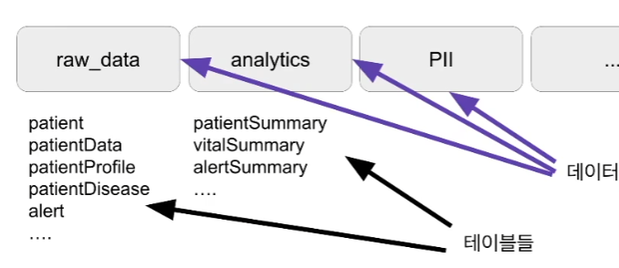
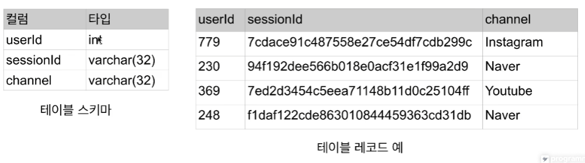
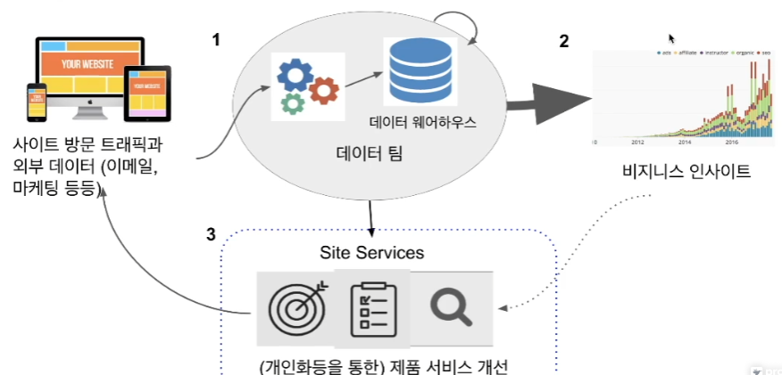
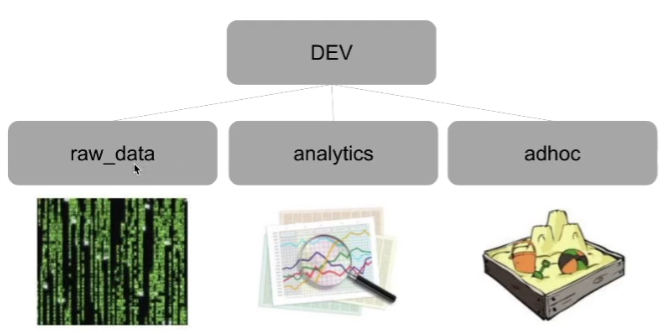

## <u>SQL_Analysis_Day 1-1</u>

- 내용 추가

<br>
<br>
<br>
<br>

- ### <u>대표적 관계형 데이터 베이스</u>

  - 프로덕션 DB: MySQL, PostgreSQL, Oracle, ...
    - ORTP(OnLine Transaction Processing)
    - 빠른 속도 집중, 서비스에 필요한 정보 저장
  - **데이터 웨어하우스**: Redshift, Snowflake, BigQuery, Hive, ...
    - OLAP(OnLine Analytical Processing)
      - 처리 데이터 크기에 집중. 데이터 분석 혹은 모델 빌딩 등을 위한 데이터 저장
        - 보통 프로덕션 DB를 복사해서 데이터 웨어하우스에 저장
        -

- ### <u>관계형 데이터베이스의 구조</u>

  - 관계형 데이터베이스는 2단계로 구성됨
    - 가장 밑단에는 테이블들이 존재 (테이블 엑셀의 시트에 해당)
    - 테이블들은 데이터베이스(혹은 스키마)라는 폴더 밑으로 구성(엑셀에서는 파일)
      

<br>

- 테이블을 보고 짐작할 수 있다.
  - raw(날 것의) data

<br>

- 테이블의 구조(테이블 스키마라고도 함)

  - 테이블은 레코드들로 구성(행)
  - 레코드는 하나 이상의 필드(컬럼)로 구성(열)
  - 필드(컬럼)는 이름과 타입과 속성(primary key)으로 구성됨

    
    <br>

  - pk가 동일하면 리젝(유일해야 한다)

<br>

- ### <u>SQL</u>

  - Structured Query Language
    - 관계형 데이터베이스에 있는 데이터(테이블)를 질의하거나 조작해주는 언어
    - SQL은 1970년대 초반에 IBM이 개발한 구조화된 데이터 질의 언어
    - 두 종류의 언어로 구성됨
      - DDL(Data Definition Laguage):
        - 테이블의 구조를 정의하는 언어
      - DML(Data Manipulation Language):
        - 테이블에서 원하는 레코드들을 읽어오는 질의 언어
        - 테이블에 레코드를 추가/삭제/갱신해주는데 사용하는 언어
    - 구조화된 데이터를 다루는 한 SQL은 데이터 규모와 상관없이 쓰임
    - 모든 대용량 데이터 웨어하우스는 SQL기반
      - Redshift, Snowflake, BigQuery, Hive
    - Spark나 Hadoop도 예외 x
      - SparkSQL과 Hive라는 SQL언어 지원됨
    - 데이터 분야에서 일하고자 한다면 반드시 익혀야 함

- ### <u>Denormalized schema</u>
  - 데이터 웨어하우스에서 사용하는 방식
    - 단위 테이블로 나눠 저장하지 않음으로 별도의 조인이 필요 없는 형태를 말함
    - 이는 스토리지를 더 사용하지만 조인이 필요 없기에 빠른 계산이 가능

<br>
<br>
<br>

## <u>SQL_Analysis_Day 1-2</u>

- 데이터 웨어하우스 소개: 무엇이고, 다른 관계형 데이터베이스와 어떻게 다른지 알아보자

- 데이터 웨어하우스: 회사에 필요한 모든 데이터를 저장
  - 여전히 SQL 기반의 관계형 데이터베이스
    - 프로덕션 데이터베이스와는 별도이어야 함(마음놓고 query를 날릴 수 있게)
      - OLAP
    - AWS의 Redshift(고정비용), Google Cloud의 Big Query, Snowflake(가변비용) 등이 대표적
  - 데이터 웨어하우스는 고객이 아닌 내부 직원(_내부 데이터 팀원을 위한 데이터베이스_)을 위한 데이터 베이스
    - 처리속도가 아닌 처리 데이터의 크기가 더 중요해짐
  - ETL 혹은 데이터 파이프라인
    - 외부에 존재하는 데이터를 읽어다가 데이터 웨어하우스로 저장해주는 코드들이 필요해지는데 이를 ETL 혹은 데이터 파이프라인이라고 부름

<br>

- **데이터 인프라란?**

  - 데이터 엔지니어가 관리 - 여기서 한 단계 더 발전하면 Spark와 같은 대용량 분산처리 시스템이 일부로 추가됨
    
    <br>
    - 1단계:
    - 2단계: 데이터 엔지니어
    - 3단계: 사이언티스트

- ### <u>Cloud</u>
  - 컴퓨팅 자원(HW, SW 등등)을 네트워크를 통해 서비스 형태로 사용하는 것.
  - 키워드:
    - "No Provisioning": 준비할 필요 x 원하는 사양만
    - "Pay As You Go": 쓴 만큼 지불(초기투자 필요 x)
  - 자원(예를 들면 서버)을 필요한만큼 (거의) 실시간으로 할당하여 사용한만큼 지불
    - 탄력적으로 필요한만큼의 자원을 유지하는 것이 중요

<br>

- #### <u>클라우드 컴퓨팅이 없었다면?</u>
  - 서버/네트웍/스토리지 구매와 설정 등을 직접 해야한다.
  - 데이터센터 공간을 직접 확보(Co-location)
    - 확장이 필요한 경우 공간을 먼저 더 확보해야함
  - 그 공간에 서버를 구매하여 설치하고 네트웍 설정
    - 보통 서버를 구매해서 설치하는데 적어도 두세달 걸림
  - Peak time을 기준으로 Capacity planning을 해야함
    - 놀고 있는 자원들이 높게 되는 현상 발생
  - 직접 운영비용 vs. 클라우드 비용
    - 기회비용 측면에서 생각했을 때
- #### <u>장점</u>

  - 초기 투자 비용이 크게 줄어든다(CAPEX(Capital Expenditure) vs. OPEX(Operating Expense:운영 비용))
  - 리소스 준비를 위한 대기시간 대폭 감소(Shorter Time to Market)
  - 노는 리소스 제거로 비용 감소(탄력적 운용이 요구됨)
  - 글로벌 확장 용이
  - 소프트웨어 개발 시간 단축
    - Managed Service (SaaS) 이용

- ### <u>AWS</u>

  - 가장 큰 클라우드 컴퓨팅 서비스 업체
  - 2002년 아마존의 상품데이터를 API로 제공하면서 시작
    - 남아프리카 엔지니어의 아이디어 (아마존의 남는 서버를 다른 곳에 제공하면서 비용을 받자) 별도의 사업부로 발전
    - 현재 100여개의 서비스를 전세계 15개의 지역에서 제공
    - 대부분의 서비스들이 오픈소스 프로젝트들을 기반으로 함
    - 최근 들어 ML/AI관련 서비스들도 내놓기 시작
  - 사용 고객
    - Netflix, Zynga등의 상장업체들도 사용
    - 많은 국내 업체들도 사용시작(서울 리전)
  - 다양한 종류의 SW/플랫폼 서비스를 제공.
    - AWS의 서비스만으로 쉽게 온라인 서비스 생성
    - 뒤에서 일부 서비스 따로 설명

- #### <u>EC2 - Elastic Compute Cloud(1)</u>

  - AWS의 서버 호스팅 서비스.
    - 리눅스 혹은 윈도우 서버를 론치하고 어카운트를 생성하여 로그인 가능(구글앱 엔진과의 가장 큰 차이점)
    - 가상 서버들이라 전용서버에 비해 성능이 떨어짐
    - Bare metal 서버도 제공하기 시작
  - 다양한 종류의 서버 타입 제공
    - http://aws.amazone.com/ec2/
  - Incoming network bandwidth는 공짜이지만 outgoing은 유료.

- #### <u>EC2 - Elastic Compute Cloud(2)</u>

  - 세 가지 종류의 구매 옵션
    - On-Demand: 시간당 비용 지불, 가장 흔히 사용
    - Reserved: 1년이나 3년 사용을 보장 1/3정도 40% 디스카운트
    - Spot Instance: 일종의 경매방식 놀고 있는 리소스 항상 살아있다는 보장 x

- #### <u>S3 - Simple Storage Service(1)</u>

  - http://aws.amazon.com/s3/
  - 아마존이 제공하는 대용량 클라우드 스토리지 서비스
  - S3는 데이터 저장관리를 위해 계층적 구조를 제공
  - 글로벌 네임스페이스를 제공하기 때문에 톱레벨 디렉토리 이름 선정 주의
  - S3에서는 디렉토리를 버킷(Bucket)이라고 부름
  - 버킷이나 파일별로 엑세스 컨트롤 가능

- #### <u>S3 - Simple Storage Service(2)</u>

  - https://aws.amazon.com/ko/s3/pricing/
  - Low cost. 1TB per month:
    - Standard storage: $23 (데이터 보장 확률에 따른 가격)
      - Infrequent Access storage: $12.5
      - SLA가 다름
    - Glacier storage: $4

- #### <u>기타 중요 서비스 - Database Services</u>

  - RDS(Relational Database Service)
    - MySQL, PostgreSQL, Aurora
    - Oracle, MS SQL server
  - DynamoDB
  - **Redshift**
  - ElasticCache
  - Neptune(Graph database)
  - ElasticSearch
  - MongoDB

- #### <u>기타 중요 서비스 - AI & ML Services</u>

  - SageMaker
    - Deep Learning and Machine Leaning end-to-end framework
    - 모델을 만들고 테스트하고 최종적으로 API형태로 deploy 해줌
    - 1. 어떤 문제를 해결할 건지
    - 2. 기반해서 traning set 수집
    - 3. 어떤 ML 알고리즘 사용할건지 결정(SageMaker 해줌)
    - 4. 거기에 따른 Hyper prameter 선택(SageMaker)
    - 5. traning set / test set 나눠야 함(SageMaker)
    - 6. 프로덕션에 API형태로 디플로이 해야함(사용할 수 있게)(SageMaker)
  - Lex
    - Conversational Interface(Chatbot service)
  - Polly
    - Text to Speech Engine(텍스트를 음성으로 바꿔줌)
  - Rekognition

    - Image Recognition Service

  - Amazon Alexa
    - Amazon's voice bot platform
  - Amazon Connect
    - Amazon's Contact Center Solution
    - 콜센터 구현이 아주 쉬워짐
  - Lambda
    - Event-driven, serverless compution engine
    - 서비스 구현을 위해서 EC2를 론치할 필요가 없음
    - Google Cloud에는 Cloud Function이란 이름으로 존재
    - Azure에는 Azure Function이란 이름으로 존재

- ### <u>Redshift</u>

  - Scalable SQL 엔진(1)
  - 2 PB까지 지원
  - Still OLAP
    - 응답속도가 빠르지 않기 때문에 프로덕션 데이터베이스로 사용불가
  - Columnar storage
    - 컬럼별 압축이 가능
    - 컬럼을 추가하거나 삭제하는 것이 아주 빠름
  - 벌크 업데이트 지원
    - 레코드가 들어있는 파일을 S3로 복사 후 COPY 커맨드로 Redshift로 일괄 복사
  - **고정 용량/비용** SQL 엔진
    - vs. Snowflake(Cloud와 관계 없이 사용 가능) vs. BigQuery
  - 다른 데이터 웨어하우스처럼 primary key uniqueness를 보장하지 않음(개발자가 pk보장 작업을 해야 함)
    - 프로덕션 데이터베이스들은 보장함
  - Redshift는 Postgresql 8.x와 SQL이 호환됨
    - 하지만 Postgresql 8.x의 모든 기능을 지원하지는 않음
      - 예를 들어 text 타입이 존재하지 않음
    - Postgresql 8.x를 지원하는 툴이나 라이브러리로 액세스 가능
      - JDBC/ODBC
    - 다시 한번 SQL이 메인 언어라는 점 명심
      - 그러기에 테이블 디자인이 아주 중요하다.
    - Redshift Options and Pricing
      - Dense Storage
      - Dense Compute
      - Managed Storage
  - #### <u>Redshift Schema (폴더) 구성</u>

    

    - admin 권한 가진 사람만 가능

```SQL
CREATE SCHEMA raw_data;
CREATE SCHEMA analytics;
CREATE SCHEMA adhoc;
```

<br>
<br>
<br>
<br>

- [git push 사용법/팁](https://www.daleseo.com/git-push/)
- [git 입문](https://backlog.com/git-tutorial/kr/stepup/stepup2_4.html)
- [git branch 팁](https://www.freecodecamp.org/korean/news/git-clone-branch-how-to-clone-a-specific-branch/)
- [원하는 파일만 git push](https://velog.io/@lov012726/git%EC%9B%90%ED%95%98%EB%8A%94-%ED%8C%8C%EC%9D%BC%EB%93%A4%EB%A7%8C-git-push-%ED%95%98%EB%8A%94-%EB%B2%95)
- [branch생성 후 push](https://velog.io/@clubmed2/Git-branch%EC%83%9D%EC%84%B1-%ED%9B%84-push%ED%95%98%EA%B8%B0)
- [git main](https://blog.outsider.ne.kr/1598)

<br>
<br>
<br>
<br>

- **Keyword**:

<br>
<br>
<br>
<br>
<br>
<br>
<br>
<br>
<br>
<br>
<br>
<br>
<br>
<br>
<br>

### **Summary**:

<br>

- [실습 링크](https://github.com/pjw74/DjangoProject/tree/main/mysite)

- 전체 코드 복습할 것

<br>
<br>
<br>
<br>
<br>
<br>

---

**1. 이론 강의 추가할 부분 추가 진행**

- 추가할 부분: day 02~06까지 확인
- 보충: day 07~13

**2. 선택 강의 문제 풀이 진행**
