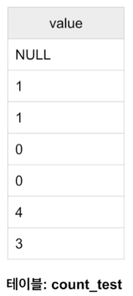

## <u>SQL_Analysis_Day 2-1</u>

- ### <u>SQL - SELECT</u>

- #### Redshift 클러스터 정보

  - 1 x dc2.large instance
    - 160GB
  - Host
    - learnde.
  - Port number:
    - 5439
  - Database name:
    - dev

- #### 예제 테이블

  - 관계형 데이터베이스 예제 - 웹서브 사용자/세션 정보(1)
    - 사용자 ID: 보통 웹서비스에서는 등록된 사용자마다 부여하는 유일한 ID
    - 세션 ID: 세션마다 부여되는 ID
      - 세션: 사용자의 방문을 논리적인 단위로 나눈 것
        - 사용자가 외부 링크(광고)를 타고 오거나 직접 방문해서 올 경우 세션을 생성
        - 사용자가 방문 후 30분간 interaction이 없거나 뭔가를 하는 경우 새로 세션을 생성
      - 즉 하나의 사용자는 여러 개의 세션을 가질 수 있음
      - 보통 세션의 경우 세션을 만들어낸 접점(경유지)를 채널이란 이름으로 기록해둠(접점: 유튜브,페이스북,구글검색 등 채널으로 기록)
        - 마케팅 관련 기여도 분석을 위함
      - 또한 세션이 생긴 시간도 기록
      - _여러 채널에 같은 돈을 썼을 때 효율 분석하기 위해서_ 매출까지 확인
  - 관계형 데이터베이스 예제 - 웹서비스 사용자/세션 정보(2)
    - 이 정보를 기반으로 다양한 데이터 분석과 지표 설정이 가능
      - 마케팅 관련, 사용자 트래픽 관련
      - DAU, WAU, MAU등의 일주월별 Active User 차트
      - Marketing Channel Attribution 분석
        - **어느 채널에 광고를 하는 것이 가장 효과적인가?**
        - First Channel Attribution, Last, Multiple

- #### Redshift 중심으로 DDL, DML 소개

  - SQL 기본
    - 먼저 다수의 SQL문을 실행한다면 세미콜론으로 분리 필요
      - SQL문1; SQL문2; SQL문3;
    - SQL 주석
      - --: 인라인 한줄짜리 주석
      - /\*--\*/: 여러 줄에 걸쳐 주석
    - SQL 키워드는 대문자를 사용한다던지 하는 나름대로의 포맷팅 필요
      - 팀 프로젝트라면 팀에서 사용하는 공통 포맷이 필요
    - 테이블/필드이름의 명명 규칙을 정하는 것이 중요
      - 단수형 vs 복수형
        - User vs Users
      - \_ vs CamelCasing
        - user_session_channel vs UserSessionChannel
  - SQL DDL - 테이블 구조 정의 언어 (1)

    - CREATE TABLE
    - Primary Key 속성을 지정할 수 있으나 무시됨
      - Primary key uniqueness
        - Big Data 데이터웨어하우스에서는 지켜지지 않음(Redshift, Snowflake, BigQuery)
      - CTAS: CREATE TABLE table_name AS SELECT
        - vs CREATE TABLE and then INSERT

    ```SQL
    CREATE TABLE raw_data.user_session_channel(
      userid int,
      sessionid varchar(32) primary key,
      channel varchar(32)
    );
    ```

  - SQL DDL - 테이블 구조 정의 언어 (2)

    - DROP TABLE
      - DROP TABLE table_name;
        - 없는 테이블을 지우려고 하는 경우 에러
      - DROP TABLE **IF EXISTS** table_name;
      - vs DELETE FROM
        - DELETE FROM은 조건에 맞는 레코드들을 지움(테이블 자체는 존재)

  - SQL DDL - 테이블 구조 정의 언어 (3)

    - ALTER TABLE
      - 새로운 컬럼 추가:
        - ALTER TABLE 테이블이름 ADD COLUMN 필드이름 필드타입;
      - 기존 컬럼 이름 변경:
        - ALTER TABLE 테이블이름 RENAME 현재필드이름 to 새필드이름;
      - 기존 컬럼 제거:
        - ALTER TABLE 테이블이름 DROP COLUMN 필드이름;
      - 테이블 이름 변경:
        - ALTER TABLE 현재테이블이름 RENAME to 새테이블이름;

    <br>

  - SQL DML - 테이블 데이터 조작 언어 (1)
    - 레코드 질의 언어: SELECT
      - 뒤에서 더 자세히 설명
      - SELECT FROM: 테이블에서 레코드와 필드를 읽어오는데 사용
      - WHERE를 사용해서 레코드 선택 조건을 지정
      - GROUP BY를 통해 정보를 그룹 레벨에서 뽑는데 사용하기도 함
        - DAU, WAU, MAU 계산은 GROUP BY를 필요로 함
      - ORDER BY를 사용해서 레코드 순서를 결정하기도 함
      - 보통 다수의 테이블의 조인해서 사용하기도 함
  - SQL DML - 테이블 데이터 조작 언어 (2) - 레코드 수정 언어: - INSERT INTO: 테이블에 레코드를 추가하는데 사용 - UDATE FROM: 테이블 레코드의 필드 값 수정 - DELETE FROM: 테이블에서 레코드를 삭제 - vs TRUNCATE

<br>
<br>
<br>

## <u>SQL_Analysis_Day 2-2</u>

- 실습에 들어가기에 앞서 기억할 점 (1)
  - 현업에서 깨끗한 데이터란 존재하지 않음
    - 항상 데이터를 믿을 수 있는지 의심할 것
    - 실제 레코드를 몇 개 살펴보는 것 만한 것이 없음 -> 노가다
  - 데이터 일을 한다면 항상 데이터의 품질을 의심하고 체크하는 버릇이 필요
    - 중복된 레코드들 체크하기
    - 최근 데이터의 존재 여부 체크하기(freshness)
    - Primary key uniqueness가 지켜지는지 체크하기
    - 값이 비어있는 컬럼들이 있는지 체크하기
    - 위의 체크는 코딩의 **unit test** 형태로 만들어 매번 쉽게 체크해볼 수 있음
- 실습에 들어가기에 앞서 기억할 점 (2)

  - 어느 시점이 되면 너무나 많은 테이블들이 존재하게 됨
    - 회사 성장과 밀접한 관련
    - 중요 테이블들이 무엇이고 그것들의 메타 정보를 잘 관리하는 것이 중요해짐
  - 그 시점부터는 Data Discovery 문제들이 생겨남
    - 무슨 테이블에 내가 원하고 신뢰할 수 있는 정보가 들어있나?
    - 테이블에 대해 질문을 하고 싶은데 누구에게 질문을 해야하나?
  - 이 문제를 해결하기 위한 다양한 오픈소스와 서비스들이 출현
    - DataHub(LinkedIn), Amundsen(Lyft), ...
    - Select Star, DataFrame, ...

- **SELECT (1)**

  - 테이블(들)에서 레코드들(혹은 레코드수)을 읽어오는데 사용
  - WHERE을 사용해 조건을 만족하는 레코드

- **SELECT (4)**

  ```SQL
  SELECT DISTINCT channel --유일한 채널 이름을 알고 싶은 경우
  FROM raw_data.user_session_channel;

  SELECT channel, COUNT(1) --채널별 카운트를 하고 싶은 경우
  FROM raw_data.user_session_channel
  GROUP BY 1;
  ```

- **SELECT (5)**

  ```SQL
  SELECT COUNT(1) --테이블의 모든 레코드 수 카운트 . COUNT(*)하나의 레코드
  FROM raw_data.user_session_channel;

  SELECT COUNT(1)
  FROM raw_data.user_session_channel
  WHERE channel = 'Facebook'; --channel 이름이 Facebook경우만 고려해서 레코드 수 카운트
  ```

- **CASE WHEN**
  - 필드 값의 변환을 위해 사용 가능
    - CASE WHEN 조건 THEN 참일때 값 ELSE 거짓일때 값 END 필드이름
  - 여러 조건을 사용하여 변환하는 것도 가능

```SQL
CASE
  WHEN 조건1 THEN 값1
  WHEN 조건2 THEN 값2
  ELSE 값3
END 필드이름

-- Example

SELECT CASE
  WHEN channel in ('Facebook','Instagram') THEN 'Social-Media'
  WHEN channel in ('Google','Naver')THEN 'Search-Engine'
  ELSE 'Something-Else'
END channel_type
FROM raw_data.user_session_channel;
```

- **NULL이란?**

  - 값이 존재하지 않음을 나타내는 상수. 0 혹은 ""과는 다름
  - 필드 지정시 값이 없는 경우 NULL로 지정 가능
    - 테이블 정의시 디폴트 값으로도 지정 가능
  - 어떤 필드의 값이 NULL인지 아닌지 비교는 특수한 문법을 필요로 함
    - field 1 is NULL 혹은 field 1 is not NULL
  - NULL이 사칙연산에 사용되면 그 결과는?
    - SELECT 0 + NULL, 0 - NULL, 0 \* NULL, 0/NULL
      = 다 NULL

- **COUNT 함수 제대로 이해하기**

  

  ```SQL
  SELECT
   COUNT(1) as count_1, --count_test = 7
   COUNT(0) as count_0, -- = 7
   COUNT(NULL) as count_null,--= 0
   COUNT(value) as count_value, --= 6 -- NULL아닌 값
   COUNT(DISTINCT value) as count_distinct_value -- = 4 -- unique value, NULL 빼고
  FROM raw_data.count_test
  ```

- **WHERE**

  - IN
    - WHERE channel in ('Google','Youtube')
      - WHERE channel = 'Google' OR channel = 'Youtube'
    - NOT IN
  - LIKE and ILIKE
    - LIKE is a case sensitive string match(대소문자 구분).
      ILIKE is a case-insensitive string match(대소문자 구분x)
    - WHERE channel LIKE 'G%' -> 'G\*'
    - WHERE channel LIKE '%o%' -> '\*o\*'
    - NOT LIKE or NOT ILIKE
  - BETWEEN
    - Used for data range matching
  - 위의 오퍼레이터들은 CASE WHEN 사이에서도 사용가능

- **STRING Functions**

  ```SQL
  - LEFT(str, N) -- 첫번째 인자 str, 두번째 숫자 str을 N만큼 빼냄
  - REPLACE(str, exp1, exp2) -- exp1를 exp2로 바꿔치기
  - UPPER(str) -- 대문자로
  - LOWER(str) -- 소문자로
  - LEN(str) -- 길이
  - LPAD, RPAD -- str 붙여줌
  - SUBSTRING
  ```

- **ORDER BY**

  - Default ordering is ascending
    - ORDER BY 1 ASC
  - DESC
  - Ordering by multiple columns:
    - ORDER BY 1 DESC, 2, 3
      - 첫 번째 내림차순, 2번째 오름 같으면 3번째 오름차순으로
  - NULL 값 순서는?
    - NULL 값들은 오름차순 일 경우 (ASC), 마지막에 위치함
    - NULL 값들은 내림차순 일 경우 (DESC), 처음에 위치함
    - 이를 바꾸고 싶다면 NULLS FIRST 혹은 NULLS LAST를 사용

- **타입 변환**
  - DATE Conversion:
    - 타임존 관련 변환
      - CONVERT_TIMEZONE('America/Los_Angeles', ts)
      - select pg_timezone_names();
    - DATE, TRUNCATE
    - DATE_TRUNC
      - 첫번째 인자가 어떤 값을 추출하는지 지정(week,month,day, ...)
    - EXTRACT or DATE_PART: 날짜시간에서 특정 부분의 값을 추출가능
    - DATEDIFF(빼고)
    - DATEADD(더하고)
    - GET_CURRENT, ...
  - TO_CHAR, TO_TIMESTAMP
- **Type Casting**

  - 1/2 결과는? 0 이됨. 정수간의 연산은 정수가 되어야하기 때문
  - :: 오퍼레이터를 사용
    - category::float
  - cast 함수를 사용
    - cast(category as float)

<br>
<br>

## 실습진행 Colab

<br>
<br>


<br>
<br>
<br>
<br>

- **Keyword**:

<br>
<br>
<br>
<br>
<br>
<br>
<br>
<br>
<br>
<br>
<br>
<br>
<br>
<br>
<br>

- **Summary**:
