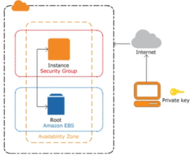
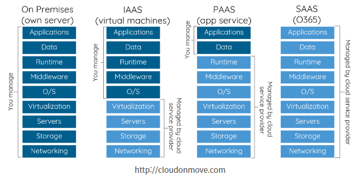

## <u>01 EC2 개요</u>

### AWS EC2 기능

---

- **인스턴스**: 가상 컴퓨팅 환경
- **Amazon 머신 이미지(AMI)**: 서버에 필요한 운영체제와 여러 소프트웨어들이 적절히 구성된
  상태로 제공되는 템플릿으로 인스턴스를 쉽게 만들 수 있습니다.
- **인스턴스 유형**: 인스턴스를 위한 CPU, 메모리, 스토리지, 네트워킹 용량의 여러 가지 구성 제공
- **키 페어**를 사용하여 인스턴스 로그인 정보 보호(AWS는 퍼블릭 키를 저장하고 사용자는 개인 키를 안전한 장소에 보관하는 방식)
- **인스턴스 스토어 볼륨**: 임시 데이터를 저장하는 스토리지 볼륨으로 인스턴스 중단, 최대 절전 모드로 전환 또는 종료 시 삭제됨
- **Amazon Elastic Block Store(Amazon EBS)**, 즉 Amazon EBS 볼륨을 사용해 영구 스토리지 볼륨에 데이터 저장
- **보안 그룹**을 사용해 인스턴스에 연결할 수 있는 프로토콜, 포트, 소스 IP 범위를 지정하는 방화벽 기능
- **탄력적 IP 주소(EIP)**: 동적 클라우드 컴퓨팅을 위한 고정 IPv4 주소
- **태그**: 사용자가 생성하여 Amazon EC2 리소스에 할당할 수 있는 메타데이터
- **Virtual Private Clouds(VPC)**: AWS 클라우드에서는 논리적으로 격리되어 있지만 원할 때마다
  고객의 네트워크와 간편히 연결할 수 있는 가상 네트워크

  - AWS EC2 구성도

  

<br>
<br>

## <u>01 클라우드 서비스개요</u>

### AWS 란?

- Amazon Web Services(AWS)
  - 전 세계적으로 분포한 데이터 센터에서 200개가 넘는 완벽한 기능의 서비를 제공하는, 세계적으로
    가장 포괄적이며, 널리 채택되고 있는 클라우드 플랫폼.
  - 빠르게 성장하는 스타트업, 가장 큰 규모의 엔터프라이즈, 주요 정부 기관을 포함한 수백만명의
    고객이 AWS를 사용하여 비용을 절감하고, 민첩성을 향상시키고 더 빠르게 혁신함.

<br>

- **클라우드 컴퓨팅이란?**
  - 클라우드 컴퓨팅 IT 리소스를 인터넷을 통해 온디맨드로 제공하고 사용한 만큼만 비용을 지불하는 방식.
  - 물리적 데이터 센터와 서버를 구입, 소유 및 유지 관리하는 대신, Amazon Web Services(AWS)와
    같은 클라우드 공급자로부터 필요에 따라 컴퓨팅 파워, 스토리지, 데이터베이스와 같은 기술 서비스에
    엑세스 한다.
  - 이점:
    - 민첩성
    - 탄력성
    - 비용절감
    - On demend
    - 관리 이용성

<br>

- **클라우드 유형**

  

  [참고 url](https://dalsacoo-log.tistory.com/entry/Cloud-Computing)

<br>
<br>

- **클라우드 서비스 제품**
  - AWS
  - Azure
  - GCP
  - OCI
  - IBM 클라우드
  - 알리바바 클라우드
  - KT 클라우드
  - 네이버 NCP

<br>
<br>

## <u>02 EC2 실습</u>

### 실습진행: AWS 콘솔

- Windows OS 개인키 설정
  .pem 다운
  - mac OS: chmod 400 .pem

```python
# cmd에서만 되고 powershell에서는 안됨
# myec2.pem 자리에 본인의 pem 파일 명을 대입하면 됨
# cmd는 pem 파일이 있는 폴더에서 실행해야 함

icacls.exe myec2.pem /reset
icacls.exe myec2.pem /grant:r %username%:(R)
icacls.exe myec2.pem /inheritance:r
```

<br>
<br>

## <u>02 클라우드 기본용어</u>

- **AWS 기본용어**

  - **가상화** - 물리적 컴퓨터 하드웨어를 보다 효율적으로 활용할 수 있도록 해주는 프로세스이며,
    이는 클라우드 컴퓨팅의 기반을 제공하는 기술
  - **가상머신** - 가상머신(VM)은 소프트웨어 형식으로 물리적 컴퓨팅을 시뮬레이션하는 가상 환경이다.
    이들은 일반적으로 VM의 구성, 가상 하드 드라이브의 스토리지, 그리고 특정 시점에 해당 상태를
    유지하는 VM의 일부 스냅샷을 포함한 다수의 파일들로 구성되어 있다.
  - **스냅샷**

    - 스냅샷은 마치 사진 찍듯이 특정 시점에 스토리지의 파일 시스템을 포착해 보관하는 기술
    - Windows OS의 복원 지점과 같이 장애나 데이터 손상 시 스냅샷을 생성한 시점으로 데이터를 복구
    - 스냅샷은 원본 데이터를 그대로 복사해 다른 곳에 저장하는 백업과 달리 초기 생성 시 혹은 데이터의 변경이
      있기 전까지는 스토리지의 공간을 차지하지 않는다.
    - 메타데이터(데이터에 대한 부가적인 정보)의 복사본에 해당하기 때문에 생성하는 데 오랜 시간이 걸리지 않고,
      장애 상황이 발생해도 빠르게 데이터를 복원

  - **데이터 센터** - 수많은 서버들을 한데 모아 네트워크로 연결해 놓은 시설
  - Region(지역)
    - Region은 Data Center가 위치한 지역
    - IT리소스를 생성할 Region은 선택 가능
    - 대상 고객의 지역과 자원 생성할 Region이 최대한 가까워야 함
    - 국가마다 자원사용 비용이 다름
  - Availability Zone(가용영역) - 하나의 Region은 두 개 이상의 Availability Zone으로 구성됨. - 줄여서 AZ로 표시

- AWS Pricing Calculator 비용 계산기

<br>
<br>

## <u>03 탄력적 IP</u>

- 고정 IP 할당 가능 해제 후 재사용도 가능

<br>
<br>

## <u>04 Elastic Beanstalk</u>

- **Elasticbeanstalk**
  - Elastic Beanstalk를 사용하면 애플리케이션을 실행하는 인프라에 대해 자세히 알지 못해도
    AWS 클라우드에서 애플리케이션을 신속하게 배포하고 관리할 수 있다.
  - Elastic Beanstalk를 사용하면 선택 또는 제어에 대한 제한 없이 관리 복작성을 줄일 수 있다.
    애플리케이션을 업로드 하기만 하면 Elastic Beanstalk에서 용량 프로비저닝, 로드 밸런싱, 조정,
    애플리케이션 상태 모니터링에 대한 세부 정보를 자동으로 처리한다.
  - Elastic Beanstalk는 Go, Java, .NET, Node.js, PHP, Python 및 Ruby에서 개발된 애플리케이션을 지원합니다.
    애플리케이션을 배포할 때, Elastic Beanstalk가 선택된 지원 가능 플랫폼 버전을 구축하고 Amazon EC2 등의
    AWS 리소스를 하나 이상 프로비저닝하여 애플리케이션을 실행합니다.
    <br>

### 실습진행: AWS 콘솔

<br>

- **Keyword**:

<br>
<br>
<br>
<br>
<br>
<br>
<br>
<br>
<br>
<br>
<br>
<br>
<br>
<br>
<br>

### **Summary**:

<br>
<br>
<br>
<br>
<br>
<br>
