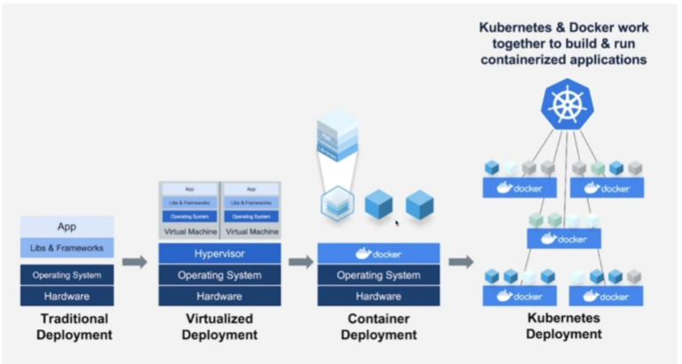
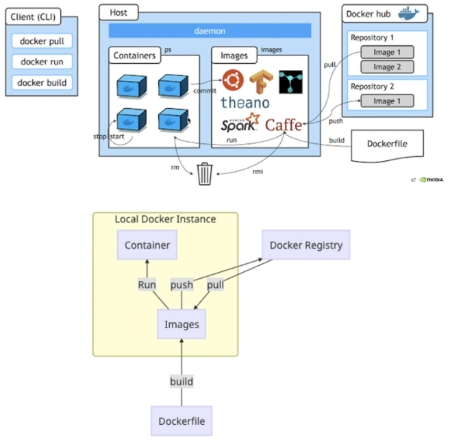

## <u>01 Lambda</u>

---

- 서버를 프로비저닝하거나 관리하지 않고도 코드를 실행할 수 있게 해주는 컴퓨팅 서비스
-

### 실습: AWS 콘솔: Lambda

[AWS 개발자 안내서: Lambda](https://docs.aws.amazon.com/ko_kr/lambda/latest/dg/welcome.html)

 
 
 

## <u>01 Docker</u>

---

[AWS 개발자 안내서: docker](https://aws.amazon.com/ko/docker/)

 

### Docker Image

- 이미지(Image)
- 이미지는 컨테이너를 생성할 때 필요한 요소로 컨테이너의 목적에
  맞는 바이너리와 의존성이 설치되어 있음
  여러 개의 계층으로 된 바이너리 파일로 존재

- 컨테이너(Container)
- 호스트와 다른 컨테이너로부터 격리된 시스템 자원과 네트워크를 사용하는 프로세스
  이미지는 읽기 전용으로 사용하여 변경사항은 컨테이너 계층에 저장
    => 컨테이너에서 무엇을 하든 이미지는 영향 받지 않음

 

### Docker LIFE CYCLE

  

 

### Docker 주요 명령어

1. container 생성 및 실행 관련 명령어

- container 생성 및 실행: run
- container 중지: stop
- container 실행: start
- container 재실행: restart

2. container 관리 관련 명령어

- container 확인: ps
- container 삭제: rm

3. container 실행 관리 관련 명령어

- container log 확인: logs
- container에 명령어 수행: exec

4. image 관리 관련 명령어 

- image 확인: images
- image 삭제: rmi
- image 다운로드하기: pull
- image 업로드하기: push
- image 태그 지정하기: tag

 
 
 

## <u>01 CloudWatch</u>
---

 
 
 
 
 
 
 
 
 
 
 
 

|  |  |
| ------------------------ | ------------------------ |

 
 
 
 
 
 
 
 

- **Keyword**:

 
 
 
 
 
 
 
 
 
 
 
 
 
 
 

### **Summary**:

 
 
 
 
 
 
