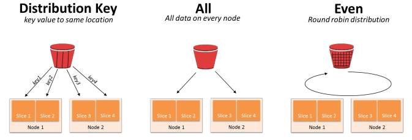
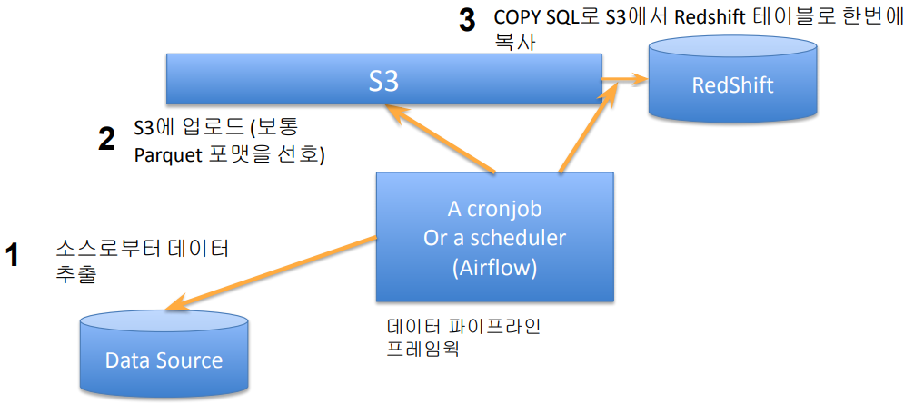
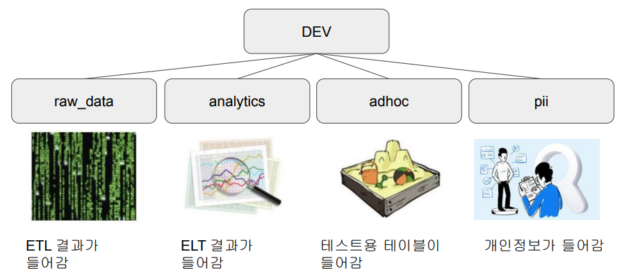

## <u>1강. Day 2-1</u>

### Contents

1. Redshift 특징 소개
2. Redshift 설치(Trial)
3. Redshift 초기 설정(스키마,그룹,유저)
4. Redshift COPY 명령으로 테이블에 레코드 적재하기

---

- Redshift의 특징 (1)

  - AWS에서 지원하는 데이터 웨어하우스 서비스
  - 2 PB의 데이타까지 처리 가능
    - 최소 160GB로 시작해서 점진적으로 용량 증감 가능
  - Still OLAP
    - 응답속도가 빠르지 않기 때문에 프로덕션 데이터베이스로 사용불가
  - 컬럼 기반 스토리지
    - 레코드 별로 저장하는 것이 아니라 컬럼별로 저장함
    - 컬럼별 압축이 가능하며 컬럼을 추가하거나 삭제하는 것이 아주 빠름

- Redshift의 특징 (2)

  - 벌크 업데이트 지원
    - 레코드가 들어있는 파일을 S3로 복사 후 COPY 커맨드로 Redshift로 일괄 복사
  - **고정 용량/비용** SQL 엔진
    - 최근 가변 비용 옵션도 제공 (Redshift Serverless)
  - 데이터 공유 기능 (Datashare):
    - 다른 AWS 계정과 특정 데이터 공유 가능. Snowflake의 기능을 따라함
  - 다른 데이터 웨어하우스처럼 primary key uniqueness를 보장하지 않음
    - 프로덕션 데이터베이스들은 보장함

- Redshift의 스케일링 방식 (1)

  - 용량이 부족해질 때마다 새로운 노드를 추가하는 방식으로 스케일링
  - 예) Scale Out 방식과 Scale Up 방식
    - dc2.large가 하나면 최대 0.16TB까지의 용량을 갖게됨
    - 공간이 부족해지면
      - dc2.large 한대를 더 추가 -> 총 0.32TB (Scale Out)
      - 아니면 사양을 더 좋은 것으로 업그레이드 -> dc2.8xlarge 한대로 교체 (Scale Up)
  - 이를 Resizing이라 부르며 Auto Scaling 옵션을 설정하면 자동으로 이뤄짐

- Redshift의 레코드 분배와 저장 방식 (1)

  - Redshift가 두 대 이상의 노드로 구성되면 그 시점부터 테이블 최적화가 중요
    - 한 테이블의 레코드들을 어떻게 다수의 노드로 분배할 것이냐!
  - Distkey, Diststyle, Sortkey 세 개의 키워드를 알아야함
    - Diststyle은 레코드 분배가 어떻게 이뤄지는지를 결정
      - all, even, key (디폴트는 “even”)
    - Distkey는 레코드가 어떤 컬럼을 기준으로 배포되는지 나타냄 (diststyle이 key인 경우)
    - Sortkey는 레코드가 한 노드내에서 어떤 컬럼을 기준으로 정렬되는지 나타냄
      - 이는 보통 타임스탬프 필드가 됨

- Redshift의 레코드 분배와 저장 방식 (2)

  - Diststyle이 key인 경우 컬럼 선택이 잘못되면?

    - 레코드 분포에 Skew가 발생 -> 분산처리의 효율성이 사라짐
    - BigQuery나 Snowflake에서는 이런 속성을 개발자가 지정할 필요가 없음 (시스템이 알아서 선택)

    

- Redshift의 레코드 분배와 저장 방식 예

```SQL
CREATE TABLE my_table (
 column1 INT,
 column2 VARCHAR(50),
 column3 TIMESTAMP,
 column4 DECIMAL(18,2)
) DISTSTYLE KEY DISTKEY(column1) SORTKEY(column3);
--my_table의 레코드들은 column1의 값을 기준으로 분배되고
--같은 노드(슬라이스)안에서는 column3의 값을 기준으로 소팅이 됨
```

- Redshift의 벌크 업데이트 방식 - COPY SQL

  

<br>
<br>
<br>

## <u>2강. Day 2-2</u>

### 실습: AWS 웹 콘솔: Redshift 설치

1. Redshift Serverless cluster create
2. colab 연결: workgroup Endpoint 복사
3. admin username, password 설정
4. Endpoint pubilc 접근 권한 설정
5. Workgroup configuration -> Publicly accessible: ON
6. VPC security group 설정 변경: Inbound rules edit -> Custom TCP:5439:0.0.0.0/0 설정
7. colab 연결

<br>
<br>
<br>

## <u>3강. Day 2-3</u>

### Redshift 초기 설정

- Redshift Schema: 다른 기타 관계형 데이터베이스와 동일한 구조

  

- 스키마(Schema) 설정

  - 모든 스키마를 리스트하기: select \* from pg_namespace;

    ```SQL
    CREATE SCHEMA raw_data;
    CREATE SCHEMA analytics;
    CREATE SCHEMA adhoc;
    CREATE SCHEMA pii;
    ```

- 사용자(User) 생성

  - 모든 사용자를 리스트하기: select \* from pg_user;

    ```SQL
    CREATE USER keeyong PASSWORD '...';
    ```

- 그룹(Group) 생성/설정 (1)

  - 한 사용자는 다수의 그룹에 속할 수 있음
  - 그룹의 문제는 계승이 안된다는 점
    - 즉 너무 많은 그룹을 만들게 되고 관리가 힘들어짐
  - 예를 들어 다음과 같은 그룹이 존재
    - <u>어드민</u>을 위한 pii_users
    - <u>데이터 분석가</u>를 위한 analytics_authors
    - 데이터 활용을 하는 <u>개인</u>을 위한 analytics_users

- 그룹(Group) 생성/설정 (2)

- 그룹 생성 - CREATE GROUP
- 그룹에 사용자 추가 - ALTER GROUP 그룹이름 ADD USER 사용자이름
- 그룹에 스키마/테이블 접근 권한 설정 (나중에 설명)
- 모든 그룹을 리스트하기: select \* from pg_group;

  ```SQL
  CREATE GROUP analytics_users;
  CREATE GROUP analytics_authors;
  CREATE GROUP pii_users;

  ALTER GROUP analytics_authors ADD USER keeyong;
  ALTER GROUP analytics_users ADD USER keeyong;
  ALTER GROUP pii_users ADD USER keeyong;
  ```

- 역할(Role) 생성/설정

- 역할은 그룹과 달리 계승 구조를 만들 수 있음
- 역할은 사용자에게 부여될 수도 있고 다른 역할에 부여될 수도 있음
- 한 사용자는 다수의 역할에 소속가능함
- 모든 역할을 리스트하기: select \* from SVV_ROLES;

```SQL
CREATE ROLE staff;
CREATE ROLE manager;
CREATE ROLE external;

GRANT ROLE staff TO keeyong;
GRANT ROLE staff TO ROLE manager;
```

### 실습: colab:

- 스키마/사용자/그룹/역할 생성

<br>
<br>
<br>

## <u>4강. Day 2-4</u>

### Redshift COPY 명령으로 테이블에 레코드 적재하기

- COPY와 AWS IAM 학습

  - COPY 명령을 사용해 raw_data 스키마 밑 3개의 테이블에 레코드를 적재해볼
    예정
  - 각 테이블을 CREATE TABLE 명령으로 raw_data 스키마 밑에 생성
  - 이때 각 테이블의 입력이 되는 CSV 파일을 먼저 S3로 복사해야함
    - 그래서 S3 버킷부터 미리 생성 (S3 웹콘솔)
  - S3에서 해당 테이블로 복사를 하려면 Redshift가 S3 접근권한을 가져야함
    - 먼저 Redshift가 S3를 접근할 수 있는 역할을 만들고 (IAM 웹콘솔)
    - 이 역할을 Redshift 클러스터에 지정 (Redshift 웹콘솔)

- raw_data 테스트 테이블 만들기 - 테이블 생성

- raw_data 스키마에 아래 세 테이블 만들기

  - 보통 이런 테이블들은 ETL을 통해 데이터 소스에서 복사해오는 형태로 이뤄짐

    ```SQL
    CREATE TABLE raw_data.user_session_channel (
    userid integer ,
    sessionid varchar(32) primary key,
    channel varchar(32)
    );

    CREATE TABLE raw_data.session_timestamp (
    sessionid varchar(32) primary key,
    ts timestamp
    );

    CREATE TABLE raw_data.session_transaction (
    sessionid varchar(32) primary key,
    refunded boolean,
    amount int
    );
    ```

- raw_data 테스트 테이블 만들기 - S3 버킷 생성과 파일 업로드

  - AWS 콘솔에서 S3 bucket 하나 만들고 거기로 업로드하기
    - s3://\*\*\*\*-test-bucket/test_data/user_session_channel.csv
      - raw_data.user_session_channel
    - s3://\*\*\*\*-test-bucket/test_data/session_timestamp.csv
      - raw_data.session_timestamp
    - s3://\*\*\*\*-test-bucket/test_data/session_transaction.csv
      - raw_data.session_transaction

- Redshift에 S3 접근 권한 설정
  - AWS IAM(Identity and Access Management)을 이용해 이에 해당하는 역할\
    (Role)을 만들고 이를 Redshift에 부여해야함
  1. 웹 콘솔에서 IAM
  2. Roles - Create Role
  3. AWS service 선택 -> Redshift 선택
  4. Redshift - Customizable 선택 -> Next Permissions 버튼 클릭
  5. Filter Policies 박스에서 AmazonS3FullAccess를 찾아서 왼쪽의 체크박스를\  
     선택하고 Next: Tags 버튼을 클릭
  6. Next: Review 버튼을 클릭하고 최종 이름으로 redshift.read.s3을 지정하고
     최종 생성
- redshift.read.s3 역할을 Redshift 클러스터에 지정 (1)
  - Redshift 콘솔로 돌아가 해당 클러스터의 Default Namespace를 선택하고 \
    “Security and encryption” 탭 아래 “Manage IAM roles”라는 버튼을 선택
  - 여기 Manage IAM roles 박스에서 “Associate IAM roles” 메뉴를 선택하고 \
    앞서 만든 redshift.read.s3 권한을 지정하고 “Associate IAM roles” 버튼을\
    클릭한다.

<br>
<br>
<br>
<br>
<br>
<br>
<br>
<br>
<br>
<br>
<br>
<br>
<br>
<br>
<br>
<br>
<br>
<br>
<br>
<br>
<br>
<br>
<br>

- **Keyword**:

<br>
<br>
<br>
<br>
<br>
<br>

### **Summary**:

<br>
<br>
<br>
