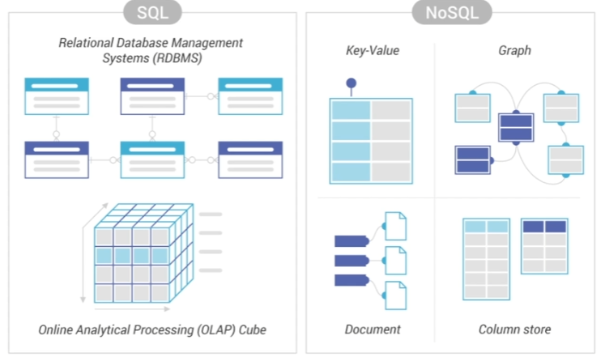
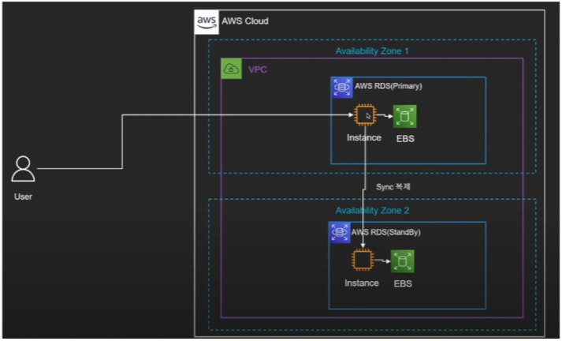

## <u>01 Route53</u>

### Route53

---

- Amazon Route53는 가용성이 확장성이 뛰어난 DNS(도메인 이름 시스템) 웹 서비스.
- Route53을 사용하여 세 가지 주요 기능, 즉 도메인 등록, DNS 라우팅, 상태 확인을 조합하여 실행할 수 있다.

  

- 특징

  - Route53은 public host zone 과 private host zone 존재
  - Route53 = DNS(네임서버) + 모니터링 + L4 + GSLB

    

 
 

### 실습진행: AWS 콘솔

- AWS 내부에서 살 때 -> 도메인 등록, 외부에서 살 때 -> 호스팅 영역 생성
- 레코드 생성 - sub 도메인 가능

 
 
 
 

## <u>01 RDS, DocumentDB, DynamoDB</u>

### RDS

- SQL vs NoSQL
  

 

- RDS

  - DB 인스턴스는 클라우드에서 실행하는 격리된 데이터베이스 환경
  - DB 인스턴스에는 여러 사용자가 만든 데이터베이스가 포함될 수 있으며,
    독립 실행형 데이터베이스 인스턴스에 액세스할 때 사용하는 도구 및 어플리케이션을
    사용해 액세스할 수 있다.
  - AWS 명령줄 도구, Amazon RDS API 작업 또는 AWS Management Console을 사용해 간단히 DB 인스턴스를 만들고 수정할 수 있다.
  - 직접 시스템 로그인 불가능.
  - RDS는 serverless가 아님.

    

 

### 실습진행: AWS 콘솔: RDS

 
 

### DocumentDB

---

- MongoDB API 워크로드의 완전 관리 및 유연한 확장이 가능한 문서전용(Document) 데이터베이스
- Amazon DocumentDB에서는 스토리지 및 컴퓨팅이 분리되어 각각을 독립적으로 조정.
- 개발자는 데이터 크기에 관계없이 지연 시간이 짧은 읽기 전용 복제본을 몇 분 내에 최대
  15개까지 추가하여 읽기 용량을 수백만 개의 요청으로 늘릴 수 있음
- Amazon DocumentDB는 99.99%의 가용성을 위해 설계되었으며 6개의 데이터 복사본을
  3개의 AWS 가용 영역(AZ)에 복제
- JSON 데이터
- 유연한 인덱싱

### MongoDB

---

- MongoDB는 Document 지향 Database이다.
- 데이터 중복이 발생할 수 있지만, 접근성과 가시성이 좋다
- 스키마 설계가 어렵지만, 스키마가 유연해서 Application의 요구사항에 맞게
  데이터를 수용할 수 있다.
- 분산에 대한 솔루션을 지원해서 Scale-out이 쉽다.
- 확장 시, Application을 변경하지 않아도 된다.

  

 
 

### DynamoDB

---

- Amazon DynamoDB는 안전관리형 Key-Value 기반 NoSQL데이터베이스 서비스.
- Auto-Scaling
- DynamoDB는 유휴 시 암호화를 제공하여 중요한 데이터 보호와 관련된 운영 부담 및 복잡성을 제거한다.
- DynamoDB를 통해 원하는 양의 데이터를 저장 및 검색하고 어느 수준의 요청 트래픽도
  처리할 수 있는 데이터베이스 테이블을 생성할 수 있다.
- AWS Management Console을 사용하여 리소스 사용률 및 성능 지표를 모니터링할 수 있습니다.
- DynamoDB는 온디맨드 백업 기능을 제공
- 테이블 생성시 스키마 생성 필요 없음

  

 

### Document DB vs Dynamo DB

---

[공통점]

- NoSQL Database
- AWS Database Migration Service를 통해 데이터 마이그레이션을 위한 이식성을 제공
- AWS Key Management Service를 통한 저장 데이터 암호화와 보안기능을 제공
- 관리 API 호출과 CloudFormation에 대한 CloudTrail 및 VPC Flow Logs로 감사 기능 제공

  
  

### 실습진행: AWS 콘솔: Dynamo DB, Document DB

 
 

## <u>02 Certification Manager</u>

### Certification Manager

---

- AWS Certification Manager(ACM)를 사용하면 AWS 서비스 및 연결된 내부 리소스에 사용할 공인
  및 사설 SSL/TLS 인증서를 프로비저닝, 관리 및 배포할 수 있습니다.
  ACM은 SSL/TLS 인증서를 구매, 업로드 및 갱신하는 데 드는 시간 소모적인 수동 프로세스를 대신 처리해줍니다.

  1. 사용할 TLS/SSL 인증서를 AWS 계정으로 요청하거나 가져온다.
  2. 도메인 이름 시스템(DNS) 또는 이메일 검증을 통해 요청된 인증서의 도메인 소유권을 검증하여 인증서 발급을 완료한다.
  3. Elastic Load Balancing(ELB), Amazon CloudFront 등과 같은 다양한 AWS 서비스에서 새로 발급되거나 가져온
     인증서를 사용한다.

- **특징**
  1. ACM 통합 서비스를 위한 무료 퍼블릭 인증서
  2. 관리형 인증서 갱신
  3. 손쉽게 인증서 받기

 

- SSL 인증서

---

- SSL 인증서는 공개 키와 개인 키라는 키 쌍을 갖고 있다.
- 이 키들이 함께 작용하여 암호화된 연결을 수립.
- 인증서는 또한 "주체(subject)"라는 것을 포함하고 이는 인증서/웹사이트 소유자의 ID이다
- 인증서를 얻으려면 서버에서 인증서 서명 요청(CSR)을 생성해야 한다.
- 이 과정에서 서버에 개인 키와 공개 키를 생성.
- SSL 인증서 발급자(인증 기간 또는 CA라 함)에게 보내는 CSR 데이터 파일에는 공개 키가 포함됩니다.

### 실습진행: AWS 콘솔: Certification Manager

 
 

## <u>03 CloudFront</u>

- Amazon CloudFront는 뛰어난 성능, 보안 및 개발자 편의를 위해 구축된 콘텐츠 전송 네트워크(CDN) 서비스
  

- **CDN**
  1. 콘텐츠 전송 네트워크(CDN)는 데이터 사용량이 많은 애플리케이션의 웹 페이지 로드 속도를 높이는
     상호 연결된 서버 네트워크
  2. 정적 콘텐츠 & 동적 콘텐츠
  3. 캐싱 / 동적 가속 / 엣지 로직 계산
- 특징
  1. 대기 시간 감소
  2. 보안 향상
  3. 비용 절감
  4. 사용자 정의 전송

### 실습진행: AWS 콘솔: CloudFront

 
 

## <u>04 ELB</u>

- **Elastic Load Balancing (ELB)**

---

- 로드 밸런싱은 애플리케이션을 지원하는 리소스 풀 전체에 네트워크 트래픽을 균등하게 배포하는 방법

 

- **Load Balancer**

---

- 로드밸런서는 서버에 가해지는 부하(=로드)를 분산(=밸런싱) 해주는 장치 또는 기술을 통칭
  

- **ELB 대상그룹**
  - 대상 그룹에 대상을 등록한다. 기본적으로 로드 밸런서는 대상 그룹에 대해 지정한 프로토콜과 포트 번호를 사용하여
    등록된 대상으로 요청을 전송한다.
  - 또는 대상 그룹에 각 대상을 등록할 때 포트를 재정의할 수 있다.

### 실습: AWS콘솔: 로드밸런서, 대상 그룹

 
 

## <u>05 VPC</u>

---

- Amazon Virtual Private Cloud(Amazon VPC)를 이용하면 사용자가 정의한 가상 네트워크로 AWS 리소스를 시작할 수 있다.
- 이 가상 네트워크는 AWS의 확장 가능한 인프라를 사용한다는 이점과 함께 고객의 자체 데이터 센터에서
  운영하는 기존 네트워크와 유사하다.

  

 

- **VPC 기능**

---

- Virtual Private Cloud(VPC)
  - VPC는 자체 데이터 센터에서 운영하는 기존 네트워크와 아주 유사한 가상 네트워크이다.
    VPC를 생성한 후 서브넷을 추가할 수 있다.
- 서브넷
  - 서브넷은 VPC의 IP주소 범위이다. 서브넷은 단일 가용 영역에 상주해야 한다. 서브넷을 추가한 후에는
    VPC에 AWS 리소스를 배포할 수 있다.
- IP 주소 지정
  - VPC와 서브넷에 IPv4 주소와 IPv6 주소를 할당할 수 있다.
    또한 퍼블릭 IPv4 및 IPv6 GUA 주소를 AWS로 가져오고 VPC의 리소스
    (예: EC2 인스턴스, NAT 게이트웨이, Network Load Balancing)에 할당할 수 있다.
- 라우팅
  - 라우팅 테이블을 사용하여 서브넷 또는 게이트웨이의 네트워크 트래픽이 전달되는 위치를 결정한다.
- 게이트웨이 및 엔드포인트

  - 게이트웨이는 VPC를 다른 네트워크에 연결한다.
    예를 들면, 인터넷 게이트웨이를 사용하여 VPC를 인터넷에 연결한다.
    VPC 엔드포인트를 사용하여 인터넷 게이트웨이 또는 NAT 장치를 사용하지 않고 AWS 서비스에 비공개로 연결합니다.

- 피어링 연결
  - VPC 피어링 연결을 사용하여 두 VPC의 리소스 간 트래픽을 라우팅한다.
- 트래픽 미러링
  - 네트워크 인터페이스에서 네트워크 트래픽을 복사하고 심층 패킷 검사를 위해 보안 및 모니터링 어플라이언스로 전송한다.
- Transit Gateway
  - 중앙 허브 역할을 하는 전송 게이트웨이를 사용하여 VPC, VPN 연결 및 AWS Direct Connect 연결 간에 트래픽을 라우팅한다.
- VPC 흐름 로그
  - 흐름 로그는 VPC의 네트워크 인터페이스로 들어오고 나가는 IP 트래픽에 대한 정보를 캡쳐한다.
- VPN 연결

  - AWS Virtual Private Network(AWS VPN)을 사용하여 온프레미스 네트워크에 VPC를 연결한다.

- **CIDR**

  - Classless Inter-Domain Routing, 사이더: 클래스 없는 도메인 간 라우팅 기법

    
    

- VPC 생성

  1. IP 주소 범위 선택
  2. 가용 영역(AZ) 별 서브넷 설정
  3. 인터넷으로 향하는 경로(route) 만들기
  4. VPC로/부터의 트래픽 설정

- Nat gateway

- VPC 구성

---

- [Private IP 사용 가능 대역]
  - 10.0.0.0 ~ 10.255.255.255
  - 172.16.0.0 ~ 172.31.255.255
  - 192.168.0.0 ~ 192.168.255.255

### 실습: AWS콘솔: VPC

 
 
 
 
 
 
 
 

- **Keyword**:

 
 
 
 
 
 
 
 
 
 
 
 
 
 
 

### **Summary**:

 
 
 
 
 
 
