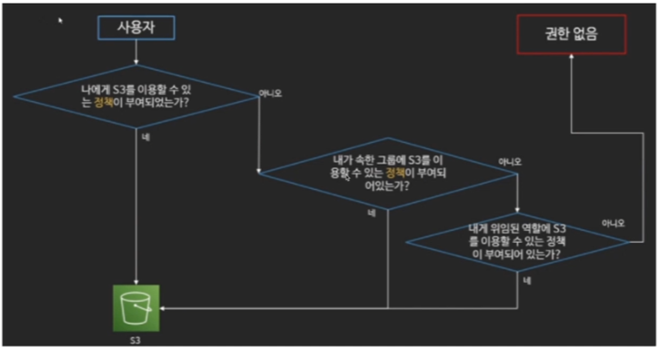
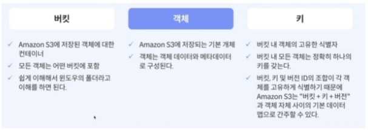
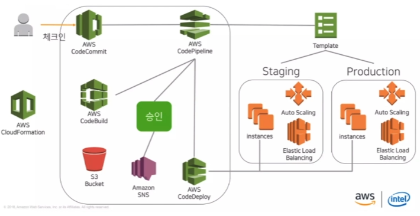
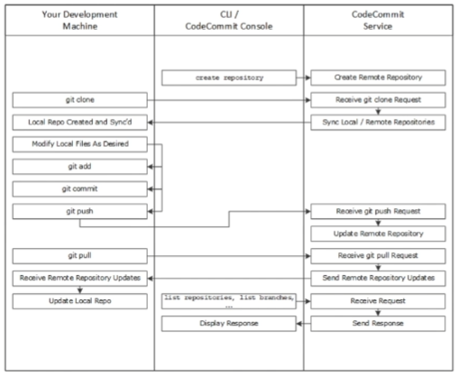
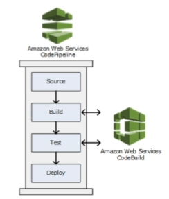
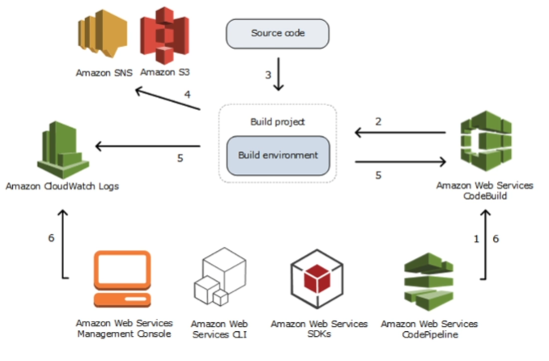
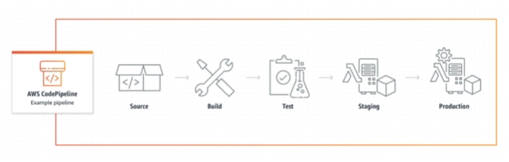

## <u>01 IAM</u>

### IAM

---

- AWS Identity and Access Management(IAM)은 AWS 리소스에 대한 액세스를 안전하게 제어할 수 있는 웹 서비스이다.
- IAM을 사용하여 리소스를 사용하도록 인증(로그인) 및 권한 부여(권한 있음)된 대상을 제어한다.
- AWS 계정을 생성할 때는 해당 계정의 모든 AWS 서비스 및 리소스에 대한 완전한 액세스 권한이 있는 단일 로그인 ID로 시작한다.
- 이 자격 증명은 AWS 계정 루트 사용자라고 하며, 계정을 생성할 때 사용한 이메일 주소와 암호로 로그인하여 액세스한다.
- 일상적인 작업에 루트 사용자를 사용하지 않을 것을 강력히 권장한다.

- [특징]

  - AWS 계정에 대한 공유
  - 세분화된 권한
  - Amazon EC2에서 실행되는 애플리케이션을 위한 보안 AWS 리소스 액세스
  - 멀티 팩터 인증(MFA)
  - ID 페더레이션
  - 보장을 위한 자격 증명 정보
  - PCI DSS 준수
  - 많은 AWS 서비스와의 통합
  - 최종 일관성
  - 무료 사용

- [정책]

  |  |  |
  | ------------------------ | ------------------------ |

### 실습진행: AWS 콘솔: IAM

 
 
 

## <u>01 S3</u>

- **S3**

---

- Amazon Simple Storage Service(Amazon S3)는 업계 최고의 확장성, 데이터 가용성, 보안 및 성능을 제공하는 객체 스토리지 서비스.
- 모든 규모와 업종의 고객은 Amazon S3를 사용하여 데이터 레이크, 웹 사이트, 모바일 애플리케이션, 백업 및 복원, 아카이브,
  엔터프라이즈 애플리케이션, IoT 디바이스, 빅 데이터 분석 등
  다양한 사용 사례에서 원하는 양의 데이터를 저장하고 보호할 수 있다.
- Amazon S3는 특정 비즈니스, 조직 및 규정 준수 요구 사항에 맞게 데이터에 대한 액세스를 최적화, 구조화 및 구성할 수 있는 관리 기능을 제공한다.

 

- [기능]
  - 스토리지 클래스
  - 스토리지 관리
  - 액세스 관리
  - 데이터 처리
  - 스토리지 로깅 및 모니터링
  - 분석 및 인사이트
  - 강력한 일관성

 

- **Amazon S3를 사용하여 정적 웹 사이트 호스팅**

---

- Amazon S3을 사용하여 정적 웹 사이트를 호스팅할 수 있다.
- 정적 웹 사이트에서 개별 웹 페이지는 정적 콘텐츠를 포함한다.
- 클라이언트 측 스크립트를 포함할 수도 있다.
- 이와는 대조적으로, 동적 웹 사이트는 PHP, JSP 또는 ASP.NET 등 서버 측 스크립트를 포함한 서버 측 처리에 의존한다.

  

 
 
 

## <u>01 CI/CD(CodeCommit, CodeBuild, CodeDeploy, CodePipeline)</u>

- CI/CD

  - **지속적 통합**(Continuous Integration)
    - 모든 개발자가 개발한 코드를 공유 리포지토리에 하루에도 여러번 코드를 커밋하고 병합하는 것
  - **지속적 전달**(Continuous Delivery)

    - 개발팀이 짧은 주기로 소프트웨어를 개발하고 언제든지 운영환경으로 안정적으로 배포하는 것

    

### CodeCommit

---

- AWS CodeCommit는 클라우드에서 자산(예:문서,소스코드,바이너리파일)을 비공개로 저장하여 관리하는 데 사용할 수 있도록
  Amazon Web Services에서 호스팅되는 버전 관리 서비스.
  

- [특징]
  - Benefit from a fully managed service hosted by AWS
  - Store your code securely
  - Work collaboratively on code
  - Easily scale your version control projects
  - Store anything, anytime
  - Integrate with other AWS and third-party services
  - Easily migrate files from other remote repositories
  - Use the Git tools you already know

### 실습진행: AWS 콘솔: CodeCommit

 

### CodeBuild

---

- AWS CodeBuild는 클라우드상의 완전관리형 빌드 서비스.
- CodeBuild는 소스 코드를 컴파일하고 단위 테스트를 실행하며 배포 준비가 완료된 아티팩트를 생성.
- CodeBuild에서는 자체 빌드 서버를 프로비저닝, 관리 및 확장할 필요 없음.
- 이 서비스는 Apache Maven, Gradle 등과 같은 널리 사용되는 프로그래밍 언어 및 빌드 도구에 맞게 사전 패키지된 빌드 환경을 제공.
- CodeBuild에서 빌드 환경을 사용자 지정하여 사용자 고유의 빌드 도구를 사용.
- CodeBuild는 최대 빌드 요청 수에 맞게 자동으로 확장

  |  |  |
  | ------------------------ | ------------------------ |

 

### CodeDeploy

---

- CodeDeploy는 Amazon EC2 인스턴스, 온프레미스 인스턴스, 서버리스 Lambda 함수 또는 Amazon ECS 서비스로 애플리케이션 배포를 자동화하는 배포 서비스
- 다음을 포함하여 다양한 애플리케이션 콘텐츠를 거의 무제한으로 배포가능.
  - 코드
  - 서버리스 AWS Lambda 함수
  - 웹 및 구성 파일
  - Executables
  - 패키지
  - 스크립트
  - 멀티미디어 파일
- CodeDeploy는 서버에서 실행되고 Amazon S3버킷, Github 리포지토리 또는 Bitbucket 리포지토리에 저장되는 애플리케이션 콘텐츠를 배포가능.
- CodeDeploy를 사용하기 위해 기존 코드를 변경할 필요가 없음.

 

### CodePipeline

---

- AWS CodePipeline은 빠르고 안정적인 애플리케이션 및 인프라 업데이트를 위해 릴리스 파이프라인을 자동화하는 데
  도움이 되는 완전 관리형의 지속적 전달 서비스.

  

- [특징]
  - 소프트웨어 릴리스 프로세스를 모델링하고, 서버를 설정하거나 프로비저닝할 필요성을 줄일 수 있음.
  - AWS Management Console 또는 AWS command line interface(CLI)를
    사용하여 소프트웨어 릴리스 프로세스 단계를 정의할 수 있음.
  - 피드백을 반복하고 각 코드 변경을 테스트하여 버그를 포착하는 새로운 기능을 신속하게 릴리스할 수 있음
  - 릴리스 프로세스의 모든 단계에서 자체 플러그 또는 사전 구축된 플러그인을 사용하여 필요에 맞추어 조정할 수 있음.

 
 
 

## <u>01 SpringBoot 구성</u>

- 구성도

---

 

- **실습**

---

1. 백엔드 모듈 구성
2. Elastic beanstalk 구성
3. s3 구성
4. React 구성
5. RDS 구성
6. VPC 구성
7. 도메인 구성
8. SSL 구성
9. CI/CD 구성

### 실습진행: 인텔리제이 Springboot

### [링크](https://github.com/pjw74/citron)

 
 
 

## <u>02 VPC 구성</u>

### 실습진행: AWS: VPC

 
 
 

## <u>03 Elastic Beanstalk 구성</u>

### 실습진행: AWS: Elastic beanstalk

- 새 환경 생성 -> 웹 -> 추가옵션 -> VPC 네트워크 설정 ->
  인스턴스 서브넷(private영역 설정) -> 데이터베이스 서브넷(private영역 설정) -> 환경생성
- EC2 -> 인스턴스 -> bastonhost -> VPC 설정 -> 서브넷(public)

 
 
 
 
 
 
 
 

 
 
 
 
 
 
 
 

- **Keyword**:

 
 
 
 
 
 
 
 
 
 
 
 
 
 
 

### **Summary**:

 
 
 
 
 
 
