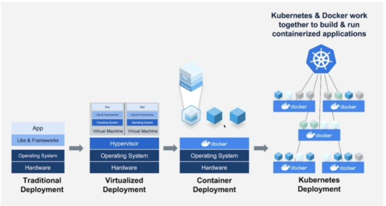
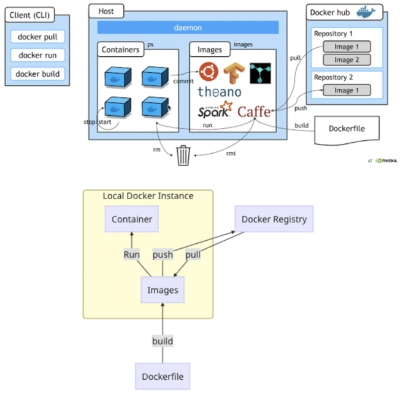

## <u>01 Lambda</u>

---

- 서버를 프로비저닝하거나 관리하지 않고도 코드를 실행할 수 있게 해주는 컴퓨팅 서비스

### 실습: AWS 콘솔: Lambda

[AWS 개발자 안내서: Lambda](https://docs.aws.amazon.com/ko_kr/lambda/latest/dg/welcome.html)

1. 블루프린트 사용으로 test
2. s3 연동 -> 해당 버킷 이벤트 알림 생성, Lambda함수 등록

```python
# python code
import json
import boto3
from datetime import datetime

client = boto3.client('s3')

def lambda_handler(event, context):
    what_time = datetime.now().strftime("%Y-%m-%d %H:%M:%S")
    bucket = event['Records'][0]['s3']['bucket']['name']
    key = event['Records'][0]['s3']['object']['key']
    try:
        response = client.get_object(Bucket=bucket, Key=key)

        text = response['Body'].read().decode()
        data = json.loads(text)

        if data['temperature'] > 40:
            print(f"Temperature detected : {data['temperature']}C at {what_time}")
            print("Be careful! It's getting really hot!!")
        else:
            print("So far so good")
    except Exception as e:
        print(e)
        raise e
```

```json
{
  "temperature": 45
}
```

<br>
<br>
<br>

## <u>01 Docker</u>

---

- 더 많은 SW를 더 빨리 제공
- 운영 표준화
- 원활하게 이전
- 비용 절감



[AWS 개발자 안내서: docker](https://aws.amazon.com/ko/docker/)

<br>

### Docker Image

- 이미지(Image)
- 이미지는 컨테이너를 생성할 때 필요한 요소로 컨테이너의 목적에
  맞는 바이너리와 의존성이 설치되어 있음
  여러 개의 계층으로 된 바이너리 파일로 존재

- 가상화(Hypervisor): 한 대의 pc에 논리적 공간을 분리해서 여러 개의 서비스를 띄움

- 컨테이너(Container)
- 호스트와 다른 컨테이너로부터 격리된 시스템 자원과 네트워크를 사용하는 프로세스
  이미지는 읽기 전용으로 사용하여 변경사항은 컨테이너 계층에 저장\
   => 컨테이너에서 무엇을 하든 이미지는 영향 받지 않음

- Docker Network
  - port forwarding 필요
  - $ docker run -p 8000:80 httpd
  - http://example.com:8000/index.html

<br>

### Docker LIFE CYCLE



<br>

### Docker 주요 명령어

1. container 생성 및 실행 관련 명령어

- container 생성 및 실행: run
- container 중지: stop
- container 실행: start
- container 재실행: restart

2. container 관리 관련 명령어

- container 확인: ps
- container 삭제: rm

3. container 실행 관리 관련 명령어

- container log 확인: logs
- container에 명령어 수행: exec

4. image 관리 관련 명령어

- image 확인: images
- image 삭제: rmi
- image 다운로드하기: pull
- image 업로드하기: push
- image 태그 지정하기: tag

### dockerfile

- | 명령어: | 설명 |
  | ------- | ---- |
- FROM: 베이스 이미지를 설정한다. <이미지 이름>:<태그> 형식
- METATAINER: 메인테이너 정보
- RUN: 셀 스크립트 혹은 명령을 실행. 이미지 생성 시에 실행
- CMD: 컨테이너가 시작되었을 때 실행할 실행 파일 또는 셸 스크립트
- EXPOSE: 호스트와 연결할 포트 번호
- WORKDIR: CMS에서 설정한 실행 파일이 실행될 디렉터리

- Java 예시

  - FROM openjdk:8-jdk-alpine
  - ARG JAR_FILE=build/libs/\*.jar
  - COPY ${JAR_FILE} demo-0.0.1-SNAPSHOT.jar
  - ENTRYPOINT ["java","-jar","/demo-0.0.1-SNAPSHOT.jar]

- docker file 빌드 \
  $ docker build -t pip-config-server:0.0.1 .

### Docker-compose

- 여러 개의 도커파일을 띄우고 관리

  - [예제](https://learn.microsoft.com/ko-kr/visualstudio/docker/tutorials/tutorial-multi-container-app-mysql)

- root에 docker-compose.yml 있는 상태로 \
  $ docker-compose up -d

<br>
<br>
<br>

## <u>01 CloudWatch</u>

### 실습: AWS 콘솔: CloudWatch

- Collect
- Monitor
- Act
- Analyze

<br>
<br>
<br>
<br>
<br>
<br>
<br>
<br>
<br>
<br>
<br>
<br>

<br>
<br>
<br>

## <u>01 Devops</u>

---

- 데브옵스는 소프트웨어의 개발과 운영의 합성어로서, 소프트웨어 개발자와 \
  정보기술 전문가 간의 소통, 협업 및 통합을 강조하는 개발

  - 문화: 사람(팀,인원,가치,의사소통)
    - DevOps를 통해 하나의 문화를 만들어 나갑니다.
  - 자동화: 일(프로세스,방법론)
    - 자동화를 통해 효율성과 빠른 속도를 지향
  - 측정: 서비스(서비스의 가치,성격)
    - 지표를 측정하여 지속적으로 개선
  - 공유: 자원(H/W,S/W,기술,도구)
    - 공유를 통해 함께 발전
  - 축적: 시간(일정,변경 가능성,회복탄력성,예측)
    - 기록을 축적하여 자산을 만들어 나감

- DevOps 엔지니어 역할

  - 올바른 DevOps 문화를 위해 서비스 혹은 SW LifeCycle에서 반복적인 \
    일들을 자동화, 기술적 문제 혹은 팀의 차이를 기술적으로 예방\
    하고, 해소시키는 사람

  1. **Soft skill**

  - 소프트 스킬은 사회 기술, 의사소통 기술, 성격 또는 성격 \
    특성, 태도, 직업 속성, 소셜 인텔리젼스 및 감성 인텔리전스 지수 등의 조합으로, \
    사람들이 환경을 탐색하고 다른 사람들과 잘 일하는 능력을 이야기한다.

  2. **Technical Skill**

  - 기술적 스킬은 특정한 일을 효과적으로 수행하는 지식과 능력을 이야기 한다.
  - IT 영역에서는 프로그래밍 언어 작성 능력, SW 디자인, \
    데이터베이스 및 서버관리 등 특정한 기술의 지식과 수행능력을 예로 들수 있다.

  - 프로그램 : Go, Python 등 능숙하게 다룰 수 있는 언어는 큰 강점이 됩니다.
  - 운영체제 : Linux와 같은 운영체제를 능숙하게 다루는 것과 개념을 반드시 알아야 합니다.
  - 서버관리 : 서버를 관리하는 기술과 운영지식을 통해 신뢰할 수 있는 서비스를 구축해야 합니다.
  - 오픈소스 : 인프라를 이루는 SW들을 이해하고, 자동화 도구들을 다룰 수 있어야 합니다.
  - 클라우드 : 퍼블릭 클라우드를 능숙하게 다루고, 직접 구축 및 설계를 할 수 있어야 합니다.

### Datapipeline

1. 데이터 생성: users
2. 수집: Amazon Kinesis Streams, Firehose, API Gateway, Lambda function, ...
3. 전처리 및 저장: AWS Glue, S3, / EMR, / Athena, ...
4. 분석 및 시각화: Zepplin, tableau, periscope Data, Superset, ...

- AWS Glue vs Airflow

<br>
<br>
<br>

## <u>02 ECS / ECR</u>

---

### 실습: AWS 콘솔: ECS(Elastic Container Service) - Amazon ECR

- IAM ecr-fullaccess 정책 등록
- ecr에 image push
- ecs: 별도의 서비스 없이 운영(서버리스)
- ecs 클러스터 생성
- 태스크 정의
- 서비스 생성
- ELB 구성: ec2 -> 로드밸런서
- ECS와 ELB 연결

<br>
<br>
<br>

## <u>02 API Gateway</u>

---

- 규모와 관계없이 API를 생성, 유지 관리 및 보호

- HTTP API
- WebSocket API
- REST API
- REST API(private)

- Lambda 함수 연결

<br>
<br>
<br>

<br>
<br>
<br>
<br>
<br>
<br>
<br>
<br>
<br>
<br>

- **Keyword**:

<br>
<br>
<br>
<br>
<br>
<br>
<br>
<br>
<br>
<br>
<br>
<br>
<br>
<br>
<br>

### **Summary**:

<br>
<br>
<br>
<br>
<br>
<br>
