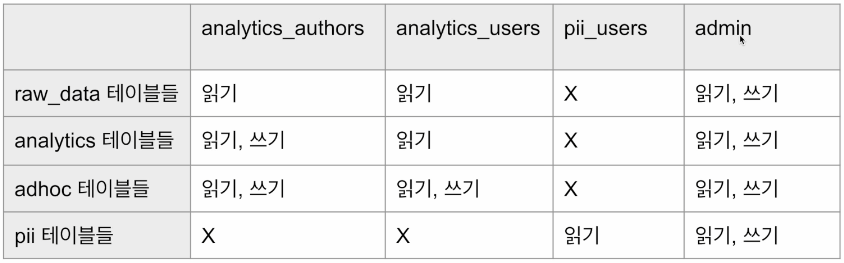

## <u>1. Day 3-1</u>

1. Redshift 권한과 보안
2. Redshift 백업과 테이블 복구
3. Redshift 관련 기타 서비스 소개
4. Redshift Spectrum으로 S3 외부 테이블 조작해보기
5. Redshift ML 사용하기
6. Redshift 중단/제거하기

### Redshift 권한과 보안

- 사용자별 테이블 권한 설정

  - 역할(Role) 혹은 그룹(Group) 별로 스키마별 접근 권한을 주는 것이 일반적
    - RBAC(Role Based Access Control)가 새로운 트렌드: 그룹보다 편리
    - 개인정보와 관련한 테이블들이라면 별도 스키마 설정
      - 극히 일부 사람만 속한 역할에 접근 권한을 줌

- 사용자 그룹 권한 설정 (1)
  - 예
    

```SQL
-- 사용자 그룹 권한 설정 - analytics_authors

GRANT ALL ON SCHEMA analytics TO GROUP analytics_authors;
GRANT ALL ON ALL TABLES IN SCHEMA analytics TO GROUP analytics_authors;
GRANT ALL ON SCHEMA adhoc to GROUP analytics_authors;
GRANT ALL ON ALL TABLES IN SCHEMA adhoc TO GROUP analytics_authors;
GRANT USAGE ON SCHEMA raw_data TO GROUP analytics_authors;
GRANT SELECT ON ALL TABLES IN SCHEMA raw_data TO GROUP analytics_authors;
```

```SQL
-- 사용자 그룹 권한 설정 - analytics_authors

GRANT USAGE ON SCHEMA analytics TO GROUP analytics_users;
GRANT SELECT ON ALL TABLES IN SCHEMA analytics TO GROUP analytics_users;
GRANT ALL ON ALL TABLES IN SCHEMA adhoc TO GROUP analytics_users;
GRANT ALL ON SCHEMA adhoc to GROUP analytics_users;
GRANT USAGE ON SCHEMA raw_data TO GROUP analytics_users;
GRANT SELECT ON ALL TABLES IN SCHEMA raw_data TO GROUP analytics_users;
```

```SQL
-- 사용자 그룹 권한 설정 - pii_users

GRANT USAGE ON SCHEMA pii TO GROUP pii_users;
GRANT SELECT ON ALL TABLES IN SCHEMA pii TO GROUP pii_users;
```

<br>

- 컬럼 레벨 보안(Column Level Security)

  - 테이블내의 특정 컬럼(들)을 특정 사용자나 특정 그룹/역할에만 접근 가능하게 하는 것
  - 보통 개인정보 등에 해당하는 컬럼을 권한이 없는 사용자들에게 감추는 목적으로 사용
    - 가장 좋은 방법은 아예 그런 컬럼을 별도 테이블로 구성하는 것
    - 더 좋은 방법은 보안이 필요한 정보를 아예 데이터 시스템으로 로딩하지 않는 것

- 레코드 레벨 보안(Row Level Security)
  - 테이블내의 특정 레코드(들)을 특정 사용자나 특정 그룹/역할에만 접근 가능하게 하는 것
  - 특정 사용자/그룹의 특정 테이블 대상 SELECT, UPDATE, DELETE 작업에 추가 조건을 다는 형태로 동작
    - 이를 RLS Policy라고 부름
    - CREATE RLS POLICY명령을 사용하여 Policy를 만들어 이를 ATTACH RLS POLICY명령을 사용해 특정 테이블에 추가함

### 실습: colab:

- 권한 설정

<br>
<br>
<br>

## <u>2. Day 3-2</u>

### Redshift 백업과 테이블 복구

- Redshift가 지원하는 데이터 백업 방식
  - 기본적으로 백업 방식은 마지막 백업으로부터 바뀐 것들만 저장하는 방식
    - 이를 Snapshot이라고 부름
    - 백업을 통해 과거로 돌아가 그 시점의 내용으로 특정 테이블을 복구하는 것이 가능(Table Restore)
    - 또한 과거 시점의 내용으로 Redshift 클러스터를 새로 생성하는 것도 가능
  - 자동 백업:
    - 기본은 하루, 최대 과거 35일까지의 변경을 백업하게 할 수 있음
      - Redshift클러스터의 Maintenance탭-> Backup details -> Edit
    - 이 경우 백업은 같은 지역에 있는 S3에 이뤄짐.
    - 다른 지역에 있는 S3에 하려면 Cross-regional snapshot copy를 설정해야함. 이는 보통 재난시 데이터 복구에 유용함
  - 매뉴얼 백업:
    - 언제든 원할 때 만드는 백업으로 명시적으로 삭제할 때까지 유지됨(혹은 생성시 보존 기한 설정)
      - Redshift클러스터의 Actions -> Create snapshot

### Redshift Serverless가 지원하는 데이터 백업 방식 (1)

- 일단 Snapshot 이전에 Recovery Point라는 것이 존재
  - Recovery Point를 Snapshot으로 바꾼 다음에 여기서 테이블 복수를 하거나 이것으로 \
    새로운 Redshift클러스터 등을 생성하는 것이 가능
  - Recovery Point는 과거 24시간에 대해서만 유지됨

### 실습: AWS Redshift 웹 콘솔:

- 고정 비용
- 가변 비용

<br>
<br>
<br>

## <u>3. Day 3-3</u>

### Redshift 관련 기타 서비스 소개

- **<u>Redshift Spectrum</u>**

  - 확장 기능
  - S3에 있는 파일들을 마치 테이블처럼 SQL로 처리 가능
    - S3 파일들을 외부 테이블들(external Table)로 처리하면서 Redshift테이블과 조인 가능
    - S3 외부 테이블들은 보통 Fact 테이블들이 되고 Redshift테이블들은 Dimension 테이블
    - 1TB를 스캔할 때마다 $5비용
  - 이를 사용하려면 Redshift 클러스터가 필요

    - S3 & Redshift 클러스터는 같은 region에 있어야함

  - Redshift의 경우 용량을 미리 결정하고 월정액(Fixed Cost) 지급
  - Redshift Serverless는 반대로 쓴만큼 비용을 지불하는 옵션

  - 데이터 처리 크기와 특성에 따라 오토 스케일링이 적용됨

- **<u>Athena</u>**

  - AWS의 Presto 서비스로 사실상 Redshift Spectrum과 비슷한 기능을 제공
  - S3에 있는 데이터들을 기반으로 SQL 쿼리 기능 제공
    - 이 경우 S3를 데이터 레이크라 볼 수 있음

- **<u>Redshift ML</u>**
  - SQL만 사용하여 머신러닝 모델을 훈련하고 사용할 수 있게 해주는 Redshift 기능
  - 이 기능은 사실 AWS SageMaker에 의해 지원됨
    - SageMaker는 Auto Pilot이라 하여 최적화된 모델을 자동 생성해주는 기능 제공
  - 이미 모델이 만들어져 있다면 이를 사용하는 것도 가능(BYOM: Bring Your Own Model)

<br>
<br>
<br>

## <u>4. day 3-4</u>

### Redshift Spectrum으로 S3 외부 테이블 조작해보기

- Fact 테이블: 분석의 초점이 되는 양적 정보를 포함하는 중앙 테이블

  - 일반적으로 매출 수익, 판매량 또는 이익과 같은 사실 또는 측정 항목을 포함하여 \
    비즈니스 결정에 사용
  - Fact 테이블은 일반적으로 외래 키를 통해 여러 Dimension 테이블과 연결됨
  - 보통 Fact 테이블의 크기가 훨씬 더 큼

- Dimension 테이블: Fact 테이블에 대한 상세 정보를 제공하는 테이블

  - 고객, 제품과 같은 테이블로 Fact 테이블에 대한 상세 정보 제공
  - Fact 테이블의 데이터에 맥락을 제공하여 사용자가 다양한 방식으로 데이터를 조각내고 분석 가능하게 해줌
  - Dimension 테이블은 일반적으로 primary key를 가지며, fact테이블의 foreign key에서 참조
  - 보통 Dimension 테이블의 크기는 훨씬 더 작음

- 예 (1)

  - Fact 테이블:
    - 앞서 사용했던 user_session_channel
  - Dimension 테이블:
    - 존재하지 않았지만 user_session_channel 테이블에 사용된 사용자나 채널에 대한 정보
      - user
      - channel

- 예 (2)

  - Fact 테이블:
    - Order
  - Dimension 테이블:
    - Product. Order 테이블에 사용된 상품에 대한 정보
    - User. Order 테이블에서 상품 주문을 한 사용자에 대한 정보

- Redshift Spectrum 사용 유스 케이스

  - Fact 테이블을 Redshift로 적재하지 않고 위의 두 테이블을 조인하고 싶다면?

- 외부 테이블(External Table)이란?

  - 데이터베이스 엔진이 외부에 저장된 데이터를 마치 내부 테이블처럼 사용하는 방법
    - 외부 테이블은 외부(보통 S3와 같은 클라우드 스토리지)에 저장된 대량의 데이터를 데이터베이스 \
      내부로 복사하고 쓰는 것이 아니라 임시 목적으로 사용하는 방식
  - SQL 명령어로 데이터베이스에 외부 테이블 생성 가능
  - 외부 테이블을 사용하여 데이터 처리 후 결과를 데이터베이스에 적재하는데 사용가능
  - 외부 테이블은 보안 및 성능 문제에 대한 신중한 고려 필요
  - 이는 Hive등에서 처음 시작한 개념, 대부분의 빅 데이터 시스템에서 사용됨

- **Redshift Spectrum** 실습을 위한 외부 테이블 용 스키마 설정

  - 먼저 앞서 만든 redshift.read.s3 ROLE에 AWSGlueConsoleFullAccess 권한
    지정이 필요
  - 다음으로 아래 SQL을 실행하여 외부 테이블용 스키마 생성

```SQL
CREATE EXTERNAL SCHEMA external_schema
from data catalog
database 'myspectrum_db'
iam_role 'arn:aws:iam::521227329883:role/redshift.read.s3'
create external database if not exists;
```

<br>

- **AWS Glue**
- AWS Glue는 AWS의 Serverless ETL 서비스로 아래와 같은 기능 제공
- 데이터 카탈로그:
  1. AWS Glue Data Catalog는 데이터 소스 및 대상의 메타데이터를 대상으로 검색 기능을 제공.
- ETL 작업 생성: AWS Glue Studio
- 작업 모니터링 및 로그:
  1. AWS Glue 콘솔을 통해 사용자는 ETL 작업의 실행 상태 및 로그를 모니터링 가능
- 서버리스 실행:

- Redshift Spectrum 실습을 위한 외부 Fact 테이블 정의
  - S3에 usc라는 폴더를 각자 S3 버킷 밑에 만들고
  - 그 폴더로 user_session_channel.csv 파일을 복사
  - 다음으로 아래 SQL을 실행 (이런 형태의 명령은 Hive/Presto/SparkSQL에서
    사용됨)

```SQL
CREATE EXTERNAL TABLE external_schema.user_session_channel (
 userid integer ,
 sessionid varchar(32),
 channel varchar(32)
)
row format delimited
fields terminated by ','
stored as textfile
location 's3://keeyong-test-bucket/usc/';
```

- Redshift Spectrum 실습을 위한 내부 Dimension 테이블
  - 테스트를 위해 user 테이블을 하나 raw_data 스키마 밑에 생성

```SQL
CREATE TABLE raw_data.user_property AS
SELECT
 userid,
 CASE WHEN cast (random() * 2 as int) = 0 THEN 'male' ELSE 'female' END gender,
 (CAST(random() * 50 as int)+18) age
FROM (
 SELECT DISTINCT userid
 FROM raw_data.user_session_channel
);
```

- Redshift Spectrum Fact + Dimension 테이블 조인

```SQL
SELECT gender, COUNT(1)
FROM external_schema.user_session_channel usc
JOIN raw_data.user_property up ON usc.userid = up.userid
GROUP BY 1;
```

<br>
<br>
<br>

## <u>5. Day 3-5</u>

### Redshift Spectrum으로 S3 외부 테이블 조작해보기

### 실습: AWS Redshift 웹 콘솔:

- IAM: AWSGluefullaccess 추가
- S3: usc/user_session_channel 추가

### 실습: colab:

<br>
<br>
<br>

## <u>6. day 3-6</u>

### Redshift ML 사용하기

- **머신러닝의 정의**
- 배움이 가능한 기계(혹은 알고리즘)의 개발
  - 결국 데이터의 패턴을 보고 흉내(imitation)내는 방식으로 학습
  - 학습에 사용되는 이 데이터를 트레이닝셋 (training set)이라고 부름
- 컴퓨터가 학습할 수 있도록 하는 알고리즘과 기술을 개발하는 분야
- 딥러닝(신경망의 다른 이름)은 머신 러닝의 일부
  - 비젼, 자연언어처리 (텍스트/오디오)등에 적용되고 있음
- 인공지능은 머신러닝을 포괄하는 개념

- **머신러닝 모델이란?**

  - 머신 러닝의 최종 산물이 머신 러닝 모델
    - 학습된 패턴(트레이닝셋)에 따라 예측을 해주는 블랙박스

- 입력 데이터를 주면 그를 기반으로 예측

  - 정확히 이야기하자면 지도 머신러닝 (Supervised Machine Learning)
  - 이외에도 2가지의 다른 머신러닝 방식이 존재
    - 비지도 머신러닝(Unsupervised Machine Learning)
    - 강화 학습 (Reinforcement Learning)

- 머신러닝 모델 트레이닝 혹은 빌딩이란?

  - 이런 머신 러닝 모델을 만드는 것을 지칭
  - 입력은 트레이닝셋

- 트레이닝셋 예 - 타이타닉호 승객 생존 여부 예측

  - 예측해야하는 값 - 보통 **레이블**이라 부르고 Y로 표기
  - 레이블을 예측하는데 사용하는 힌트들 - **피쳐(Feature)** 라고 부름. X라고 표기
  - 지도 머신러닝 예측

- **Amazon SageMaker란?**

- 머신러닝 모델 개발을 처음부터 끝까지 해결해주는 AWS 서비스

  - MLOps 프레임웍

- 크게 4가지 기능 제공
  - 트레이닝 셋 준비
  - 모델 훈련
  - 모델 검증
  - 모델 배포와 관리
    - API 엔드포인트, 배치 서빙, …
- 다양한 머신러닝 프레임웍을 지원

  - Tensorflow/Keras, PyTorch, MXNet, …
  - 자체 SageMaker 모듈로 머신러닝 모델 훈련 가능

- 전체적인 절차

  1. 캐글 Orange Telecom Customer Churn 데이터셋 사용 \
     a. [여기](https://docs.google.com/spreadsheets/d/10uf6mXraekS8wndxl9n_GYsOgA0SdUDhKlLXW9gOkdA/edit#gid=1364111700)에서 다운로드 받을 것 (File -> Download -> CSV)
  2. 데이터 준비: 여기에 있는 csv 파일을 적당히 S3 버킷 아래 폴더로 업로드 \
     a. s3://keeyong-test-bucket/redshift_ml/train.csv
  3. 위의 데이터를 raw_data.orange_telecom_customers로 로딩 (COPY) \
  4. SageMaker 사용권한을 Redshift cluster에 지정해주어야함 \
     a. 해당 IAM Role 생성 후 지정 (AmazonSageMakerFullAccess)
  5. CREATE MODEL 명령을 사용 \
     a. 모델을 생성하고 모델 사용시 호출할 SQL 함수도 생성 \
     b. 이 때 SageMaker와 관련한 비용이 발생함을 유의
  6. Model SQL 함수를 사용해서 테이블상의 레코드들을 대상으로 예측 수행
  7. 사용이 다 끝난 후 SageMaker와 관련한 리소스 제거

- 사용한 SQL 여기서 [확인](https://docs.google.com/document/d/1Qb_qBwx5gPDBvNVTxGhN3UB6zdGANy_hXtodMVUWZ5g/edit) 가능

<br>
<br>
<br>

## <u>7. Day 3-7</u>

### 실습: AWS Redshift 웹 콘솔:

1. IAM: Redshitf-ML + S3FullAccess, SageMakerFullAccess 추가

- Edit trust policy 양방향 설정
  - Pricipal type: AWS service
  - ARN: redshift.amazonaws.com

2. ARN 복사
3. Redshift - namespace - default - IAM roles - Associate IAM roles - Redshift-ML추가 \
4. colab - SQL 실행
5. SageMaker - Dashboard - Models, Endpoints 모두 삭제
6. S3 - drop table 확인

<br>
<br>
<br>

## <u>8. Day 3-8</u>

- Redshift 관련 유지보수

  - Redshift 서비스는 주기적으로 버전 업그레이드를 위해 중단됨
    - 이를 Maintenance window라고 부름
    - Serverless에는 이게 존재하지 않음

- 테이블 청소와 최적화 - VACUUM 명령
  - 테이블 데이터 정렬:
    - Redshift 테이블에 데이터가 삽입, 업데이트 또는 삭제될 때 데이터는 불규칙하게 분산되어 \
      저장될 수 있는데 VACUUM 명령어는 데이터를 정렬하여 남아 있는 행을 모아 쿼리 실행 시 검색해야 할 블록 수를 줄이는 작업 수행
  - 디스크 공간 해제:
    - 테이블에서 행이 삭제되면 디스크 공간이 즉시 해제되지 않음.
    - VACUUM 명령어는 더 이상 필요하지 않은 행을 제거하고 사용한 디스크 공간을 해제
  - 삭제된 행에서 공간 회수:
    - 테이블에서 행이 삭제되면 VACUUM 명령 실행 전까지 이 공간은 회수되지 않음
  - 테이블 통계 업데이트:
    - VACUUM은 테이블 통계를 업데이트하여 Query Planner가 쿼리 최적화 지원
    - 바쁘지 않을 때 실행해주는 것이 좋음

<br>
<br>
<br>
<br>
<br>
<br>
<br>
<br>
<br>
<br>
<br>
<br>
<br>
<br>
<br>
<br>
<br>
<br>
<br>
<br>
<br>
<br>
<br>
<br>
<br>
<br>
<br>
<br>
<br>
<br>

<br>
<br>
<br>


<br>
<br>
<br>
  
<br>
<br>
<br>
<br>
<br>
<br>
<br>
<br>
<br>
<br>

- **Keyword**:

<br>
<br>
<br>
<br>
<br>
<br>
<br>
<br>
<br>
<br>
<br>
<br>
<br>
<br>
<br>

### **Summary**:

<br>
<br>
<br>
<br>
<br>
<br>
