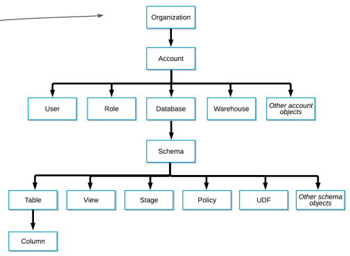

## <u>1. day 4-1</u>

### Snowflake 운영과 관리

- Contents
  1. Snowflake 특징 소개
  2. Snowflake 무료 시험판 실행
  3. Snowflake 실습을 위한 초기 환경 설정
  4. Snowflake 사용자 권한 설정
  5. Snowflake 기타 기능과 사용 중단하기 살펴보기

 

- **Snowflake 소개**

  - 2014년에 클라우드 기반 데이터웨어하우스로 시작됨 (2020년 상장)
    - 지금은 데이터 클라우드라고 부를 수 있을 정도로 발전
    - 글로벌 클라우드위에서 모두 동작 (AWS, GCP, Azure) - 멀티클라우드
    - 데이터 판매를 통한 매출을 가능하게 해주는 Data Sharing/Marketplace 제공
    - ETL과 다양한 데이터 통합 기능 제공

- **Snowflake 특징**

  - 스토리지와 컴퓨팅 인프라가 별도로 설정되는 가변 비용 모델
  - SQL 기반으로 빅데이터 저장, 처리, 분석을 가능하게 해줌
  - CSV, JSON, Avro, Parquet 등과 같은 다양한 데이터 포맷을 지원
    - S3, GC 클라우드 스토리지, Azure Blog Storage도 지원
  - 배치 데이터 중심이지만 실시간 데이터 처리 지원
  - Time Travel: 과거 데이터 쿼리 기능으로 트렌드를 분석하기 쉽게 해줌
  - 웹 콘솔 이외에도 Python API를 통한 관리/제어 가능
    - ODBC/JDBC 연결도 지원
  - 자체 스토리지 이외에도 클라우드 스토리지를 외부 테이블로 사용 가능
  - Snowflake의 계정 구성도: Organization -> 1+ Account -> 1+ Databases

- **Snowflake 특징 (3)**

  - **Organizations**:
    - 한 고객이 사용하는 모든 Snowflake 자원들을 통합하는 최상위 레벨 컨테이너
    - 하나 혹은 그 이상의 Account들로 구성되며 이 모든 Account들의 접근권한, 사용트래킹, 비용들을
      관리하는데 사용됨
  - **Accounts**:
    - 하나의 Account는 자체 사용자, 데이터, 접근권한을 독립적으로 가짐
    - 한 Account는 하나 혹은 그 이상의 Database로 구성됨
  - **Databases**:
    - 하나의 Database는 한 Account에 속한 데이터를 다루는 논리적인 컨테이너
    - 한 Database는 다수의 스키마와 거기에 속한 테이블과 뷰등으로 구성되어 있음
    - 하나의 Database는 PB단위까지 스케일 가능하고 독립적인 컴퓨팅 리소스를 갖게 됨
      - 컴퓨팅 리소스를 **Warehouses**라고 부름. Warehouses와 Databases는 일대일 관계가 아님

- **Snowflake 특징 (4)**

  - **Data Marketplace**
    - 데이터 메시 용어가 생기기 전부터 “데이터 마켓플레이스"라는 서비스 제공
  - **Data Sharing (“Share, Don’t Move”)**
    - “Data Sharing”: 데이터 셋을 사내 혹은 파트너에게 스토리지 레벨에서 공유하는 방식

- Snowflake의 기본 데이터 타입

  - Numeric: TINYINT, SMALLINT, INTEGER, BIGINT, NUMBER, NUMERIC,
    DECIMAL, FLOAT, DOUBLE, REAL.
  - Boolean: BOOLEAN.
  - String: CHAR, VARCHAR, TEXT, BINARY, VARBINARY.
  - Date and Time: DATE, TIME, TIMESTAMP, TIMESTAMP_LTZ,
    TIMESTAMP_TZ.
  - Semi-structured data: VARIANT (JSON, OBJECT.
  - Binary: BINARY, VARBINARY
  - Geospatial: GEOGRAPHY, GEOMETRY.
  - Array: ARRAY
  - Object: OBJECT

 
 
 

## <u>2. Day 4-2</u>

### Snowflake 무료 시험판 실행

- https://signup.snowflake.com/
- Snowflake Warehouse에서 Credit이란?

  - 쿼리 실행과 데이터 로드와 기타 작업 수행에 소비되는 계산 리소스를
    측정하는 단위
  - 1 credit는 상황에 따라 다르지만 대략 $2-$4의 비용을 발생시킴

- Snowflake 비용 구조
  - 컴퓨팅 비용: 앞서 크레딧으로 결정됨
  - 스토리지 비용: TB 당으로 계산
  - 네트워크 비용: 지역간 데이터 전송 혹은 다른 클라우드간 데이터 전송시 TB 당 계산

 
 
 

## <u>3. Day 4-3</u>

### Snowflake 실습을 위한 초기 환경 설정

### 실습: Snowflake 웹: 스키마 설정

 
 
 

## <u>4. Day 4-4</u>

### Snowflake 사용자 권한 설정

### 실습: Snowflake 웹: 테이블 S3에서 가져오기

- **Data Governance 관련 기능**

  - Object Tagging
  - <u>Data Classification</u>
    - 개인정보인가 아닌가 자체적으로 분류
  - Tag based Masking Policies
  - Access History
  - Object Dependencies

 

- **잠깐! Data Governance란 무엇인가?**
  - 필요한 데이터가 적재적소에 올바르게 사용됨을 보장하기 위한 데이터 관리 프로세스
    - 품질 보장과 데이터 관련 법규 준수를 주 목적으로 함
  - 다음을 이룩하기 위함이 기본 목적
    - 데이터 기반 결정에서 일관성
      - 예: KPI등의 지표 정의와 계산에 있어 일관성
    - 데이터를 이용한 가치 만들기
      - Citizen data scientist가 더 효율적으로 일할 수 있게 도와주기
      - Data silos를 없애기
    - 데이터 관련 법규 준수
      - 개인 정보 보호 -> 적절한 권한 설정과 보안 프로세스 필수!
- Snowflake Object  
   

- Data Governance 관련 기능 - **Data Classification**

  - Enterprise 레벨에서만 가능한 기능
  - 앞서 Object Tagging은 개인 정보 관리가 주요 용도 중의 하나
    - 하지만 이를 매뉴얼하게 관리하기는 쉽지 않음. 그래서 나온 기능이 Data Classification
  - 3가지 스텝으로 구성됨
    - Analyze: 테이블에 적용하면 개인정보나 민감정보가 있는 컬럼들을 분류해냄
    - Review: 이를 사람(보통 데이터 엔지니어)이 보고 최종 리뷰 (결과 수정도 가능)
    - Apply: 이 최종 결과를 System Tag로 적용
      - SNOWFLAKE.CORE.PRIVACY_CATEGORY (상위레벨)
        - IDENTIFIER, QUASI_IDENTIFIER, SENSITIVE
      - SNOWFLAKE.CORE.SEMANTIC_CATEGORY (하위레벨 - 더 세부정보)
  - 식별자/준식별자

- Data Governance 관련 기능 - Object Dependencies

  - 데이터 거버넌스와 시스템 무결성 유지를 목적으로 함
  - 테이블이나 뷰를 수정하는 경우 이로 인한 영향을 자동으로 식별
    - 예를 들어 테이블 이름이나 컬럼 이름을 변경하거나 삭제하는 경우
    - 즉 데이터 리니지 분석을 자동으로 수행해줌
  - 계승 관계 분석을 통한 더 세밀한 보안 및 액세스 제어
    - 어떤 테이블의 개인정보 컬럼이 새로운 테이블을 만들때 사용된다면?
      - 원본 테이블에서의 권한 설정이 그대로 전파됨 (Tag 포함)

 
 
 

## <u>5. Day 4-5</u>

### Snowflake 기타 기능과 사용 중단하기 살펴보기

- Marketplace
- Data - Private Sharing
- Activity - Query/Copy/Task History

 
 
 
 
 
 

- **Keyword**:

 
 
 
 
 
 

### **Summary**:

 
 
 
 
 
 
