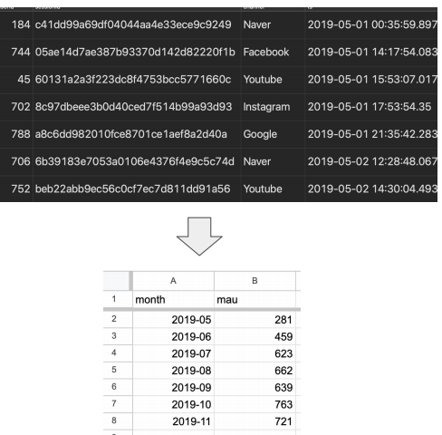
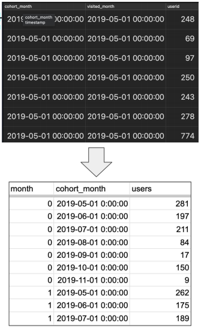
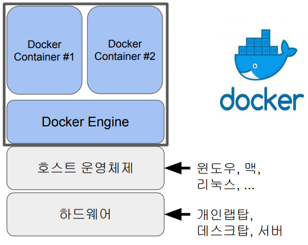
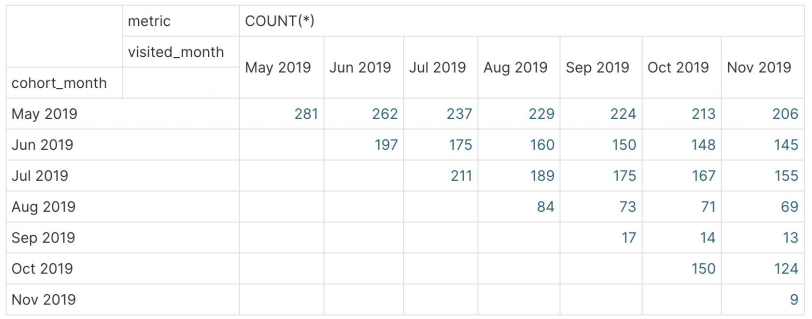
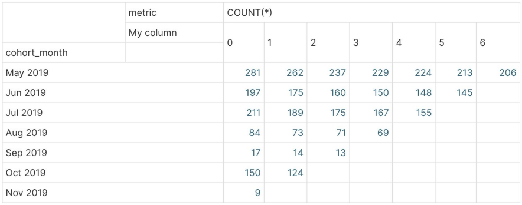
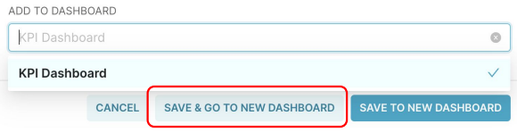
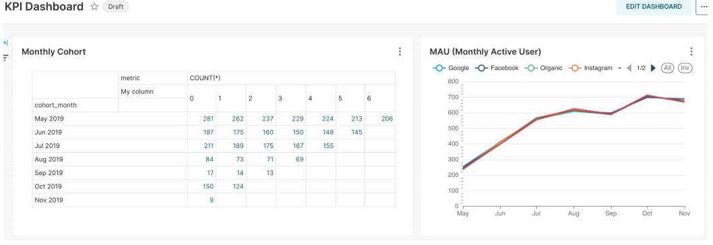

## <u>1. Day 5-1</u>

- 5. 대시보드 소개와 구현

### Contents

1. 다양한 시각화 툴 소개
2. Superset 소개
3. Superset으로 만들려는 대시보드 소개
4. Superset 설치 방법
5. Preset 설정
6. Superset을 Docker로 설치
7. Redshift 설정하고 MAU 차트 만들기
8. Cohort 차트 만들고 대시보드 만들기
9. 강의 마무리

- 시각화 툴이란?

  - 대시보드 혹은 BI(Business Intelligence)툴이라고 부르기도 함
  - **KPI**(Key Performance Indicator), **지표**, 중요한 데이터 포인트들을 데이터를 기반으로 계산/분석/표시해주는 툴
  - 결국은 결정권자들로 하여금 흔히 이야기하는 데이터 기반 의사결정을 가능하게 함
    - 데이터 기반 결정(Data-Driven Decision)
    - 데이터 참고 결정(Data-Informed Decision)
  - 현업 종사자들이 데이터 분석을 쉽게 할 수 있도록 해줌

- 어떤 툴들이 존재하나?

  - Excel, Google Spreadsheet: 사실상 가장 많이 쓰이는 시각화 툴
  - Python: 데이터 특성 분석(EDA: Exploratory Data Analysis)에 더 적합
  - Looker(구글)
  - Tableau(세일즈포스)
  - Power BI(마이크로소프트)
  - Apache Superset(오픈소스)
  - <u>Mode Analytics</u>, <u>ReDash</u>
  - Google Studio
  - AWS Quicksight

- Looker

  - 특징
    - Tableau보다 만들어 놓은 남의 것 수정변환 용이함
    - LookML이 자체언어로 데이터 모델을 만드는 것으로 시작
    - 내부 고객뿐만 아니라 외부 고객을 위한 대시보드 작성가능
    - 고가의 라이센스 정책을 갖고 있으나 굉장히 다양한 기능 제공

- Tableau

  - 특징
    - 다양한 제품군 보유. 일부는 사용이 무료
    - 제대로 배우려면 시간이 꽤 필요하지만 강력한 대시보드 작성가능
    - Looker가 뜨기 전까지 오랫동안 마켓 리더로 군림

- ReDash

  - Superset과 상당히 흡사
    - 더 강력한 쿼리 에디터 제공하지만 사용자 권한 관련 기능은 부족

- Mode Analytics

  - SQL, R, Python 등을 기반으로 데이터 분석 가능

    - 조금더 테크니컬한 인력을 대상으로한 애널리틱스 기능 제공
    - KPI 대시보드라기 보다는 EDA (Exploratory Data Analysis) 툴에 가까움

- 어떤 시각화 툴을 선택할 것인가?

- Looker 혹은 Tableau가 가장 많이 사용되는 추세
  - 두 툴 모두 처음 배우는데 시간이 필요함
  - Tableau의 가격이 더 싸고 투명하며 무료 버전도 존재해서 공부가 가능
- 중요한 포인트는 셀프서비스 대시보드를 만드는 것
  - 안 그러면 매번 사람의 노동이 필요해짐
    - 60-70%의 질문을 셀프서비스 대시보드로 할 수 있다면 대성공
  - 또한 사용하기가 쉬워야 더 많은 현업 인력들이 직접 대시보드를 만들 수 있음
    - 데이터 민주화 (Data Democratization), 데이터 탈중앙화 (Data Decentralization)
    - 데이터 품질이 점점 더 중요해지며 데이터 거버넌스가 필요한 이유가 됨!
  - 이런 측면에서는 Looker가 더 좋은 선택이지만 가격이 상당히 비쌈

<br>
<br>
<br>

## <u>2. Day 5-2</u>

### Superset 소개

- Airbnb에서 시작된 오픈소스

  - https://github.com/apache/superset
  - 현재 Airbnb의 전사 대시보드가 Superset
    - Dropbox에서 데이터 Explore 대시보드로 사용
  - https://preset.io/
    - 여기에 무료 어카운트 생성 후 실습

- Superset 구조와 용어

- Flask와 React JS로 구성됨
- 기본으로 sqlite을 메타데이터 데이터베이스로 사용
- Redis를 캐싱 레이어로 사용
- SqlAlchemy가 백엔드 DB 접근에 사용됨

- Database/Dataset
  - Database == 관계형 데이터베이스 (예: Redshift)
  - Dataset == 테이블
- Dashboard/Chart
  - Dashboard는 하나 이상의 chart로 구성

<br>
<br>
<br>

## <u>3. Day 5-3</u>

### 만들려는 대시보드 소개

- 만들어볼 두 개의 차트와 하나의 대시보드

- Database로 Redshift 사용
- 채널별 Monthly Active User 차트
  - 입력 테이블(Dataset)은 analytics.user_session_summary
- Monthly Cohort 차트

  - 입력 테이블(Dataset)은 analytics.cohort_summary

- MAU 차트 입력: user_session_summary

  ```SQL
  CREATE TABLE analytics.user_session_summary AS
  SELECT usc.*, t.ts
  FROM raw_data.user_session_channel usc
  LEFT JOIN raw_data.session_timestamp t ON t.sessionid = usc.sessionid

  -- session 단의 완전한 정보를 갖게 만든 테이블
  -- 이를 바탕으로 시각화를 구현할 예정
  ```

- 구글 스프레드시트로 해보는 MAU 시각화

  ```SQL
  SELECT
  LEFT(ts, 7) "month",
  COUNT(DISTINCT userid) mau
  FROM analytics.user_session_summary
  GROUP BY 1
  ORDER BY 1;
  ```

- 이 파일을 Google Spreadsheet로 로딩
- 이를 차트 기능을 사용해서 시각화 수행

  

- **코호트 분석이란?**

  - 코호트(Cohort)란?
    - 특정 속성을 바탕으로 나뉘어진 사용자 그룹
    - 보통 속성은 사용자의 서비스 등록월
  - 코호트 분석이란?
    - 코호트를 기반으로 다음을 계산
    - 사용자의 이탈률, 잔존률, 총 소비금액 등
  - 코호트 기반 사용자 잔존률 (Retention)
    - 보통 월기반으로 시각화해서보는 것이 일반적

- Cohort 차트 입력: cohort_summary

- 먼저 아래 써머리 테이블을 Redshift 단에 생성 - 이미 만들어져 있음

  ```SQL
  CREATE TABLE analytics.cohort_summary as
    SELECT cohort_month, visited_month, cohort.userid
    FROM (
      SELECT userid, date_trunc('month', MIN(ts)) cohort_month
      FROM raw_data.user_session_channel usc
      JOIN raw_data.session_timestamp t ON t.sessionid = usc.sessionid
      GROUP BY 1
  ) cohort
  JOIN (
    SELECT DISTINCT userid, date_trunc('month', ts) visited_month
    FROM raw_data.user_session_channel usc
    JOIN raw_data.session_timestamp t ON t.sessionid = usc.sessionid
  ) visit ON cohort.cohort_month <= visit.visited_month and cohort.userid = visit.userid;
  ```

- 구글 스프레드시트로 해보는 코호트 시각화

  

- 아래 내용을 다운로드 받아서 cohort.csv로 저장

  ```SQL
  SELECT
    DATEDIFF(month, cohort_month, visited_month) month,
    cohort_month,
    COUNT(userid) users
  FROM analytics.cohort_summary
  GROUP BY 1, 2
  ORDER BY 1, 2;
  ```

- 이 파일을 Google Spreadsheet로 로딩
- 이를 피봇 테이블 기능을 사용해서 시각화 수행
  - 뒤에서 더 자세히 설명

### 실습: 구글 스프레드시트: MAU와 코호트 시각화

- MAU: Insert chrat -> Setup, Customize 설정
- 코호트 시각화: Insert -> pivot table -> Rows: cohort_month, Columns: month, Value: users

<br>
<br>
<br>

## <u>4. Day 5-4</u>

### Superset 설치 방법

- Docker 이용 설치 vs. Preset.io에 있는 서비스 이용

  - Docker에 익숙하고 개인컴퓨터 사양이 충분히 좋다면 Docker가 더 좋음
    - 이 경우는 Superset 오픈소스를 그대로 쓰는 형태
  - Preset.io는 무료 Starter 플랜이 있기는 하지만 회사 이메일이 있는 경우에만 사용 가능
    - Superset 오픈소스를 기반으로 변경된 버전을 사용하는 형태. \
      하지만 오픈소스 버전과 크게 다르지 않음
  - 두 가지 설정 방법을 일단 모두 설명
    - Preset 셋업
    - Docker Superset 셋업
    - (세번째 방법은) 리눅스 서버에 설치하는 것
  - 차트/대시보드 생성 방식은 Superset 기준으로 설명

- Docker란?

  - 예를 들어 MySQL을 다른 OS에서 설치하려면 다양한 변수가 존재
    - 즉 설치 과정이 OS와 OS의 버전에 따라 달라지게 됨
    - 다양한 다수의 다른 소프트웨어들의 설치가 동반되는 것이 일반적임
  - Docker는 특정 프로그램과 (그 프로그램을 실행하는데) 필요한 기타 소프트웨어들을 \
    하나의 패키지로 만듬으로써 해당 프로그램의 개발과 사용을 도와주는 오픈소스 플랫폼
    - 이 패키지를 먼저 파일 시스템 형태로 만드는데 이를 Docker Image라고 함
      - 이 Image는 다른 이들과 공유가능
      - Docker Image 공유소를 Docker Registry(Docker Hub)라고 부름
    - Docker Image를 실행시킨 것을 Docker Container라고 부르며 이 안에서 해당 프로그램이 실행됨
      - 이 때 Docker Engine이 먼저 실행되어 있어야함

- Docker Image

  - 단순히 응용 프로그램 뿐만 아니라 그 프로그램이 필요로 하는 모든 다른 환경까지 포함한 소프트웨어 패키지

- Docker Container

  - Docker Image를 Docker Engine에서 실행한 것을 지칭
  - Docker Engine만 실행하면 그 위에서 다양한 소프트웨어들을 충돌없이 실행 가능

    

- (Dataset) Redshift 테이블 정보

  - raw_data.user_session_channel
  - raw_data.session_timestamp
  - raw_data.session_transaction
  - analytics.user_session_summary
  - analytics.cohort_summary

<br>
<br>
<br>

## <u>5. Day 5-5</u>

### Preset 셋업

- Preset.io 방문
  - 회사 이메일 필요
  - Preset -> WORKSPACE 생성
  - Settings -> Database Connections -> Redshift 설정 -> DATABASE - Redshift
  - HOST:, PORT:, Database:, ID:, Password: 입력

### 실습: Superset Workspace 생성부터 데모하기

<br>
<br>
<br>

## <u>6. Day 5-6</u>

### Superset을 Docker로 설치

- Docker Engine 설치 -> Resources 설정(맥:6GB, 윈도우:8GB)

- **Docker Superset 실행**
  1. 먼저 터미널 프로그램을 실행
  2. 적당한 폴더로 이동
  3. Superset Github repo를 클론
     - git clone https://github.com/apache/superset.git
  4. superset 폴더로 이동
     - cd superset
  5. Docker engine 실행하고
  6. 다음 2개의 명령을 수행
     - docker-compose -f docker-compose-non-dev.yml pull
     - docker-compose -f docker-compose-non-dev.yml up
     - 아래는 최신 버전을 다운로드. 특정 버전을 다운로드하려면 아래를 먼저 실행
       - git checkout 1.4.0
  7. http://localhost:8088으로 웹 UI 로그인
     - admin:admin 사용

<br>
<br>
<br>

## <u>7. Day 5-7</u>

### Redshift 설정하고 MAU 차트 만들기

- Summary

  - 우리가 사용하는 Superset의 버전은 2.1.0
  - Database Connection 설정
  - Dataset (user_session_summary 테이블) 임포트하기
  - MAU 차트 만들고 저장하기

- Database Connection 설정
  - Database Connections - PostgreSQL - Redshift 설정
- user_session_summary 테이블을 Dataset으로 추가

  - Datasets -> +DATASET - DATABASE: Redshift, SCHEMA: analytics
  - user_session_summary -> table columns 확인 -> CREATE DATASET AND CREATE CHART

- 차트 생성: MAU (2)

  - 이름: MAU(Monthly Active User)
  - X-Axis: ts
  - Time Grain: month
  - Metrics:
    - COUNT_DISTINCT(userid)
  - Dimension: channel

- 차트 생성: MAU (3) - 저장 후 확인
  - SAVE -> NAME: MAU(Monthly Active User)
  - Charts -> 확인 가능

### 실습: Docker: Superset MAU 차트 만들기

<br>
<br>
<br>

## <u>8. Day 5-8</u>

### Cohort 차트 만들고 대시보드 구성하기

- Summary

  - Dataset (cohort_summary 테이블) 임포트하기
  - Cohort 차트 만들기
  - Cohort 차트로 일단 대시보드 생성
  - MAU 차트를 대시보드에 추가

- cohort_summary 테이블을 Dataset으로 추가
  1. Datasets - DATASET - DATABASE - Redshift, analytics, cohort_summary
  2. CREATE DATASET AND CREATE CHART
- 차트 1 생성: Cohort

  

  - Create a now chart

    - Choose a dataset - cohort_summary
    - Choose chart type - Pivot Table

  - 이름: Monthly Cohort
  - Columns: visited_month
  - Rows: cohort_month
  - Time Grain: Month
  - Metrics: COUNT(\*)

- 차트 2 생성: Cohort
  

  - 이름: Monthly Cohort
  - Columns: (원래 필드를 삭제하고 새로 생성)
    - DATEDIFF(month, cohort_month, visited_month)
  - Rows: cohort_month
  - Time Grain: Month
  - Metrics: COUNT(\*)

  - 차트 2 저장: 동시에 KPI Dashboard로 저장
    

  - KPI Dashboard에 MAU 차트 추가하기

<br>

### 실습: Docker위 Superset에서 Cohort 차트 만들고 대시보드 구성



<br>
<br>
<br>

## <u>9. Day 5-9</u>

### 강의 마무리

- 클라우드 데이터웨어하우스의 기능은 대동소이
  - 하지만 다양한 관점에서 봤을 때 Snowflake, BigQuery, Redshift의 순으로 추천
  - 가변비용 모델이 일반적으로 고정비용 모델보다 더 큰 데이터 처리 가능
  - 작은 회사이고 비용이 중요하다면 Redshift 가변비용이 더 좋음
- 데이터 활용이 늘어나면 데이터 품질 유지와 개인정보 보호가 중요
  - 데이터 민주화와 데이터 탈중앙화는 거스를 수 없는 트렌드
  - “데이터 거버넌스"는 데이터 품질 유지와 개인정보 보호를 보장하기 위한 프로세스
- 대시보드
  - 기술적인 분석 중심 대시보드 기술과 아닌 것 존재
    - 후자가 Tableau, Looker, Power BI, Superset 등등 -> KPI/지표 대시보드
    - 전자는 Mode Analytics, Python Notebook, Excel 등등

<br>
<br>
<br>  
<br>
<br>
<br>
<br>

### 특강: 박주형 강사님의 [AWS 클라우드]

- 기본 기능 복습, IAM 추가 내용, Amazon EKS
- 깃헙: github.com/joo-pe

- Amazon EKS

- 복습 내용

  1. Docker / ECS / ECR
  2. IAM
  3. AWS CLI
  4. AWS Cloud9
  5. VPC

- Container 란
- AWS container services
- Docker
-

<br>
<br>
<br>
<br>
<br>
<br>

- **Keyword**:

<br>
<br>
<br>
<br>
<br>
<br>

### **Summary**:

<br>
<br>
<br>
<br>
<br>
<br>
