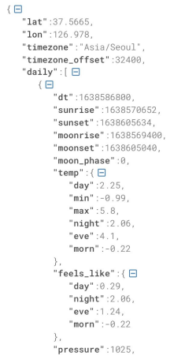
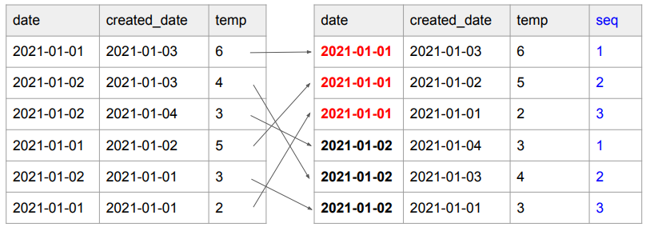
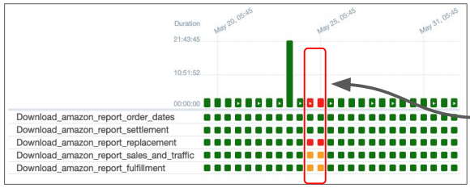

## <u>1. airflow-day4-1</u>

Contents

1. 4장 숙제 리뷰
2. Open Weathermap DAG 구현하기
3. Primary Key Uniqueness 보장하기
4. Backfill과 Airflow

<br>

airflow.cfg (1)

1. DAGs 폴더는 어디에 지정되는가? \
   a. 기본적으로는 Airflow가 설치된 디렉토리 밑의 dags 폴더가 되며 dags_folder 키에 저장됨

2. DAGs 폴더에 새로운 Dag를 만들면 언제 실제로 Airflow 시스템에서 이를 알게
   되나? \
    이 스캔 주기를 결정해주는 키의 이름이 무엇인가? \
    a. dag_dir_list_interval (기본값은 300 = 5분)

3. 이 파일에서 Airflow를 API 형태로 외부에서 조작하고 싶다면 어느 섹션을
   변경해야하는가? \
    a. api 섹션의 auth_backend를 airflow.api.auth.backend.basic_auth로 변경

4. Variable에서 변수의 값이 encrypted가 되려면 변수의 이름에 어떤 단어들이 \
   들어가야 하는데 이 단어들은 무엇일까? :) \
   a. password, secret, passwd, authorization, api_key, apikey, access_token

5. 이 환경 설정 파일이 수정되었다면 이를 실제로 반영하기 위해서 해야 하는
   일은?
   a. sudo systemctl restart airflow-webserver
   b. sudo systemctl restart airflow-scheduler

6. Metadata DB의 내용을 암호화하는데 사용되는 키는 무엇인가?
   a. fernet_key

<br>

Airflow와 타임존

- airflow.cfg에는 두 종류의 타임존 관련 키가 존재
  a. default_timezone
  b. default_ui_timezone
- start_date, end_date, schedule
  a. default_timezone에 지정된 타임존을 따름
- execution_date와 로그 시간
  a. 항상 UTC를 따름
  b. 즉 execution_date를 사용할 때는 타임존을 고려해서 변환후 사용필요

현재로 가장 좋은 방법은 UTC를 일관되게 사용하는 것으로 보임

<br>

dags 폴더에서 코딩시 작성한다면 주의할 점

- Airflow는 dags 폴더를 주기적으로 스캔함
  [core]
  dags_folder = /var/lib/airflow/dags
  # How often (in seconds) to scan the DAGs directory for new files. Default to 5 minutes.
  dag_dir_list_interval = 300
- 이때 DAG 모듈이 들어있는 모든 파일들의 메인 함수가 실행이 됨
  - 이 경우 본의 아니게 개발 중인 테스트 코드도 실행될 수 있음
    from airflow import DAG
    …
    cur.execute(“DELETE FROM ….”)

<br>

CountryInfo DAG 코드 리뷰

- **UpdateSymbol_v2 거의 흡사함**

```python
import requests
@task
def extract_transform():
  response = requests.get('https://restcountries.com/v3/all')
  countries = response.json()
  records = []
  for country in countries:
    name = country['name']['common']
    population = country['population']
    area = country['area']
    records.append([name, population, area])
  return records

with DAG(
  dag_id = 'CountryInfo',
  start_date = datetime(2023,5,30),
  catchup=False,
  tags=['API'],
  schedule = '30 6 * * 6' # 0 - Sunday, …, 6 - Saturday
) as dag:
  results = extract_transform()
  load("pjw7491", "country_info", results)

CREATE TABLE {schema}.{table} (
 name varchar(256) primary key,
 population int,
 area float
);

```

### 실습: docker:

```bash
$ docker ps
$ docker exec -it scheduler id sh
$ ls -tl
$ clear
$ ls -tl dags
$ cat dags/CountryInfo.py

# airflow.cfg 살펴보기
```

<br>
<br>
<br>

## <u>2. airflow-day4-2</u>

### Open Weathermap DAG 구현하기

Open Weathermap API 소개

- 위도/경도를 기반으로 그 지역의 기후 정보를 알려주는 서비스
- 무료 계정으로 api key를 받아서 이를 호출시에 사용
  - https://openweathermap.org/price

만들려는 DAG: 서울 8일 낮/최소/최대 온도 읽기

- 먼저 Open Weathermap에 각자 등록하고 자신의 API Key를 다운로드 받을 것
- API Key를 open_weather_api_key라는 Variable로 저장
- 서울의 위도와 경도를 찾을 것
- One-Call API를 사용: https://openweathermap.org/api/one-call-api
  - 앞서 API KEY와 서울의 위도/경도를 사용해서 위의 API를 requests 모듈을 사용해서 호출
  - 응답 결과에서 온도 정보(평균/최소/최대)만 앞으로 7일을 대상으로 출력해볼 것
    - **날짜, 낮 온도(day), 최소 온도(min), 최대 온도(max)**

https://api.openweathermap.org/data/2.5/onecall?lat={lat}&lon={lon}&exclude={part}&appid={API key}&units=metric

DAG 구현 (1)

- Open Weathermap의 one call API를 사용해서 서울의 다음 8일간의 낮/최소/최대 \
  온도를 읽어다가 각자 스키마 밑의 weather_forecast라는 테이블로 저장
  - https://openweathermap.org/api/one-call-api를 호출해서 테이블을 채움
  - weather_forecast라는 테이블이 대상이 됨
    - 여기서 유의할 점은 created_date은 레코드 생성시간으로 자동 채워지는 필드라는 점

```SQL
CREATE TABLE keeyong.weather_forecast (
 date date primary key,
 temp float, -- 낮 온도
 min_temp float,
 max_temp float,
 created_date timestamp default GETDATE()
);
```

DAG 구현 (2)

- One-Call API는 결과를 JSON 형태로 리턴해줌
  - 이를 읽어들이려면 requests.get 결과의 text를 JSON으로 변환해 주어야함
  - 아니면 requests.get 결과 오브젝트가 제공해주는 .json()이란 함수 사용
    - f = requests.get(link)
    - f_js = f.json()
- 결과 JSON에서 daily라는 필드에 앞으로 8일간 날씨 정보가 들어감 있음
  - daily 필드는 리스트이며 각 레코드가 하나의 날짜에 해당
  - 날짜 정보는 “dt”라는 필드에 들어 있음. 이는 epoch이라고 해서 1970년 1월 1일 이후 \
    밀리세컨드로 시간을 표시. 이는 아래와 같은 코드로 읽을 수 있는 날짜로 변경 가능
    - datetime.fromtimestamp(d["dt"]).strftime('%Y-%m-%d') # 2021-10-09

<br>

Open Weather API 호출 응답 보기

- daily라는 리스트에 앞으로 8일간의 온도 정보가 들어옴

  - dt 필드가 날짜를 나타냄
  - temp 필드가 온도 정보를 나타냄

    - day
    - min
    - max
    - night
    - eve
    - morn

      

<br>
<br>
<br>

## <u>3. airflow-day4-3</u>

### Primary Key Uniqueness 보장하기

Primary Key Uniqueness란?

- 테이블에서 하나의 레코드를 유일하게 지칭할 수 있는 필드(들)
  - 하나의 필드가 일반적이지만 다수의 필드를 사용할 수도 있음
  - 이를 CREATE TABLE 사용시 지정
- 관계형 데이터베이스 시스템이 Primary key의 값이 중복 존재하는 것을 막아줌
- 예 1) Users 테이블에서 email 필드
- 예 2) Products 테이블에서 product_id 필드

```SQL
CREATE TABLE products (
  product_id INT PRIMARY KEY,
  name VARCHAR(50),
  price decimal(7, 2)
);

CREATE TABLE orders (
  order_id INT,
  product_id INT,
  PRIMARY KEY (order_id, product_id),
  FOREIGN KEY (product_id) REFERENCES products (product_id)
);
```

<br>

빅데이터 기반 데이터 웨어하우스들은 Primary Key를 지켜주지 않음

- Primary key를 기준으로 유일성 보장을 해주지 않음
  - 이를 보장하는 것은 데이터 인력의 책임
- Primary key 유일성을 보장해주지 않는 이유는?
  - 보장하는데 메모리와 시간이 더 들기 때문에 대용량 데이터의 적재가 걸림돌이 됨

```SQL
CREATE TABLE pjw7491.test (
 date date primary key,
 value bigint
);

-- Primary Key Uniqueness 보장하기
INSERT INTO pjw7491.test VALUES ('2023-05-10', 100);
INSERT INTO pjw7491.test VALUES ('2023-05-10', 150); -- 이 작업이 성공함!
```

<br>

Primary Key 유지 방법 (1)
● 앞서 살펴본 keeyong.weather_forecast 테이블을 대상으로 살펴보자

```SQL
CREATE TABLE pjw7491.weather_forecast (
  date date primary key,
  temp float,
  min_temp float,
  max_temp float,
  created_date timestamp default GETDATE()
);
```

- 날씨 정보이기 때문에 최근 정보가 더 신뢰할 수 있음.
- 그래서 어느 정보가 더 최근 정보인지를 created_date 필드에 기록하고 이를 활용
- 즉 date이 같은 레코드들이 있다면 created_date을 기준으로 더 최근 정보를 선택 \
  이를 하는데 적합한 SQL 문법이 ROW_NUMBER

<br>

Primary Key 유지 방법 (2)



<br>

1. date별로 created_date의 역순으로
   일련번호를 매기고 싶다면?

2. 새로운 컬럼 추가!!

- date별로 레코드를 모으고 그 안에서
  created_date의 역순으로 소팅한 후 1번부터
  일련 번호 (seq) 부여

3. ROW_NUMBER를 쓰면 2를 구현 가능

```SQL
ROW_NUMBER() OVER (
  partition by date
  order by created_date DESC
  ) seq
```

<br>

Primary Key 유지 방법 (3)

- 임시 테이블(스테이징 테이블)을 만들고 거기로 현재 모든 레코드를 복사
- 임시 테이블에 새로 데이터소스에서 읽어들인 레코드들을 복사
  - 이 때 중복 존재 가능
- 중복을 걸러주는 SQL 작성:
  - 최신 레코드를 우선 순위로 선택
  - ROW_NUMBER를 이용해서 primary key로 partition을 잡고 적당한 다른 필드(보통 타임스탬프 필드)로 \
    ordering(역순 DESC)을 수행해 primary key별로 하나의 레코드를 잡아냄
- 위의 SQL을 바탕으로 최종 원본 테이블로 복사
  - 이때 원본 테이블에서 레코드들을 삭제
  - 임시 temp 테이블을 원본 테이블로 복사

Primary Key 유지 방법 (4)

1.  ```SQL
      CREATE TEMP TABLE t AS SELECT * FROM pjw7491.weather_forecast;
    ```
    -. 원래 테이블의 내용을 임시 테이블 t로 복사 \
2.  DAG는 임시 테이블(스테이징 테이블)에 레코드를 추가 \
    -. 이때 중복 데이터가 들어갈 수 있음 \
3.  DELETE FROM keeyong.weather_forecast;

Primary Key 유지 방법 (5) 4. 중복을 없앤 형태로 새로운 테이블 생성

```SQL
INSERT INTO pjw7491.weather_forecast
SELECT date, temp, min_temp, max_temp, created_date
FROM (
 SELECT *, ROW_NUMBER() OVER (PARTITION BY date ORDER BY created_date DESC) seq
 FROM t
)
WHERE seq = 1;
```

위의 코드는 매번 새로 덮어쓰는 형식의 업데이트를 가정

<br>

weather_forecast로 Incremental Update 다시 설명


<br>
- 날짜가 지날수록 날씨정보가 정확해지기 때문에 최신화 필요

<br>

Upsert란?(Insert&Update hybrid)

- Primary Key를 기준으로 존재하는 레코드라면 새 정보로 수정
- 존재하지 않는 레코드라면 새 레코드로 적재
- 보통 데이터 웨어하우스마다 UPSERT를 효율적으로 해주는 문법을 지원해줌
  - 뒤에서 MySQL to Redshift DAG를 구현할 때 살펴볼 예정

<br>
<br>
<br>

## <u>4. airflow-dat4-4</u>

### Backfill과 Airflow

관리하는 데이터 파이프라인의 수가 늘어나면  
**이 중의 몇은 항상 실패하게 되며 이를 어떻게 관리하느냐**가  
데이터 엔지니어의 삶에 큰 영향을 준다

Incremental Update가 실패하면?



<br>

하루에 한번 동작하고 Incremental하게 업데이트하는 \
파이프라인이라면?

실패한 부분을 재실행하는 것이 얼마나 중요한가?

이제부터 할 이야기는 Incremental Update시에만 의미가 있음

- 다시 한번 가능하면 Full Refresh를 사용하는 것이 좋음
  - 문제가 생겨도 다시 실행하면 됨
- Incremental Update는 효율성이 더 좋을 수 있지만 운영/유지보수의 난이도가 올라감
  - 실수등으로 데이터가 빠지는 일이 생길 수 있음
  - 과거 데이터를 다시 다 읽어와야하는 경우 다시 모두 재실행을 해주어야함

**Backfill**의 용이성 여부 -> 데이터 엔지니어 삶에 직접적인 영향!

- Backfill의 정의
  - 실패한 데이터 파이프라인을 재실행 혹은 읽어온 데이터들의 문제로 다시 다 읽어와야하는 경우를 의미
- Backfill 해결은 Incremental Update에서 복잡해짐
  - Full Refresh에서는 간단. 그냥 다시 실행하면 됨
- 즉 실패한 데이터 파이프라인의 재실행이 얼마나 용이한 구조인가?
  - 이게 잘 디자인된 것이 바로 Airflow

<br>

보통 Daily DAG를 작성한다고 하면 어떻게 할까?

- 지금 시간을 기준으로 어제 날짜를 계산하고 그 날짜에 해당하는 데이터를 읽어옴

```python
from datetime import datetime, timedelta
# 지금 시간 기준으로 어제 날짜를 계산
y = datetime.now() - timedelta(1)
yesterday = datetime.strftime(y, '%Y-%m-%d')
# yesterday에 해당하는 데이터를 소스에서 읽어옴
# 예를 들어 프로덕션 DB의 특정 테이블에서 읽어온다면
sql = f"SELECT * FROM table WHERE DATE(ts) = '{yesterday}'"
```

<br>

그런데 지난 1년치 데이터를 Backfill 해야한다면?

- 기존 ETL 코드를 조금 수정해서 지난 1년치 데이터에 대해 돌린다
- 실수하기 쉽고 수정하는데 시간이 걸림

```python
from datetime import datetime, timedelta

#y = datetime.now() - timedelta(1)
#yesterday = datetime.strftime(y, '%Y-%m-%d')

yesterday = '2023-01-01'
# yesterday에 해당하는 데이터를 소스에서 읽어옴
# 예를 들어 프로덕션 DB의 특정 테이블에서 읽어온다면
sql = f"SELECT * FROM table WHERE DATE(ts) = '{yesterday}'"
```

<br>

어떻게 ETL을 구현해놓으면 이런 일이 편해질까?

- 시스템적으로 이걸 쉽게 해주는 방법을 구현한다
  - 날짜별로 backfill 결과를 기록하고 성공 여부 기록: 나중에 결과를 쉽게 확인
  - 이 날짜를 시스템에서 ETL의 인자로 제공
  - 데이터 엔지니어는 읽어와야하는 데이터의 날짜를 계산하지 않고 시스템이 지정해준 날짜를 사용
- Airflow의 접근방식
  - ETL 별로 실행날짜와 결과를 메타데이터 데이터베이스에 기록
  - 모든 DAG 실행에는 “**execution_date**”이 지정되어 있음
    - execution_date으로 채워야하는 날짜와 시간이 넘어옴
  - 이를 바탕으로 데이터를 갱신하도록 코드를 작성해야함
  - 잇점: backfill이 쉬워짐

<br>

Daily Incremental Update를 구현해야 한다면?

- 예를 들어 2020년 11월 7일의 데이터부터 매일매일 하루치 데이터를 읽어온다고 가정
- 이 경우 언제부터 해당 ETL이 동작해야하나?
  - 2020년 11월 8일
- 다르게 이야기하면 2020년 11월 8일날 동작하지만 읽어와야 하는 데이터의 날짜는?

  - 2020년 11월 7일: 이게 **start_date**이 됨

- Airflow의 **start_date**은 시작 날짜라기는 보다는 처음 읽어와야하는 데이터의 날짜임
- **execution_date**은 읽어와야하는 데이터의 날짜로 설정됨

<br>
<br>
<br>
<br>
<br>
<br>
<br>
<br>
<br>
<br>
<br>
<br>

- **Keyword**:

<br>
<br>
<br>
<br>
<br>
<br>

### **Summary**:

<br>
<br>
<br>
<br>
<br>
<br>
