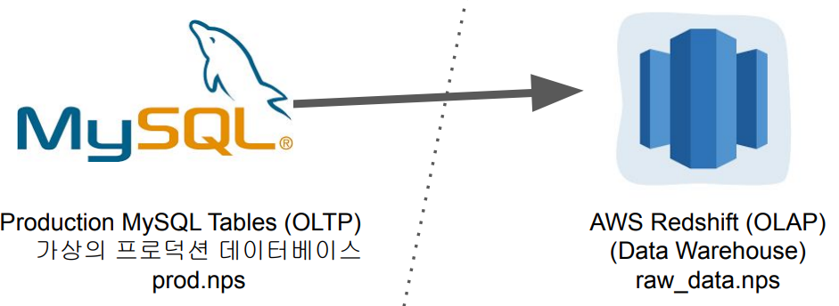
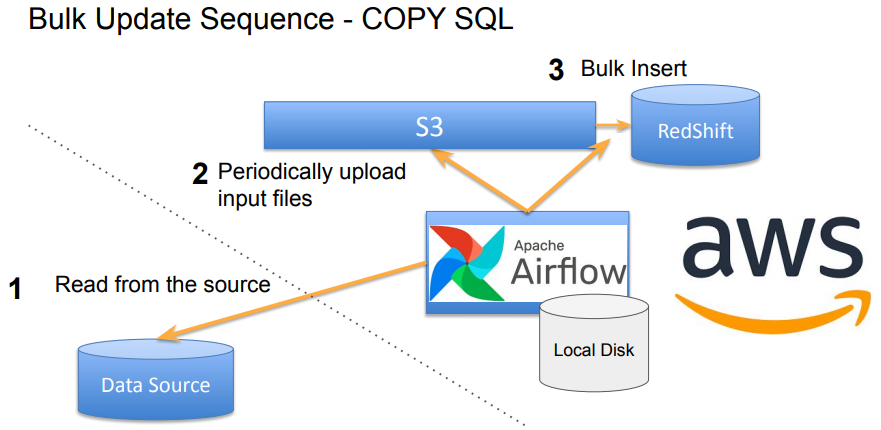

## <u>1. airflow-day5-1</u>

Contents

1. 5장 숙제 리뷰
2. OLTP 테이블 복사하기
3. Backfill 실행하기
4. Summary 테이블 만들기 (ELT)
5. 최종정리

<br>

UpdateSymbol_v2의 Incremental Update 방식 수정해보기

- DISTINCT 방식의 중복처리는 데이터 소스에 따라 이상 동작할 수 있음
- ROW_NUMBER 방식의 Primary key 동일 레코드 처리: UpdateSymbol_v3.py

<br>
<br>
<br>

## <u>2. airflow-day5-2</u>

### 프로덕션 데이터베이스 (MySQL) -> 데이터 웨어하우스 (Redshift)

구현하려는 ETL 소개 (1)



<br>

구현하려는 ETL 소개 (2)


<br>

AWS 관련 권한 설정

- Airflow DAG에서 S3 접근 (쓰기 권한)
  - IAM User를 만들고 S3 버킷에 대한 읽기/쓰기 권한 설정하고 access key와 secret key를 사용
- Redshift가 S3 접근 (읽기 권한)
  - Redshift에 S3를 접근할 수 있는 역할 (Role)을 만들고 이를 Redshift에 지정

<br>

AWS S3 접근은? (Connections)

- Access Key ID와 Secret Access Key를 사용하는 걸로 바뀜
  - 루트 사용자의 키들을 사용하면 해킹시 AWS 자원들을 마음대로 사용 가능 -> 여러번 사고가 남
- 우리가 사용해볼 Best Practice는:
  - IAM(Identity and Access Management)을 사용해 별도의 사용자를 만들고
  - 그 사용자에게 해당 S3 bucket을 읽고 쓸 수 있는 권한을 제공하고
  - 그 사용자의 Access Key ID와 Secret Access Key를 사용
    - 이 키도 주기적으로 변경해서 해킹이 될 경우의 피해를 최소화

<br>

MySQL의 테이블 리뷰 (OLTP, Production Database)

```SQL
CREATE TABLE prod.nps (
 id INT NOT NULL AUTO_INCREMENT primary key,
 created_at timestamp,
 score smallint
);
```

- 이미 테이블은 이미 MySQL쪽에 만들어져있고 레코드들이 존재하며 이를 Redshift로 복사하는 것이 우리가 해볼 실습

<br>

Redshift(OLAP, Data Warehouse)에 해당 테이블 생성

```SQL
CREATE TABLE (본인의스키마).nps (
 id INT NOT NULL primary key,
 created_at timestamp,
 score smallint
);
```

- 이 테이블들은 Redshift쪽에 본인 스키마 밑에 별도로 만들고 뒤에서 실습할 DAG를 통해 \
  MySQL쪽 테이블로부터 Redshift 테이블로 복사하는 것이 우리가 해볼 실습

<br>
<br>
<br>

## <u>3. airflow-day5-3</u>

MySQL_to_Redshift DAG의 Task 구성

- SqlToS3Operator
  - MySQL SQL 결과 -> S3
  - (s3://grepp-data-engineering/{본인ID}-nps)
  - s3://s3_bucket/s3_key
- S3ToRedshiftOperator

  - S3 -> Redshift 테이블
  - (s3://grepp-data-engineering/{본인ID}-nps) -> Redshift (본인스키마.nps)
  - COPY command is used

    

<br>

코드 리뷰 - MySQL_to_Redshift.py 살펴보기

- 2개의 Operator를 사용해서 구현
  - SqlToS3Operator
  - S3ToRedshiftOperator
- MySQL 있는 테이블 nps를 Redshift내의 각자 스키마 밑의 nps 테이블로 복사
  - S3를 경유해서 COPY 명령으로 복사

<br>

MySQL 테이블의 Incremental Update 방식 (1)

- MySQL/PostgreSQL 테이블이라면 다음을 만족해야함
  - created (timestamp): Optional
  - modified (timestamp)
  - deleted (boolean): 레코드를 삭제하지 않고 deleted를 True로 설정

<br>

MySQL 테이블의 Incremental Update 방식 (3)

- Daily Update이고 테이블의 이름이 A이고 MySQL에서 읽어온다면
- S3ToRedshiftOperator로 구현하는 경우
  - query 파라미터로 아래를 지정
  - SELECT \* FROM A WHERE DATE(modified) = DATE(execution_date)
  - method 파라미터로 “UPSERT”를 지정
  - upsert_keys 파라미터로 Primary key를 지정
    - 앞서 nps 테이블이라면 “id” 필드를 사용

<br>

### 실습

- AWS S3 Connections 설정 (IAM User 설정)
- Redshift S3 Connections 설정 (IAM Role 설정)
- MySQL 관련 모듈 설치 (Docker)
- MySQL_to_Redshift DAG 실행
- MySQL_to_Redshift_v2 DAG 실행

<br>
<br>
<br>

## <u>4. airflow-day5-4</u>

### Backfill 실행해보기

Backfill을 커맨드라인에서 실행하는 방법

```bash
airflow dags backfill dag_id -s 2018- 07- 01 -e 2018- 08- 01
airflow dags backfill MySQL_to_Redshift_v2 -s 2023-01-01 -e 2023-02-01
```

- This assumes the followings:
- catchUp이 True로 설정되어 있음
- execution_date을 사용해서 Incremental update가 구현되어 있음
- start_date부터 시작하지만 end_date은 포함하지 않음
- 실행순서는 날짜/시간순은 아니고 랜덤. 만일 날짜순으로 하고 싶다면
- DAG default_args의 depends_on_past를 True로 설정

default_args = {
'depends_on_past': True,

<br>
<br>
<br>

## <u>5. airflow-day5-5</u>

### 최종 정리

Airflow란 무엇인가?

- Airflow는 파이썬으로 작성된 데이터 파이프라인 (ETL) 프레임웍
  - 가장 많이 사용되는 데이터 파이프라인 관리/작성 프레임웍
  - Airflow에서 데이터 파이프라인을 DAG(Directed Acyclic Graph) 라고 부름
- Airflow의 장점
  - 데이터 파이프라인을 세밀하게 제어 가능
  - 다양한 데이터 소스와 데이터 웨어하우스를 지원
  - 백필(Backfill)이 쉬움
- Airflow 관련 중요 용어/개념
  - start_date, execution_date, catchup
- 스케일링 방식
  - Scale Up vs. Scale Out vs. 클라우드 버전 vs. K8s 사용

<br>

데이터 파이프라인 작성시 기억할 점

- 데이터 파이프라인에 관한 정보를 수집하는 것이 중요
  - 비지니스 오너와 데이터 리니지에 주의할 것
  - 결국 데이터 카탈로그가 필요
- 데이터 품질 체크
  - 입력 데이터와 출력 데이터
- 코드 실패를 어설프게 복구하려는 것보다는 깔끔하게 실패하는 것이 좋음
- 가능하면 Full Refresh
  - Incremental Update를 쓸 수 밖에 없다면 Backfill 방식을 \
    먼저 생각해둘 것 -> Airflow가 필요한 이유
- 주기적인 청소 (데이터, 테이블, Dag)

<br>

다음 스텝

- Airflow 고도화 강의에서 더 많은 내용을 공부할 예정
  - 운영, 고급 기능 (다양한 방식의 DAG 트리거), 구글 스프레드시트 연동, 슬랙 연동
- 컨테이너 기술 공부 (Docker와 K8s)
- Spark에 대해 학습하여 빅데이터 처리
- 배치가 아닌 리얼타임 기준으로 스트리밍 데이터 처리 (Kafka, Kinesis)

<br>
<br>
<br>
<br>
<br>
<br>

- **Keyword**:

<br>
<br>
<br>
