## <u>1. docker-day1-1-Airflow 운영상의 어려움</u>

Contents

1. Hello World, Docker!
2. 웹 서비스를 Docker로 빌드하고 실행해보기
3. Docker-Compose 사용해보기
4. Container Orchestration이란?
5. Docker로 Airflow Task 실행해보기
6. Airflow를 Docker/K8s로 설정하기

<br>

관리해야하는 DAG의 수가 100개를 넘어간다면?

- 데이터 품질이나 데이터 리니지 이슈 이외에도 다양한 이슈들이 발생
- 어떤 이슈들이 있을까?
  - 라이브러리 충돌
  - Worker의 부족
  - Worker 서버들의 관리와 활용도 이슈

<br>

1. 라이브러리 충돌

- 라이브러리/모듈의 충돌 이슈가 발생하기 시작함
- DAG에 따라 실행에 필요한 라이브러리/모듈이 달라지기 시작
  - 예) Python 버전
- 이로 인해 DAG 혹은 Task별로 별도의 독립공간을 만들어주는 것이 필요
  - **Docker** to the rescue
  - Dag 혹은 Task 코드를 Docker Image로 만들고 이를 독립된 공간(Docker Container)안에서 실행

<br>

2. Worker의 부족

- Scale Up
- Scale Out
  - 클라우드 서비스 사용
- K8s와 같은 컨테이너 기술 사용

  - 필요한대로 서버 요청

    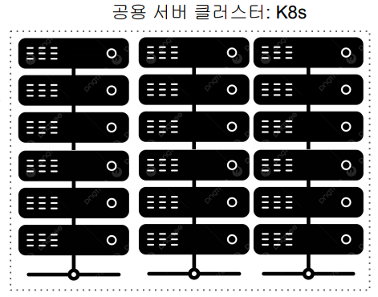

<br>

3. 낮은 Server Utilization 이슈

- Airflow 전용 하드웨어를 지정했는데 서버들이 항상 바쁘지 않다면?
- 서비스별로 전용 서버를 할당하는 것은 여러가지로 이슈를 만들어냄
  - 서비스별로 Capacity 관리를 해야함
  - 각 서비스에 속한 서버들은 보면 utilization이 낮은 이슈 발생
- 이 역시 K8s와 같은 컨테이너 기술의 도입으로 해결 가능

<br>

해결책

- 태스크나 DAG 코드를 Docker Image로 만들어서 Docker Container 형태로 실행
  - 라이브러리/모듈 충돌을 방지
  - 개발 환경과 프로덕션 환경을 동일하게 유지
- Airflow Worker를 K8s에서 필요한 대로 동적으로 할당하여 사용
  - 전용 서버를 Airflow에 할당하지 않고 Container Orchestration 서비스를 통해 할당해서 사용하고 리턴
- Airflow에서 이를 해결하는 방법은 3가지
  1. Airflow Operator로 KubernetesPodOperator를 사용
  2. Airflow Operator로 DockerOperator를 사용
  3. **Airflow Executor**로 아래를 사용
  - KubernetesExecutor
  - CeleryKubernetesExecutor
  - LocalKubernetesExecutor

<br>

잠깐! Airflow Executor는 무엇?

- Executor는 Task들을 관리하고 실행하는 역할을 수행
  - 병렬 혹은 일렬 실행이나 어느 worker에서 실행할지 등등
- 다양한 수의 Executor 타입이 존재
  - Sequential Executor: 디폴트로 설치되며 Sqlite와 같은 싱글스레드 DB에서만 사용가능
  - Local Executor: task들을 Airflow 마스터 노드안에서 실행
  - Celery Executor: 다수의 Worker 노드가 있는 경우 사용되며 \
    Celery 큐를 사용해 task들을 worker 노드로 분산하여 실행
  - Kubernetes Executor는 K8s 클러스터를 사용하여 task들을 독립된 환경에서 사용
  - Local Kubernetes Executor와 Celery Kubernetes Executor도 존재

<br>

Airflow 아키텍처: Docker와 K8s를 사용하는 방법

- Airflow Operator로 KubernetesPodOperator를 사용
  - 이 방식은 특정 태스크를 Docker Image로 만들어 K8s에서 실행
- Airflow Operator로 DockerOperator를 사용
  - 이 방식은 특정 태스크를 Docker Image로 만들어 Docker Container 위 에서 실행
- Airflow Executor로 다음 중의 하나를 사용
  - **KubernetesExecutor**
    - 모든 DAG 코드가 Docker Image로 빌드되어 K8s에서 실행됨
  - **CeleryKubernetesExecutor**
    - CeleryExecutor와 KubernetesExecutor를 동시에 사용하는 방법을 제공해주는 Executor
    - 이는 Airflow 로드가 전체적으로 큰데 소수의 task만 Isolation을 필요로 하는 경우
  - **LocalKubernetesExecutor**
    - LocalExecutor와 KubernetesExecutor를 동시에 사용하는 방법을 제공해주는 Executor

<br>
<br>
<br>

## <u>2. docker-day1-2-Docker 소개와 Virtual Machines vs. Docker Containers</u>

내 컴퓨터 환경을 그대로 패키징해서 다른 이에게 줄 수
있다면?

- Docker Image: 이렇게 독립적으로 완전하게 만들어진 패키지
- Docker Container: 이 Docker Image를 독립된 환경에서 실행한 것

  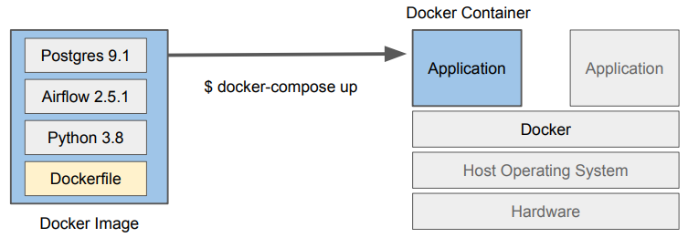

  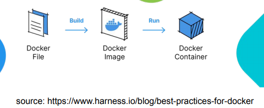

<br>

Docker의 목표

- 소프트웨어를 일관되게 빌드하고 실행하고 배포

<br>

Virtual Machines vs. Docker Containers

Virtual Machine 소개

- AWS의 EC2가 대표적인 Virtual Machine (VM)
- 하드웨어를 추상화하여 한 컴퓨터 위에 가상 컴퓨터를 올리는 것
  - 즉 컴퓨터 하드웨어 단의 추상화
- Virtual Machines: 보통 하나의 컴퓨터 위에 다수의 VM을 실행하는 것이 일반적 이 안에서 소프트웨어가 동작
- VM을 생성하고 관리하기 위한 소프트웨어:

  - VMWare, VirtualBox, Hyper-v, …

    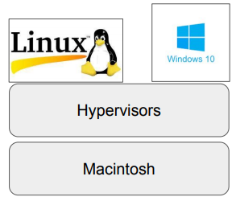

<br>

Virtual Machine의 장단점

- 장점
  - 소프트웨어를 실행하기 위한 독립적이고 분리된 공간을 제공
  - 다수의 소프트웨어를 각 VM단에서 독립적으로 실행가능
- 단점
  - 각 VM은 자신만의 OS를 필요로 함 (가상 하드웨어위에서 돌기 때문)
    - 유료 OS라면 라이센스 비용 필요
    - 그러다보니 시작하는데 오래 걸림
  - 자원을 많이 사용함 (VM들끼리 자원을 나눠써야함)

<br>

Docker Container 소개

- 소프트웨어를 실행하기 위한 독립적이고 분리된 공간
- 자체 파일 시스템을 갖고 있음 (Volume이라고 부름)

| Host OS | 지원하는 컨테이너 OS | \
| 맥 | 경량화된 리눅스 VM이 동작함| \
| 윈도우 | 윈도우, 리눅스| \
| 리눅스 | 리눅스|

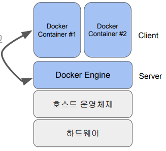

<br>

Container의 장단점

- 장점
  - 소프트웨어를 실행하기 위한 독립적이고 분리된 공간을 제공
    - 다수의 소프트웨어를 각 컨테이너단에서 독립적으로 실행가능
  - 자원 소비가 적음 (lightweight)
    - 몇 십개에서 몇 백개의 container를 실행 가능
  - 호스트 OS를 사용 (별도 비용 없음)
    - 따라서 빠르게 실행됨
- 단점

  - 많은 수의 Docker Container를 관리하는 것은 쉽지 않음
  - Host OS를 사용하기에 Cross-platform compatibility를 항상 지원하지 않음
  - GUI 소프트웨어 개발에 적합치 않음

    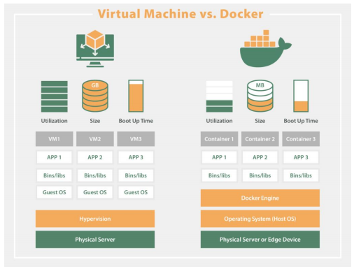

<br>
<br>
<br>

## <u>3. docker-day1-3-Docker 설치</u>

### Docker Desktop vs. Docker Engine

- Docker Desktop은 Docker Engine + 여러가지 툴들

Docker 사용을 위한 시스템 사양 체크

- 2023년 5월 기준
- 맥
  - 최소 4GB의 메모리
  - 맥 OS 버전 11 혹은 그 이상
- 윈도우
  - 최소 4GB의 메모리
  - 64비트 윈도우 10이나 윈도우 11
  - 그 이외에 다른 조건이 존재
    - 예) Hyper-V와 Container 기능이 활성화되어 있어야함
    - 예) WSL 버전 (이는 윈도우 위에서 돌아가는 리눅스 커널)

<br>
<br>
<br>

## <u>4. docker-day1-4-Docker 프로그램 개발 프로세스</u>

### Docker 프로그램 개발 프로세스

하이레벨 Docker 사용 프로세스

- 먼저 대상 소프트웨어를 선택
  - 다수의 컴포넌트로 구성되는 소프트웨어라면 각각이 Docker Image로 만들어져야할 수도 있음
- 이를 **Docker Image로 빌드하자: Dockerization**이라고 부름

  - Dockerfile이란 텍스트 파일로 세부 정보를 기술
    - 해당 소프트웨어를 이미지로 바꾸기 위한 Docker에게 주는 명령들을 포함
  - Docker Image: **하나**의 Docker Container안에서 실행됨!

    - Dockerfile을 기준으로 만들어지며 소프트웨어를 실행하기위해 필요한 모든 것을 포함

      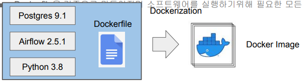

<br>

Docker Image의 구성 요소

- 기본 OS (리눅스라면 우분투, 데비안 등등)와 같은 소프트웨어의 실행환경
- 소프트웨어 자체 (코드)
- 소프트웨어가 필요로 하는 라이브러리
- 파일 시스템 스냅샷: 이는 스택화된 형태로 구현됨 (뒤에서 더 설명)
- 환경 설정 변수: 빌드할 때 변수와 실행 때 변수 두 가지가 존재
- 메타 데이터: 이미지 자체에 대한 정보 (버전, 작성자, 설명 등등)

위 정보와 설치 관련 실행 순서등이 Dockerfile에 기술됨
Docker Image는 다수의 파일로 구성됨 (“docker image ls”)

<br>

Docker Image의 등록: Docker Hub

- Docker Registry는 Docker Image들의 보관소
  - On-prem registry와 Cloud registry가 존재
  - docker hub이 가장 유명
- 여기에 등록을 하면 회사내 혹은 퍼블릭하게 이미지를 공유 가능

  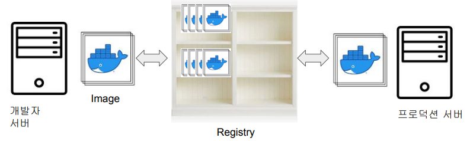

<br>

Docker Hub이란 무엇인가? (2)

- Teams & Organizations
- Public과 Private Repo 제공
- Official Images
- Github과 연동을 통한 Automated Build 제공

  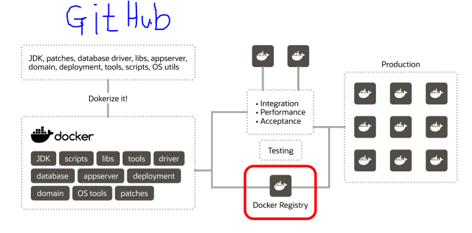

<br>
<br>
<br>

## <u>5. docker-day1-5-실습1\_ 간단한 Hello World 프로그램(1)</u>

### 실습 1: 간단한 Hello World

만들려는 프로그램 실행 (Docker 없이)

- 직접 설치/실행시 순서
  1. OS 선택
  2. Node 설치
  3. 코드 복사
  4. 프로그램 실행 (node app.js)

<br>

Dockerfile의 생성

- Docker에게 소프트웨어 설치 명령을 기술
- 먼저 베이스 이미지를 기술 (FROM)
- 다음으로 코드 복사
- 마지막으로 코드 실행

  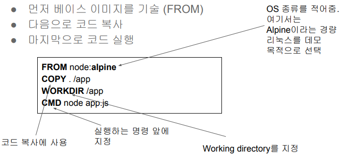

<br>

keyword: FROM, COPY, WORKDIR, CMD

<br>

Dockerfile 사용 가능 기타 키워드

- ARG:
  - Docker Image를 만들 때 사용되는 변수 지정. 최종 이미지에는 안 들어감
- ENV
  - 컨테이너가 실행될 때 사용되는 환경변수. 최종 이미지에 저장됨
- USER
  - 컨테이너를 실행할 때 사용할 유저 ID
- EXPOSE
  - 서비스 사용 포트번호
- RUN
  - 빌드시 실행되어야하는 명령들이 지정됨 (docker build)
  - RUN apt-get update && apt-get install -y curl

<br>

Dockerfile 키워드: CMD vs. ENTRYPOINT (1)

- Container가 시작할 때 실행되어야 하는 명령어를 지정하는데 사용 (docker run)
  - 굉장히 흡사한 기능을 제공하지만 우선 순위가 있음
- 둘다 한 DOCKERFILE에서 여러번 실행되면 각각 마지막 것만 사용됨
- 아래의 경우 docker run 실행시 동일한 결과가 나옴

  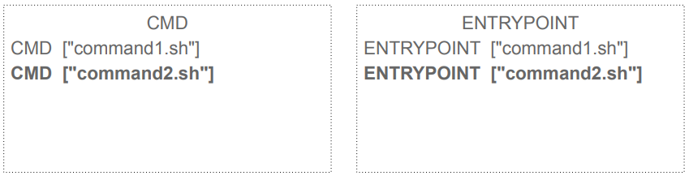

<br>

Dockerfile 키워드: CMD vs. ENTRYPOINT (2)

- CMD나 ENTRYPOINT 중 하나만 지정되면 그게 container가 실행될 때 실행

```bash
# 설정
FROM debian:buster

COPY . /myproject
RUN apt-get update …
CMD ["./cmd1.sh"]

# 실행
docker run my-image
=> ./cmd1.sh가 기본으로 실행됨
docker run my-image cmd2.sh
=> cmd2.sh가 실행됨
```

<br>

Dockerfile 키워드: CMD vs. ENTRYPOINT (3)

- 둘이 한 DOCKERFILE에서 같이 지정가능함
- 둘이 같이 사용되면 ENTRYPOINT가 기본 명령이 되고 CMD가 인자를 제공
- ENTRYPOINT는 --entrypoint 옵션을 통해서만 덮어쓰기가 가능

```bash
# 설정
FROM debian:buster

COPY . /myproject
RUN apt-get update …
ENTRYPOINT ["entrypoint.sh"]
CMD ["param1", "param2"]

# 실행
docker run my-image
=> entrypoint.sh param1 param2
docker run my-image cmd2
=> entrypoint.sh cmd2

# ENTRYPOINT 덮어쓰기
docker run --entrypoint="/cmd3.sh” my-image
```

<br>

CMD or ENTRYPOINT?

- 최대한 CMD만 사용
- ENTRYPOINT를 사용하면 실행시 타이핑을 덜 할 수 있음
  - 파라미터를 지정해주면 되기 때문이지만 감춰지기 때문에 오히려 혼란을 줄 수 있음

요약:

1. ENTRYPOINT가 있으면 CMD 값이 파라미터로 실행됨
2. 아니면 CMD가 실행됨

<br>

Dockerfile 더 살펴보기: Airflow 예

```bash
FROM python:3.7-slim-buster
ENV DEBIAN_FRONTEND noninteractive # 이미지에도 최종 저장됨

ARG AIRFLOW_USER_HOME=/usr/local/airflow
ARG AIRFLOW_VERSION=1.10.9

COPY config/airflow.cfg ${AIRFLOW_USER_HOME}/airflow.cfg

RUN chown -R airflow: ${AIRFLOW_USER_HOME} # 빌드할 때 실행되는 명령

EXPOSE 8080 5555 8793

USER airflow
WORKDIR ${AIRFLOW_USER_HOME}
ENTRYPOINT ["/entrypoint.sh"] #
CMD ["webserver"]             # => /entrypoint.sh webserver
```

<br>

Docker Image 생성

```bash
$ docker build --platform linux/amd64 -t hello-world-docker .
# docker build를 실행하면 Dockerfile에서 RUN 명령이 실행됨
# -t는 태그를 지정하는 것으로 뒤에서 더 설명

# 만일 Apple M1 chip 기반 맥에서 빌드하는 경우 그 이미지는 ARM 기반
# 아키텍처로 만들어지기 때문에 일반 리눅스에서 안 돌아감.
# --platform 옵션을 사용해서 linux/amd64로 지정

# 실행 과정
 => [internal] load build definition from Dockerfile
…
 => => writing image
sha256:cb6c638168780afd3d74fc1cddd813917a6a397dad453c8e1a8063635c1521fe 0.0s
 => => naming to docker.io/library/hello-world-docker
```

<br>

Docker Image 확인

```bash
$ docker image ls
REPOSITORY TAG IMAGE ID CREATED SIZE
hello-world-docker latest cb6c63816878 22 minutes ago 179MB
```

<br>

Docker Container로 실행

```bash
$ docker run hello-world-docker
Hello Docker!
# docker run을 Dockerfile에서 CMD 명령이 실행됨
```

- 만일 이 이미지를 다른 컴퓨터에서 실행하고자 한다면?
  - Docker Registry (예를 들면 Docker hub)으로 먼저 등록

<br>
<br>
<br>

## <u>6. docker-day1-6-실습1- 간단한 Hello World 프로그램(2)</u>

### Docker Hub 소개

1. Docker Registry에 등록 (1): Docker Hub 회원등록
2. Docker Registry에 등록 (2): hello-world-docker repo 만들기
3. Docker Registry에 등록 (3)

- 터미널로 이동하여 다음 명령을 실행
- 먼저 현재 이미지의 repo 이름을 jungwoo7476/hello-world-docker로 변경

```bash
$ docker image ls
$ docker tag hello-world-docker:latest jungwoo7476/hello-world-docker:latest
$ docker image ls
$ docker login --username=jungwoo7476
$ docker push jungwoo7476/hello-world-docker
```

<br>

Docker Hub로부터 받은 Image 실행

다른 서버에서 이미지를 다운로드 받아 컨테이너로 실행하기 (1)

- https://labs.play-with-docker.com/를 사용해서 4시간동안 서버를 하나 무료로 사용
- Docker Hub에 로그인이 되어있다면 그냥 계정 연결을 허용하면 됨

다른 서버에서 이미지를 다운로드 받아 컨테이너로 실행하기 (2)

- 터미널 윈도우를 Option+Enter(윈도우는 Alt+Enter)로 최대화하고 아래 명령 실행

```bash
$ docker version
$ docker pull jungwoo7476/hello-world-docker
$ docker image ls
$ docker run jungwoo7476/hello-world-docker
```

실행시 아래 에러가 난다면 build할때 --platform 옵션 사용
필요:

WARNING: The requested image's platform (linux/arm64/v8) does not match the detected host \
platform (linux/amd64/v3) and no specific platform was \
requested exec /usr/local/bin/docker-entrypoint.sh: exec format error

만일 로컬에 다운로드받은 이미지가 없다면 docker hub에서 pull을 알아서 수행함

<br>

**여기서 사용해본 Docker 명령 요약**

- docker version
- docker build -t
- docker push
- docker login
- docker tag
- docker pull
- docker run
  - p option (port mapping)
  - v option (volume mapping)

<br>

docker run vs. docker exec

- docker run과 docker exec의 차이점은 무엇일까?
- docker run은 새로 Container를 실행하는 것
- docker exec는 실행된 Container에 작업을 하는 것
  - 그래서 이 명령은 Container ID가 필요함
- 두 명령 모두 --user root 혹은 -u root를 통해 루트 유저로 연결가능

<br>
<br>
<br>

## <u>7. docker-day1-7-실습1-간단한 Hello World 프로그램-데모</u>

### 실습 #1 데모

Docker Image 이름?

- docker image ls와 docker images와 동일한 결과를 보여줌

- 앞서 docker tag 명령의 경우 별칭을 만들어주는 것임 (이름을 바꾸는 것이 아님)
  - docker tag hello-world-docker jungwoo7476/hello-world-docker
- Docker image의 실제 ID는 IMAGE ID임
- Image 이름 자체는 REPOSITORY 이름과 TAG로 구성됨
  - 한번에 쓰는 경우 :을 사이에 두고 같이 씀 -> redis:13, jungwoo7476/hello-world-docker:latest

<br>

Docker tag란?

- Docker Image의 버전이나 변형을 나타내는 문자열
  - 디폴트 값은 latest
  - Docker Image의 부가정보를 나타냄
- Docker Image 이름에서 :뒤에 해당
  - 예: ubuntu:18.04
  - 예: bitnami/airflow
  - 예: node:alpine

<br>

Docker Image 이름

- docker image ls에서 Repository에 해당
  - Docker Hub에서 다운로드받은 것이라면 어카운트ID(네임스페이스)를 포함할 수 있음
  - 하지만 공식이미지는 네임스페이스가 없음
- 포맷: Repo이름:태그
  - 예: jungwoo7476/hello-world-docker:latest
  - 예: bitnami/airflow
  - 예: hello-world-docker:latest
- 공식 이미지들의 경우에는 네임스페이스가 없음
  - 예: ubuntu:18.04
  - 예: node:alpine

### 실습: CLI

```bash
$ cat Dockerfile
$ ls -tl
$ cat app.js
$ node app.js
$ docker image ls
$ docker image rm -f [IMAGE ID]
$ docker build --platform linux/amd64 -t hello-world-docker .
$ docker run hello-world-docker
# Hello Docker!
$ docker image ls
$ docker tag hello-world-docker jungwoo7476/hello-world-docker
$ docker login --username=jungwoo7476
# Password:
$ docker push jungwoo7476/hello-world-docker
```

### 실습: https://labs.play-with-docker.com/

```bash
$ docker pull
$ docker run
```

<br>
<br>
<br>

## <u>8. docker-day1-8-실습2-Ubuntu</u>

### 실습 2: 우분투

리눅스 커널과 배포판

- 리눅스 커널: 리눅스의 핵심부분. Linus B. Torvalds가 1992년에 처음 공개

  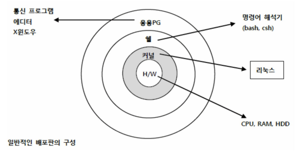

<br>

- 핵심: 커널은 동일, 자동차의 엔진

어떤 리눅스 배포판이 있는가?

- 우분투: 가장 많이 사용되며 데비안에 기반해서 만들어진 리눅스 배포판
- 데비안
- 알파인: 임베드 시스템에서 사용할 용도로 만들어진 경량화 리눅스 배포판
- 페도라
- 센트OS
- …

배포판에 따라 다른 패키지 매니저가 존재

- npm
- yarn
- pip
- apt
- NuGet

<br>

우분투 설치 후 다양한 명령 실행해보기 보통은 docker image를 \
pull하고 run을 해야함! 바로 run을 하면?

- docker run ubuntu
- docker ps
- docker ps -a
- docker run -it ubuntu
  - nano
  - apt list
  - apt install nano
  - apt update
  - apt install nano
  - nano
  - apt remove nano

### 실습: CLI: ubuntu

```bash
$ docker run ubuntu
$ docker ps -a
$ docker run -it ubuntu
$ apt update
$ apt install nano
```

<br>
<br>
<br>

## <u>9. docker-day1-9-실습3\_ MySQL 서버 실행</u>

### 실습 3: MySQL

MySQL 8.0을 Docker로 실행해보기

- 먼저 Docker Engine이 실행된 것 확인하고 terminal 프로그램 실행
- MySQL docker image를 다운로드
  - docker pull mysql/mysql-server:8.0
- 다운로드받은 이미지로 Docker container 실행
  - docker run --name=mysql_container mysql/mysql-server:8.0
- MySQL root 계정의 패스워드 찾기
  - docker logs mysql_container 2>&1 | grep GENERATED
  - (windows) docker logs mysql_container 2>&1 | Select-String "GENERATED"
- 마지막으로 MySQL shell 실행하기
  - docker exec -it mysql_container mysql -uroot -p

<br>

여기서 사용해본 Docker 명령

- docker run --name
  - 기억하기 쉬운 이름을 docker ps로 찾은 Container ID 대신 사용 가능
- docker logs
  - Container쪽에서 생성된 stdout, stderr단의 로그를 읽어옴
  - --follow 옵션을 사용하면 로그가 계속적으로 스트리밍이 됨

<br>

```bash
$ docker start mysql_container
$ docker ps
$ docker exec -it mysql_container mysql -uroot -p
mysql> $ show databases;
mysql> $ show databases;
mysql> $ ALTER USER root@localhost IDENTIFIED BY '비번';
mysql> $ use mysql;
mysql> $ show tables;
```

<br>
<br>
<br>
<br>
<br>
<br>
<br>
<br>
<br>
<br>
<br>
<br>

### 특강: [Airflow 환경 구축기] (feat. 김학진 멘토님)

<br>
<br>
<br>
<br>
<br>
<br>

- **Keyword**:

<br>
<br>
<br>
