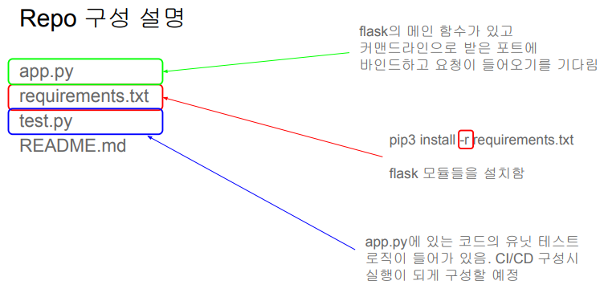

## <u>1. docker-day2-1-챕터소개와-1장퀴즈리뷰</u>

Contents

1. 1장 퀴즈 리뷰
2. 학습 목표 소개
3. Hangman 서비스 소개
4. Hangman 서비스를 Dockerization하기 (숙제)
5. CI/CD와 Github Actions 소개
6. Github Actions 사용 1: 테스트 추가
7. Github Actions 사용 2: Dockerization 추가

### 1장 퀴즈 리뷰

1. Container를 사용하는 경우의 장점으로 맞는 것

- 서버 사용의 효율성이 는다
- 서비스 별 전용 서버가 아닌 공용 서버들을 만들고 사용하기에 서버 관리에 일관성이 생긴다
- 소프트웨어 설치에서 생기는 충돌 이슈를 제거할 수 있다

2. VM과 비교해서 Docker의 장점이 아닌 것

- 가볍고 빠르다 (o)
- OS 라이센스 비용이 필요없다 (o)
- Docker Image는 어느 환경에서도 동작한다 (x)

3. Docker Image를 만드는 과정을 기술하는 파일의 이름

- Dockerfile

4. 지금 컴퓨터에 설치된 모든 이미지를 리스트해주는 명령

- docker images

5. 빌드한 이미지를 Docker Contaienr로 실행해주는 명령

- docker run

6. 이미 실행중인 Docker Container와 통신하는 명령

- docker exec

7. 가장 많이 사용되는 Docker Image Registry의 이름

- Docker Hub

8. Docker tag에 대한 설명으로 잘못된 것

- 기본 값은 latest이다 (o)
- 버전이나 변형에 관한 정보를 제공한다 (o)
- 한 이미지는 하나의 tag만 가질 수 있다 (x)

9. Docker Hub에 있는 이미지들은 기본적으로 어카운트이름 (내임스페이스라 부르기도 함)이 \
   이미지 이름에 들어가는데 일부 이미지들은 어카운트이름이 필요없다. 어떤 이미지들인가?

- 공식 이미지

 
 
 

## <u>2. docker-day2-2-학습 목표와 Hangman 서비스 소개</u>

### 학습 목표 소개

웹서비스를 Docker로 구동해보는 전체 과정 익히기

- hangman_web이라는 repo의 main에 코드가 머지될 때마다 다음을 수행

1. 테스트 수행
2. Docker Image 빌드

- 이를 위해 Dockerfile 부터 만들어볼 예정

3. Docker Image를 Docker Hub로 푸시

- 위 과정을 Github repo에 Github Actions으로 구현

 

Hangman 프로그램

- hangman 프로그램을 flask를 사용하여 웹으로 노출
  - 포트번호는 어디든 바인딩 가능하며 실행할 때 지정
  - flask 관련 모듈 설치가 필요함: requirements.txt
- 실행 방법
  - python3 -m flask run --host=0.0.0.0 --port=4000
    - 이 경우 app.py를 기본으로 사용함

 

 

### 실습: https://labs.play-with-docker.com/

- git clone hangman_web.git
- pip3 install -r requirements.txt
- python3 -m flask run --host=0.0.0.0 --port=4000

 
 
 

## <u>3. docker-day2-3-Hangman 서비스를 Docker Image로 구성개요</u>

### Hangman 서비스를 Docker Image로 구성

- 숙제: hangman repo에 Dockerfile 추가하기 (4)

  - Dockerfile을 본인 github repo에 커밋
  - 혹시라도 막히는 부분이 있으면 질문을 꼭 할 것!
  - 최종적으로 본인 Docker Hub 계정에 업로드된 hangman \
    repo 링크와 스크린샷을 keeyong@gmail.com으로 보내던지 Slack으로 DM할 것

 
 
 

## <u>4. docker-day2-4-Hangman 서비스를 Dockerization하기</u>

### Hangman 서비스를 Dockerization하기

- Dockerfile 리뷰

FROM python:3.8-slim-buster \
LABEL Maintainer="id@gmail.com" <- (메타데이터로 docker inspect 명령으로 찾아볼 수 있음) \
WORKDIR /app \
COPY app.py ./ \
COPY requirements.txt ./ \
RUN pip3 install -r requirements.txt \
EXPOSE 4000 <- (이 포트 번호를 사용하니 포트 맵핑을 할때 참고하라는 정보) \
CMD ["python3", "-m", "flask", "run", "--host=0.0.0.0", "--port=4000"]

 

전체 과정 데모

- 과정에서 사용해볼 일부 docker 명령
  - docker inspect 명령
  - docker run "-d" 옵션
  - docker stop 명령
- 순서:
  - docker build --platform=linux/amd64 -t keeyong/hangman .
  - docker image ls
  - docker inspect keeyong/hangman
  - docker run -p 4000:4000 keeyong/hangman
  - docker run -p 4000:4000 -d keeyong/hangman(백그라운드 실행)
  - docker push keeyong/hangman

 
 
 

## <u>5. docker-day2-5-CI,CD소개</u>

### CI/CD와 Github Actions 소개

 
 
 
 
 
 
 
 
 
 
 
 
 
 

- **Keyword**:

 
 
 
 
 
 
