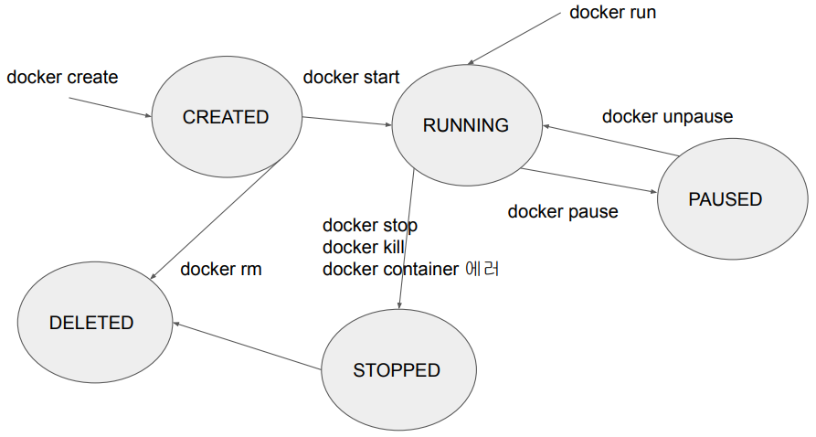
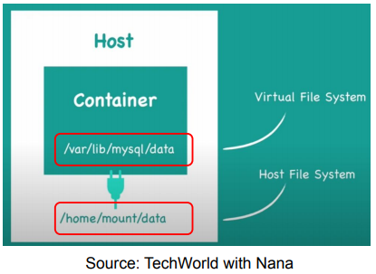

## <u>1. docker-day3-1-Docker 명령 정리와 2장 퀴즈</u>

### 3. Docker Compose 사용해보기 (전반부)

Contents

1. Docker 명령 정리와 2장 퀴즈
2. Docker Volume이란?
3. 다수의 Container로 구성된 소프트웨어 실행
4. Docker-Compose로 다수 Container로 실행해보기
5. Airflow Docker docker-compose.yml 리뷰
6. 숙제

<br>

Docker 명령 정리 - Image 관련

- docker build --platform=linux/amd64 -t jungwoo7476/hangman

- docker images (로컬에 도커 이미지 보기)
- docker image ls

- docker rmi (로컬에 도커 이미지 삭제)
- docker image rm

<br>

Docker 명령 정리 - Docker Hub 관련

- docker login -u 사용자ID -p 사용자PW
- docker pull jungwoo7476/hangman
- docker push jungwoo7476/hangman

<br>

Docker 명령 정리 - Container 관련

- docker create
- docker run --name -p -v 이미지이름
- docker ps
- docker ps -a
- docker ps -q
- docker stop 컨테이너이름 (혹은 컨테이너ID)

- docker start 컨테이너이름 (혹은 컨테이너ID)
- docker restart 컨테이너이름 (혹은 컨테이너ID)
- docker kill 컨테이너이름 (혹은 컨테이너ID)
- docker pause 컨테이너이름 (혹은 컨테이너ID)

- docker unpause 컨테이너이름 (혹은 컨테이너ID)
- docker rm 컨테이너이름 (혹은 컨테이너ID)

<br>

Docker 명령 정리 - Container logs

- docker logs -f 컨테이너이름 (혹은 컨테이너ID)
- docker logs --tail 100 컨테이너이름 (혹은 컨테이너ID)

<br>

Docker 명령 정리 - exec

- docker run --name=hangman jungwoo7476/hangman (처음 실행)
- docker exec hangman cat /etc/hosts (이미 실행)
  127.0.0.1 localhost
  ::1 localhost ip6-localhost ip6-loopback

<br>

Docker 명령 정리 - Container detach & attach

- docker run jungwoo7476/hangman
- docker run -d jungwoo7476/hangman
  a043d40\***\*\*\*\***
- docker attach a043

<br>

Docker Container의 일생


<br>
<br>
<br>

## <u>2. docker-day3-2-Docker Volume이란</u>

### Docker Volume이란?

Docker Volume의 필요성

- Docker Container가 실행되었다가 중단되면 데이터들은 어떻게 될까?
- 특정 소프트웨어가 Docker Container를 통해 일회성으로 동작하는 것이 \
  아니라 계속해서 동작해야 한다면 데이터가 영구적으로 보관되어야함
  - 예) 데이터베이스가 Docker Container안에서 동작한다면?
- 이를 보장하는 기능이 Docker Volumes => **Data Persistence**
- Docker Container내의 가상 파일 시스템과 호스트 시스템의 파일 시스템을 맵핑
  - 예) 호스트 파일 시스템의 /home/jungwoo7476/logs를 Docker Container의 /var/lib/airflow/logs로 맵핑
  - 이 경우 **Docker Container가 중단되더라도 모든 Airflow logs는 기록이 남게 됨**

<br>

Docker Volume 예

- Container와 Host 시스템이 특정 폴더를 공유

  - Container가 사라지더라도 데이터는 남게 하는 것!

    

<br>

Container로 MySQL을 실행하는 경우 데이터가 저장되는 공간을 Docker Volume으로 설정

<br>

**Docker Volume** 정의

- 호스트 파일 시스템 폴더를 Docker Container 파일 시스템의 폴더로 **마운트**하는 것
  - 호스트쪽에서 내용을 바꾸면 바로 Docker Container쪽에도 반영됨
    - 반대도 사실이지만 Volume의 속성을 잡기 나름임 (예를 들면 읽기 전용)
  - 이를 통해 Docker Container의 상태와 관계없이 데이터를 영구적으로 보관
- 파일 시스템에서 마운트란?
  - 원래 마운트란 디스크와 같은 물리적인 장치를 파일 시스템의 특정 위 (폴더)에 연결해주는 것을 말함
  - 예를 들어 윈도우에서 USB를 꼽으면 내 컴퓨터에 새로운 :D 혹은 :E와 \
    같은 식으로 새로운 폴더가 생기는 것이 바로 마운트임

<br>

Docker Volume 타입

1. Host Volumes: docker run -v를 실행할 때 페어로 지정
   - docker run -v /home/keeyong/logs:/var/lib/airflow/logs
   - :앞이 호스트 파일 시스템 패스이고 뒤가 컨테이너 파일 시스템 패스임
2. Anonymous Volumes: docker run -v를 실행할 때 컨테이너 패스만 지정
   - docker run -v /var/lib/mysql/data
   - 이 방식이 Dockerfile에서 사용되는 방식으로 호스트쪽에 액세스되지는 않지만 재시작해도 유지됨
3. Named Volumes: docker run -v를 실행할 때 이름과 컨테이너 패스를 지정
   - docker run -v name:/var/lib/mysql/data
   - 가장 선호되는 방식임. 이 방식이 하나의 Volume을 다수의 \
     컨테이너에서 공유하는 것도 가능하게 해줌
   - 이 포맷으로 뒤에서 살펴볼 docker-compose에서도 사용됨

- Volume을 Readonly로 지정하고 싶다면?
- name:/var/lib/mysql/data:ro

<br>

이미지 생성시 Docker Volume 사용법

1. Dockerfile

- Volume 명령을 통해 anonymous volume만 지정 가능

2. docker-compose

- Host Volume이나 Named Volume

<br>

Docker Volume을 Dockerfile에서 사용한 예 (1)

- nginx를 실행해보자
  - docker run -d --name=nginx -p 8081:80 nginx
  - 브라우저 방문: http://localhost:8081/
  - docker exec --user=root -it nginx sh
    - apt update
    - apt install nano
    - nano /usr/share/nginx/html/index.html (내용 편집: Welcome to Docker Volume)
    - exit
  - docker restart nginx
    - 위의 과정을 반복해 /usr/share/nginx/html/index.html 내용 확인시 원상복구된 것을 볼 수 있음

<br>

Docker Volume을 Dockerfile에서 사용한 예 (2)

- 이번에는 아래 Dockerfile로 이미지를 빌딩

```Dockerfile
FROM nginx:latest
RUN echo "<h1>Hello from Volume</h1>" > /usr/share/nginx/html/index.html
VOLUME /usr/share/nginx/html
```

- docker build -t demo-earthly .
- docker run -p 8081:80 -d --name nginx_demo demo-earthly
- http://localhost:8081/
- docker exec -it --user=root nginx_demo sh
  - apt update;apt install nano
  - nano /usr/share/nginx/html/index.html
  - exit
- docker restart nginx_demo

<br>

Docker Volume을 docker-compose.yml에서 사용한 예

- Airflow 예)
  volumes:
  - **${AIRFLOW_PROJ_DIR:-.}/dags:/opt/airflow/dags**
  - ${AIRFLOW_PROJ_DIR:-.}/logs:/opt/airflow/logs
  - ${AIRFLOW_PROJ_DIR:-.}/plugins:/opt/airflow/plugins

호스트 파일시스템: airflow-setup/dags

MySQL_to_Redshift_v2.py
UpdateSymbol_v3.py
UpdateSymbol.py
…

둘의 내용이
동일해야함

Docker Container 파일시스템: /opt/airflow/dags

```bash
$ docker exec 4f8635eefa02 ls -tl /opt/airflow/dags
```

MySQL_to_Redshift_v2.py
UpdateSymbol_v3.py
UpdateSymbol.py

<br>

Docker Volume 명령들

- docker volume ls
- docker volume rm
- docker volume prune
- docker volume inspect

<br>

데모: 앞서 nginx 두 가지 실행 예 살펴보기

- 이 외에 airflow의 docker-compose.yml 파일도 잠깐 살펴볼 예정

<br>
<br>
<br>

## <u>3. docker-day3-3-Docker Volume이란 데모</u>

### 실습: CLI: Docker compose.yml:

```bash
$ docker run -d --name=nginx -p 8081:80 nginx
# localhost:8081 접속 후 페이지 확인하고
$ docker exec -it --user=root nginx sh
$ apt update
$ apt install nano
$ nano /usr/share/nginx/html/index.html
# 내용 수정 후 저장
$ docker stop nginx
$ docker rm nginx
$ docker run -d --name=nginx -p 8081:80 nginx
$ docker exec -it --user=root nginx sh
$ cat /usr/share/nginx/html/index.html
# nginx\html: index.html, test.html 생성
$ docker run -p 8081:80 --name nginx -v "[로컬 html 폴더]:[docker html 폴더]" nginx
# docker가 이미 실행 중이라면?
# $ docker stop
# $ docker rm

# airflow의 docker-compose.yml
```

<br>
<br>
<br>

## <u>4. docker-day3-4-Docker 환경 클린업</u>

### 다수의 Container로 구성된 소프트웨어 실행

<br>
<br>
<br>
<br>
<br>
<br>

- **Keyword**:

<br>
<br>
<br>
<br>
<br>
<br>
