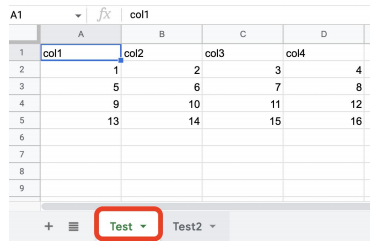

## <u>1. airflowdbt-day2-1-구글시트연동하기(1)</u>

### 구글 시트 연동하기 (1)

Contents

1. ELT 구현
2. Slack 연동하기
3. **구글 시트 연동하기 (1): 시트 => Redshift 테이블**
4. **구글 시트 연동하기 (2): Redshift 테이블 => 시트**
5. **API & Airflow 모니터링**
6. **숙제**

구글 시트를 테이블로 복사하는 예제 개요



<br>

를

<br>

```SQL
CREATE TABLE
pjw7491.spreadsheet_copy_testing (
 col1 int,
 col2 int,
 col3 int,
 col4 int
);
```

<br>

구현 절차들

- 시트 API 활성화하고 구글 서비스 어카운트 생성하고 그 내용을 JSON 파일로 다운로드
- 어카운트에서 생성해준 이메일을 조작하고 싶은 시트에 공유
- Airflow DAG쪽에서 해당 JSON 파일로 인증하고 앞서 시트를 조작

<br>

구글 서비스 어카운트 생성 (1)

- 구글 클라우드 로그인
  - https://console.cloud.google.com/
- 구글 스프레드시트 API 활성화 필요
  - https://console.cloud.google.com/apis/library/sheets.googleapis.com

구글 서비스 어카운트 생성 (2)

- 다음으로 구글 서비스 어카운트 생성 (JSON)
  - 아래 두 문서 중 하나를 참고
    - https://robocorp.com/docs/development-guide/google-sheets/interacting-with-google-sheets
    - https://denisluiz.medium.com/python-with-google-sheets-service-account-step-by-step-8f74c26ed28e
- 이 JSON 파일의 내용을 google_sheet_access_token이란 이름의 Variable로 등록
- 이 JSON 파일을 보면 이메일 주소가 하나 존재
  - 이를 읽고 싶은 구글스프레드시트 파일에 공유. 이 이메일은 iam.gserviceaccount.com로 끝남

<br>
<br>
<br>

## <u>2. airflowdbt-day2-2-데모-구글시트연동하기(1)</u>

### 실습: GCP Web UI: CLI:

```SQL
CREATE TABLE
pjw7491.spreadsheet_copy_testing (
 col1 int,
 col2 int,
 col3 int,
 col4 int
);
```

<br>
<br>
<br>

## <u>3. airflowdbt-day2-3-구글시트연동하기와 데모(2)</u>

### 구글 시트 연동하기 (2)

SQL 결과를 구글 시트로 복사하는 예제 개요

```SQL
SELECT *
FROM analytics.nps_summary
```

<br>

소스 코드 보기

- 소스 코드 보기
  - SQL_to_Sheet.py
  - plugins/gsheet.py의 update_sheet

<br>

데모

- 앞서 데모에서 사용했던 동일한 시트에 새로운 탭을 하나 만듬
  - 이미 필요한 이메일 주소가 해당 시트에 편집자로 공유가 되어 있기에 별도 작업이 필요 없음
- 거기에 “SELECT \* FROM analytics.nps_summary”의 내용을 복사
  - 이 과정을 PythonOperator로 구현
  - 해당 기능은 gsheet 모듈내에 있는 update_sheet라는 함수로 구현했음

<br>

### 실습: GCP Web UI: CLI:

Google Drive API 활성
(airflow)airflow dags test SQL_to_Sheet 2023-06-20
구글 스프레드 시트 확인

<br>
<br>
<br>

## <u>4. airflowdbt-day2-4-Airflow API와 모니터링</u>

### 구글 시트 연동하기 (2)

<br>
<br>
<br>
<br>
<br>
<br>

- **Keyword**:

<br>
<br>
<br>
<br>
<br>
<br>
