## <u>1. airflo>wdbt-day4-1-Airflow운영과 대안</u>

### 3. Airflow 운영과 대안

Contents

1. 프로덕션 사용을 위한 Airflow 환경 설정
2. Airflow 로그 파일 삭제하기
3. Airflow 메타데이터 백업하기
4. Airflow 대안

<br>

프로덕션 사용을 위한 Airflow 환경 설정

Things to Change (1)

- airflow.cfg is in /var/lib/airflow/airflow.cfg
  - Any changes here will be reflected when you restart the **webserver** and **scheduler**
  - [core] 섹션의 dags_folder가 DAG들이 있는 디렉토리가 되어야함
    - /var/lib/airflow/dags
  - dag_dir_list_interval: dags_folder를 Airflow가 얼마나 자주 스캔하는지 명시 (초 단위)
- Airflow Database upgrade (Airflow 설치때 설명)
  - Sqlite -> Postgres or MySQL (이 DB는 주기적으로 백업되어야함)
  - sql_alchemy_conn in Core section of airflow.cfg
- ~~SequentialExecutor 사용~~ (Airflow 설치때 설명)
  - Executor in Core section of airflow.cfg
  - Single Server: from SequentialExecutor to LocalExecutor or CeleryExecutor
    - Cluster: from SequentialExecutor to CeleryExecutor or KubernetesExecutor

<br>

Things to Change (2)

- Enable Authentication & use a strong password
  - In Airflow 2.0, authentication is ON by default
  - 되도록이면 VPN (Virtual Private Network) 뒤에 위치
- Large disk volume for logs and local data
  - Logs -> /dev/airflow/logs in (Core section of airflow.cfg)
    - base_log_folder
    - child_process_log_directory
  - Local data -> /dev/airflow/data
- Periodic Log data cleanup
  - The above folders need to be cleaned up periodically (아니면 S3와 같은 클라우드 스토리지로
    복사)
  - You can write a shell Operator based DAG for this purpose

<br>

Things to Change (3)

- From Scale Up to Scale Out
  - Go for Cloud Airflow options (Cloud Composer or MWAA) or Docker/K8s
- Backup Airflow metadata database
  - Backup variables and connections (command lines or APIs)
    - airflow variables export variables.json
    - airflow connections export connections.json
- Add health-check monitoring
  - https://airflow.apache.org/docs/apache-airflow/stable/logging-monitoring/check-health.html
    - API를 먼저 활성화하고 Health Check Endpoint API를 모니터링 툴과 연동
    - 앞서 설명
  - 어느 정도 규모가 된다면 DataDog, Grafana등을 사용하는 것이 일반적 (DevOps팀과 협업)
  - airflow metadata DB, webserver, scheduler 연동

<br>

GCP’s Cloud Composer Screenshots
Amazon MWAA

- variables, connections 관리를 내부 시스템인 seceret manager 로 관리

Variables: Airflow 변수는 워크플로우 설정 및 관리에 사용되는 키-값 쌍이며, \
Amazon MWAA에서는 이러한 변수를 AWS Secrets Manager에서 보안을 위해 저장할 수 있습니다. \
이를 통해 민감한 데이터를 안전하게 보관하고 환경에 액세스할 수 있는 \
IAM 정책을 사용하여 접근 권한을 제어할 수 있습니다.

<br>

Connections: Airflow 연결 정보(connections)는 외부 시스템(Integrations)과의
상호작용에 필요한 인증 및 설정 정보를 포함합니다. \
AWS Secrets Manager를 사용하여 이러한 연결 정보를 암호화된 상태로 저장하고 안전하게 관리할 수 있습니다. \
이를 통해 연결 정보에 대한 중앙 집중식 관리와 보안이 가능합니다.

1. AWS Secrets Manager에서 새로운 secret 생성합니다.
2. Amazon MWAA 환경을 설정하거나 업데이트할 때, 해당 비밀의 ARN(Amazon Resource Name)을 지정하여 Amazon MWAA에 연결합니다. \
   이렇게 하려면, MWAA 환경의 설정에 Airflow Variable 또는 Airflow Connection으로 secret 추가

<br>

Microsoft Azure: Data Factory

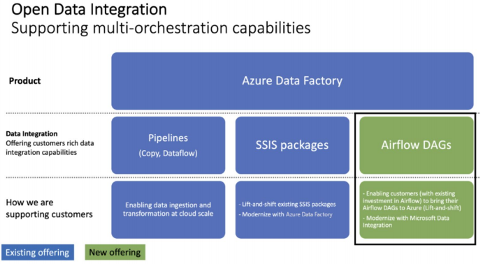

<br>

### Airflow 로그 파일 삭제하기

Airflow 로그 위치

- 두 군데에 별도의 로그가 기록됨. 이를 주기적으로 삭제하거나 백업 (s3) 필요

```yml
[logging]
# The folder where airflow should store its log files
# This path must be absolute
base_log_folder = /var/lib/airflow/logs

[scheduler]
child_process_log_directory = /var/lib/airflow/logs/scheduler
#2개의 log파일
```

<br>

Airflow 로그 위치 - docker compose

- docker compose로 실행된 경우 logs 폴더가 host volume의 형태로 유지
  volumes:
  - ${AIRFLOW_PROJ_DIR:-.}/dags:/opt/airflow/dags
  - **${AIRFLOW_PROJ_DIR:-.}/logs:/opt/airflow/logs**

```bash
learn-airflow $ ls -tl logs(win: Get-ChildItem -Path logs)
```

<br>

Airflow 메타데이터 백업하기

Airflow 메타데이터의 주기적인 백업

- 이 데이터베이스가 외부에 있다면 (특히 AWS RDS라면)
  - 거기에 바로 주기적인 백업 셋업
- Airflow와 같은 서버에 메타 데이터 DB가 있다면 (예를 들어 PostgreSQL)
  - 그러면 DAG등을 이용해 주기 백업 실행 (S3로 저장)
  - Backup_Airflow_Data_to_S3.py

<br>

### Airflow 대안

Airflow 이외의 다른 데이터 파이프라인 프레임웍들

- [Prefect](https://www.prefect.io/opensource/v2/) (Open Source)
- [Dagster](https://dagster.io/) (Open Source)
- [Airbyte](https://airbyte.com/) (Open Source)
- SaaS 형태의 데이터 통합 툴들
  - FiveTran
  - Stitch Data
  - Segment

<br>
<br>
<br>

## <u>2. airflowdbt-day4-2-dbt-db-normalization</u>

### 4. dbt (Data Build Tool)

Contents

1. ELT의 미래는?
2. Database Normalization
3. dbt 소개
4. dbt 사용 시나리오
5. dbt 설치와 환경 설정
6. dbt Models: Input
7. dbt Models: Output
8. dbt Seeds
9. dbt Sources
10. dbt Snapshots
11. dbt Tests
12. dbt Documentation
13. dbt Expectations
14. 마무리

<br>

### ELT의 미래는?

- 데이터 품질의 중요성 증대
  - 입출력 체크
  - 더 다양한 품질 검사
  - 리니지 체크
  - 데이터 히스토리 파악
  - 데이터 품질 유지 -> 비용/노력 감소와 생산성 증대의 지름길

<br>

### Database Normalization

Data Maturity Model and Reality

AI & ML \
BI & Analytics \
--여기를 경계로 큰 갭이 존재-- \
Data Integration \
Data Wrangling \
Data Collection

<br>

Database Normalization

- 데이터베이스를 좀더 조직적이고 일관된 방법으로 디자인하려는 방법
  - 데이터베이스 정합성을 쉽게 유지하고 레코드들을 수정/적재/삭제를 용이하게 하는 것
- Normalization에 사용되는 개념

  - Primary Key
  - Composite Key
  - Foreign Key

    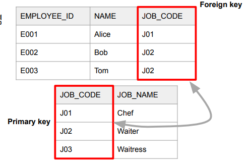

<br>

1NF (First Normal Form)

- 한 셀에는 하나의 값만 있어야함 (atomicity)
- Primary Key가 있어야함
- 중복된 키나 레코드들이 없어야함

**목표는 중복을 제거하고 atomicity를 갖는 것**

- 1NF (First Normal Form) 예제

  - Employee 테이블

    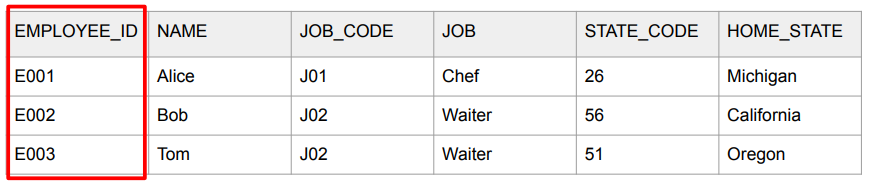

<br>

2NF (Second Normal Form)

- 일단 1NF를 만족해야함
- 다음으로 Primary Key를 중심으로 의존결과를 알 수 있어야함
- 부분적인 의존도가 없어야함
  - 즉 모든 부가 속성들은 Primary key를 가지고 찾을 수 있어야함
  - That is, all non-key attributes are fully dependent on a primary key

**목표는 중복을 제거하고 atomicity를 갖는 것**

- 2NF (Second Normal Form) - 예제

  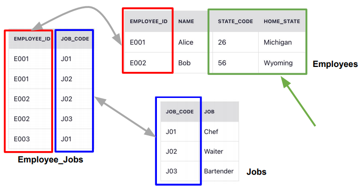

<br>

3NF (Third Normal Form)

- 일단 2NF를 만족해야함
- 전이적 부분 종속성을 없어야함

  - 2NF의 예에서 state_code과 home_state가 같이 Employees 테이블에 존재

    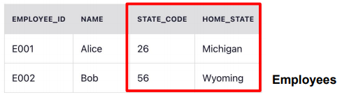

- 3NF (Third Normal Form) - 예제

  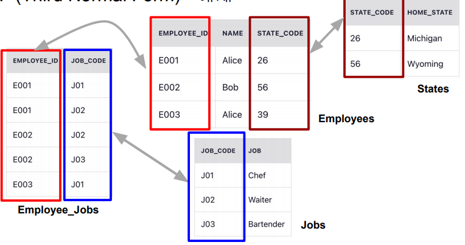

<br>

- Slowly Changing Dimensions (1)
  - DW나 DL에서는 모든 테이블들의 히스토리를 유지하는 것이 중요함
    - 보통 두 개의 timestamp 필드를 갖는 것이 좋음
      - created_at (생성시간으로 한번 만들어지면 고정됨)
      - updated_at (꼭 필요 마지막 수정 시간을 나타냄)
- 이 경우 컬럼의 성격에 따라 어떻게 유지할지 방법이 달라짐
  - SCD Type 0
  - SCD Type 1
  - **SCD Type 2**
  - SCD Type 3
  - SCD Type 4

<br>

- Slowly Changing Dimensions (2)

  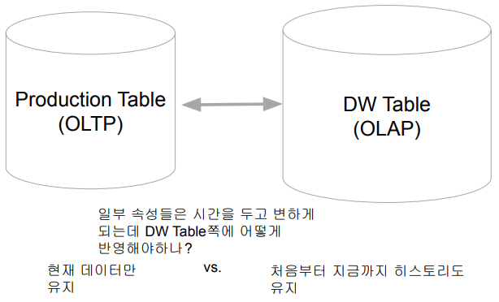

<br>

- SCD Type 0
  - 한번 쓰고 나면 바꿀 이유가 없는 경우들
  - 한번 정해지면 갱신되지 않고 고정되는 필드들
  - 예) 고객 테이블이라면 회원 등록일, 제품 첫 구매일

<br>

- SCD Type 1
- 데이터가 새로 생기면 덮어쓰면 되는 컬럼들
- 처음 레코드 생성시에는 존재하지 않았지만 나중에 생기면서 채우는 경우
- 예) 고객 테이블이라면 연간소득 필드

<br>

- SCD Type 2

  - 특정 entity에 대한 데이터가 새로운 레코드로 추가되어야 하는 경우
  - 예) 고객 테이블에서 고객의 등급 변화

    - tier라는 컬럼의 값이 “regular”에서 “vip”로 변화하는 경우
    - 변경시간도 같이 추가되어야함

      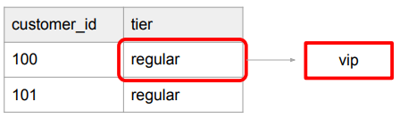

<br>

- SCD Type 3
  - SCD Type 2의 대안으로 특정 entity 데이터가 새로운 컬럼으로 추가되는 경우
  - 예) 고객 테이블에서 tier라는 컬럼의 값이 “regular”에서 “vip”로 변화하는 경우
    - previous_tier라는 컬럼 생성
    - 변경시간도 별도 컬럼으로 존재해야함

<br>

- SCD Type 4
  - 특정 entity에 대한 데이터를 새로운 Dimension 테이블에 저장하는 경우
  - SCD Type 2의 변종
  - 예) 별도의 테이블로 저장하고 이 경우 아예 일반화할 수도 있음

<br>
<br>
<br>

## <u>3. airflowdbt-day4-3-dbt 사용시나리오</u>

### dbt 소개

- dbt란 무엇인가?
  - Data Build Tool (https://www.getdbt.com/)
    - ELT용 오픈소스: In-warehouse data transformation
    - dbt Labs라는 회사가 상용화 ($4.2B valuation)
    - Analytics Engineer라는 말을 만들어냄
  - 다양한 데이터 웨어하우스를 지원
    - Redshift, Snowflake, Bigquery, Spark
  - 클라우드 버전도 존재
    - dbt Cloud

<br>

- dbt가 서포트해주는 데이터 시스템
  - BigQuery
  - Redshift
  - Snowflake
  - Spark
  - …

<br>

- dbt 구성 컴포넌트

  - 데이터 모델 (models)
    - 테이블들을 몇개의 티어로 관리
      - 일종의 CTAS (SELECT 문들), Lineage 트래킹
    - Table, View, CTE 등등
  - 데이터 품질 검증 (tests)
  - 스냅샷 (snapshots)

    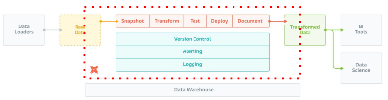

<br>

### dbt 사용 시나리오

- 다음과 같은 요구조건을 달성해야한다면?
  - 데이터 변경 사항을 이해하기 쉽고 필요하다면 롤백 가능
  - 데이터간 리니지 확인 가능
  - 데이터 품질 테스트 및 에러 보고
  - Fact 테이블의 증분 로드 (Incremental Update)
  - Dimension 테이블 변경 추적 (히스토리 테이블)
  - 용이한 문서 작성

<br>

- 보통 사용하는 테크 스택

  - Redshift/Spark/Snowflake/BigQuery
  - dbt
  - Airflow

    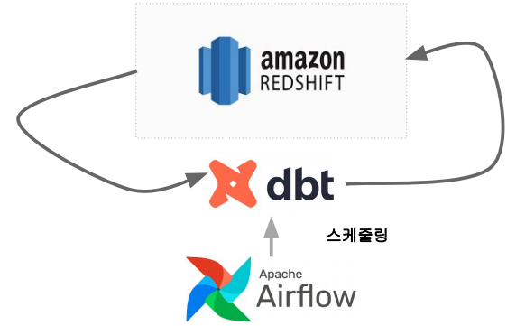

<br>

- 무슨 ELT 작업을 해볼까요?
  - Redshift 사용
  - AB 테스트 분석을 쉽게 하기 위한 ELT 테이블을 만들어보자
  - 입력 테이블:
    - user_event, user_variant, user_metadata
  - 생성 테이블: Variant별 사용자별 일별 요약 테이블
    - variant_id, user_id, datestamp, age, gender,
    - 총 impression, 총 click, 총 purchase, 총 revenue

<br>

- 입력 데이터들
  - Production DB에 저장되는 정보들을 Data Warehouse로 적재했다고 가정
  - raw_data.user_event
    - 사용자/날짜/아이템별로 impression이 있는 경우 그 정보를 기록하고 \
      impression으로부터 클릭, 구매, 구매시 금액을 기록. 실제 환경에서는 이런 aggregate 정보를 \
      로그 파일등의 소스 (하나 이상의 소스가 될 수도 있음) 로부터 만들어내는 프로세스가 필요함
  - raw_data.user_variant
    - 사용자가 소속한 AB test variant를 기록한 파일 (control vs. test)
  - raw_data.user_metadata
    - 사용자에 관한 메타 정보가 기록된 파일 (성별, 나이 등등)

<br>

- 입력데이터: raw_data.user_event

```SQL
CREATE TABLE raw_data.user_event (
  user_id int, --------+
  datestamp timestamp, -- 사용자별/날짜별/아이템별
  item_id int, --------+
  clicked int, -----+
  purchased int,    -- impression/clicked/purchase/paidamount 요약
  paidamount int ---+
);
```

<br>

- 입력데이터: raw_data.user_variant

```SQL
CREATE TABLE raw_data.user_variant (
 user_id int,
 variant_id varchar(32) -- control vs. test
);
```

- 보통은 experiment와 variant 테이블이 별도로 존재함
- 그리고 위의 테이블에도 언제 variant_id로 소속되었는지 타임스탬프 필드가 존재하는 것이 일반적

<br>

- 입력데이터: raw_data.user_metadata

```SQL
CREATE TABLE raw_data.user_metadata (
 user_id int,
 age varchar(16),
 gender varchar(16)
); -- 사용자별 메타정보: 이를 이용해 다양한 각도에서
   --AB 테스트 결과를 분석해볼 수 있음
```

<br>

- Fact 테이블과 Dimension 테이블
  - Fact 테이블: 분석의 초점이 되는 양적 정보를 포함하는 중앙 테이블
    - 일반적으로 매출 수익, 판매량, 이익과 같은 측정 항목 포함. 비즈니스 결정에 사용
    - Fact 테이블은 일반적으로 외래 키를 통해 여러 Dimension 테이블과 연결됨
    - 보통 Fact 테이블의 크기가 훨씬 더 큼
  - Dimension 테이블: Fact 테이블에 대한 상세 정보를 제공하는 테이블
    - 고객, 제품과 같은 테이블로 Fact 테이블에 대한 상세 정보 제공
    - Fact 테이블의 데이터에 맥락을 제공하여 다양한 방식으로 분석 가능하게 해줌
    - Dimension 테이블은 primary key를 가지며, fact 테이블에서 참조 (foreign key)
    - 보통 Dimension 테이블의 크기는 훨씬 더 작음

<br>

- 입력 데이터 요약

  - user_event, user_variant, user_metadata

    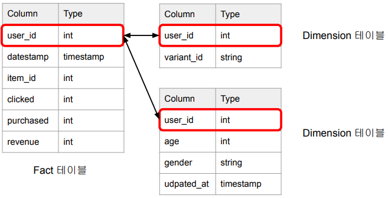

<br>

- 최종 생성 데이터 (ELT 테이블)
  - SELECT로 표현하면 아래와 같음

```SQL
SELECT
  variant_id,
  ue.user_id,
  datestamp,
  age,
  gender,
  COUNT(DISTINCT item_id) num_of_items, -- 총 impression
  COUNT(DISTINCT CASE WHEN clicked THEN item_id END) num_of_clicks, -- 총 click
  SUM(purchased) num_of_purchases, -- 총 purchase
  SUM(paidamount) revenue -- 총 revenue
FROM raw_data.user_event ue
JOIN raw_data.user_variant uv ON ue.user_id = uv.user_id
JOIN raw_data.user_metadata um ON uv.user_id = um.user_id
GROUP by 1, 2, 3, 4, 5;
```

<br>
<br>
<br>

## <u>4. airflowdbt-day4-4-dbt 설치와 환경 설정</u>

### dbt 설치와 환경 설정

- dbt 사용절차
  - dbt 설치
    - dbt Cloud vs. dbt Core
    - git을 보통 사용함
  - dbt 환경설정
  - Connector 설정
    - Connector가 바로 바탕이 되는 데이터 시스템 (Redshift, Spark, …)
  - 데이터 모델링 (tier)
    - Raw Data -> Staging -> Core
  - 테스트 코드 작성
  - (필요하다면) Snapshot 설정

<br>

- dbt 설치 옵션
  - Cloud 버전: dbt Cloud
  - 로컬 개발 버전: dbt Core

<br>

- dbt 설치: 로컬 버전으로 진행 (1.4.3)
  - pip3 install dbt-redshift
    - 위의 명령은 dbt-core 모듈도 설치해줌
    - 환경에 맞는 dbt connector를 설치: Redshift, BigQuery, Snowflake,

<br>

### 실습: CLI:

```bash
# 가상환경 셋팅
$ python -m venv venv
$ pip3 install dbt-redshift
$ .\venv\Scripts\Activate.ps1
$ python -m pip install --upgrade pip
$ pip install dbt-redshift
$ dbt --version
################################################
################################################
# windows 가상 환경 python 버전 설정
$ py -3.8 -m venv new-venv
$ new-venv\Scripts\activate
$ python -m pip install --upgrade pip
$ pip install dbt-redshift
$ dbt --version
$ dbt init learn_dbt
# (windows) user/.dbt/profile.yml에서 수정
# redshift, host, port, user, password, dbname, schema, threads
```

<br>

- dbt 파일과 폴더 설명
  - dbt_project.yml: 메인 환경 설정 파일
  - models
  - seeds
  - tests
  - snapshots
  - macros
  - analyses
  - README.md

<br>

- dbt_project.yml

```yml
name: "learn_dbt"
version: "1.0.0"
config-version: 2

profile: "learn_dbt" # ~/.dbt/profiles.yml 안에 존재해야함

model-paths: ["models"]
analysis-paths: ["analyses"]
test-paths: ["tests"]
seed-paths: ["seeds"]
macro-paths: ["macros"]
snapshot-paths: ["snapshots"]

target-path:
  "target" # folder to store compiled SQL files
  # 중간 결과들이 저장되는 폴더
clean-targets: # directories to be removed by `dbt clean`
  - "target"
  - "dbt_packages"
models:
  learn_dbt:
    example: #이 두 라인은 삭제 그리고 models
      +materialized: view # 폴더에 있는 example 서브폴더 삭제
```

<br>
<br>
<br>

## <u>5. airflowdbt-day4-5-dbt Input</u>

### dbt Models: Input

- Model이란?
  - ELT 테이블을 만듬에 있어 기본이 되는 빌딩블록
    - 테이블이나 뷰나 CTE의 형태로 존재
  - 입력,중간,최종 테이블을 정의하는 곳
    - 티어 (raw, staging, core, …)
    - raw => staging (src) => core

<br>

- 잠깐: View란 무엇인가?
  - SELECT 결과를 기반으로 만들어진 가상 테이블
    - 기존 테이블의 일부 혹은 여러 테이블들을 조인한 결과를 제공함
    - CREATE VIEW 이름 AS SELECT …
  - View의 장점
    - 데이터의 추상화: 사용자는 View를 통해 필요 데이터에 직접 접근. 원본 데이터를 알 필요가 없음
    - 데이터 보안: View를 통해 사용자에게 필요한 데이터만 제공. 원본 데이터 접근 불필요
    - 복잡한 쿼리의 간소화: SQL(View)를 사용하면 복잡한 쿼리를 단순화.
  - View의 단점
    - 매번 쿼리가 실행되므로 시간이 걸릴 수 있음
    - 원본 데이터의 변경을 모르면 실행이 실패함

<br>

- 잠깐: CTE (Common Table Expression)

```sql
WITH temp1 AS (
  SELECT k1, k2
  FROM t1
  JOIN t2 ON t1.id = t2.foreign_id
), temp2 AS (
…
)
SELECT *
FROM temp1 t1
JOIN temp2 t2 ON …
-- 마치 피지컬 한 테이블처럼 사용 가능함
```

<br>

- Model 구성 요소
  - Input
    - 입력(raw)과 중간(staging, src) 데이터 정의
    - raw는 CTE로 정의
    - staging은 View로 정의
  - Output
    - 최종(core) 데이터 정의
    - core는 Table로 정의
  - 이 모두는 models 폴더 밑에 sql 파일로 존재
    - 기본적으로는 SELECT + Jinja 템플릿과 매크로
    - 다른 테이블들을 사용 가능 (reference)
      - 이를 통해 리니지 파악

<br>

- 데이터 빌딩 프로세스

  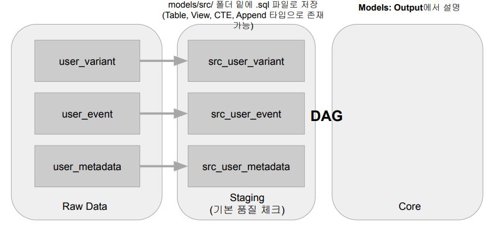

<br>

- models/src - src_user_event.sql

```sql
WITH src_user_event AS (
  SELECT * FROM raw_data.user_event
)
SELECT
  user_id,
  datestamp,
  item_id,
  clicked,
  purchased,
  paidamount
FROM
  src_user_event
```

<br>

- models/src - src_user_variant.sql

```sql
WITH src_user_variant AS (
  SELECT * FROM raw_data.user_variant
)
SELECT
  user_id,
  variant_id
FROM
  src_user_variant
```

<br>

- models/src - src_user_metadata.sql

```sql
WITH src_user_metadata AS (
  SELECT * FROM raw_data.user_metadata
)
SELECT
  user_id,
  age,
  gender,
  updated_at
FROM
  src_user_metadata
```

<br>

- Model 빌딩: dbt run

```bash
...
Found 3 models, 0 tests, 0 snapshots, 0 analyses, 327 macros, 0 operations, 0 seed files, 0 sources, 0 exposures, 0 metrics
...
```

<br>

- Model 빌딩 확인
  - 해당 스키마 밑에 테이블 생성 여부 확인
  - dbt run은 프로젝트 구성 다양한 SQL 실행
    - 이 SQL들은 DAG로 구성됨
  - dbt run은 보통 다른 더 큰 명령의 일부로 실행
    - dbt test
    - dbt docs generate

<br>
<br>
<br>

## <u>6. airflowdbt-day4-6-dbt Output</u>

### dbt Models: Output

- Materialization이란?
  - 입력 데이터(테이블)들을 연결해서 새로운 데이터(테이블) 생성하는 것
    - 보통 여기서 추가 transformation이나 데이터 클린업 수행
  - 4가지의 내장 materialization이 제공됨
  - 파일이나 프로젝트 레벨에서 가능
  - 역시 dbt run을 기타 파라미터를 가지고 실행

<br>

- 4가지의 Materialization 종류
  - View
    - 데이터를 자주 사용하지 않는 경우
  - Table
    - 데이터를 반복해서 자주 사용하는 경우
  - Incremental (Table Appends)
    - Fact 테이블
    - 과거 레코드를 수정할 필요가 없는 경우
  - Ephemeral (CTE)
    - 한 SELECT에서 자주 사용되는 데이터를 모듈화하는데 사용

<br>

- 데이터 빌딩 프로세스

  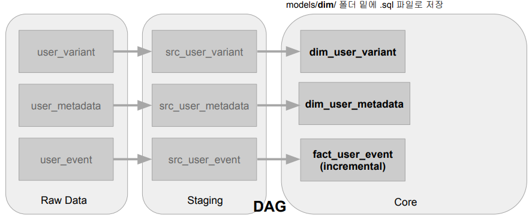

<br>

- 잠깐 Jinja 템플릿이란?
  - 파이썬이 제공해주는 템플릿 엔진으로 Flask에서 많이 사용
    - Airflow에서도 사용함
  - 입력 파라미터 기준으로 HTML 페이지(마크업)를 동적으로 생성
  - 조건문, 루프, 필터등을 제공

<br>

- models 밑에 core 테이블들을 위한 폴더 생성
- dim 폴더와 fact 폴더 생성
  - dim 밑에 각각 dim_user_variant.sql과 dim_user_metadata.sql 생성
  - fact 밑에 fact_user_event.sql 생성
- 이 모두를 physical table로 생성

<br>

- models/dim - dim_user_variant.sql
  - Jinja 템플릿과 ref 태그를 사용해서 dbt 내 다른 테이블들을 액세스

```sql
WITH src_user_variant AS (
  SELECT * FROM {{ ref('src_user_variant') }}
)
SELECT
  user_id,
  variant_id
FROM
  src_user_variant
```

<br>

- models/dim - dim_user_metadata.sql
  - 설정에 따라 view/table/CTE 등으로 만들어져서 사용됨
    - materialized라는 키워드로 설정

```sql
WITH src_user_metadata AS (
    SELECT * FROM {{ ref('src_user_metadata') }}
)
SELECT
    user_id,
    age,
    gender,
    updated_at
FROM
    src_user_metadata
```

<br>

- models/fact - fact_user_event.sql
  - Incremental Table로 빌드 (materialized = ['incremental'](https://iomete.com/docs/guides/dbt/dbt-incremental-models-by-examples))

```sql
{{
 config(
 materialized = 'incremental',
 on_schema_change='fail'
 )
}}
-- incremental_strategy도 사용가능
--   - append
--   - merge
--   - insert_overwrite
-- 이 경우 unique_key와 merge_update_columns 필드를 사용하기도 함

-- 스키마가 바뀐 경우 대응 방법 지정
--   - append_new_columns
--   - ignore
--   - sync_all_columns
--   - fail


WITH src_user_event AS (
    SELECT * FROM {{ ref("src_user_event") }}
)
SELECT
    user_id,
    datestamp,
    item_id,
    clicked,
    purchased,
    paidamount
FROM
    src_user_event
```

<br>

- 다음으로 model의 materialized format 결정
  - 최종 Core 테이블들은 view가 아닌 table로 빌드
  - dbt_project.yml을 편집

```yml
models:
  learn_dbt:
    example:
      +materialized: view
# example 폴더 밑에 있는 테이블들은 모두 view로 빌드

# 수정

models:
  learn_dbt:
    +materialized: view # 이 프로젝트의 테이블들은 기본적으로 view로 빌드
    dim:
      +materialized: table
# dim 폴더 밑에 있는 테이블들은 모두 table로 빌드
```

<br>

- Model 빌딩: dbt run (dbt compile도 있음)

- dbt compile vs. dbt run
  - dbt compile은 SQL 코드까지만 생성하고 실행하지는 않음
  - dbt run은 생성된 코드를 실제 실행함

<br>

- Model 빌딩 확인
  - 해당 스키마 밑에 테이블 생성 여부 확인
  - Core 테이블들은 Table
  - Staging 테이블들은 View

<br>

- models/fact - fact_user_event.sql
  - WHERE 조건 붙이기

```sql
{{
 config(
 materialized = 'incremental',
 on_schema_change='fail'
 )
}}
WITH src_user_event AS (
  SELECT * FROM {{ ref("src_user_event") }}
)
SELECT
    user_id,
    datestamp,
    item_id,
    clicked,
    purchased,
    paidamount
FROM
  src_user_event

  -- 조건 붙이기
WHERE datestamp is not NULL

    AND datestamp > (SELECT max(datestamp) from {{ this }})


```

<br>

raw_data.user_event에 새 레코드 추가후 dbt run 수행

- 적당한 Redshift 클라이언트 툴에서 아래 수행

```sql
INSERT INTO raw_data.user_event VALUES (100, '2023-06-10', 100, 1, 0, 0);
```

- 다음으로 dbt run을 수행
- compiled SQL을 확인해서 정말 Incremental하게 업데이트되었는지 확인
- 최종적으로 Redshift 클라이언트 툴에서 다시 확인

```sql
SELECT * FROM pjw7491.fact_user_event WHERE datestamp = '2023-06-10';
```

<br>

- Model 빌딩: Compile 결과확인
  - learn_dbt/target/compiled/learn_dbt/models/fact
    - fact_user_event.sql의 내용은 아래와 같음

```sql
WITH src_user_event AS (
  SELECT * FROM "dev"."pjw7491"."src_user_event"
)
SELECT
  user_id,
  datestamp,
  item_id,
  clicked,
  purchased,
  paidamount
FROM
  src_user_event
WHERE datestamp is not NULL
  AND datestamp > (SELECT max(datestamp) from "dev"."pjw7491"."fact_user_event")
```

<br>

src 테이블들을 CTE로 변환해보기

- src 테이블들을 굳이 빌드할 필요가 있나?
- dbt_project.yml 편집

```sql
models:
  learn_dbt:
    # Config indicated by + and applies to all files under models
    +materialized: view
    dim:
      +materialized: table
    src:
      +materialized: ephemeral
```

- src 테이블들 (View) 삭제

```sql
DROP VIEW pjw7491.src_user_event;
DROP VIEW pjw7491.src_user_metadata;
DROP VIEW pjw7491.src_user_variant
```

- dbt run 실행
  - 이제 SRC 테이블들은 CTE 형태로 임베드되어서 빌드됨

<br>

- Model 빌딩: dbt run (dbt compile도 있음)
  - src 테이블 빌드와 관련된 부분들이 빠져있음

<br>

- 데이터 빌딩 프로세스

  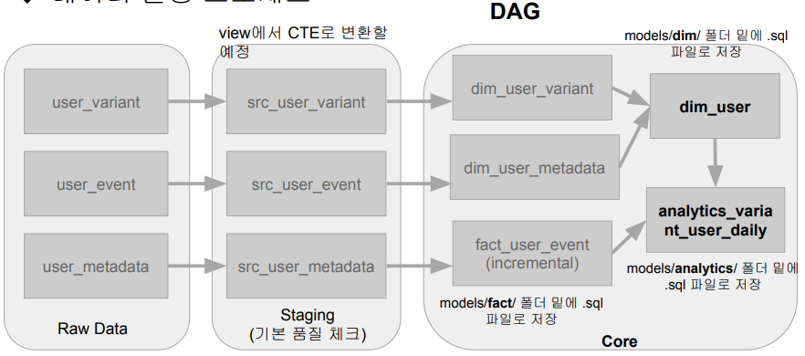

<br>

- models/dim - dim_user.sql
- dim_user_variant와 dim_user_metadata를 조인

```sql
WITH um AS (
    SELECT * FROM {{ ref("dim_user_metadata") }}
), uv AS (
    SELECT * FROM {{ ref("dim_user_variant") }}
)
SELECT
    uv.user_id,
    uv.variant_id,
    um.age,
    um.gender
FROM uv
LEFT JOIN um ON uv.user_id = um.user_id
```

<br>

- models/analytics - analytics_variant_user_daily.sql
  - dim_user와 fact_user_event를 조인 - analytics 폴더를 models 밑에 생성

```sql
WITH u AS (
    SELECT * FROM {{ ref("dim_user") }}
), ue AS (
    SELECT * FROM {{ ref("fact_user_event") }}
)
SELECT
    variant_id,
    ue.user_id,
    datestamp,
    age,
    gender,
    COUNT(DISTINCT item_id) num_of_items, -- 총 impression
    COUNT(DISTINCT CASE WHEN clicked THEN item_id END) num_of_clicks, -- 총 click
    SUM(purchased) num_of_purchases, -- 총 purchase
    SUM(paidamount) revenue -- 총 revenue
FROM ue LEFT JOIN u ON ue.user_id = u.user_id
GROUP by 1, 2, 3, 4, 5
```

<br>

- Model 빌딩: dbt run
  - 최종 테이블까지 생성

<br>
<br>
<br>

## <u>7. airflowdbt-day4-7-데모 input-output</u>

### 데모: dbt Models: Input & Output

```bash
$ cd .\learn_dbt\
$ vi .\dbt_project.yml
# models:
#   learn_dbt:
#     example: # 삭제
#       +materialized: view # 삭제
$ Remove-Item -Path example -Recurse(macOS: rm -rf example)
# example 폴더 삭제
$ New-Item -ItemType Directory -Name "src"(macOS: mkdir src)
$ cd src
$ vi src_user_event.sql
$ vi src_user_variant.sql
$ vi src_user_metadata.sql
\learn_dbt $ dbt run
$ cd .\models\
$ New-Item -ItemType Directory -Name "dim"
$ New-Item -ItemType Directory -Name "fact"
$ vi dim/dim_user_variant.sql
$ vi dim/dim_user_metadata.sql
$ vi fact/fact_user_event.sql
$ vi .\dbt_project.yml
  ...
  models:
    learn_dbt:
      # Config indicated by + and applies to all files under models/example/
      +materialized: view # learn_dbt 모두 view table
      dim:
        +materialized: table # dim 하위는 Physical table
$ dbt compile
# models: 6
# staging: 3 + dim: 2, fact: 1
$ dbt run
# table 생성
$ vi models/fact/fact_user_event.sql
  ...
  FROM
      src_user_event
  WHERE datestamp is not NULL
  
      AND datestamp > (SELECT max(datestamp) from {{ this }})
  
$ dbt run
$ insert into raw_data.user_event values (100, '2023-06-10', 100, 1, 0, 0)
# 권한 없음 테스트만 확인
$ cd target
$ cd compiled
$ cd learn_dbt
$ cd models
$ cd fact
$ cat .\fact_user_event.sql
$ cd target
$ cd run
$ cd .\learn_dbt\
$ cd .\models\
$ cd .\models\fact
$ cat .\fact_user_event.sql
##
$ vi .\dbt_project.yml
    ...
    dim:
      +materialized: table
    src:
      +materialized: ephemeral
# 하고 테이블 드랍
# DROP VIEW keeyong.src_user_event;
# DROP VIEW keeyong.src_user_metadata;
# DROP VIEW keeyong.src_user_variant
$ dbt run
$ cd .\target\compiled\learn_dbt\models\dim
$ vim .\dim_user_variant.sql # 최종 sql문 확인

$ cd models
$ vi .\dim\dim_user.sql
$ vi .\analytics\analytics_variant_user_daily.sql
$
$
$
$
$
$
$
$
$


```

<br>
<br>
<br>
<br>
<br>
<br>

- **Keyword**:

<br>
<br>
<br>
<br>
<br>
<br>
