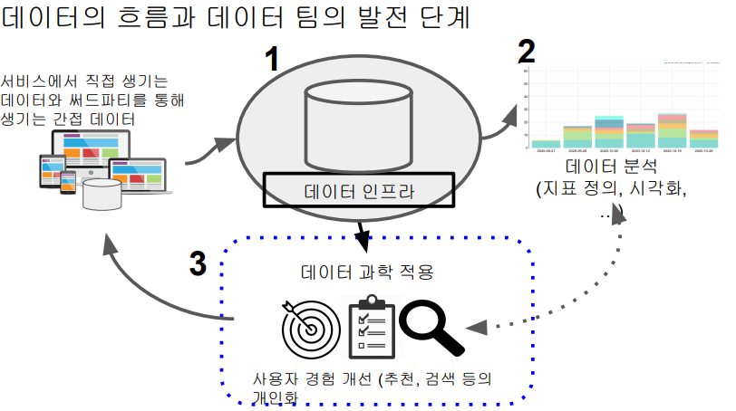
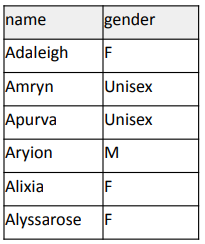
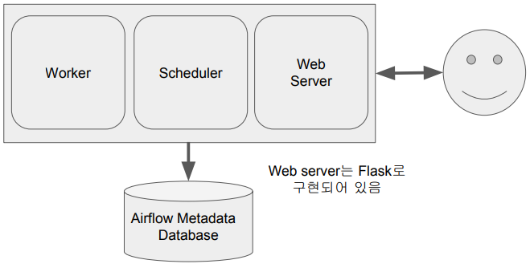
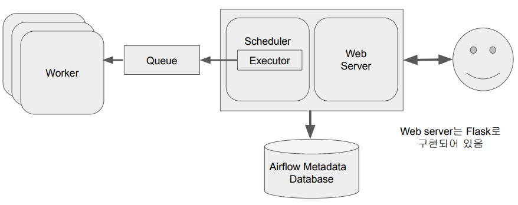
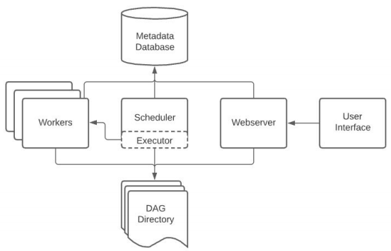
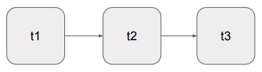
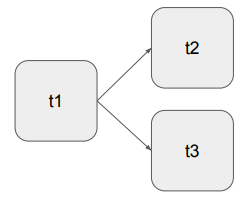

## <u>1. airflow-day1-1</u>

- 데이터 파이프라인과 Airflow 소개

- Contents

1. 데이터 파이프라인 소개
2. Airflow 소개
3. Airflow 설치
4. Airflow 프로그램 구조
5. Airflow Backfill 이해하기
6. Airflow DAG 작성 - Hello World!
7. Airflow DAG 작성 - MySQL, API, ELT
8. Airflow 고급 기능
9. 기타 Airflow DAG 예제 살펴보기
10. Airflow 운영

- ETL 소개

  - 데이터의 흐름과 데이터 팀의 발전 단계

    

- 데이터 소스( \
   MySQL (프로덕션DB),\
   Stripe (신용카드 데이터), \
   Mailchimp (이메일), \
   Zendesk (서포트 티켓), \
   Amplitude (유저 데이터), \
   RingCentral (콜 데이터), \
   Salesforce (세일즈 데이터), \
  ) [**다수의 ETL**]

- 데이터 인프라( \
  Airflow,
  데이터 웨어하우스,
  요약 테이블 만들기)

- 대시보드

<br>
<br>
<br>

## <u>2. airflow-day1-2</u>

### 용어 설명: ETL

- ETL: Extract, Transform and Load
- Data Pipeline, ETL, Data Workflow, DAG
  - ETL (Extract, Transform, and Load)
  - Called DAG (Directed Acyclic Graph) in Airflow

<br>

### 용어 설명: ELT

- ETL vs ELT
  - ETL: 데이터를 데이터 웨어하우스 외부에서 내부로 가져오는 프로세스
    - 보통 데이터 엔지니어들이 수행함
  - ELT: 데이터 웨어하우스 내부 데이터를 조작해서 (보통은 좀더 추상화되고 요약된) 새로운 데이터를 만드는 프로세스
    - 보통 데이터 분석가들이 많이 수행
    - 이 경우 데이터 레이크 위에서 이런 작업들이 벌어지기도 함
    - 이런 프로세스 전용 기술들이 있으며 dbt가 가장 유명: Analytics Engineering
      - dbt: Data Build Tool

<br>

### 용어 설명: Data Lake vs. Data Warehouse

- 데이터 레이크 (Data Lake)
  - 구조화 데이터 + 비구조화 데이터
  - 보존 기한이 없는 모든 데이터를 원래 형태대로 보존하는 스토리지에 가까움
  - 보통은 데이터 웨어하우스보다 몇배는 더 큰 스토리지
- 데이터 웨어하우스 (Data Warehouse)
  - 보존 기한이 있는 구조화된 데이터를 저장하고 처리하는 스토리지
  - 보통 BI 툴들(룩커, 태블로, 수퍼셋, …)은 데이터 웨어하우스를 백엔드로 사용함

<br>

### Data Pipeline의 정의

- 데이터를 소스로부터 목적지로 복사하는 작업
  - 이 작업은 보통 코딩 (파이썬 혹은 스칼라) 혹은 SQL을 통해 이뤄짐
  - 대부분의 경우 목적지는 데이터 웨어하우스가 됨
- 데이터 소스의 예:
  - Click stream, call data, ads performance data, transactions, sensor data, metadata, …
  - More concrete examples: production databases, log files, API, stream data (Kafka topic)
- 데이터 목적지의 예:
  - 데이터 웨어하우스, 캐시 시스템 (Redis, Memcache), 프로덕션 데이터베이스, NoSQL, S3, ...

<br>

### 데이터 파이프라인의 종류 (1)

Raw Data ETL Jobs

1. 외부와 내부 데이터 소스에서 데이터를 읽어다가 (많은 경우 API를 통하게 됨)
2. 적당한 데이터 포맷 변환 후 (데이터의 크기가 커지면 Spark등이 필요해짐)
3. 데이터 웨어하우스 로드

이 작업은 보통 데이터 엔지니어가 함

<br>

### 데이터 파이프라인의 종류 (2)

Summary/Report Jobs

1. DW(혹은 DL)로부터 데이터를 읽어 다시 DW에 쓰는 ETL
2. Raw Data를 읽어서 일종의 리포트 형태나 써머리 형태의 테이블을 다시 만드는 용도
3. 특수한 형태로는 AB 테스트 결과를 분석하는 데이터 파이프라인도 존재 \

- 요약:
  테이블의 경우 SQL (CTAS를 통해)만으로 만들고 이는 데이터 분석가가 하는 \
  것이 맞음. 데이터 엔지니어 관점에서는 어떻게 데이터 분석가들이 편하게 할 수 \
  있는 환경을 만들어 주느냐가 관건

-> Analytics Engineer (DBT)

### 데이터 파이프라인의 종류 (3)

Production Data Jobs

1. DW로부터 데이터를 읽어 다른 Storage(많은 경우 프로덕션 환경)로 쓰는 ETL
   a. 써머리 정보가 프로덕션 환경에서 성능 이유로 필요한 경우
   b. 혹은 머신러닝 모델에서 필요한 피쳐들을 미리 계산해두는 경우
2. 이 경우 흔한 타켓 스토리지:
   a. Cassandra/HBase/DynamoDB와 같은 NoSQL
   b. MySQL과 같은 관계형 데이터베이스 (OLTP)
   c. Redis/Memcache와 같은 캐시
   d. ElasticSearch와 같은 검색엔진

<br>
<br>
<br>

## <u>3. airflow-Day1-3</u>

### 데이터 파이프라인을 만들 때 고려할 점

- 이상과 현실간의 괴리
- 이상 혹은 환상
  - 내가 만든 데이터 파이프라인은 문제 없이 동작할 것이다
  - 내가 만든 데이터 파이프라인을 관리하는 것은 어렵지 않을 것이다
- 현실 혹은 실상
  - 데이터 파이프라인은 많은 이유로 실패함
    - 버그 :)
    - 데이터 소스상의 이슈: What if data sources are not available or change its data format
    - 데이터 파이프라인들간의 의존도에 이해도 부족
    - 데이터 파이프라인의 수가 늘어나면 유지보수 비용이 기하급수적으로 늘어남
  - 데이터 소스간의 의존도가 생기면서 이는 더 복잡해짐. 만일 마케팅 채널 정보가
    - 데이트가 안된다면 마케팅 관련 다른 모든 정보들이 갱신되지 않음
    - More tables needs to be managed (source of truth, search cost, …)

<br>

- Best Practices (1)
  - 가능하면 데이터가 작을 경우 매번 통채로 복사해서 테이블을 만들기 (Full Refresh)
  - Incremental update만이 가능하다면, 대상 데이터소스가 갖춰야할 몇 가지 조건이 있음
    - 데이터 소스가 프로덕션 데이터베이스 테이블이라면 다음 필드가 필요:
      - created (데이터 업데이트 관점에서 필요하지는 않음)
      - modified
      - deleted
    - 데이터 소스가 API라면 특정 날짜를 기준으로 새로 생성되거나 업데이트된 레코드들을 \
      읽어올 수 있어야함

<br>

- Best Practices (2)
  - **멱등성(Idempotency)**을 보장하는 것이 중요
  - 멱등성은 무엇인가?
    - 동일한 입력 데이터로 데이터 파이프라인을 다수 실행해도 최종 테이블의 내용이 달라지지 말아야함
      - 예를 들면 중복 데이터가 생기지 말아야함
    - 중요한 포인트는 critical point들이 모두 one atomic action으로 실행이 되어야 한다는 점
      - SQL의 transaction이 꼭 필요한 기술

<br>

- Best Practices (3)
  - 실패한 데이터 파이프라인을 재실행이 쉬워야 함
  - 과거 데이터를 다시 채우는 과정(Backfill)이 쉬워야 함
  - Airflow는 이 부분(특히 backfill)에 강점을 갖고 있음

<br>

- Best Practices (4)
  - 데이터 파이프라인의 입력과 출력을 명확히 하고 문서화
    - 비지니스 오너 명시: 누가 이 데이터를 요청했는지를 기록으로 남길 것!
    - 이게 나중에 데이터 카탈로그로 들어가서 데이터 디스커버리에 사용 가능함
      - 데이터 리니지가 중요해짐 -> 이걸 이해하지 못하면 온갖 종류의 사고 발생

<br>

- Best Practices (5)
  - 주기적으로 쓸모없는 데이터들을 삭제
    - Kill unused tables and data pipelines proactively
    - Retain only necessary data in DW and move past data to DL (or storage)

<br>

- Best Practices (6)
  - 데이터 파이프라인 사고시 마다 사고 리포트(post-mortem) 쓰기
    - 목적은 동일한 혹은 아주 비슷한 사고가 또 발생하는 것을 막기 위함
    - 사고 원인(root-cause)을 이해하고 이를 방지하기 위한 액션 아이템들의 실행이 중요해짐
    - 기술 부채의 정도를 이야기해주는 바로미터

<br>

- Best Practices (7)
  - 중요 데이터 파이프라인의 입력과 출력을 체크하기
  - 아주 간단하게 입력 레코드의 수와 출력 레코드의 수가 몇개인지 체크하는 것부터 시작
  - 써머리 테이블을 만들어내고 Primary key가 존재한다면 Primary key uniqueness가 보장되는지 체크하는 것이 필요함
  - 중복 레코드 체크
  - ...
- **데이터 대상 유닛 테스트**

<br>
<br>
<br>

## <u>4. airflow-day1-4</u>

### 간단한 ETL 작성해보기

### Extract, Transform, Load

- Extract:
  - 데이터를 데이터 소스에서 읽어내는 과정. 보통 API 호출
- Transform:
  - 필요하다면 그 원본 데이터의 포맷을 원하는 형태로 변경시키는 과정. 굳이 변환할 필요는 없음
- Load:
  - 최종적으로 Data Warehouse에 테이블로 집어넣는 과정

### 실습: colab: 웹상에서 존재하는 이름 성별 CSV 파일을 Redshift에 있는 테이블로 복사

- S3 CSV 파일 -> Redshift에 있는 테이블

1. 각자에게 할당된 schema밑에 아래 테이블을 생성

   ```SQL
   CREATE TABLE (본인의스키마).name_gender (
   name varchar(32) primary key,
   gender varchar(8)
   );
   ```

2. 데이터 소스:

- 이 파일에는 두 개의 필드가 존재 (name & gender)

  

3. 파이썬으로 Colab에서 작성: 세 개의 함수로 구성

- extract, transform, load
- 3개의 함수를 각각 별개의 태스크로 구성할 수도 있고 하나의 태스크 안에서 3개의 함수를 모두 호출하게 구성도 가능

<br>
<br>
<br>

## <u>5. airflow-day1-5</u>

### Airflow 소개

- Airflow는 파이썬으로 작성된 데이터 파이프라인(ETL) 프레임웍
- 데이터 파이프라인 스케줄링 지원

  - 정해진 시간에 ETL 실행 혹은 한 ETL의 실행이 끝나면 다음 ETL 실행

- 데이터 파이프라인(ETL)을 쉽게 만들 수 있도록 해줌

  - 다양한 데이터 소스와 데이터 웨어하우스를 쉽게 통합해주는 모듈 제공
    - https://airflow.apache.org/docs/
  - 데이터 파이프라인 관리 관련 다양한 기능을 제공해줌: 특히 Backfill

- Airflow에서는 데이터 파이프라인을 DAG(Directed Acyclic Graph)라고 부름
  - 하나의 DAG는 하나 이상의 태스크로 구성됨
- 2020년 12월에 Airflow 2.0이 릴리스됨
- Airflow 버전 선택 방법: 큰 회사에서 사용하는 버전이 무엇인지 확인.
  - https://cloud.google.com/composer/docs/concepts/versioning/composer-versions

<br>
<br>
<br>

## <u>6. airflow-day1-6</u>

### Airflow 구성

Airflow - 총 5개의 컴포넌트로 구성

1. 웹 서버 (Web Server)
2. 스케줄러 (Scheduler)
3. 워커 (Worker)
4. 메타 데이터 데이터베이스
   a. Sqlite가 기본으로 설치됨
5. 큐 (다수서버 구성인 경우에만 사용됨)
   a. 이 경우 Executor가 달라짐

<br>

Airflow 구성

- 스케줄러는 DAG들을 워커들에게 배정하는 역할을 수행
- 웹 UI는 스케줄러와 DAG의 실행 상황을 시각화해줌
- 워커는 실제로 DAG를 실행하는 역할을 수행
- 스케줄러와 각 DAG의 실행결과는 별도 DB에 저장됨
  - 기본으로 설치되는 DB는 SQLite
  - 실제 프로덕션에서는 MySQL이나 Postgres를 사용해야함

Airflow 스케일링 방법

- 스케일 업 (더 좋은 사양의 서버 사용)
- 스케일 아웃 (서버 추가)

Airflow 구조: 서버 한대



<br>

Airflow 구조: 다수 서버



<br>

Airflow 구조 다시 보기



<br>

**여러종류의 Executor들**

- Sequential Executor
- Local Executor
- Celery Executor
- Kubernetes Executor
- CeleryKubernetes Executor
- Dask Executor

<br>

Airflow 개발의 장단점

- 장점
  - 데이터 파이프라인을 세밀하게 제어 가능
  - 다양한 데이터 소스와 데이터 웨어하우스를 지원
  - 백필(Backfill)이 쉬움
- 단점
  - 배우기가 쉽지 않음
  - 상대적으로 개발환경을 구성하기가 쉽지 않음
  - 직접 운영이 쉽지 않음. 클라우드 버전 사용이 선호됨
    - GCP provides “Cloud Composer”
    - AWS provides “Managed Workflows for Apache Airflow”
    - Azure provides “Data Factory Managed Airflow”

DAG란 무엇인가?

- Directed Acyclic Graph의 줄임말
- Airflow에서 ETL을 부르는 명칭
- DAG는 태스크로 구성됨
  - 예를 3개의 태스크로 구성된다면 Extract, Transform, Load로 구성
- 태스크란? - **Airflow의 오퍼레이터(Operator)** 로 만들어짐
  - Airflow에서 이미 다양한 종류의 오퍼레이터를 제공함
  - 경우에 맞게 사용 오퍼레이터를 결정하거나 필요하다면 직접 개발
  - e.g., Redshift writing, Postgres query, S3 Read/Write, Hive query, Spark job, shell script

DAG의 구성 예제 (1), DAG의 구성 예제 (2)

|  |  |
| ------------------------------- | ------------------------------- |

1-1. 3개의 Task로 구성된 DAG. \
1-2. 먼저 t1이 실행되고 t2, t3의 순으로 일렬로 실행

2-1. 3개의 Task로 구성된 DAG. \
2-2. 먼저 t1이 실행되고 여기서 t2와 t3로 분기

<br>
<br>
<br>

### 특강: [데이터 파이프라인 트렌드] (feat. max)

<br>
<br>
<br>
<br>
<br>
<br>

- **Keyword**:
  - Airflow, Backfill, DAG란(Directed Acyclic Graph), Executor
  - ETL(Extract, Transform, Load)
  - 데이터 레이크 (Data Lake), 데이터 웨어하우스 (Data Warehouse), Data Pipeline, DBT, 멱등성

<br>
<br>
<br>
<br>
<br>
<br>
