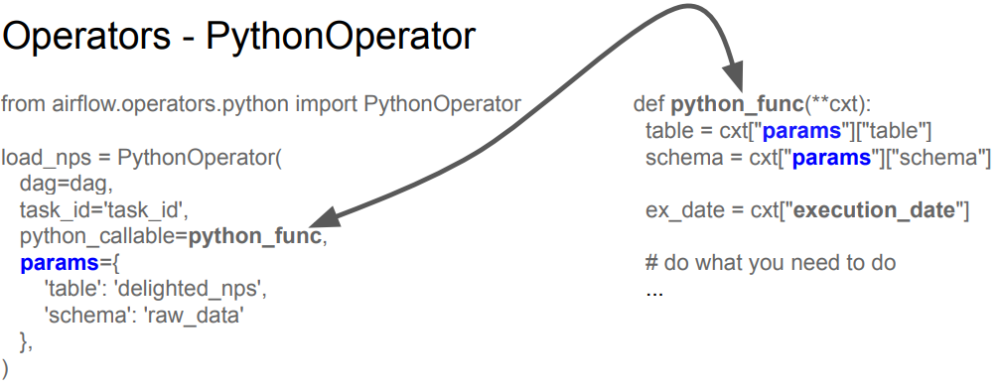
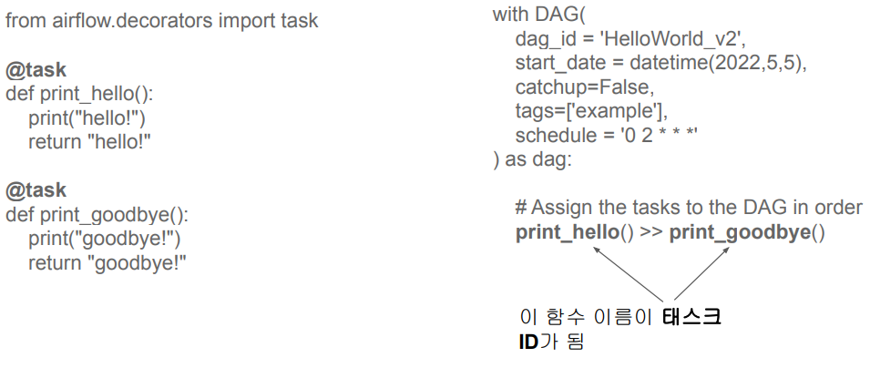
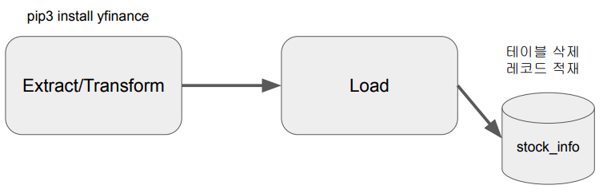
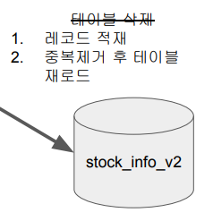

## <u>1. airflow-day3-1</u>

- Hello World 예제 프로그램 살펴보기

- Contents

1. Hello World 예제 프로그램 살펴보기
2. Name Gender 예제 프로그램 포팅
3. Open Weather DAG 구현하기
4. Primary Key Uniqueness 보장하기

- 2개의 태스크로 구성된 데이터 파이프라인 (DAG)

  - print_hello: PythonOperator로 구성되어 있으며 먼저 실행
  - print_goodbye: PythonOperator로 구성되어 있으며 두번째로 실행

- Operators - PythonOperator

  

- Airflow Decorators: 프로그래밍이 단순해짐

  

<br>
<br>
<br>

## <u>2. airflow-day3-2</u>

### Name Gender 예제 프로그램 포팅

- NameGenderCSVtoRedshift.py 개선하기 #1

- params를 통해 변수 넘기기
- execution_date 얻어내기
- “delete from” vs. “truncate”

  - DELETE FROM raw_data.name_gender; -- WHERE 사용 가능
  - TRUNCATE raw_data.name_gender;

- result: NameGenderCSVtoRedshift_v2.py

<br>

- NameGenderCSVtoRedshift.py 개선하기 #2

- Xcom 객체를 사용해서 세 개의 task로 나누기
- Redshift의 스키마와 테이블 이름을 params로 넘기기

- result: NameGenderCSVtoRedshift_v3.py

- Connections and Variables

- Connections(AWS Redshift 정보 설정 가능)
  - This is used to store some connection related info such as hostname, port number, and access credential
  - Postgres connection or Redshift connection info can be stored here
- Variables(Key-Value 설정 가능)
  - Used to store API keys or some configuration info
  - Use “access” or “secret” in the name if you want its value to be encrypted
  - We will practice this

-> Airflow Web UI -> admin -> Connections & Variables 에서 설정 \
-> **from airflow.models import Variable**

<br>

- NameGenderCSVtoRedshift.py 개선하기 #3

- Variable를 이용해 CSV parameter 넘기기
- NameGenderCSVtoRedshift_v3.py#L72
- Xcom을 사용해서 3개의 태스크로 나눠보기

- csv_url: Variables 설정 가능

<br>

- **Xcom이란?**
- 태스크(Operator)들간에 데이터를 주고 받기 위한 방식
- 보통 한 Operator의 리턴값을 다른 Operator에서 읽어가는 형태가 됨
- 이 값들은 Airflow 메타 데이터 DB에 저장이 되기에 큰 데이터를 주고받는데는 사용불가

  - 보통 큰 데이터는 S3 등에 로드하고 그 위치를 넘기는 것이 일반적

- 태스크 하나로 구성이 된 경우:
  data = extract(link)
  lines = transform(data)
  load(lines)

- 3개의 태스크로 나눈 경우:
  데이터를 어떻게 넘길까?

-> text = context["task_instance"].xcom_pull(key="return_value",task_ids="extract")

<br>
<br>
<br>

## <u>3. airflow-day3-3</u>

### Name Gender 예제 프로그램 포팅

- Redshift Connection 설정 (Data Warehouse)

- Redshift Connection 사용하기
- NameGenderCSVtoRedshift_v4.py

- **from airflow.providers.postgres.hooks.postgres import PostgresHook**

<br>

- NameGenderCSVtoRedshift.py 개선하기 #5

- from airflow.decorators import task
  - task decorator를 사용
  - 이 경우 xcom을 사용할 필요가 없음
  - 기본적으로 PythonOperator 대신에 airflow.decorators.task를 사용
- NameGenderCSVtoRedshift_v5.py

  - schema 변경 잊지 말기!

- **from airflow.decorators import task**

### 실습: airflow 웹 UI & Command line:

```bash
$ cp -r .\learn-airflow\dags\* dags (실습 파일 복사)
$ Get-ChildItem -Path dags(ls -tl dags)

$ xcopy .\learn-airflow\dags\* dags /E /Y
# 이 명령은 .\learn-airflow\dags\*에 있는 모든 파일과 폴더를 dags 폴더로 복사하면서, 기존에 있는 항목이 있으면 덮어씁니다.

# /E: 이 옵션을 사용하면, 하위 디렉토리를 포함하여 복사를 수행합니다.
# /Y: 이 옵션을 사용하면, 덮어쓰기 질문에 자동으로 "예"를 대답하게 됩니다. 기존 파일과 폴더를 덮어쓰게 됩니다.
```

<br>

```bash
$ docker ps -a
$ docker exec -it [scheduler id] sh
(airflow)$ airflow dags list
(airflow)$ airflow tasks list namegender_v5
extract
load
transform

(airflow)$ airflow variables list
key
=======
csv_url


(airflow)$ airflow variables get csv_url

```

- 구글 colab에서 만들었던 namegender.csv 파일을 Redshift table로 적재해주는 데이터 파이프라인을 airflow로 고도화

- **Airflow 관련 기타 Q & A**

- PostgresHook의 autocommit 파라미터

  - Default 값은 False로 주어짐
  - 이 경우 BEGIN은 아무런 영향이 없음 (no-operation)

- DAG에서 task를 어느 정도로 분리하는 것이 좋을까?

  - task를 많이 만들면 전체 DAG이 실행되는데 오래 걸리고 스케줄러에 부하
  - task를 너무 적게 만들면 모듈화가 안되고 실패시 재실행을 시간이 오래 걸림
  - 오래 걸리는 DAG이라는 실패시 재실행이 쉽게 다수의 task로 나누는 것이 좋음

- Airflow의 Variable 관리 vs. 코드 관리

  - 장점: 코드 푸시의 필요성이 없음
  - 단점: 관리나 테스트가 안되어서 사고로 이어질 가능성이 있음

<br>

- **숙제**: airflow.cfg

1. DAGs 폴더는 어디에 지정되는가? \
   -> airflow.cfg에서 dags_folder 키를 통해 지정할 수 \
   있습니다. 기본적으로는 ~/airflow/dags 폴더가 사용됩니다.

<br>

2. DAGs 폴더에 새로운 Dag를 만들면 언제 실제로 Airflow 시스템에서 이를 알게 되나? \
   이 스캔 주기를 결정해주는 키의 이름이 무엇인가? \
   -> DAGs 폴더에 새로운 DAG를 만들면 scheduler_interval에 설정된 시간 동안은 일반적으로 Airflow가 새로운 DAG 파일을 \
   인식하지 못합니다. 이 경우 수동으로 DAG를 로드하도록 scheduler 프로세스를 다시 시작해야 합니다. \
   DAG를 로드하려면 다음과 같이 명령어를 입력해주시면 됩니다.

   ```bash
   airflow scheduler -D
   airflow dags unpause <DAG_ID>
   # 해당 명령어는 지정된 DAG ID의 상태를 "unpaused"로 바꾸어
   # 로드할 수 있도록 만들어줍니다.
   ```

<br>

3. 이 파일에서 Airflow를 API 형태로 외부에서 조작하고 싶다면 어느 섹션을 변경해야하는가? \
   -> Airflow를 API 형태로 외부에서 조작하고 싶다면 [api] 섹션을 변경해야 합니다. \
   해당 섹션에서는 Flask 웹 서버와 CORS 등과 관련된 설정이 가능합니다.

<br>

4. Variable에서 변수의 값이 encrypted가 되려면 변수의 이름에 \
    어떤 단어들이 들어가야 하는데 이 단어들은 무엇일까? :) \
   -> Variable에서 변수의 값이 encrypted가 되려면 "encrypt"라는 단어가 변수의 이름에 포함되어야 합니다. 예를 들면, \
   my_variable_encrypt와 같은 형태로 변수 이름을 설정해야 합니다.

<br>

5. 이 환경 설정 파일이 수정되었다면 이를 실제로 반영하기 위해서 해야 하는 일은? \
   -> 이 파일이 수정되었다면 Airflow를 다시 시작해야 합니다. 변경된 내용이 적용되려면 다음과 같은 명령어를 입력해주시면 됩니다.

```bash
airflow webserver -D
airflow scheduler
# 이 명령어를 입력하면 변경된 설정이 적용된 Airflow 웹 서버와 스케줄러 모두 재시작됩니다.
```

6. Metadata DB의 내용을 암호화하는데 사용되는 키는 무엇인가? \
   -> Metadata DB의 내용을 암호화하는데 사용되는 키는 fernet_key입니다. \
   이 값은 airflow.cfg 파일 내의 [core] 섹션에서 설정할 수 있습니다.

<br>
<br>
<br>

## <u>4. airflow-day3-4</u>

### Yahoo Finance API DAG 작성 (1)

구현 DAG의 세부 사항 - Full Refresh로 구현

1. Yahoo Finance API를 호출하여 애플 주식 정보 수집 (지난 30일)
2. Redshift 상의 테이블로 1에서 받은 레코드들을 적재

   

<br>

- 앞서 코드 실행
  - Docker에 로그인해서 yfinance 모듈 설치가 필요
  - airflow dags test UpdateSymbol 2023-05-20
- docker container에 루트 유저로 로그인하는 방법

### 실습: airflow in docker

```bash
$ docker ps -a
$ docker exec -it [scheduler id] sh
$ pip3 install yfinance
$ clear
$ pwd
$ ls -tl
$ cd dags
$ ls
$ ls -tl UpdateSymbol.py
$ airflow tasks list UpdateSymbol
$ airflow dags test UpdateSymbol 2023-05-30 # CLI에서 실행
$ docker exec --user root -it 2bb0ac7e51b3 sh # root 유저 접속
```

<br>
<br>
<br>

## <u>5. airflow-day3-5</u>

### Yahoo Finance API DAG 작성 (2)

- 구현 DAG의 세부 사항 - Incremental Update로 구현

1. Yahoo Finance API를 호출하여 애플 주식 정보 수집 (지난 30일)
2. Redshift 상의 테이블로 1에서 받은 레코드들을 적재하고 중복 제거
   a. 매일 하루치의 데이터씩 늘어남

   

<br>

- Load: Redshift의 테이블을 업데이트 (1)
  - Incremental Update로 구현
  - 임시 테이블 생성하면서 현재 테이블의 레코드를 복사 (CREATE TEMP TABLE … AS SELECT)
  - 임시 테이블로 Yahoo Finance API로 읽어온 레코드를 적재
  - 원본 테이블을 삭제하고 새로 생성
  - 원본 테이블에 임시 테이블의 내용을 복사 (이 때 SELECT DISTINCT \*를 사용하여 중복 제거)
- 트랜잭션 형태로 구성 (NameGender DAG와 동일)

### 숙제

세계 나라 정보 API 사용 DAG 작성 (1)

- https://restcountries.com/에 가면 세부 사항을 찾을 수 있음
- 별도의 API Key가 필요없음
- https://restcountries.com/v3/all를 호출하여 나라별로 다양한 정보를 얻을 수 있음

{"name": {"common": "South Korea", "official": "Republic of Korea", …
"area": 100210.0,
"population": 51780579, …}

세계 나라 정보 API 사용 DAG 작성 (2)

- Full Refresh로 구현해서 매번 국가 정보를 읽어오게 할 것!
- API 결과에서 아래 3개의 정보를 추출하여 Redshift에 각자 스키마 밑에 테이블 생성
  - country -> [“name”][“official”]
  - population -> [“population”]
  - area -> [“area”]
- 단 이 DAG는 UTC로 매주 토요일 오전 6시 30분에 실행되게 만들어볼 것!
- 숙제는 개인 github에 repo를 만든 후 제출할 것!

<br>
<br>
<br>
<br>
<br>
<br>
<br>
<br>
<br>
<br>
<br>
<br>

- **Keyword**:

<br>
<br>
<br>
<br>
<br>
<br>

### **Summary**:

<br>
<br>
<br>
<br>
<br>
<br>
