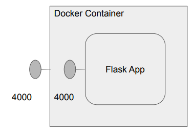
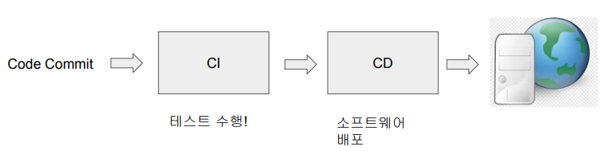
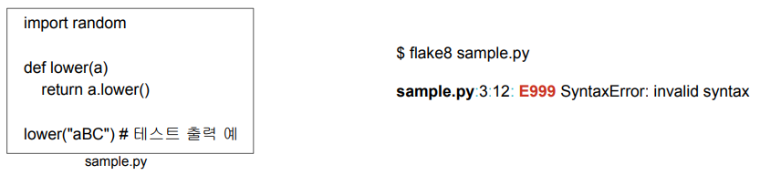

## <u>1. docker-day2-1-챕터소개와-1장퀴즈리뷰</u>

Contents

1. 1장 퀴즈 리뷰
2. 학습 목표 소개
3. Hangman 서비스 소개
4. Hangman 서비스를 Dockerization하기 (숙제)
5. CI/CD와 Github Actions 소개
6. Github Actions 사용 1: 테스트 추가
7. Github Actions 사용 2: Dockerization 추가

### 1장 퀴즈 리뷰

1. Container를 사용하는 경우의 장점으로 맞는 것

- 서버 사용의 효율성이 는다
- 서비스 별 전용 서버가 아닌 공용 서버들을 만들고 사용하기에 서버 관리에 일관성이 생긴다
- 소프트웨어 설치에서 생기는 충돌 이슈를 제거할 수 있다

2. VM과 비교해서 Docker의 장점이 아닌 것

- 가볍고 빠르다 (o)
- OS 라이센스 비용이 필요없다 (o)
- Docker Image는 어느 환경에서도 동작한다 (x)

3. Docker Image를 만드는 과정을 기술하는 파일의 이름

- Dockerfile

4. 지금 컴퓨터에 설치된 모든 이미지를 리스트해주는 명령

- docker images

5. 빌드한 이미지를 Docker Contaienr로 실행해주는 명령

- docker run

6. 이미 실행중인 Docker Container와 통신하는 명령

- docker exec

7. 가장 많이 사용되는 Docker Image Registry의 이름

- Docker Hub

8. Docker tag에 대한 설명으로 잘못된 것

- 기본 값은 latest이다 (o)
- 버전이나 변형에 관한 정보를 제공한다 (o)
- 한 이미지는 하나의 tag만 가질 수 있다 (x)

9. Docker Hub에 있는 이미지들은 기본적으로 어카운트이름 (내임스페이스라 부르기도 함)이 \
   이미지 이름에 들어가는데 일부 이미지들은 어카운트이름이 필요없다. 어떤 이미지들인가?

- 공식 이미지

<br>
<br>
<br>

## <u>2. docker-day2-2-학습 목표와 Hangman 서비스 소개</u>

### 학습 목표 소개

웹서비스를 Docker로 구동해보는 전체 과정 익히기

- hangman_web이라는 repo의 main에 코드가 머지될 때마다 다음을 수행

1. 테스트 수행
2. Docker Image 빌드

- 이를 위해 Dockerfile 부터 만들어볼 예정

3. Docker Image를 Docker Hub로 푸시

- 위 과정을 Github repo에 Github Actions으로 구현

<br>

Hangman 프로그램

- hangman 프로그램을 flask를 사용하여 웹으로 노출
  - 포트번호는 어디든 바인딩 가능하며 실행할 때 지정
  - flask 관련 모듈 설치가 필요함: requirements.txt
- 실행 방법
  - python3 -m flask run --host=0.0.0.0 --port=4000
    - 이 경우 app.py를 기본으로 사용함

<br>


<br>

### 실습: https://labs.play-with-docker.com/

- git clone hangman_web.git
- pip3 install -r requirements.txt
- python3 -m flask run --host=0.0.0.0 --port=4000

<br>
<br>
<br>

## <u>3. docker-day2-3-Hangman 서비스를 Docker Image로 구성개요</u>

### Hangman 서비스를 Docker Image로 구성

Docker 컨테이너 내부 프로세스와 호스트 프로세스간의 통신 (3)

- Docker 컨테이너 내부 프로세스가 오픈한 포트번호를 외부로 노출해주는 것이 포트맵핑

  - docker run 수행시 -p 옵션 사용

    - docker run -p 4000:4000 이미지이름

      

<br>

숙제: hangman repo에 Dockerfile 추가하기 (1)

- 앞서 1장에서 만들어본 Dockerfile에 대한 설명을 참고하여 Dockerfile 추가
  - FROM에 사용할 베이스 이미지로는 python:3.8-slim-buster을 사용
  - RUN에서는 pip3 install -r requirements.txt가 지정되어야함
- 다음으로 아래와 같은 이름으로 이미지를 빌드해볼 것
  - DockerHub어카운트ID/hangman
- 맥 M1이라면 빌드시 --platform=linux/amd64 사용을 잊지 말것
- 마지막으로 이 이미지를 가지고 컨테이너를 실행할 것 (docker run)
  - 이 때 포트 포워딩을 고려해서 실행해야함

<br>

숙제: hangman repo에 Dockerfile 추가하기 (2)

- 이 이미지를 labs.play-with-docker.com에서 다운로드받아 실행해볼 것
  - 여기서 해당 Flask app을 오픈해볼 수 있음

<br>

- 숙제: hangman repo에 Dockerfile 추가하기 (4)

  - Dockerfile을 본인 github repo에 커밋
  - 혹시라도 막히는 부분이 있으면 질문을 꼭 할 것!
  - 최종적으로 본인 Docker Hub 계정에 업로드된 hangman \
    repo 링크와 스크린샷을 keeyong@gmail.com으로 보내던지 Slack으로 DM할 것

<br>
<br>
<br>

## <u>4. docker-day2-4-Hangman 서비스를 Dockerization하기</u>

### Hangman 서비스를 Dockerization하기

- Dockerfile 리뷰

```dockerfile
FROM python:3.8-slim-buster \
LABEL Maintainer="id@gmail.com" <- (메타데이터로 docker inspect 명령으로 찾아볼 수 있음) \
WORKDIR /app \
COPY app.py ./ \
COPY requirements.txt ./ \
RUN pip3 install -r requirements.txt \
EXPOSE 4000 <- (이 포트 번호를 사용하니 포트 맵핑을 할때 참고하라는 정보) \
CMD ["python3", "-m", "flask", "run", "--host=0.0.0.0", "--port=4000"]
```

<br>

전체 과정 데모

- 과정에서 사용해볼 일부 docker 명령
  - docker inspect 명령
  - docker run "-d" 옵션
  - docker stop 명령
- 순서:
  - docker build --platform=linux/amd64 -t jungwoo7476/hangman .
  - docker image ls
  - docker inspect jungwoo7476/hangman
  - docker run -p 4000:4000 jungwoo7476/hangman
  - docker run -p 4000:4000 -d jungwoo7476/hangman(백그라운드 실행)
  - docker push jungwoo7476/hangman

<br>

### 실습: CLI

```bash
$ docker build --platform=linux/amd64 -t jungwoo7476/hangman .
$ clear
$ docker image ls
$ docker inspect jungwoo7476/hangman
$ clear
$ docker run jungwoo7476/hangman
$ docker run -p 4000:4000 jungwoo7476/hangman
$ docker stop [CONTAINER ID]
$ docker run -p 4000:4000 -d jungwoo7476/hangman(백그라운드 실행)
$ docker push jungwoo7476/hangman
```

<br>
<br>
<br>

## <u>5. docker-day2-5-CI,CD소개</u>

### CI/CD와 Github Actions 소개

소프트웨어 빌드란?

- 자신(혹은 팀)이 개발한 소프트웨어를 최종적으로 출시하기 위한 형태로 만드는 것
  - 테스트가 빌드의 중요한 일부로 포함
- 참여 개발자들이 많을수록 이는 더 중요
- 개발이 끝나기 전부터 빌드를 하면 소프트웨어의 안정성 증대
  - Continuous Integration!(**CI**)

<br>

Continuous Integration이란?

- Software Engineering Practice의 하나
- 기본 원칙
  - 코드 Repo는 하나만 유지 (Master or Main)
  - 코드변경을 최대한 자주 반영
  - 테스트를 최대한 추가
    - Test Coverage
  - 빌드를 계속적으로 수행 (자동화)
    - Commit Build vs. Nightly Build
  - 성공한 빌드의 프로덕션 릴리스 (자동화)
    - CD: Continuous Delivery

<br>

CI/CD란?



<br>
<br>
<br>

## <u>6. docker-day2-6-Git,Github소개</u>

### Git/Github 소개

Git이란?

- Git은 분산환경을 지원하는 소스 버전 컨트롤 시스템
  - CVS, SVN은 항상 서버에 연결되어 있다는 전제하에서 사용 가능 (중앙 개발)
- 리눅스를 만든 Linus Torvalds가 개발
  - 리눅스 커널 개발을 위해 만들었으며 GPL v2 오픈소스
- SVN/CVS에 비해 현저하게 빠르나 사용법은 훨씬 더 복잡함 :(

<br>

Git의 장점 짧은 버전

- 다수의 개발자가 공동 개발
- 코드 리뷰 가능
- 코드 백업
- 과거의 코드로 롤백 가능

<br>

Git의 장점 긴 버전

- 팀원들과 코딩을 같이 할 수 있고 코드 충돌이 생기면 이를 해결가능하고 (구글닥처럼)
- 코드변경을 주기적으로 저장하면서 리뷰를 받을 수 있고
- 모든 코드 변경이 기록되며 (백업)
- 지금 코드의 스냇샵을 잡아 (이를 버전이라 부름) 나중에 필요시 버전간 이동이 가능
- 사실 이런 모든 작업을 꼭 코드 뿐만 아니라 모든 텍스트 파일에 사용 가능

<br>

Github이란?

- Git repo 호스팅/클라우드 서비스 (http://github.com)
  - 대부분의 회사들이 Git을 직접 설치해서 사용하기 보다는 github을 사용
- Git은 텍스트 커맨드라인 툴이지만 Github은 웹기반 인터페이스도 제공 (일부)
- 자신이 만든 repo들이 모두 public일 경우 사용이 무료
  - private repo의 수에 따라 가격대가 결정됨
  - 개발자들을 위한 Facebook!
- 다양한 툴을 제공하여 생태계 마련
  - Code 개발 생산성 증대를 위한 Copilot
  - CI/CD등의 다양한 연동을 위한 Workflows 제공
  - 또한 문서화를 위한 Wikis와 버그리포트와 트랙킹을 위한 Issues 기능을 제공
- 2018년에 마이크로소프트가 $7.5B에 인수함

<br>

Git 관련 용어 (I)

- **Repo**:
  - Repository의 준말로 Git으로 관리되는 소프트웨어 프로젝트를 지칭
- **Master/Main**:
  - 한 Repo에서 기본이 되는 메인 코드를 지칭. Git에서는 master이고 github에서는 이제 main
- **Branch**:
  - 자신의 Repo에서 새로운 기능 개발등을 위해 Master 혹은 다른 Branch로부터 만든 코드 작업본을 지칭. \
    작업 후 나중에 원본 Branch와 다시 병합하려는 목적으로 만들어진다
- **Clone**:
  - 다른 계정에 존재하는 repo로부터 새로운 local repository를 만드는 것
- **Commit** (Check-in):
  - 내가 만든 코드 변경을 Branch의 Local Repository에 반영하는 것

<br>

Git 관련 용어 (2)

- 작업은 항상 내 컴퓨터에 있는 Local Repo에서 일어나며 Pull과 Push를 통해 서버상의 Remote Repo와 연결
- **Pull**:
  - Master와 같은 Remote Repo로부터 마지막 Pull이후 변경된 것을 다시 \
    가져오는 작업. 즉 Master(혹은 Branch)와 씽크하는 것을 지칭
- **Push**:
  - 작업 중인 로컬 복사본 (Local Repo)에서 서버(Remote Repo)로 변경사항들을 복사하는 것을 지칭
- **Merge**:
  - Pull이나 Push했을 경우 두 Branch(대부분 이 중 하나는 Master)간의 충돌(Conflict)을 해결하는 과정. \
    많은 경우 이는 자동으로 해결되나 몇몇 경우에는 손으로 직접 충돌을

<br>

메인/마스터 브랜치

- Github에서는 이전에 master라 불렀고 지금은 main이라 부르는 source of truth가 되는 특별한 branch
- 특정한 기능을 구현하기 위해 만들어진 mainline의 복사본. 구현과 테스트가 이뤄진 후에 main branch와 머지됨

<br>
<br>
<br>

## <u>7. docker-day2-7-Github Actions소개</u>

### Github Actions 소개

- CI/CD를 Github위에서 구현하기 위한 서비스
  - 코드 테스트, 빌드, 배포 자동화 기능 제공
- Workflow라 부르며 아래 컴포넌트로 구성
  - Events
  - Jobs
  - Actions
  - Runner
    - Github hosted runners
    - Self hosted runners

<br>

Github Actions - Workflow (1)

- Workflow는 트리거 이벤트가 발생하면 시작되는 일련의 동작들을 지칭
- 트리거 이벤트의 예들은?
  - 코드 커밋 (main과 같은 특정 브랜치를 대상으로만 제한 가능)
  - PR 생성
  - 다른 Workflow의 성공적인 실행

<br>

Github Actions - Workflow (2)

- Workflow를 위한 명령어들은 YAML 파일로 저장
  - 명령어들로는 환경설정과 scripts 실행들이 대표적
- Workflow는 Job들로 나눠지며 각 Job은 일련의 스텝을 수행
  - 각 스텝은 하나 혹은 그 이상의 명령어를 실행
    - 이 명령어는 actions라고 부르는 명령어들의 집합이 될 수도 있음
  - 각 스텝은 윈도우나 리눅스 서버 위에서 runner에 의해 실행
    - 이걸 **Docker Image**에서 수행하는 것이 서비스 배포 과정에 따라 더 일반적이기도 함

<br>

Github에서 어떻게 Github Actions를 선택하는가?

- 적용하려는 repo에 보면 Actions 메뉴가 있음
- 다음으로 workflow를 하나 생성
- yml 파일을 직접 생성 혹은 템플릿(CI Templates) 선택 후 수정
  - Python Application 혹은 Docker Image

<br>
<br>
<br>

## <u>8. docker-day2-8-Github Actions 사용 #1</u>

### Github Actions 소개

시작하기 전에

- 먼저 learndataeng/hangman_web repo를 본인의 Github 어카운트로 fork
  - 여기에 앞서 만든 Dockerfile도 있어야함! (두 번째 실습에서 필요: Docker Image 생성에서 필요)
  - 여기에 보면 test.py가 있고 여기에 unittest 모듈을 이용한 테스트 코드가 존재
- Github Actions를 통해 main 브랜치에 push나 PR이 있는 경우 test.py를 실행할 예정
  - 하나의 repo에 대해 다수의 workflow들이 존재 가능
  - 모두 .github/workflows/ 밑에 yml 파일 형태로 존재

<br>

사용해볼 CI Template: Python Application

- Python Application이란 CI Template을 사용할 예정
  - 테스트 코드 실행 이외에도 flake8을 사용해서 코딩 스타일을 체크해볼 예정
- 기본으로 pytest를 테스트 프레임웍으로 설치 -> 우리는 unittest로 작성되어 있음
- Python code linting tool으로 flake8을 설치하고 문법 에러와 코딩 스타일 체크

<br>

파이썬 코드 스타일 체크 - flake8

- 파이썬 코드에서 에러나 코딩 스타일 등에서 이슈를 체크해주는 툴
  - 이런 툴을 Linting tool이라 부름 (언어별로 존재)

flake8 . --count --exit-zero --max-complexity=10 --max-line-length=127 --statistics



<br>

테스트 코드 소개

- 테스트 소스 코드
  - unittest를 사용 (pytest라는 대안도 있음)
- 테스트 코드 실행

```bash
$ flake8 sample.py(문법,스타일 이슈 테스트)

$ python3 -m unittest test.py # 혹은 python3 test.py
```

### 실습: 테스트 코드: Github Actions

1. 작업 Repo에서 Actions 탭 선택
2. CI Templates에서 View All > Python application
3. .github/workflows/python-app.yml 편집

<br>

잠깐! yml (or yaml) 파일 포맷: 환경설정 파일에 많이 쓰임

```yml
# Comments start with a #
# Key-value pairs are separated by a colon and a space
name: John Doe
age: 30
# Lists are denoted by a hyphen and a space
hobbies:
  - reading
  - hiking
# Nested key-value pairs are indented with two spaces
contact:
  email: john.doe@example.com
  phone:
  home: 555-1234
  work: 555-5678

# multi-line string
description: |
  This is a
  multi-line
  string
```

<br>
<br>
<br>

## <u>9. docker-day2-9-Github Actions 사용 #2</u>

### Github Actions 사용 #2: Dockerization 추가

사용해볼 Template: Docker Image

- Docker Image이란 Template을 사용할 예정

<br>

Docker 관련 스텝들

- docker login
  - 이 때 Docker hub ID와 Password를 읽어와야함. 하드코딩하지 않고 Github내에 저장 (뒤에서 더 설명)
    - secrets.DOCKER_USER
    - secrets.DOCKER_PASSWORD
- docker build
- docker push

=> 위의 과정을 .github/workflows/docker-image.yml에 기술 (steps 밑에 name)

### 실습: Github Actions: CLI:

```bash
env:
  DOCKER_USER: ${{secrets.DOCKER_USER}}
  DOCKER_PASSWORD: ${{secrets.DOCKER_PASSWORD}}

setting에서 설정

# CLI

$ docker image ls
$ docker image rm -f [IMAGE ID]
$ docker run -p 4000:4000 jungwoo7476/hangman
```

<br>
<br>
<br>
<br>
<br>
<br>

- **Keyword**:

<br>
<br>
<br>
<br>
<br>
<br>
