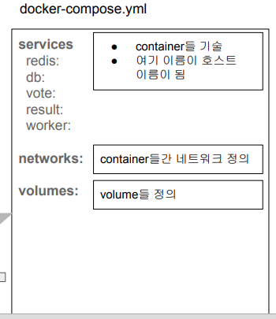
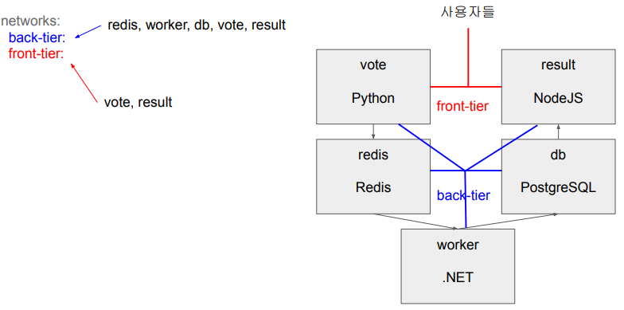

## <u>1. docker-day4-1-기타질문들 살펴보기</u>

Contents

1. Docker 명령 정리와 2장 퀴즈
2. Docker Volume이란?
3. 다수의 Container로 구성된 소프트웨어 실행 \
4. **Docker-Compose로 다수 Container로 실행해보기** \
5. **Airflow Docker docker-compose.yml 리뷰**

<br>

기타 질문들 살펴보기
.dockerignore
맥에서 port 5000

<br>

.dockerignore란 무엇인가? (1)

- Image build할 때 추가하지 말아야할 파일들이나 폴더들 지정
- 앞서 살펴보았던 voting-application의 경우 .dockerignore의 내용은 아래와 같음 \
  \*.pyc \
  project.lock.json \
  bin/ \
  obj/ \
  .vs/ \
  node_modules/

<br>

.dockerignore란 무엇인가? (2)

- 이외에 고려해볼만한 내용들은?
  .git \
  .cache \
  logs/ \
  _.md \
  \*\*/_.class

<br>

.dockerignore란 무엇인가? (3)

- Dockerfile에서 COPY 명령
  - 실수로 불필요한 파일 혹은 민감한 정보가 들어있는 파일들이 이미지로 들어가는 걸 막으려면 \
    COPY 명령을 처음이나 파일이나 폴더별로 일일이 적어주는 것이 좋을 수 있음. 그러면서 .dockerignore의 내용 보강

```dockerfile
FROM …
# Copy our code from the current folder to /app inside the
container
COPY . .
```

<br>

.dockerignore의 친구들

- .gitignore
- .npmignore
- .eslintignore
- .hgignore

<br>

맥에서 발생하는 port 5000 에러

- 맥에서 Container에 port 5000번을 호스트 포트로 사용하려고 하면 아래 에러 발생
- Error response from daemon: Ports are not available: exposing port TCP 0.0.0.0:5000 -> \
  .0.0.0:0: listen tcp 0.0.0.0:5000: bind: address already in use
- 이는 MacOS Monterey에만 존재하는 문제로 해결책이 있긴 하지만 다른 포트번호를 쓰는 것이 더 좋음

<br>
<br>
<br>

## <u>2. docker-day4-2-Docker-Compose로 다수 Container로 실행해보기</u>

### Docker-Compose로 다수 Container로 실행해보기

Docker-Compose란 무엇인가? (1)

- 다수의 Container로 소프트웨어가 구성되는 경우 사용할 수 있는 툴 + 환경설정파일
  - docker-compose.yml로 설정
  - 여기서 다양한 테스트등도 수행가능
  - 다양한 버전을 만드는 것도 일반적 (dev, test, prod 등등)
- 개별 Container를 따로 관리하는 것보다 훨씬 더 생산성이 높음
- 환경설정 파일의 이름은 docker-compose.yml이나 docker-compose.yaml

<br>

Docker-Compose란 무엇인가? (2)

- 하지만 그만큼 배워야할 것도 많고 복잡해짐
- 사용법 자체는 간단: 소프트웨어를 구성하는 모든 컨테이너에게 적용됨
  - docker-compose build
  - docker-compose up \*\*
  - docker-compose pull
  - docker-compose ps
  - docker-compose down \*\*
  - docker-compose start
  - docker-compose stop
  - docker-compose rm

<br>

Docker-Compose

- Docker Desktop의 일부로 설치가 됨
- Docker Engine을 실행하고 먼저 터미널에서 버전 확인
  - 만일 docker-compose가 없다고 나오면 먼저 docker-compose부터 실행
- Docker Compose v.1.27+ 부터 v2와 v3가 합쳐짐

```bash
$ docker-compose --version
Docker Compose version v2.15.1
```

<br>

docker-compose.yml 작성

- 다양한 버전이 존재하는데 우리는 v2와 v3가 합쳐진 버전 사용 예정
- services: 다음으로 프로그램을 구성하는 서비스들을 지정
  - 각 서비스는 별개의 Docker Image 지정과 Docker Container 실행으로 구성됨
  - 즉 각 서비스는 자신의 Dockerfile을 갖고 있어야함 아니면 docker hub등에서 이미지를 다운로드
  - 서비스별로 포트번호, 환경변수, 디스크 볼륨등을 지정해야함
  - 서비스 이름은 아무 이름이나 가능
- volumes: 앞서 사용된 docker volume들을 지정
- networks: 앞서 사용된 network들을 지정
  - network은 지정하지 않으면 같은 docker-compose 그룹 내에서는 모두 연결이 됨
  - “default”라는 이름으로 기본 네트웍이 만들어짐

<br>

docker-compose vs. docker compose

- v1: docker-compose
- v2: docker compose
- Docker 1.27부터 docker에 명령으로 compose가 추가됨
  - docker-compose 보다는 “docker compose”를 쓰는 것이 더 좋음
  - 별도로 docker-compose를 설치할 필요가 없음. 하지만 아직까지 대부분의 문서가 \
    docker-compose 중심으로 만들어져 있음

<br>

docker-compose.yaml or docker-compose.yml

- docker compose 명령의 위 둘 중의 하나를 찾음
  - 만일 둘다 존재한다면 에러 발생함
- 만일 다른 이름의 파일을 사용하고 싶다면 -f 옵션 사용
  - docker-compose -f docker-compose.mac.yml up
    - docker-compose.**prod**.yml
    - docker-compose.**dev**.yml
    - docker-compose.**test**.yml

<br>

docker-compose.yml 작성 예

```yml
services:
  frontend:
    build: ./frontend
    ports:
      - 3000:3000
  backend:
    build: ./backend
    ports:
      - 3001:3001
    environment:
      DB_URL: mongodb://database/vidly
  database:
    image: mongo:4.0-xenial
    ports:
      - 27017:27017
    volumes:
      - vidly: /data/db
volumes:
  vidly:
```

<br>

docker-compose로 이미지 생성과 관리 (1)

- docker-compose build
  - build 키로 지정된 것들 대상
- docker-compose pull
  - docker hub에서 이미지들을 읽어오려고 함
- docker images
  - 각 개별 이미지 앞에 폴더 이름을 prefix로 붙임 (docker hub에서 읽어온 것 제외)
    - worker -> example-voting-app-worker

<br>

docker-compose로 이미지 생성과 관리 (2)

- docker-compose images
  - 컨테이너에 의해 실행되고 있는 이미지들만 보여줌
- docker-compose push
  - docker hub으로 이미지들을 푸시하려고 함

<br>

docker-compose로 소프트웨어 시작과 중단 (1)

- docker-compose up # build => create => start
  - docker-compose create
  - docker-compose start
- docker-compose down # stop => rm
- docker-compose stop
- docker-compose rm

<br>

docker-compose로 소프트웨어 시작과 중단 (2)

- docker-compose ls # docker-compose를 그룹별로 보여줌
- docker-compose ps

<br>

docker-compose 네트워킹

- docker끼리 네트워크 연결이 필요한 경우
  - services에 준 이름으로 호스트 이름이 생성됨
  - 내부에 DNS 서버가 하나 생성되어 이름을 내부 IP로 변환해줌
- 별도로 네트워크를 구성하고 싶다면
  - networks에 네트워크를 나열하고 네트워크를 적절하게 서비스에 지정해주어야함
- docker network ls

<br>

### voting application을 docker-compose로 실행해보기

앞서 5개의 Container를 일일히 실행했을 때의 문제점

- Postgres를 실행하는 부분이 제대로 동작하지 않았음
  - docker run -d --name=db -e POSTGRES_PASSWORD=password --network mynetwork postgres

worker/Program.cs

```cs
var pgsql = OpenDbConnection("Server=db;Username=postgres;Password=postgres;");
var redisConn = OpenRedisConnection("redis");
```

- 이를 해결하려면 Container를 실행할 때 아래 2개의 환경변수를 넘겨주어야 함
- POSTGRES_USER: "postgres"
- POSTGRES_PASSWORD: "postgres"
- 이걸 docker-compose 환경 설정 파일을 통해 넘기면서 해결해볼 예정

<br>

docker-compose.yml로 포팅: 뼈대



<br>
<br>
<br>

## <u>3. docker-day4-3-데모-숙제-Docker-Compose로 다수 Container로 실행해보기</u>

### 실습: CLI:

```bash
$ git clone
$ cd example-voting-app
$ docker container rm -f $(docker container ls -aq)
$ docker image rm -f $(docker image ls -q)
$ docker ps -a
$ docker images
$ docker compose -f docker-compose.mac.yml build
$ docker images
$ docker compose -f docker-compose.mac.yml pull
$ docker images
$ docker compose -f docker-compose.mac.yml up
$ docker-compose ps
$ docker exec -it --user=postgres example-voting-app-db-1 sh
/ $ whoami
/ $ psql
postgres=# \c
postgres=# \dt
postgres=# SELECT * FROM votes;
$ docker compose -f docker-compose.mac.yml down
# 컨테이너 stop,rm 이미지는 남김
```

<br>
<br>
<br>

## <u>4. docker-day4-4-최종-Docker-Compose로 다수 Container로 실행해보기</u>

### voting application의 docker-compose.yml 개선하기

docker-compose.yml로 포팅: networks 정의



<br>

docker-compose.yml로 포팅: services들에 네트워크 지정

```yml
services:
 redis:
  …
  networks:
   - back-tier
 db:
  …
  networks:
   - back-tier
 vote:
  …
  networks:
   - back-tier
   - front-tier
 result:
  …
  networks:
   - back-tier
   - front-tier
 worker:
  …
  networks:
   - back-tier
```

<br>

docker-compose.yml로 포팅: volumes 정의

- 어느 컨테이너 서비스의 데이터가 계속해서 저장되어야 하는가?
  - PostgreSQL

```yml
volumes:
  db-data:
# db의 내용이 persistent해야함
```

<br>

voting application의 docker-compose.yml 최종 개선하기

docker-compose.yml로 포팅: vote 서비스 개선

```yml
vote:
 build: ./vote
 ports:
  - 5001:80
 networks:
  - back-tier
  - front-tier

vote:
 build: ./vote
 command: python app.py
 depends_on: # 서비스들간의 의존성이 있을 경우 먼저 실행 서비스 기술
  redis:
   condition: service_healthy
 healthcheck: # 해당 서비스의 건강을 나타내주는 체크
  test: ["CMD", "curl", "-f", "http://localhost"]
  interval: 15s
  timeout: 5s
  retries: 3
  start_period: 10s
 volumes:
  - ./vote:/app
 ports:
  - "5001:80"
 networks:
  - front-tier
  - back-tier
```

<br>

docker-compose.yml의 command와 entrypoint

- command: 이미지 Dockerfile의 CMD를 덮어쓰는데 사용
- entrypoint: 이미지 Dockerfile의 ENTRYPOINT를 덮어쓰는데 사용

<br>

docker-compose.yml의 healthcheck

- 역시 Dockerfile에서 기술가능한 기능이며 docker-compose에서 덮어쓰기 가능

```yml
healthcheck:
  test: ["CMD", "curl", "-f", "http://localhost"] # 0 for success 1 for failure
  interval: 1m30s
  timeout: 10s
  retries: 3
  start_period: 40s
```

<br>

docker-compose.yml의 depends_on

- 해당 서비스가 실행되기 위해서 먼저 실행되어야 하는 서비스들을 여기 기술
- short form:
  depends_on:
  - db
  - redis
- long form:
  depends_on:
  db:
  condition: service_healthy
  redis:
  condition: service_started

**condition**으로 가능한 값

- service_started:
- service_healthy:
- service_completed_successfully:

<br>

docker-compose.yml로 포팅: db 서비스 개선

```yml
db:
 image: postgres:15-alpine
 networks:
  - back-tier

db:
 image: postgres:15-alpine
 environment: # 이 환경변수를 통해 Postgres DB 설정이 됨.
  POSTGRES_USER: "postgres"
  POSTGRES_PASSWORD: "postgres"
 volumes: # host volume과 named volume을 사용하고 있음
  - "db-data:/var/lib/postgresql/data"
  - "./healthchecks:/healthchecks"
 healthcheck:
  test: /healthchecks/postgres.sh
  interval: "5s"
 networks:
  - back-tier
```

<br>

docker-compose.yml의 environment

- 해당 서비스가 컨테이너 안에서 실행될 때 환경변수들을 지정 (Dockerfile의 ENV)

```yml
#- Map 문법:
environment:
 RACK_ENV: development
 SHOW: "true"
  USER_INPUT:
#- Array 문법:
environment:
 - RACK_ENV=development
 - SHOW=true
  - USER_INPUT
```

<br>

docker-compose.yml로 포팅: redis 서비스 개선

```yml
redis:
 image: redis:alpine
 networks:
  - back-tier


redis:
 image: redis:alpine
 volumes:
  - "./healthchecks:/healthchecks"
 healthcheck:
  test: /healthchecks/redis.sh
  interval: "5s"
 networks:
  - back-tier
```

<br>

docker-compose.yml로 포팅: worker 서비스 개선

```yml
worker:
 build: ./worker
 networks:
  - back-tier


worker:
 build:
  context: ./worker
 depends_on:
  redis:
   condition: service_healthy
  db:
   condition: service_healthy
 networks:
  - back-tier


# 이 방식을 쓰는 경우 더 많은 빌드 관련 정보를 넘겨줄 수 있음
build:
 context: ./myapp
 dockerfile: Dockerfile.dev
 args:
  ENVIRONMENT: development
```

<br>

docker-compose.yml로 포팅: result 서비스 개선

```yml
result:
 build: ./result
 ports:
  - 5002:80
 networks:
  - front-tier
  - back-tier


result:
 build: ./result
 entrypoint: nodemon server.js
 depends_on:
  db:
   condition: service_healthy
 volumes:
  - ./result:/app
 ports:
  - "5002:80"
  - "5858:5858"
 networks:
  - front-tier
  - back-tier
```

<br>
<br>
<br>

## <u>5. docker-day4-5-Airflow Docker docker-compose.yml 리뷰</u>

### Airflow Docker docker-compose.yml 리뷰

앞서 다운로드 받은 docker-compose.yaml 파일 내용 보기

- version
- x-airflow-common
  - airflow-common이라는 별칭 정의. 여러 서비스에서 공유하는 공통 구성을 정의
  - 이를 보통 anchor라고 부르며 YML 파일 블록을 나중에 계승이란 형태로 재사용 가능하게 해줌
  - version, services, volumes, networks를 제외한 최상위 레벨 키워드는 모두 anchor
- services
  - postgres
  - redis
  - airflow-webserver
  - airflow-scheduler
  - airflow-worker
  - airflow-triggerer
  - airflow-init
- volumes
  - postgres-db-volume

<br>

airflow-scheduler 서비스 보기

```yml
airflow-scheduler:
 <<: *airflow-common
 command: scheduler
 healthcheck:
  test: ["CMD-SHELL", 'airflow jobs check --job-type SchedulerJob --hostname "$${HOSTNAME}"']
  interval: 10s
  timeout: 10s
  retries: 5
restart: always
depends_on:
 <<: *airflow-common-depends-on
 airflow-init:
  condition: service_completed_successfully
```

<br>

Dag를 구현하며 특정 파이썬 모듈을 설치해야한다면?

```python
import yfinance as yf

@task
def get_historical_prices(symbol):
 ticket = yf.Ticker(symbol)
 data = ticket.history()

DAG를 구현하며 새로 생긴 모듈을 어떻게 설치해주어야할까?
일일히 docker container에 들어가서 설치해주는 것은 유지보수도 안되고 불가능!

docker-compose.yaml에 답이 있음
```

<br>

Dag를 구현하며 특정 파이썬 모듈을 설치해야한다면?

- x-airflow-common에서 \_PIP_ADDITIONAL_REQUIREMENTS의 값을 변경
  Before:
  \_PIP_ADDITIONAL_REQUIREMENTS: ${\_PIP_ADDITIONAL_REQUIREMENTS:-}
  After:
  \_PIP_ADDITIONAL_REQUIREMENTS: ${\_PIP_ADDITIONAL_REQUIREMENTS:- **yfinance pandas numpy**}

<br>
<br>
<br>
<br>
<br>
<br>

- **Keyword**:

<br>
<br>
<br>
<br>
<br>
<br>
