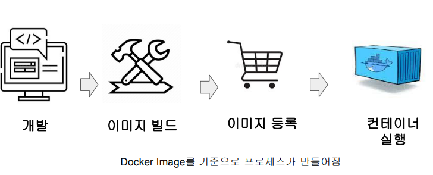
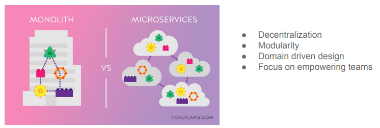
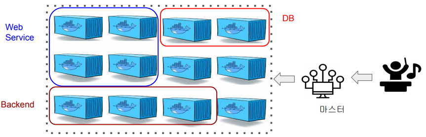
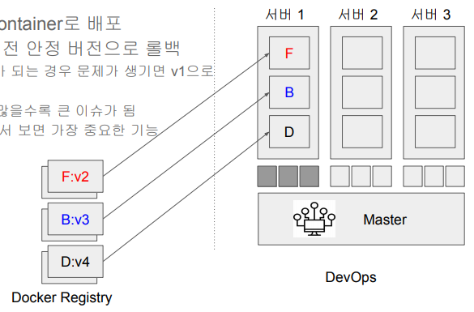
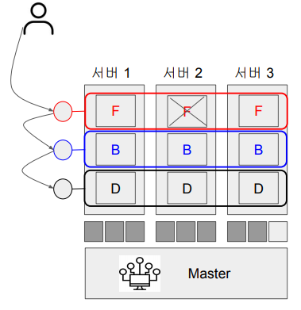
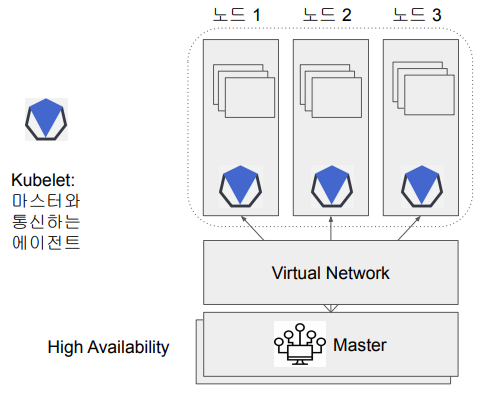

## <u>1. docker-day5-1-Docker-정리</u>

### 4. K8s 맛보기

Contents

1. Docker 정리
2. 서버 관리의 어려움
3. Container Orchestration 소개
4. K8s 소개
5. K8s 아키텍처
6. K8s/Docker 사용 예 살펴보기

<br>

이번 학습에 있어 중점을 두어야할 포인트

- K8s의 학습은 어려움!
  - 서버 운영에 관련된 부분이나 순수개발자에게는 쉽지 않음
- 모든 걸 다 설명하려는 것보다는 아래에 방점을 둘 예정임

왜 필요하고 어떤 기능을 해주는지 그리고 Docker와 어떻게 서로 보완적인 \
관계인지 이해 (개념적인 이해)하고 기본적인 사용법을 익힌다

<br>

Docker 정리

Docker 관련 용어들

- Docker Image
  - Dockerfile
- Docker Container
- Docker Hub (hub.docker.com)
- Docker Compose
  - **다수의 Docker Container들을 관리**
  - docker-compose.yml
    - Services
    - Networks
    - Volumes: host/anonymous/named volumes

<br>

Docker를 실제 Production 환경에서 사용할 때 유념할 점

- Docker volumes
  - Host volume은 보통 개발시 소스코드를 바로 container안으로 마운트하기 위함
  - Production에서는 named volumes를 써야함
- Docker container는 read-only로 사용
  - 내용을 바꿔야한다면 실행 중인 컨테이너를 수정하지 말 것
  - 항상 이미지를 새로 빌드하고 다시 컨테이너들을 새로 론치
  - 자동화가 중요해짐: CI/CD 프로세스
- 다수의 Docker Container들을 다수의 호스트들에서 실행 필요
  - 용량 문제와 Fail-over (혹은 fail-tolerant)

<br>

Docker를 개인 생산성을 향상을 위해서 사용

- 개발시 필요한 모듈을 Docker 이미지로 받아와서 Container로 실행
- 여러 소프트웨어를 연동해서 개발시 이 것들을 docker-compose로 설정
  장점:
- 일관된 방식으로 소프트웨어 설치 (문서화하고 매뉴얼하게 설치 불필요)
- 분리된 충돌없는 환경에서 소프트웨어 설치/실행

<br>
<br>
<br>

## <u>2. docker-day5-2-서버 관리의 어려움</u>

### 서버 관리의 어려움

관리해야하는 서버의 수가 늘어나면?

- 어느 서버가 문제가 있는지?
- 어느 서비스가 문제를 갖고 있는지?
- 이런 문제들을 얼마나 빨리 알고 해결할 수 있을지?
- 새로 들어온 사람이나 주니어를 잘 온보딩하려면?
- 문제들은 밤낮없이 연휴에도 발생

<br>

해결방안 1. 문서화

- 지금 서비스 상황과 셋업 방법 문서화
- 다양한 문제 발생시 해결 방법 문서화
- 문서를 현재 상황에 맞게 업데이트하는 것은 엄청난 노력
- 또한 상황에 따라 의미가 없는 경우도 많음
- 또 몇백대의 서버를 일일히 관리하고 명령을 실행한다는 것은 거의 불가능

<br>

해결방안 2. 문서화가 아닌 코드로 대신

- Infrastructure As Code: DevOps 엔지니어가 꼭 알아야하는 기술
- 문서보다는 코드로 관리
  - 대화형 명령보다는 자동화된 스크립트로 해결
  - 다수의 서버들에 명령을 대신 실행해줌
- 다양한 툴들이 쏟아져 나옴
  - Chef
  - Puppet
  - Ansible
  - Terraform
  - …
- 단점
  - Learning curve가 높음
  - 설치시 소프트웨어 충돌 문제에는 크게 도움이 안됨

<br>

해결방안 3. Virtual Machine의 도입

- 소프트웨어 충돌 해결을 위해 VM을 사용
  - 한 Physical Server에 다수의 VM을 올리고 서비스별로 VM을 하나씩 할당
- 단점
  - VM이 전반적으로 리소스 소비가 크고 느림
  - 결정적으로 특정 VM 벤더 혹은 클라우드에게 종속되어 버림 (Lock-in)

<br>

해결방안 4. Docker의 도입

- 모든 소프트웨어를 Docker Image로 만들면 어디서건 동작
  - 기본적으로 리눅스 환경에 최적
- VM에 비해 리소스 낭비도 적고 실행 시간도 빠름
- 거기다가 오픈소스라 클라우드나 특정업체 Lock-in 이슈도 없음
- 거의 단점이 없음
  - 하지만 Docker Container의 수가 늘어나면서 관리가 힘들다는 점이 부각됨

<br>

다시 한번 Docker Container의 장점

- Container 생성이 쉽고 빠름 (VM 비교)
- Image를 통해 버전 관리를 하고 배포하고 문제시 롤백이 용이
- 사용 언어등의 환경에 따른 관리방법에 차이가 없음
  - 개발, 빌드, 등록, 실행 절차가 일관되게 만들어짐 (Dev, Test, Production)
  - 개인컴퓨터이건 프로덕션 환경이나 동일
- 오픈소스이기에 특정 클라우드 벤더나 업체와 독립적

<br>

Docker는 이제 서비스 배포의 기본이 됨

- 많은 DevOps 엔지니어들은 모든 서비스를 Docker Image로 만들어서 운영 :)
- 즉 빌드 프로세스 출력물은 Docker Image가 되고 있음
  - Github에서 빌드 프로세스를 보면 docker image를 만들고 이를 내부 Registry에 등록하는 것이 일반적
- 그러다보니 다수의 Docker Image들을 더 많은 수의 Docker Container로 실행 관리하는 것이 필요해짐

모든 것의 컨테이너화 -> 이를 Containerization이라고 부름

<br>

Docker를 기본으로 서비스 배포 과정



<br>

하지만 컨테이너의 수가 기하급수적으로 늘어남!

Docker Container를 효율적으로 관리할 수 있는 도구가 필요함 \

- 다수의 컨테이너를 동시에 관리
- 놀고 있는 서버나 너무 바쁜 서버를 어떻게 알아낼지?
- 마이크로서비스의 등장으로 인한 서비스 수 증가로 어떤 서비스들이
  있는지 쉽게 찾을 수 있는 방법이 필요
- 모니터링을 어떻게 할 것인가?
- 특정 서비스의 컨테이너 수를 탄력적으로 어떻게 운영할 것인가?

<br>

잠깐! 마이크로서비스란?

- 웹 서비스를 다수의 작은 서비스(microservice)들로 구현하는 방식
- 각 서비스들은 팀 단위로 원하는 언어/기술로 개발하는 자율성을 가짐
- 각 서비스들은 계약관계로 지켜야하는 책임이 있고 서비스 정보를 등록해야함

  - Service Registry

    

<br>
<br>
<br>

## <u>3. docker-day5-3-Container-Orchestration-소개</u>

### Container Orchestration 소개

다수의 Container들을 잘 관리해보자!

- 이걸 Container Orchestration이라고 부름
- 앞서 언급했던 다양한 문제들을 효율적으로 관리하기 위한 도구
  - DevOps팀의 노가다를 줄이자!

<br>

Container Orchestration 기능 - 요약

- 한 클러스터 안에 다양한 서비스들이 공존 DB, Web Service, Backend, …
  - 자원 요청을 받아 마스터가 자원을 할당
- 다양한 기능 제공: 배포, 스케일링, 네트워크, 인사이트 등등

  

<br>

Container Orchestration 기능 - **소프트웨어 배포**

- 서비스 이미지를 Container로 배포
- 이상이 감지되면 이전 안정 버전으로 롤백

  - v1에서 v2로 배포가 되는 경우 문제가 생기면 v1으로 롤백
  - Container의 수가 많을수록 큰 이슈가 됨
  - DevOps 팀 관점에서 보면 가장 중요한 기능

    

<br>

Container Orchestration 기능 - **스케일링**

- 특정 서비스의 Container 수를 쉽게 늘리고 줄이는 것
- 이때 서버의 utilization도 고려

<br>

Container Orchestration 기능 - **네트워크**

- 서비스가 다수의 컨테이너로 나눠지면서 이들을 대표하는 Load Balancer를 만들어주어야 함
- 서비스들간에 서로를 쉽게 찾을 수 있어야함
  - 서비스 디스커버리

<br>

Container Orchestration 기능 - **인사이트**

- 노드/컨테이너 문제시 해결
  - 서버 2의 F가 다운되면 이를 서버 3에 재실행
  - F 로드밸런서 정보도 맞게 수정
- Logging/Analytics 등등의 기능 제공
  - 외부 서비스 plug and play
- 전체 서비스 분석

  - 시각화
  - 문제 분석

    

<br>
<br>
<br>

## <u>4. docker-day5-4-K8s 아키텍처</u>

### K8s 소개

Kubernetes (K8s) 소개 (1)

- 컨테이너 기반 서비스 배포/스케일/관리 자동화를 해주는 오픈소스 프레임웍
  - 구글에서 사용하던 Borg를 서비스를 오픈소스화함 (2015년)
  - 클라우드나 on-prem 모두에서 잘 동작
  - 어느 컨테이너이면 가능하지만 주로 Docker Container들이 대상이 됨
  - 물리서버나 가상서버 위에서 모두 동작
- 지금은 Cloud Native Computing Foundation이라는 비영리 단체에서 운영
  - 클라우드 환경에서 어떻게 소프트웨어를 배포하는 것이 효율적일까?
    - 컨테이너, 서비스메시, 마이크로서비스, API, DevOps, On-demand Infra

<br>

Kubernetes (K8s) 소개 (2)

- 가장 많이 사용되는 컨테이너 관리 (Orchestration) 시스템
  - 사용회사와 커뮤니티 활동이 굉장히 많고 활발
  - 카카오, 네이버, 라인, 쿠팡 등의 국내 업체도 활발히 사용
  - K8s위에 기능을 추가한 Container Orchestration 툴들이 생각남
  - 모든 글로벌 클라우드 업체들이 지원: EKS, AKS, GKE

<br>

Kubernetes (K8s) 소개 (3)

- 확장성이 좋아서 다양한 환경에서 사용됨
  - 머신러닝: Kubeflow
  - CI/CD: Tekton
  - Service Mesh: Istio
  - Serverless: Kubeless
- 다수의 서버에 컨테이너 기반 프로그램을 실행하고 관리
  - 컨테이너 기반 프로그램 == Docker Container
  - 보통 Docker와 K8S는 같이 사용됨
  - Pod: 같은 디스크와 네트웍을 공유하는 1+ 컨테이너들의 집합

<br>

### K8s 아키텍처

기본 구조: 마스터-노드



<br>

- 노드는 물리서버이거나 가상서버
- 클러스터는 1+ 노드의 집합
- 마스터는 클러스터는 관리해주는 역할 수행

<br>

기본 구조: K8S 프로세스들

- Master안에는 여러 프로세스들이 돌고 있음
  - API Server (Container로 동작): kube-apiserver
    - Entrypoint of K8S cluster
    - Web UI, CLI (kubectl), API
  - Scheduler
    - Pods 생성과 할당 (노드들의 상황 고려 - utilization)
  - Controller Manager
    - 전체 상황을 모니터링하고 fault tolerance 보장
  - Master는 High Availability가 중요함
  - etcd
    - K8S 환경 설정 정보가 저장되는 key/value 스토어로 백업됨
- Controller runtime
  - 대부분 Docker가 사용됨

<br>

Kubectl: 커맨드라인 툴

- kubectl run hello-minikube
- kubectl cluster-info
- kubectl get node

<br>

Pod란 무엇인가?

- 다시 한번 K8s 사용시 컨테이너를 바로 다루지 않음
- Pod: K8S 사용자가 사용하는 가장 작은 빌딩 블록
- 1 Pod = 보통은 하나의 container로 구성
  - 하나보다 많은 경우에는 보통 helper container가 같이 사용됨
  - 같은 Pod 안에서는 디스크와 네트워크가 공유됨
  - Fail-over를 위해 replicas를 지정하는 것이 일반적
    - 다양한 방법으로 복제본을 유지
- Pod는 네트웍 주소를 갖는 self-contained server

<br>

YAML 환경 설정 예

```yml
apiVersion: apps/v1
kind: Pod # POD, Service, ReplicaSet, Deployment
metadata:
 name: nginx
spec:
 containers:
 - name: nginx
  image: nginx
```

<br>

Pod 생성예

- kubectl create -f pod-definition.yml
- kubectl get pods
- kubectl describe pod nginx

- kubectl run nginx --image nginx

<br>
<br>
<br>

## <u>5. docker-day5-5-K8s Docker 사용 예 살펴보기와 최종 마무리</u>

### K8s/Docker 사용 예 살펴보기

케이스 #1 - Airflow

- [쏘카의 Airflow Containerization 이야기](https://tech.socarcorp.kr/data/2021/06/01/data-engineering-with-airflow.html)

케이스 #2 - Airflow

- [Bucket Place의 Airflow Containerization 이야기](https://www.bucketplace.com/post/2021-04-13-%EB%B2%84%ED%82%B7%ED%94%8C%EB%A0%88%EC%9D%B4%EC%8A%A4-airflow-%EB%8F%84%EC%9E%85%EA%B8%B0/)

<br>

다음 스텝:
어떤 부분을 학습하는 것이 좋을까?

- 만들어진 Docker Image를 어떻게 배포하고 스케일할 것인가?
  - Docker를 모르면 K8s를 이해하기 힘듬
- 먼저 docker-compose를 통해 Multi-Container 관리를 하는 것을 배우는 것이 좋음
  - 우리는 이미 앞에서 배웠음
- 다음으로 K8s를 사용하여 Container를 관리하고 배포하기
  - 실습 환경 설정, kubectl 사용, 개념 이해 (pod, deployment, service 등등)
- 네트워크 관련해서 외부와 연결 설정하기
  - Cluster IP, NodePort, Load Balancer, Ingress, 서비스 타입, 서비스 디스커버리 등등
- 스케일 아웃하기
  - 부하에 따라서 컨테이너 수 조정 (Auto-Scaling, 최소 리소스 설정 등등)

<br>

Docker/K8s에 대해 더 공부하고 싶다면?

- Kubernetes for the Absolute Beginners - Hands-on:
  - https://www.udemy.com/course/learn-kubernetes/
  - 초보자가 공부하고 실습하기 좋은 내용으로 구성되어 있음
- Docker and Kubernetes: The Complete Guide
  - https://www.udemy.com/course/docker-and-kubernetes-the-complete-guide/

<br>
<br>
<br>
<br>
<br>
<br>

- **Keyword**:

<br>
<br>
<br>
<br>
<br>
<br>
