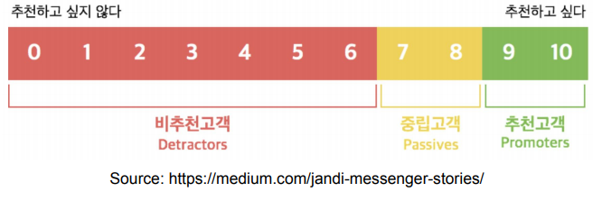
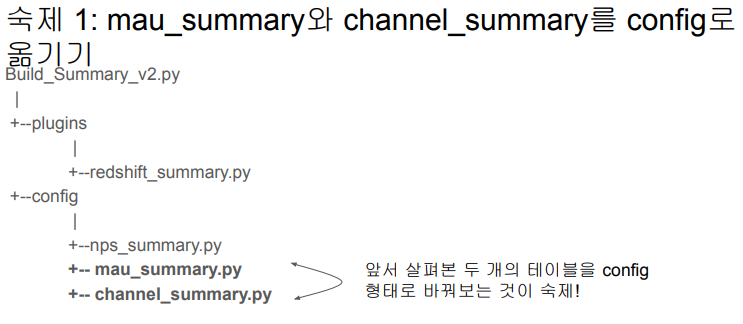

## <u>0. airflowdbt-day1-0-강의소개</u>

### Airflow 고급 기능, dbt, Data Catalog

Contents

1. ELT 작성과 구글시트/슬랙 연동
2. Airflow 기타 기능 사용해보기
3. 데이터 파이프라인 운영
4. dbt 소개와 실습
5. dbt를 Airflow에서 실행해보기
6. Data Catalog와 Data Discovery

<br>
<br>
<br>

## <u>1. airflowdbt-day1-1-airflow환경설정</u>

### 1. ELT 작성과 구글시트/슬랙 연동

Contents

1. ELT 구현
2. Slack 연동하기
3. 구글 시트 연동하기 (1): 시트 => Redshift 테이블
4. 구글 시트 연동하기 (2): Redshift 테이블 => 시트
5. API & Airflow 모니터링
6. 숙제

<br>

다시 Docker 기반 Airflow 실행 (1)

- 먼저 터미널 프로그램을 실행하고 적당한 폴더로 이동
- 이미 learn-airflow Github repo를 다운로드받은 상황이라면
  - 다운로드받은 repo 폴더로 이동
  - 여기서 아래를 수행
    - git pull
- 아니라면 아래를 수행
  - learn-airflow Github repo를 먼저 클론

<br>

다시 Docker 기반 Airflow 실행 (2)

- docker-compose.yaml 수정
  - \_PIP_ADDITIONAL_REQUIREMENTS 수정
  - data 폴더를 호스트 폴더에서 만들고 볼륨으로 공유: 임시 데이터를 저장할 폴더
    - 이를 docker volume으로 지정해서 나중에 디버깅에 사용

```yml
environment:
  AIRFLOW_VAR_DATA_DIR: /opt/airflow/data
  _PIP_ADDITIONAL_REQUIREMENTS: ${_PIP_ADDITIONAL_REQUIREMENTS:- yfinance pandas numpy oauth2client gspread}
volumes: …
  - ${AIRFLOW_PROJ_DIR:-.}/data:/opt/airflow/data
airflow-init: …
  mkdir -p /sources/logs /sources/dags /sources/plugins /sources/data
  chown -R "${AIRFLOW_UID}:0" /sources/{logs,dags,plugins,data}
```

<br>

다시 Docker 기반 Airflow 실행 (3)

- 다음 명령을 수행. Detached 모드로 실행하려면 -d 옵션 지정 (-f 옵션도 존재)
  - docker compose up -d

<br>

다시 Docker 기반 Airflow 실행 (3)

- http://localhost:8080으로 웹 UI 로그인
  - airflow:airflow 사용
  - 앞서 설정한 DATA_DIR이란 변수는 Admin => Variables에 안 보임.
    - DAG과 Airflow 환경 정보들은 Postgres의 Named Volume으로 유지되고 있음
    - 환경변수로 설정한 것들은 Web UI에서는 안 보이지만 프로그램에서는 사용가능

```bash
$ docker exec -it learn-airflow-airflow-scheduler-1 airflow variables get DATA_DIR
/opt/airflow/data
```

- Variables/Connections 설정을 어떻게 관리하는 것이 좋을까?
  - 이를 docker-compose.yaml에서 환경변수로 설정. 뒤에서 설명

<br>

고민 포인트: Airflow 실행환경 관리방안 (1)

- 기타 환경설정값들 (Variables, Connections 등등)을 어떻게 관리/배포할까?
  - 보통 docker-compose.yml 파일에서 아래 부분에 정의

```yml
x-airflow-common:
  &airflow-common
  …
  environment:
    &airflow-common-env
    AIRFLOW_VAR_DATA_DIR: /opt/airflow/data
    AIRFLOW_CONN_TEST_ID: test_connection
```

<br>

고민 포인트: Airflow 실행환경 관리방안 (2)

- 어디까지 Airflow 이미지로 관리하고 무엇을 docker-compose.yml에서 관리할지 생각
- 이는 회사마다 조금씩 다름
- Airflow 자체 이미지를 만들고 거기에 넣을지? 이 경우 환경변수를 자체 \
  이미지에 넣고 이를 docker-compose.yaml 파일에서 사용

```yml
x-airflow-common: &airflow-common
  image: ${AIRFLOW_IMAGE_NAME:-apache/airflow:2.5.1}
  # AIRFLOW_IMAGE_NAME 환경변수가 정의되어 있다면
  #그걸 사용하고 아니면 기본값으로 apache/airflow:2.5.1
```

- 아니면 docker-compose.yaml에서 환경변수를 직접 설정

<br>

고민 포인트: Airflow DAG 관리방안

- DAG 코드도 마찬가지
  - Airflow image로 DAG 코드를 복사하여 만드는 것이 좀더 깔끔
  - 아니면 docker-compose에서 host volume 형태로 설정
    - 이는 개발/테스트용으로 좀더 적합

<br>

팁: .airflowignore

- Airflow의 DAG 스캔 패턴은?
  - dags_folder가 가리키는 폴더를 서브폴더들까지 다 스캔해서 DAG 모듈이 포함된 모든 파이썬 스크립트를 \
    실행해서 새로운 DAG를 찾게 되며 이는 가끔 사고로 이어짐
- Airflow가 의도적으로 무시해야 하는 DAG_FOLDER의 디렉터리 또는 파일을 지정
- .airflowignore의 각 줄은 정규식 패턴으로 지정하며 매칭되는 파일들은 무시됨

```python
project_a
tenant_[\d]
```

- 위의 경우 아래 파일들이 무시됨
- **project_a**\_dag_1.py, TESTING\_\_**project_a**.py, **tenant_1**.py, **project_a**/dag_1.py

<br>
<br>
<br>

## <u>2. airflowdbt-day1-2-데모-airflow환경설정</u>

### 실습: CLI:

```bash
$ docker compose -f docker-compose.test.yaml up -d
$ docker exec -it learn-airflow-airflow-scheduler-1 airflow variables get DATA_DIR
```

<br>
<br>
<br>

## <u>3. airflowdbt-day1-3-summary-테이블-구현</u>

### Summary 테이블 구현

Summary table: 간단한 DAG 구현을 살펴보기

- Build_Summary.py: MAU 요약 테이블을 만들어보자
- 이 부분을 dbt로 구현하는 회사들도 많음 (Analytics Engineer)
  - https://www.getdbt.com/
  - 별도 강의에서 다룰 예정

<br>

Summary table: 이번에 사용자별 channel 정보를 요약해보자

- 앞서와 비슷하게 PythonOperator를 만들고 아래처럼 params 파라미터를 설정

```python
 params = {
 'schema' : 'pjw7491',
 'table': 'channel_summary',
 'sql' : """SELECT
 DISTINCT A.userid,
 FIRST_VALUE(A.channel) over(partition by A.userid order by B.ts rows between unbounded preceding and
unbounded following) AS First_Channel,
 LAST_VALUE(A.channel) over(partition by A.userid order by B.ts rows between unbounded preceding and
unbounded following) AS Last_Channel
 FROM raw_data.user_session_channel A
 LEFT JOIN raw_data.session_timestamp B ON A.sessionid = B.sessionid;"""
 },
```

<br>

CTAS 부분을 아예 별도의 환경설정 파일로 떼어내면 어떨까?

- 환경 설정 중심의 접근 방식
  - config 폴더를 생성
  - 그 안에 써머리 테이블별로 하나의 환경설정 파일 생성
    - 파이썬 dictionary 형태로 유지할 것이라 .py 확장자를 가져야함
- 이렇게 하면 비개발자들이 사용할 때 어려움을 덜 느끼게 됨
- 그러면서 더 다양한 테스트를 추가

mau_summary.py

```python
{
 'table': 'mau_summary',
 'schema': 'pjw7491',
 'main_sql': """SELECT …;""",
 'input_check': [ ],
 'output_check': [ ],
}
```

<br>

NPS 써머리 테이블을 만들어 보자 (1)

- NPS란? Net Promoter Score
  - 10점 만점으로 '주변에 추천하겠는가?'라는 질문을 기반으로 고객 만족도를 계산
  - 10, 9점 추천하겠다는 고객(promoter)의 비율에서 \
    0-6점의 불평고객(detractor)의 비율을 뺀 것이 NPS
- 7, 8점은 아예 계산에 안 들어감

  

<br>

NPS 써머리 테이블을 만들어 보자 (2)

- 각자스키마.nps 테이블 혹은 raw_data.nps 테이블 기준으로 일별 nps 써머리 생성
  - 먼저 SQL을 만들어보자

<br>

일별 NPS 계산 SQL

```SQL
SELECT LEFT(created_at, 10) AS date,
  ROUND(
    SUM(
      CASE
        WHEN score >= 9 THEN 1
        WHEN score <= 6 THEN -1
      END
    )::float*100/COUNT(1), 2
  ) nps
FROM pjw7491.nps
GROUP BY 1
ORDER BY 1;
```

<br>

NPS Summary를 주기적으로 요약 테이블로 만들기 (1)

- CTAS 부분을 아예 별도의 파일로 떼어내면 어떨까?
  - 환경 설정 중심의 접근 방식
  - config/nps_summary.py

```python
{
 'table': 'nps_summary',
 'schema': 'pjw7491',
 'main_sql': """SELECT …;""",
 'input_check': [ {
 'sql': 'SELECT COUNT(1) FROM pjw7491.nps',
 'count': 150000
 } ],
 'output_check': [ {
 'sql': 'SELECT COUNT(1) FROM {schema}.temp_{table}',
 'count': 12
 } ],
}
```

<br>

NPS Summary를 주기적으로 요약 테이블로 만들기 (2)

- 새로운 Operator와 helper 함수 구현
- plugins/RedshiftSummaryOperator
- build_summary_table

<br>

NPS Summary를 주기적으로 요약 테이블로 만들기 (3)

- 새로운 Operator와 helper 함수 구현

```yml
Build_Summary_v2.py
|
+--plugins
|
+--redshift_summary.py
+--config
|
+--nps_summary.py
+-- **mau_summary.py**
+-- **channel_summary.py**
```

- 다른 방법은 dbt 사용하기
  - Analytics Engineering (ELT)

앞서 살펴본 두 개의 테이블을 config 형태로 바꿔보는 것이 숙제!

<br>
<br>
<br>

## <u>4. airflowdbt-day1-4-Slack연동하기</u>

### Slack 연동하기

이번 섹션에서 하려는 일

- DAG 실행 중에 에러가 발생하면 그걸 지정된 슬랙 workspace의 채널로 보내기
- 이를 위해서 해당 슬랙 workspace에 App 설정이 필요
- 다음으로 연동을 위한 함수를 하나 만들고 (plugins/slack.py)
- 이를 태스크에 적용되는 default_args의 n_failure_callback에 지정

```python
from plugins import slack
    …
    default_args= {
    'on_failure_callback': slack.on_failure_callback,
    }
```

<br>

먼저 어느 Workspace의 어느 Channel로 보낼 것인지 결정

- prgms-de라는 Workspace 밑에 DataAlert이라는 App 생성
- 이 App이 #data-alert이라는 채널에 메세지를 보낼 수 있게 설정

<br>

데이터 파이프라인 문제를 슬랙에 표시 (1)

- https://api.slack.com/messaging/webhooks
  - 위를 따라해서 Incoming Webhooks App을 생성

<br>

데이터 파이프라인 실패/경고를 슬랙으로 보내는 방법

- slack 웹훅 토큰을 “slack_url” Variable로 저장
- slack에 에러 메세지를 보내는 별도 모듈로 개발: slack.py
- 이를 DAG 인스턴스를 만들 때 에러 콜백으로 지정
  - 예제: NameGenderCSVtoRedshift_v4.py

<br>
<br>
<br>

## <u>4. airflowdbt-day1-4-Slack연동하기</u>

### Slack 연동하기

이번 섹션에서 하려는 일

- DAG 실행 중에 에러가 발생하면 그걸 지정된 슬랙 workspace의 채널로 보내기
- 이를 위해서 해당 슬랙 workspace에 App 설정이 필요
- 다음으로 연동을 위한 함수를 하나 만들고 (plugins/slack.py)
- 이를 태스크에 적용되는 default_args의 on_failure_callback에 지정

먼저 어느 Workspace의 어느 Channel로 보낼 것인지 결정

데이터 파이프라인 문제를 슬랙에 표시 (1)

- https://api.slack.com/messaging/webhooks
  - 위를 따라해서 Incoming Webhooks App을 생성

데이터 파이프라인 문제를 슬랙에 표시 (2)
데이터 파이프라인 실패/경고를 슬랙으로 보내는 방법

- url token을 “slack_url” Variable로 저장
- slack에 에러 메세지를 보내는 별도 모듈로 개발: slack.py
- 이를 DAG 인스턴스를 만들 때 에러 콜백으로 지정
  - 예제: NameGenderCSVtoRedshift_v4.py

### 실습: airflow 웹 UI: CLI:

1. Variables 설정
2. Connection 설정

```bash
$ docker compose -f docker-compose.test.yaml up
$ docker ps
$ docker exec -it learn-airflow-airflow-scheduler-1 sh
(airflow)airflow dags list | grep v4
(airflow)airflow tasks list name_gender_v4
(airflow)airflow tasks list name_gender_v4
(airflow)airflow dags test name_gender_v4 2023-06-09
# slack alert 확인
```

<br>



<br>

숙제 2: Slack 연동

- 슬랙이 연동되어 에러가 메세지로 보내진 화면을 캡쳐하여 공유할 것
  - 슬랙 DM으로 공유

<br>
<br>
<br>
<br>
<br>
<br>

### 특강: 애자일 A/B 테스트 소개(max)

<br>
<br>
<br>
<br>
<br>
<br>

- **Keyword**:

<br>
<br>
<br>
<br>
<br>
<br>
