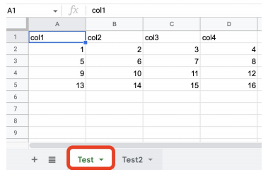

## <u>1. airflowdbt-day2-1-구글시트연동하기(1)</u>

### 구글 시트 연동하기 (1)

Contents

1. ELT 구현
2. Slack 연동하기
3. **구글 시트 연동하기 (1): 시트 => Redshift 테이블**
4. **구글 시트 연동하기 (2): Redshift 테이블 => 시트**
5. **API & Airflow 모니터링**
6. **숙제**

구글 시트를 테이블로 복사하는 예제 개요



<br>

를

<br>

```SQL
CREATE TABLE
pjw7491.spreadsheet_copy_testing (
 col1 int,
 col2 int,
 col3 int,
 col4 int
);
```

<br>

구현 절차들

- 시트 API 활성화하고 구글 서비스 어카운트 생성하고 그 내용을 JSON 파일로 다운로드
- 어카운트에서 생성해준 이메일을 조작하고 싶은 시트에 공유
- Airflow DAG쪽에서 해당 JSON 파일로 인증하고 앞서 시트를 조작

<br>

구글 서비스 어카운트 생성 (1)

- 구글 클라우드 로그인
  - https://console.cloud.google.com/
- 구글 스프레드시트 API 활성화 필요
  - https://console.cloud.google.com/apis/library/sheets.googleapis.com

구글 서비스 어카운트 생성 (2)

- 다음으로 구글 서비스 어카운트 생성 (JSON)
  - 아래 두 문서 중 하나를 참고
    - https://robocorp.com/docs/development-guide/google-sheets/interacting-with-google-sheets
    - https://denisluiz.medium.com/python-with-google-sheets-service-account-step-by-step-8f74c26ed28e
- 이 JSON 파일의 내용을 google_sheet_access_token이란 이름의 Variable로 등록
- 이 JSON 파일을 보면 이메일 주소가 하나 존재
  - 이를 읽고 싶은 구글스프레드시트 파일에 공유. 이 이메일은 iam.gserviceaccount.com로 끝남

<br>
<br>
<br>

## <u>2. airflowdbt-day2-2-데모-구글시트연동하기(1)</u>

### 실습: GCP Web UI: CLI:

```SQL
CREATE TABLE
pjw7491.spreadsheet_copy_testing (
 col1 int,
 col2 int,
 col3 int,
 col4 int
);
```

<br>
<br>
<br>

## <u>3. airflowdbt-day2-3-구글시트연동하기와 데모(2)</u>

### 구글 시트 연동하기 (2)

SQL 결과를 구글 시트로 복사하는 예제 개요

```SQL
SELECT *
FROM analytics.nps_summary
```

<br>

소스 코드 보기

- 소스 코드 보기
  - SQL_to_Sheet.py
  - plugins/gsheet.py의 update_sheet

<br>

데모

- 앞서 데모에서 사용했던 동일한 시트에 새로운 탭을 하나 만듬
  - 이미 필요한 이메일 주소가 해당 시트에 편집자로 공유가 되어 있기에 별도 작업이 필요 없음
- 거기에 “SELECT \* FROM analytics.nps_summary”의 내용을 복사
  - 이 과정을 PythonOperator로 구현
  - 해당 기능은 gsheet 모듈내에 있는 update_sheet라는 함수로 구현했음

<br>

### 실습: GCP Web UI: CLI:

Google Drive API 활성
(airflow)airflow dags test SQL_to_Sheet 2023-06-20
구글 스프레드 시트 확인

<br>
<br>
<br>

## <u>4. airflowdbt-day2-4-Airflow API와 모니터링</u>

### API & Airflow 모니터링

이번 섹션에서 해보고자 하는 일들

- Airflow의 건강 여부 체크 (health check)을 어떻게 할지 학습
- Airflow API로 외부에서 Airflow를 조작해보는 방법에 대해 학습

<br>

Airflow API 활성화 (1)

- airflow.cfg의 api 섹션에서 auth_backend의 값을 변경

  ```yml
  [api]
  auth_backend = airflow.api.auth.backend.basic_auth
  ```

- docker-compose.yaml에는 이미 설정이 되어 있음 (environments)
  AIRFLOW**API**AUTH_BACKENDS: 'airflow.api.auth.backend.basic_auth,airflow.api.auth.backend.session'

- 아래 명령으로 확인해보기

```bash
$ docker exec -it learn-airflow-airflow-scheduler-1 airflow config get-value api auth_backend
airflow.api.auth.backend.basic_auth,airflow.api.auth.backend.session
```

<br>

Airflow API 활성화 (2)

- Airflow Web UI에서 새로운 사용자 추가 (API 사용자)
  - Security -> List Users -> +
  - 이후 화면에서 새 사용자 정보 추가 (monitor:MonitorUser1)

<br>

Health API 호출

- /health API 호출

```bash
curl -X GET --user "monitor:MonitorUser1" http://localhost:8080/health
```

- 정상 경우 응답:

```json
{
  "metadatabase": {
    "status": "healthy"
  },
  "scheduler": {
    "status": "healthy",
    "latest_scheduler_heartbeat": "2022-03-12T06:02:38.067178+00:00"
  }
}
```

<br>

API 사용예

- [API 레퍼런스 살펴보기](https://airflow.apache.org/docs/apache-airflow/stable/stable-rest-api-ref.html#section/Overview)

- 특정 DAG를 API로 Trigger하기
- 모든 DAG 리스트하기
- 모든 Variable 리스트하기
- 모든 Config 리스트하기

<br>
<br>
<br>

## <u>5. airflowdbt-day2-5-데모-Airflow API와 모니터링</u>

### 데모

- API 활성화 여부 점검
- API 4개를 실행해보기
- 모니터링하기

```bash
$ docker exec -it learn-airflow-airflow-scheduler-1 airflow config get-value api auth_backend
# 특정 DAG를 API로 Trigger하기
$ curl -X POST --user "airflow:airflow" -H 'Content-Type: application/json' -d '{"execution_date":"2023-05-29T00:00:00Z"}' "http://localhost:8080/api/v1/dags/HelloWorld/dagRuns"
# 모든 DAG 리스트하기
$ curl -X GET --user "airflow:airflow" http://localhost:8080/api/v1/dags
# 모든 Variable 리스트하기
$ curl -X GET --user "airflow:airflow" http://localhost:8080/api/v1/variables
# 모든 Connections 리스트하기
$ curl -X GET --user "airflow:airflow" http://localhost:8080/api/v1/connections
# 모든 Config 리스트하기
$ curl -X GET --user "airflow:airflow" http://localhost:8080/api/v1/config
$ docker exec -it learn-airflow-airflow-scheduler-1 airflow variables export var.json
3 variables successfully exported to var.json
$ docker exec -it learn-airflow-airflow-scheduler-1 airflow connections export conn.json
Connections successfully exported to conn.json.
$ docker exec -it learn-airflow-airflow-scheduler-1 airflow connections import conn.json
$ docker exec -it learn-airflow-airflow-scheduler-1 airflow variables import var.json
# get_dags.py 생성
$ curl -X GET --user "airflow:airflow" http://localhost:8080/health
```

<br>
<br>
<br>

## <u>6. airflowdbt-day2-6-숙제</u>

### 1장 후반부 숙제

숙제 1: Dags 리스트를 API로 읽고 활성화되어 있는 DAG만 찾기

- 모든 DAG 리스트하기
  - curl -X GET --user "airflow:airflow" http://localhost:8080/api/v1/dags
- 이 API는 별다른 파라미터가 없이 등록된 모든 DAG를 리턴해줌
  - 하지만 DAG 별로 주어지는 프로퍼티를 보면 활성화 여부를 나타내주는 것이 하나 있음
  - 이를 이용해서 지금 활성화되어 있는 DAG만 프린트해주는 파이썬 스크립트를 작성해서 제출하기
- 제출 방식
  - Github PR을 하던지 코드를 슬랙으로 DM!

숙제 2: config API는 기본적으로 막혀있는데 이걸 풀려면?

- 먼저 해당 configuration 섹션과 키를 찾아보기 (airflow.cfg)
- 이를 docker-compose.yaml에서 어떻게 하면 적용하면서 풀어볼 수 있을까?
- 방법을 슬랙 DM으로 제출!

숙제 3: variables API는 환경변수로 지정된 것도 리턴?

- connections API도 동일하게 동작함
- 테스트해보고 본인이 발견한 결과를 슬랙 DM으로 제출

<br>
<br>
<br>
<br>
<br>
<br>

- **Keyword**:

<br>
<br>
<br>
<br>
<br>
<br>
