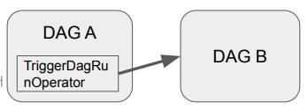
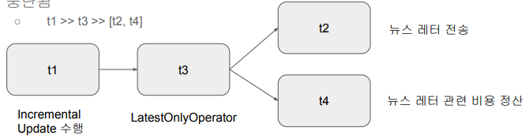
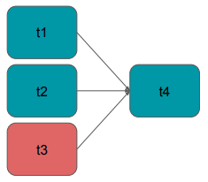
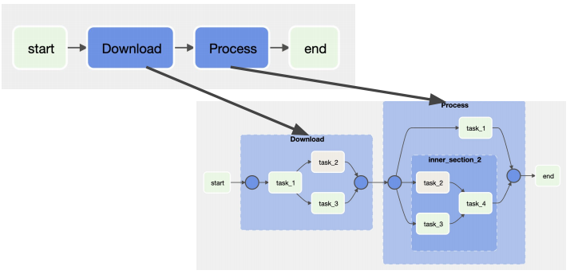
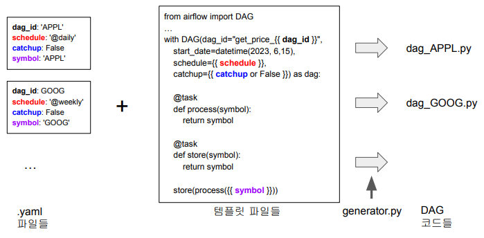
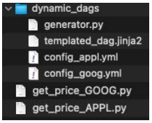

## <u>1. airflowdbt-day3-1-2장 소개</u>

Contents

1. 지난 숙제 리뷰
2. Dag Dependencies
3. Task Grouping
4. Dynamic Dags
5. DockerOperator

### 지난 숙제 리뷰

숙제 1: Dags 리스트를 API로 읽고 활성화되어 있는 DAG만 찾기

- 모든 DAG 리스트하기
  - curl -X GET --user "airflow:airflow" http://localhost:8080/api/v1/dags
- 이 API는 별다른 파라미터가 없이 등록된 모든 DAG를 리턴해줌
  - 하지만 DAG 별로 주어지는 프로퍼티를 보면 활성화 여부를 나타내주는 것이 하나 있음 (is_paused)
  - **지금 활성화되어 있는 DAG만 프린트해주는 파이썬 스크립트를 작성해서 제출**하기

```python
import requests
from requests.auth import HTTPBasicAuth
url = "http://localhost:8080/api/v1/dags"
dags = requests.get(url, auth=HTTPBasicAuth("airflow", "airflow"))
for d in dags.json()["dags"]:
    if not d["is_paused"]:
    print(d["dag_id"])
```

<br>

숙제 2: config API는 기본적으로 막혀있는데 이걸 풀려면? (1)

- 먼저 해당 configuration 섹션과 키를 찾아보기 (airflow.cfg)
  - webserver 섹션의 expose_config이며 이를 True로 설정해야함 (문자열로 설정)
- 이를 docker-compose.yaml에서 어떻게 하면 적용하면서 풀어볼 수 있을까?
  - airflow-common 밑에 environments 밑에 아래와 같이 설정

```yml
x-airflow-common:
  &airflow-common
  …
  environment:
    &airflow-common-env
    AIRFLOW_VAR_DATA_DIR: /opt/airflow/data
    AIRFLOW__WEBSERVER__EXPOSE_CONFIG: 'true'
    …
```

<br>

숙제 3: variables API는 환경변수로 지정된 것도 리턴?

- variables/connections API는 환경변수로 지정된 것은 포함하지 않음
- DATA_DIR로 정의한 Airflow Variable이 API로 리턴되는지 확인해보면 됨

```bash
$ docker exec -it learn-airflow-airflow-scheduler-1 airflow variables get DATA_DIR
=> /opt/airflow/data이 리턴됨

vs.

curl -X GET --user "airflow:airflow" http://localhost:8080/api/v1/variables
=> DATA_DIR은 존재하지 않음
```

- 환경변수를 Airflow 변수로 업데이트하려면, CLI 방법으로 환경변수 값을 Airflow 변수에 대입해야 합니다. \
  Variables API는 Airflow 변수만 반환하며, 환경변수는 직접 반환하지 않습니다.

<br>
<br>
<br>

## <u>3. airflowdbt-day3-3-Dag-Dependencies-TriggerDatRunOperator</u>

### Dag Dependencies

Dag를 실행하는 방법

- 주기적 실행: schedule로 지정
- 다른 Dag에 의해 트리거
  - Explicit Trigger: Dag A가 분명하게 Dag B를 트리거 (TriggerDagRunOperator)
  - Reactive Trigger: Dag B가 Dag A가 끝나기를 대기 (ExternalTaskSensor)
- 알아두면 좋은 상황에 따라 다른 태스크 실행 방식들
  - 조건에 따라 다른 태스크로 분기 (BranchPythonOperator)
  - 과거 데이터 Backfill시에는 불필요한 태스크 처리 (LatestOnlyOperator)
  - 앞단 태스크들의 실행상황
    - 어떤 경우에는 앞단이 실패해도 동작해야하는 경우가 있을 수 있음

<br>

두 가지 방법이 존재

- Explicit trigger

  - **TriggerDagRunOperator**
  - DAG A가 명시적으로 DAG B를 트리거

    

- Reactive trigger

  - **ExternalTaskSensor**
  - DAG B가 DAG A의 태스크가 끝나기를 대기

    - 이 경우 DAG A는 이 사실을 모름

    

<br>

TriggerDagRunOperator (1)

- DAG A의 태스크를 TriggerDagRunOperator로 구현

```python
from airflow.operators.trigger_dagrun import TriggerDagRunOperator
trigger_B = TriggerDagRunOperator(
 task_id="trigger_B",
 trigger_dag_id="트리거하려는DAG이름"
)
```

<br>

참고: Jinja Template이란?

- Jinja 템플릿은 Python에서 널리 사용되는 템플릿 엔진
  - Django 템플릿 엔진에서 영감을 받아 개발
  - Jinja를 사용하면 프레젠테이션 로직과 애플리케이션 로직을 분리하여 동적으로 HTML 생성
  - Flask에서 사용됨
- 변수는 이중 중괄호 {{ }}로 감싸서 사용
  ```html
  <h1>안녕하세요, {{ name }}님!</h1>
  ```
- 제어문은 퍼센트 기호 로 표시
  ```html
  <ul>
    
    <li>{{ item }}</li>
    
  </ul>
  ```

<br>

참고: Jinja Template + Airflow (1)

- Airflow에서 Jinja 템플릿을 사용하면 작업 이름, 파라미터 또는 SQL 쿼리와  
  같은 작업 매개변수를 템플릿화된 문자열로 정의 가능
- 이를 통해 재사용가능하고 사용자 정의 가능한 워크플로우 생성
- 예 1) execution_date을 코드 내에서 쉽게 사용: {{ ds }}
- 가능한 모든 시스템 변수는 [여기](https://airflow.apache.org/docs/apache-airflow/stable/templates-ref.html)를 참조

```python
# BashOperator를 사용하여 템플릿 작업 정의
task1 = BashOperator(
 task_id='task1',
 bash_command='echo "{{ ds }}"',
 dag=dag
)
```

<br>

참고: Jinja Template + Airflow (2)

- 예 2) 파라미터 등으로 넘어온 변수를 쉽게 사용 가능

```python
# 동적 매개변수가 있는 다른 템플릿 작업 정의
task2 = BashOperator(
 task_id='task2',
 bash_command='echo "안녕하세요, {{ params.name }}!"',
 params={'name': 'John'}, # 사용자 정의 가능한 매개변수
 dag=dag
)
```

<br>

참고: [BashOperator 레퍼런스 보기](https://airflow.apache.org/docs/apache-airflow/stable/_api/airflow/operators/bash/index.html)

- bash_command (str) – The command, set of commands or reference to a bash script (must be ‘.sh’) to be executed.
  (**templated**) - Jinja Template 지원함

<br>

참고: Airflow에서 사용 가능한 Jinja 변수들 몇개 살펴보기

- {{ ds }}
- {{ ds_nodash }}
- {{ ts }}
- {{ dag }}
- {{ task }}
- {{ dag_run }}
- {{ var.value }}: {{ var.value.get('my.var', 'fallback') }}
- {{ var.json }}: {{ var.json.my_dict_var.key1 }}
- {{ conn }}: {{ conn.my_conn_id.login }}, {{ conn.my_conn_id.password }}

<br>

참고: Airflow에서 Jinja 변수를 사용한 예제 코드 살펴보기

- Learn_Jinja
  - BashOperator 3개로 구성
    - “airflow dags test Learn_Jinja 2023-05-30”

task1:
bash_command='echo "{{ ds }}"'

**2023-05-30**

task2:
bash_command='echo "안녕하세요, {{ params.name }}!"'

**안녕하세요, John!**

task3:
bash_command="""echo "{{ dag }},{{ task }},{{ var.value.get('csv_url') }}" """

<br>

TriggerDagRunOperator (3)

airflow.cfg의 dag_run_conf_overrides_params가 True로 설정되어 있어야함

```python
from airflow.operators.trigger_dagrun import TriggerDagRunOperator
trigger_B = TriggerDagRunOperator(
    task_id="trigger_B",
    trigger_dag_id="트리거하려는DAG이름",
    conf={ 'path': '/opt/ml/conf' },
    # DAG B에 넘기고 싶은 정보. DAG B에서는 Jinja 템플릿(dag_run.conf["path"])으로 접근 가능.
    # DAG B PythonOperator(**context)에서라면 kwargs['dag_run'].conf.get('path')
    execution_date="{{ ds }}", # Jinja 템플릿을 통해 DAG A의 execution_date을 패스
    reset_dag_run=True, # True일 경우 해당 날짜가 이미 실행되었더라는 다시 재실행
    wait_for_completion=True # DAG B가 끝날 때까지 기다릴지 여부를 결정. 디폴트값은 False
)
```

<br>
<br>
<br>

## <u>4. airflowdbt-day3-4-Dag-Dependencies-나머지</u>

### Sensor + ExternalTaskSensor

BranchPythonOperator \
LatestOnlyOperator \
Trigger Rules

Sensor란 무엇인가?

- Sensor는 특정 조건이 충족될 때까지 대기하는 Operator
- Sensor는 외부 리소스의 가용성이나 특정 조건의 완료와 같은 상황 동기화에 유용
- Airflow는 몇 가지 내장 Sensor를 제공
  - FileSensor: 지정된 위치에 파일이 생길 때까지 대기
  - HttpSensor: HTTP 요청을 수행하고 지정된 응답이 대기
  - SqlSensor: SQL 데이터베이스에서 특정 조건을 충족할 때까지 대기
  - TimeSensor: 특정 시간에 도달할 때까지 워크플로우를 일시 중지
  - **ExternalTaskSensor**: 다른 Airflow DAG의 특정 작업 완료를 대기
- 기본적으로 주기적으로 poke를 하는 것
  - worker를 하나 붙잡고 poke간에 sleep를 할지 아니면 worker를 릴리스하고 다시 잡아서 \
    poke를 할지 결정해주는 파라미터가 존재: mode
    - mode의 값은 reschedule 혹은 poke가 됨

<br>

ExternalTaskSensor (1)

- DAG B의 ExternalTaskSensor 태스크가 DAG A의 특정 태스크가 끝났는지 체크함
  - 먼저 동일한 schedule_interval을 사용
  - 이 경우 두 태스크들의 Execution Date이 동일해야함. 아니면 매칭이 안됨!

```python
from airflow.sensors.external_task import ExternalTaskSensor
waiting_for_end_of_dag_a = ExternalTaskSensor(
    task_id='waiting_for_end_of_dag_a',
    external_dag_id='DAG이름',
    external_task_id='end',
    timeout=5*60,
    mode='reschedule'
)
```

<br>

ExternalTaskSensor (2)

- 만일 DAG A와 DAG B가 서로 다른 schedule interval을 갖는다면 ?
  - 예를 들어 DAG A가 DAG B보다 5분 먼저 실행된다면?
    - execution_delta를 사용
    - execution_date_fn을 사용하면 조금더 복잡하게 컨트롤 가능
  - 만일 두개의 DAG가 서로 다른 frequency를 갖고 있다면 이 경우 ExternalTaskSensor는 사용불가

```python
from airflow.sensors.external_task import ExternalTaskSensor
waiting_for_end_of_dag_a = ExternalTaskSensor(
    task_id='waiting_for_end_of_dag_a',
    external_dag_id='DAG이름',
    external_task_id='end',
    timeout=5*60,
    mode='reschedule',
    execution_delta=timedelta(minutes=5)
)
```

<br>

BranchPythonOperator

- 상황에 따라 뒤에 실행되어야할 태스크를 동적으로 결정해주는 오퍼레이터
  - 미리 정해준 Operator들 중에 선택하는 형태로 돌아감 (뒤에서 예제를 볼 예정)
- TriggerDagOperator 앞에 이 오퍼레이터를 사용하는 경우도 있음

```python
from airflow.operators.python import BranchPythonOperator
# 상황에 따라 뒤에 실행되어야 하는 태스크를 리턴
def skip_or_cont_trigger():
    if Variable.get("mode", "dev") == "dev": # 개발 중: dev, 프로덕션: pro 설정해서 개발 중 일때 사용가능
        return []
    else:
        return ["trigger_b"]
# "mode"라는 Variable의 값이 "dev"이면 trigger_b 태스크를 스킵
branching = BranchPythonOperator(
    task_id='branching',
    python_callable=skip_or_cont_trigger,
)
```

<br>

BranchPythonOperator 실습

- Learn_BranchPythonOperator.py

```python
current_hour: 0
INFO - Following branch morning_task
Skipping tasks ['afternoon_task']

# 이 경우 실행되지 않은 afternoon_task의 상태는 skipped가 됨

# UTC 기준으로 12시전이면 morning_task로 가고 아니면 afternoon_task로 브랜치
```

<br>

LatestOnlyOperator (1)

- Time-sensitive한 태스크들이 과거 데이터의 backfill시 실행되는 것을 막기 위함
- 현재 시간이 지금 태스크가 처리하는 execution_date보다 미래이고 다음 \
  execution_date보다는 과거인 경우에만 뒤로 실행을 이어가고 아니면 여기서 중단됨

  - t1 >> t3 >> [t2, t4]

    

<br>

LatestOnlyOperator (2)

```python
from airflow.operators.latest_only import LatestOnlyOperator
from airflow.operators.empty import EmptyOperator

with DAG(
    dag_id='latest_only_example',
    schedule=timedelta(hours=48), # 매 48시간마다 실행되는 DAG로 설정
    start_date=datetime(2023, 6, 14),
    catchup=True) as dag:

    t1 = EmptyOperator(task_id='task1')
    t2 = LatestOnlyOperator(task_id = 'latest_only')
    t3 = EmptyOperator(task_id='task3')
    t4 = EmptyOperator(task_id='task4')

    t1 >> t2 >> [t3, t4]
```


<br>

Trigger Rules이란?

- Upstream 태스크의 성공실패 상황에 따라 뒷단 태스크의 실행여부를 결정하고 싶다면?
  - 보통 앞단이 하나라도 실패하면 뒷 단의 태스크는 실행불가
- Operator에 trigger_rule이란 파라미터로 결정 가능
  - trigger_rule은 태스크에 주어지는 파라미터로 다음과 같은 값이 가능
  - all_success (기본값), all_failed, all_done, one_failed, \
    one_success, none_failed, none_failed_min_one_success

<br>

Trigger Rule의 가능값 (airflow.utils.trigger_rule.TriggerRule)

- ALL_SUCCESS: (default) all parents have succeeded
- ALL_FAILED: all parents are in a failed or upstream_failed state
- ALL_DONE: all parents are done with their execution (성공실패 여부와 관계없이)
- ONE_FAILED:
  - fires as soon as at least one parent has failed, it does not wait for all parents to be done
- ONE_SUCCESS:
  - fires as soon as at least one parent succeeds, it does not wait for all parents to be done
- NONE_FAILED:
  - all parents have not failed (or upstream_failed) i.e. all parents have succeeded or been skipped
- NONE_FAILED_MIN_ONE_SUCCESS
  - one parent at least is done but none failed

<br>

Trigger Rule 사용 예

```python
from airflow.utils.trigger_rule import TriggerRule

with DAG("trigger_rules", default_args=default_args, schedule=timedelta(1)) as dag:
    t1 = BashOperator(task_id="print_date", bash_command="date")
    t2 = BashOperator(task_id="sleep", bash_command="sleep 5")
    t3 = BashOperator(task_id="exit", bash_command="exit 1")
    # exit 1: 실패, exit 0: 성공
    t4 = BashOperator(
        task_id='final_task',
        bash_command='echo DONE!',
        trigger_rule=TriggerRule.ALL_DONE
    )
    [t1, t2, t3] >> t4
```



<br>

## <u>5. airflowdbt-day3-5-데모-Dag-Dependencies</u>

### 데모: CLI: 웹 UI:

TriggerDagRunOperator 실습:

- SourceDag
- TargetDag
- Jinja 템플릿 실습: Learn_Jinja
- BranchPythonOperator 실습: Learn_BranchPythonOperator
- LatestOnlyOperator 실습: Learn_LatestOnlyOperator
- Trigger Rules 실습: Learn_TriggerRules

<br>

팁: Airflow 메타데이터 DB 내용 살펴보기

- airflow:airflow로 Postgres에 로그인 가능
  docker exec -it learn-airflow-airflow-webserver-1 sh
- 그 다음에 아래 명령 수행
  psql -h postgres
- psql shell에서 아래 명령 수행
  \dt
  select \* FROM dag_run LIMIT 10;
  DELETE FROM dag_run WHERE dag_id = '기록을삭제하고싶은DAG’;

<br>

```bash
# 1
$ docker exec -it learn-airflow-airflow-webserver-1 sh
(airflow)airflow dags list | grep SourceDag
(airflow)airflow tasks list SourceDag
(airflow)airflow tasks test SourceDag trigger_task 2023-06-18
# 2
# 웹 UI: Learn_Jinja
# 3
# 웹 UI: Learn_BranchPythonOperator
# 4
$ cd dags
$ cat .\Learn_LatestOnlyOperator.py
(airflow)airflow dags test Learn_LatestOnlyOperator 2023-06-15
# 5
# 웹 UI: Learn_TriggerRule
# 6
$ cd task_groups
$ docker exec -it learn-airflow-airflow-scheduler-1 sh
$ psql -h postgres
$ \dt
$ SELECT * FROM dag_run LIMIT 10;
airflow=# SELECT COUNT(1) FROM dag_run WHERE dag_id = 'HelloWorld'
# 몇 번 실행 확인
```

<br>
<br>
<br>

## <u>6. airflowdbt-day3-6-Task-Groups</u>

### Task Grouping

태스크 그룹핑의 필요성

- 태스크 수가 많은 DAG라면 태스크들을 성격에 따라 관리하고 싶은 니즈 존재
  - SubDAG이 사용되다가 Airflow 2.0에서 나온 Task Grouping으로 넘어가는 추세
    - SubDAG를 비슷한 일을 하는 태스크들을 SubDAG라는 Child Dag로 만들어서 관리
- 다수의 파일 처리를 하는 DAG라면
  - 파일 다운로드 태스크들과 파일 체크 태스크와 데이터 처리 태스크들로 구성

<br>

예제 살펴보기 - 소스코드

- learn_airflw/Learn Task Groups
  - TaskGroup 안에 TaskGroup nesting 가능
  - TaskGroup도 태스크처럼 실행 순서 정의 가능

```python
from airflow.utils.task_group import TaskGroup

    start = EmptyOperator(task_id="start")

    with TaskGroup("Download", tooltip="Tasks for downloading data") as section_1:
        task_1 = EmptyOperator(task_id="task_1")
        task_2 = BashOperator(task_id="task_2", bash_command='echo 1')
        task_3 = EmptyOperator(task_id="task_3")
        task_1 >> [task_2, task_3]
    start >> section_1
```

<br>

예제 살펴보기 - 그래프 표현 살펴보기



### 실습: 웹 UI:

Learn_TaskGroups.py

<br>
<br>
<br>

## <u>7. airflowdbt-day3-7-Dynamic Dags</u>

### Dynamic Dags

Dynamic Dag란 무엇인가?

- 템플릿과 YAML을 기반으로 DAG를 동적으로 만들어보자
  - Jinja를 기반으로 DAG 자체의 템플릿을 디자인하고 YAML을 통해 앞서 만든 템플릿에 파라미터를 제공
- 이를 통해 비슷한 DAG를 계속해서 매뉴얼하게 개발하는 것을 방지
- DAG를 계속해서 만드는 것과 한 DAG안에서 태스크를 늘리는 것 사이의 밸런스 필요
  - 오너가 다르거나 태스크의 수가 너무 커지는 경우 DAG를 복제해나가는 것이 더 좋음

<br>

Dynamic Dag의 기본적인 아이디어



<br>

간단한 예제

- dags/dynamic_dags

- 템플릿을 통한 최종 DAG 파일 생성
  - learn-airflow % python3 dags/dynamic_dags/generator.py
- 이는 dags 폴더에 yml 파일의 수 만큼의 DAG 코드를 생성해줌

  - generator 실행을 언제할지 결정이 필요

    

### 실습: CLI: 웹 UI:

```bash
$ python3 .\dags\dynamic_dags\generator.py
$ Get-ChildItem get*
# get_price_APPL.py
# get_price_GOOG.py
```

<br>
<br>
<br>
<br>
<br>
<br>

- **Keyword**:

<br>
<br>
<br>
<br>
<br>
<br>
