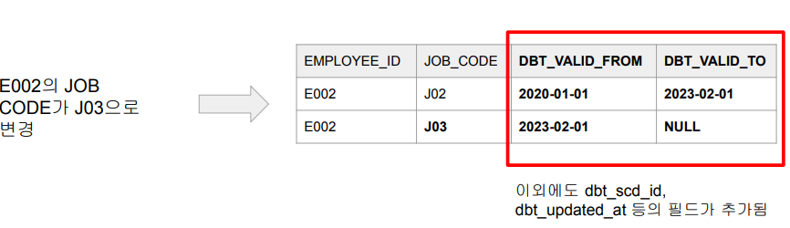

## <u>1. airflowdbt-day5-1-dbt seeds</u>

### dbt Seeds

Contents

1. ELT의 미래는?
2. Database Normalization
3. dbt 소개
4. dbt 사용 시나리오
5. dbt 설치와 환경 설정
6. dbt Models: Input
7. dbt Models: Output \
   **8. dbt Seeds** \
   **9. dbt Sources** \
   **10. dbt Snapshots**
   **11. dbt Tests** \
   **12. dbt Documentation** \
   **13. dbt Expectations** \
   **14. 마무리**

<br>

Seeds 소개

- 많은 dimension 테이블들은 크기가 작고 많이 변하지 않음
- Seeds는 이를 파일 형태로 데이터웨어하우스로 로드하는 방법
  - Seeds는 작은 파일 데이터를 지칭 (보통 csv 파일)
- dbt seed를 실행해서 빌드

<br>

Seeds 실습 (1)

- seeds 폴더 밑에 적당히 .csv 파일을 하나 생성
- 나중에 이 파일 이름으로 테이블이 생성됨
- reference_date

<br>

Seeds 실습 (2)

- 다음으로 dbt seed 실행

<br>

Seeds 실습 (3)

- 실행 결과 확인
- 다른 SQL에서 사용시
  - {{ ref("reference_date") }}

### 실습: CLI:

```bash
$ cd learn_dbt
$ cd seeds
$ vi reference_date.csv
$ dbt seed

## 테이블 변경
seeds:
  learn_dbt:
    reference_date1: # .csv 로드
      +alias: reference_date # table name 생성
$
```

<br>
<br>
<br>

## <u>2. airflowdbt-day5-2-dbt sources</u>

### dbt Sources

Staging 테이블을 만들 때 입력 테이블들이 자주 바뀐다면?

- models 밑의 .sql 파일들을 일일이 찾아 바꿔주어야함
- 이 번거로움을 해결하기 위한 것이 Sources
  - 입력 테이블에 별칭을 주고 별칭을 staging 테이블에서 사용

<br>

Sources 소개

- 기본적으로 처음 입력이 되는 ETL 테이블을 대상으로 함
  - 별칭 제공
  - 최신 레코드 체크 기능 제공
- 테이블 이름들에 별명(alias)을 주는 것
  - 이를 통해 ETL단의 소스 테이블이 바뀌어도 뒤에 영향을 주지 않음
  - 추상화를 통한 변경처리를 용이하게 하는 것
  - 이 별명은 source 이름과 새 테이블 이름의 두 가지로 구성됨
    - 예) raw_data.user_metadata -> pjw7491, metadata
- Source 테이블들에 새 레코드가 있는지 체크해주는 기능도 제공

<br>

Sources 실습 (1)

- models/sources.yml 파일 생성

```yml
version: 2

sources:
  - name: pjw7491
    schema: raw_data
    tables:
      - name: metadata
        identifier: user_metadata
      - name: event
        identifier: user_event
      - name: variant
        identifier: user_variant
```

raw_data.user_metadata는
JINJA에서 source(“pjw7491”, “metadata”)로 지칭됨

<br>

Sources 실습 (2)

- 아래는 src_user_event.sql의 예
  - models 밑의 다른 파일들도 적절하게 변경

```sql
WITH src_user_event AS (
    SELECT * FROM raw_data.user_event -- {{ source ("pjw7491", "event") }}
)
SELECT
    user_id,
    datestamp,
    item_id,
    clicked,
    purchased,
    paidamount
FROM
    src_user_event
```

<br>

Sources 최신성 (Freshness)

- 특정 데이터가 소스와 비교해서 얼마나 최신성이 떨어지는지 체크하는 기능
- dbt source freshness 명령으로 수행
- 이를 하려면 models/sources.yml의 해당 테이블 밑에 아래 추가

```yml
version: 2

sources:
  - name: pjw7491
    schema: raw_data
    tables:
      - name: event
        identifier: user_event
        # 최신성 추가
        loaded_at_field: datestamp # freshness를 결정해주는 필드
        freshness:
          warn_after: { count: 1, period: hour }
          error_after: { count: 24, period: hour }
# 지금 raw_data.user_event 테이블에서 datestamp의 최대값이 현재 시간보다
# 1시간 이상 뒤쳐져 있지만 24시간은 아니라면 warning. 24시간 이상이라면 error
```

<br>

Sources 최신성 (Freshness)

- dbt source freshness 명령으로 수행

<br>

### 실습: CLI:

```bash
$ cd models
$ vi sources.yml
version: 2

sources:
  - name: pjw7491
    schema: raw_data
    tables:
      - name: metadata
        identifier: user_metadata
      - name: event
        identifier: user_event
      - name: variant
        identifier: user_variant
$ cd src
$ vi src_user_metadata.sql
SELECT * FROM raw_data.user_metadata --> {{ source ("pjw7491", "metadata") }}
$ vi src_user_variant.sql
SELECT * FROM raw_data.user_variant --> {{ source ("pjw7491", "variant") }}
$ vi src_user_event.sql
SELECT * FROM raw_data.user_event --> {{ source ("pjw7491", "event") }}
$ cd learn_dbt
$ dbt run
# 최신성
$ vi .\models\sources.yml
- name: event
  identifier: user_event
  # 최신성 추가
  loaded_at_field: datestamp # freshness를 결정해주는 필드
  freshness:
    warn_after: { count: 1, period: hour }
    error_after: { count: 24, period: hour }
$ dbt source freshness
$
```

<br>
<br>
<br>

## <u>3. airflowdbt-day5-3-snapshots</u>

### dbt Snapshots

데이터베이스에서 스냅샷이란?

- Dimension 테이블은 성격에 따라 변경이 자주 생길 수 있음
- dbt에서는 테이블의 변화를 계속적으로 기록함으로써 과거 어느 시점이건 다시 \
  돌아가서 테이블의 내용을 볼 수 있는 기능을 이야기함
  - 이를 통해 테이블에 문제가 있을 경우 과거 데이터로 롤백 가능
  - 다양한 데이터 관련 문제 디버깅도 쉬워짐

<br>

SCD Type 2와 dbt (1)

- Dimension 테이블에서 특정 entity에 대한 데이터가 변경되는 경우
- 예) employee_jobs 테이블

  - 특정 employee_id의 job_code가 바뀌는 경우
  - 변경시간도 같이 추가되어야함

    

<br>

SCD Type 2와 dbt (2)

- Dimension 테이블에서 특정 entity에 대한 데이터가 변경되는 경우
- 새로운 Dimension 테이블을 생성 (history/snapshot 테이블)

  

<br>

dbt의 스냅샷 처리 방법

- 먼저 snapshots 폴더에 환경설정이 됨
- snapshots을 하려면 데이터 소스가 일정 조건을 만족해야함
  - Primary key가 존재해야함
  - 레코드의 변경시간을 나타내는 타임스탬프 필요 (updated_at, modified_at 등등)
- 변경 감지 기준
  - Primary key 기준으로 변경시간이 현재 DW에 있는 시간보다 미래인 경우
- Snapshots 테이블에는 총 4개의 타임스탬프가 존재
  - dbt_scd_id, dbt_updated_at
  - valid_from, valid_to

<br>

dbt snapshot 적용해보기

- snapshots/scd_user_metadata.sql 편집

```sql


{{
    config(
        target_schema='pjw7491',
        unique_key='user_id',
        strategy='timestamp',
        updated_at='updated_at',
        invalidate_hard_deletes=True
    )
}}

SELECT * FROM {{ source('pjw7491', 'metadata') }}


```

<br>

dbt snapshot 실행

- dbt snapshot

<br>

.scd_user_metadata 확인해보기


<br>

raw_data.user_metadata 업데이트 실습 개요

- 소스 테이블의 기존 레코드 하나의 age 그룹을 변경
- 그리고 dbt snapshot 실행
- .scd_user_metadata에 레코드 추가되었는지 확인

<br>

raw_data.user_metadata 업데이트 실습 (1)

- 소스 테이블의 기존 레코드 하나의 age 그룹을 변경

```sql
SELECT *
FROM raw_data.user_metadata
WHERE user_id = 99;
```


```sql
UPDATE raw_data.user_metadata
SET age = '20-29', updated_at = GETDATE()
WHERE user_id = 99;
```


<br>

raw_data.user_metadata 업데이트 실습 (2)

- dbt snapshot 실행

<br>

raw_data.user_metadata 업데이트 실습 (3)

- pjw7491.scd_user_metadata에 레코드 추가되었는지 확인

```SQL
SELECT * FROM pjw7491.scd_user_metadata WHERE user_id = 99;
```


<br>

### 실습: CLI:

```bash
$ cd snapshots
$ vi scd_user_metadata.sql


{{
    config(
        target_schema='pjw7491',
        unique_key='user_id',
        strategy='timestamp',
        updated_ait='updated_at',
        invalidate_hard_deletes=True
    )
}}

SELECT * FROM {{ source('pjw7491', 'metadata') }}


$ dbt snapshot
$
```

<br>
<br>
<br>

## <u>4. airflowdbt-day5-4-dbt-tests와 마무리</u>

### dbt Tests

Tests 소개

- 데이터 품질을 테스트하는 방법
- 두 가지가 존재
  - 내장 일반 테스트 (“Generic”)
    - unique, not_null, accepted_values, relationships 등의 테스트 지원
    - models 폴더
  - 커스텀 테스트 (“Singular”)
    - 기본적으로 SELECT로 간단하며 결과가 리턴되면 “실패”로 간주
    - tests 폴더

<br>

Generic Tests 구현

- models/schema.yml 파일 생성

```yml
version: 2

models:
  - name: dim_user_metadata
    columns:
  - name: user_id
    tests:
      - unique
      - not_null
```

<br>

Generic Tests 실행

- dbt test로 테스트 실행

<br>

Singular Tests 구현

- tests/dim_user_metadata.sql 파일 생성
  - Primary Key Uniqueness 테스트

```sql
SELECT
  *
FROM (
  SELECT
    user_id, COUNT(1) cnt
  FROM
    {{ ref("dim_user_metadata") }}
  GROUP BY 1
  ORDER BY 2 DESC
  LIMIT 1
)
WHERE cnt > 1
```

<br>

Singular Tests 실행

```bash
dbt test로 테스트 실행
```

<br>

하나의 테이블 대상으로 실행해보기

```bash
$ dbt test --select dim_user_metadata
```

- 만일 디버깅하고 싶다면 dbt --debug test --select dim_user_metadata

<br>

### dbt Documentation

dbt 문서화 소개

- 기본 철학은 문서와 소스 코드를 최대한 가깝게 배치하자는 것
- 문서화 자체는 두 가지 방법이 존재
  - 기존 .yml 파일에 문서화 추가 (선호되는 방식)
  - 독립적인 markdown 파일 생성
- 이를 경량 웹서버로 서빙
  - overview.md가 기본 홈페이지가 됨
  - 이미지등의 asset 추가도 가능

<br>

- models 문서화 하기
  - description 키를 추가: models/schema.yml, models/sources.yml

```yml
version: 2

models:
  - name: dim_user_metadata
    description: A dimension table with user metadata
    columns:
      - name: user_id
        description: The primary key of the table
        tests:
          - unique
          - not_null
```

<br>

models 문서 만들기

```bash
$ dbt docs generate
```

- 사용자 권한이 더 있다면 Redshift로부터 더 많은 정보를 가져다가 보여줌
- 결과 파일은 target/catalog.json 파일이 됨

<br>

models 문서 보기

```bash
$ dbt docs serve #로 웹서버 띄우기
```

- Lineage Graph 확인해보기

<br>

### dbt Expectations

dbt Expectations 소개

- Great Expectations에서 영감을 받아 dbt용으로 만든 dbt 확장판
  - https://github.com/calogica/dbt-expectations
- 설치 후 packages.yml에 등록

```yml
packages:
  - package: calogica/dbt_expectations
    version: [">=0.7.0", "<0.8.0"]
```

- 보통은 앞서 dbt 제공 테스트들과 같이 사용
  - models/schema.yml

<br>

dbt Expectations 함수들 일부

- expect_column_to_exist
- expect_row_values_to_have_recent_data
- expect_column_values_to_be_null
- expect_column_values_to_not_be_null
- expect_column_values_to_be_unique
- expect_column_values_to_be_of_type
- expect_column_values_to_be_in_set
- expect_column_values_to_not_be_in_set
- expect_column_values_to_be_between

<br>

요약

- ELT 품질의 중요성
- dbt 소개
- 아주 유용한 기능: Sources, Snapshots
- 데이터 품질 테스트: Tests
- 용이한 Documentation
- 테스트 기능 Expectations

<br>
<br>
<br>

## <u>5. airflowdbt-day5-5-데이터카탈로그기능소개</u>

Contents

1. 데이터 카탈로그 기능 정의
2. 데이터 카탈로그 제품 서베이
3. DataHub 데모

### 데이터 카탈로그가 가져야할 기능

데이터 카탈로그는 주요 데이터 기술 스택!

많은 회사들이 데이터 카탈로그를 메인 데이터 거버넌스 툴로 사용

- Pinterest, Udemy, LinkedIn, Uber, ...

<br>

데이터 카탈로그

- 데이터 자산 메타 정보 중앙 저장소
- 데이터 거버넌스의 첫 걸음
  - 많은 회사에서 데이터 카탈로그를 데이터 거버넌스 툴로 사용하거나 데이터 카탈로그 위에 커스텀 기능을 구현
- 데이터 카탈로그의 중요한 기능
  - (반)자동화된 메타 데이터 수집!
  - 데이터 보안! 보통 메타 데이터만 읽어옴

<br>

데이터 자산의 종류

- 테이블 (데이터베이스)
- 대시보드
- 문서/메세지 (슬랙, JIRA, Github, …)
- ML 피쳐
- 데이터 파이프라인
- 사용자 (HR 시스템)

<br>

데이터 카탈로그 : 데이터 자산의 효율적인 관리 프레임웍

- 다양한 관점에서 데이터를 조직적으로 관리
- 비지니스/데이터 용어 vs. 태그
- 데이터 오너 (Business & Technical)
- 표준화된 문서 템플릿

<br>

데이터 카탈로그 검색 화면 (1)


<br>

데이터 카탈로그 검색 화면 (2)


<br>

일반적인 데이터 카탈로그 아키텍처

<br>

데이터 카탈로그 주요 기능

- 주요 데이터 플랫폼 지원
- 비지니스 용어집 (Business Glossary)
- 주석/문서/태그 등 협업 기능
- 데이터 리니지
- 데이터 모니터링, 감사, 트레이싱
- 강력한 검색 기능 (통합 검색, NLP 검색)
- 데이터 **추천** 기능
- 데이터 유저 퍼소나 (예: 마케팅 분석가)

<br>

데이터 카탈로그 기능 - 주요 데이터 플랫폼 지원 (1)

- Data Warehouses & Data Lakes: Redshift, Snowflake, BigQuery
- BI Tools: Looker, Tableau, Redash, Power BI, Mode, Superset
- ELT: DBT, Spark, Hive, PrestoDB
- ETL Orchestration: Airflow
- NoSQL and others
  - Cassandra, Druid, Elastic Search, Kafka Schema Registry, CSV
- Users: Azure AD, LDAP, …

<br>

잠깐! DBT 소개: ELT

- DBT provides an easy way to implement Transformation in ELT

  

<br>

잠깐! DBT는 Template화된 SQL

- DBT 코드 = SQL + Jinja template = Template화된 SQL
  - 개발자가 작성한 DBT 코드를 타켓 시스템에 맞는 SQL로 바꾸어 실행해줌
- 모델부터 작성하는데 이는 하나의 SELECT 문이라고 보면 됨
  - A model == A SELECT statement
- 여기에 다양한 검증 방법 추가 가능
  - Generic tests
  - One-off tests
- 테이블의 스냅샷 추가 가능

<br>

데이터 카탈로그 기능 - 주요 데이터 플랫폼 지원 (2)


<br>

데이터 카탈로그 기능 - 비지니스 용어집 (Business Glossary)

- 권한이 있는 사람만 용어 정의가 가능
- 계층구조로 관리할 수 있다면 더 유용
  - DataHub의 경우 terms와 terms group 존재

<br>

데이터 카탈로그 기능 - 비지니스 용어와 Entity 연결

- 나중에 다른 entity등과 연결 가능

  

<br>

데이터 카탈로그 기능 - 협업 - 태그

- 태그 vs. 비지니스 용어

  - 전자는 좀더 비공식적인 데이터 분류 방법
  - 보통 후자는 계층 구조 형태의 분류체계를 따라감

  

<br>

데이터 카탈로그 기능 - 협업 - 문서화 표준 제공

<br>

데이터 카탈로그 기능 - 데이터 리니지

- Dataset-to-dataset
  - 보통 SQL 파싱으로 일어남
- Pipeline
  - 입력 데이터셋 -> Data Pipeline -> 출력 데이터셋
  - Airflow에 lineage backend라는 것이 존재
- Dashboard-to-chart
  - 하나의 차트가 여러 대시보드에 소속가능하기에 필요한 리니지
- Chart-to-dataset
- Job-to-dataflow
  - DBT에 특별한 리니지

<br>

데이터 거버넌스 관점에서 데이터 카탈로그의 중요성

- 우리가 갖고 있는 데이터 자산에 대한 통합 뷰를 제공
- 생산성 증대: 설문이나 데이터 티켓의 감소로 확인
- 위험 감소: 잘못된 결정과 개인정보등의 전파 방지
- 인프라 비용 감소: 불필요한 정보의 생성 방지와 안 쓰이는 데이터셋 삭제
- 데이터 티켓 감소
- 데이터 변경으로 인한 이슈 감소
  - 컬럼 레벨 리니지와 CI/CD 프로세스 연동

<br>

데이터 카탈로그 이후 다음 스텝은?

- 자동화된 데이터 거버넌스 관련 웍플로우를 추가
- 일단 시작으로 품질 관련 경보 시스템 구현
  - 중요 메타데이터 변경이나 데이터 품질 이슈 발생시 경보
  - 내가 관심있는 데이터 자산의 오너 변경시 경보 (예: 매출 정의 변경)
- 데이터 관련 지표 리뷰 미팅 운영

<br>
<br>
<br>

## <u>6. airflowdbt-day5-6-데이터카탈로그제품서베이</u>

### 데이터 카탈로그 제품 서베이

데이터 카탈로그 트렌드


<br>

데이터 카탈로그 툴

- 상용제품
  - Alation, Collibra
  - Atlan, Select Star, Great Expectations
- 오픈소스
  - Amundsen (Lyft), DataHub (LinkedIn)
  - AcrylData (DataHub를 상용화)
- 클라우드 서비스
  - AWS Glue Data Catalog
  - Google Cloud Data Catalog
  - Microsoft Azure Data Catalog (Purview Data Catalog로 통합 중)
- 자체 툴
  - DataBook (Uber)
  - DataPortal (Airbnb)

<br>

Atlan 소개
DataHub
Microsoft Azure Purview Data Catalog

### DataHub 소개

DataHub 설치 데모
i. Docker 설치
ii. Docker로 Datahub 설치
iii. 데이터 소스 추가 (Ingestion)
iv. 데이터 검색

<br>
<br>
<br>

## <u>7. airflowdbt-day5-7-최종마무리</u>

### 이번 강의 요약

- Airflow 고급 기능과 운영
- ELT
- 데이터 카탈로그: DataHub

<br>
<br>
<br>
<br>
<br>
<br>

- **Keyword**:

<br>
<br>
<br>
<br>
<br>
<br>
