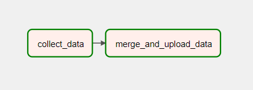
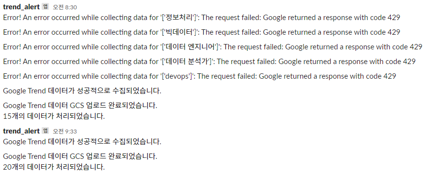

## <u>3차 프로젝트 1일차</u>

### Crontab -> airflow Dags 작성

gcp -> instance1 -> ssh -> docker ps \
docker exec -it <your_airflow_container_id> sh \
docker exec -u root -it <your_airflow_container_id> sh

<br>

dags 폴더: \
/root/learn-airflow/dags/dags

<br>

[파일 이동] \
mv file1.txt backup/

<br>

[ssh키로 접근] \
ssh -i <key_pwd> <id>@<해당 인스턴스 외부 ip>

<br>

[파일 복사] \
cp [source] [destination] \
cp file1.txt copy/

디렉토리를 재귀적으로 복사하려면 -r 옵션 \
cp -r [source_directory] [destination_directory]

<br>
<br>

---

## <u>3차 프로젝트 2일차</u>

---

<br>
<br>

Vi 에디터는

- 명령 모드(command mode),
- 입력 모드(insert mode),
- Visual 모드 등 여러 가지 모드를 사용하는데, 명령 모드에서는 Vi의 명령어들을 사용해야 합니다.

[Vi 에디터 사용에 있어 기본적인 명령어]

- 입력 모드로 전환: 편집하려는 위치에서 i 를 누르면, 입력 모드로 전환되어 텍스트 입력이 가능합니다.

- 명령 모드로 전환: 입력 모드에서는 esc 키를 누르면 명령 모드로 되돌아갑니다.

- 저장 및 종료: 명령 모드에서 :wq 를 입력하고 엔터를 누르면 변경사항을 저장한 후 종료됩니다.

- 저장하지 않고 종료: 명령 모드에서 :q! 를 입력하고 엔터를 누르면 변경사항을 저장하지 않고 종료됩니다.

- 검색: 명령 모드에서 /검색어를 입력하고 엔터를 누르면 해당 검색어를 찾습니다. n 과 N 을 사용하여 검색 결과를 탐색합니다.

- Vi 에디터에서 명령을 취소하려면, 주로 입력 모드에서 되돌리는 방법을 사용합니다.

- 입력 모드에서 문자를 지우려면 Backspace 키 또는 Ctrl + h 를 사용하여 이전 문자를 지울 수 있습니다.

- 명령 모드에서 가장 최근의 명령을 취소하려면 u를 누릅니다.

- 일반적으로 nano 에디터나 다양한 기능을 갖춘 vim 에디터를 사용하면 명령어 입력에 있어 더 다양한 옵션과 편리한 기능을 사용할 수 있습니다.

<br>

docker-compose up --build 명령 # 생략

scheduler에서 exec -it 에서 pip3 install [모듈]

<br>

[로그 확인] \
/learn-airflow/dags/logs/scheduler/

[CLI 테스트]

airflow tasks test <dag_id> <task_id> <execution_date>

<br>
<br>

---

## <u>3차 프로젝트 3일차</u>

---

<br>
<br>

[특정 버전 venv]
py -3.8 -m venv venv
.\venv\Scripts\Activate.ps1

[airflow.providers.google 모듈을 설치]
pip install apache-airflow-providers-google

[검색 키워드 추가 및 함수 구성 변경]

pytrends 라이브러리에는 여러 유용한 함수:

- interest_over_time(): 이 함수는 특정 키워드들에 대한 Google 검색 추세를 시간에 따른 데이터 프레임으로 반환합니다.

```python
interest_over_time_df = pytrends.interest_over_time()
```

- interest_by_region(): 이 함수는 특정 키워드들에 대한 Google 검색 추세를 지역별로 반환합니다. \
  resolution (국가, 지역, 도시), inc_low_vol (낮은 검색량 포함 여부), \
  inc_geo_code (지역 코드 포함 여부)와 같은 추가 인자를 사용하여 결과를 조정할 수 있습니다.

```python
interest_by_region_df = pytrends.interest_by_region(resolution='COUNTRY', inc_low_vol=True, inc_geo_code=False)
```

- related_queries(): 함수는 연관 검색어를 반환합니다. 검색된 키워드와 관련된 키워드를 얻는데 유용합니다.

```python
related_queries = pytrends.related_queries()
```

- top_charts(): 이 함수는 특정 연도와 국가에서 가장 많이 검색된 키워드를 반환합니다.

```python
top_charts = pytrends.top_charts(cid='', date='', geo='US', cat='')
```

- suggestions(): 여기에는 Google에서 추천하는 자동 완성 키워드를 반환하는 함수도 있습니다.

```python
suggestions = pytrends.suggestions("키워드")
```

위의 함수들은 모두 결합하여 pytrends를 사용한 데이터 분석 및 검색량 추이에 대한 개괄적인 정보를 얻을 수 있습니다. \
사용 사례에 맞는 이러한 함수들을 사용해 보시길 추천합니다.

<br>
<br>

---

## <u>3차 프로젝트 4일차</u>

---

<br>
<br>

- 모듈 설치, CLI 명령어, airflow dags 설계
- ~~검색 기간 수정~~
- ~~검색 키워드 추가 작업~~
- ~~dbt?~~ -> Redshift/Spark/Snowflake/BigQuery
- ~~GCP 권한 설정 이슈~~
- ~~예외처리 코드 작성 + slack 알람 코드 작성~~

<br>
<br>

---

## <u>3차 프로젝트 5일차</u>

---

<br>
<br>

- pytrends API 키워드 그룹핑 x
  - 키워드 하나당 검색량 수집 실행
  - raw_data 값 차이가 있음
    -> log 확인 -> (docker 환경) cpu, ram 점유율에 따른 다른 dag에 영향??

[해야 할 작업]

1. github_actions: CICD 테스트
2. looker 사용 대시보드 구성
3. 슬랙 apioperator
4. dbt-bigquery ??

DAG
API에서 추출한 원시데이터를 Xcom push 후, 완료 task로부터 trigger, BigQuery에 Xcom pull하여 tempfile에 저장 후 CSV형태로 변형, 적재하는 2개의 task로 나누어 ETL 구현

Cloud to Cloud DAG graph



적재 완료 알람이 구현된 부분
ETL 결과 알림
Slack web hook을 이용해 알림기능 구현



수집에 실패한 키워드 알람

<br>
<br>
<br>
<br>
<br>
<br>

- **Keyword**:

<br>
<br>
<br>
<br>
<br>
<br>
