## <u>1주차 intro</u>

### 빅데이터 처리와 Spark 소개

Contents

1. 빅데이터 정의와 예
2. 빅데이터 처리가 갖는 특징
3. 하둡의 등장과 소개
4. YARN의 동작 방식
5. 맵리듀스 프로그래밍 소개
6. 하둡 설치와 맵리듀스 프로그래밍 실습
7. Spark 소개
8. Spark 프로그램 실행 옵션

<br>
<br>
<br>

## <u>1주차 Summary</u>

### Summary

요약

- 빅데이터의 처리를 위해 하둡이라는 오픈소스가 등장
  - 분산 파일 시스템과 분산 컴퓨팅 시스템으로 구성
    - HDFS와 맵리듀스/YARN
  - 맵리듀스 프로그래밍의 제약성으로 인해 SQL이 재등장
- Spark은 대세 대용량 데이터 분산 컴퓨팅 기술
  - Pandas + Scikit Learn의 스테로이드 버전
  - SQL과 스트림 데이터와 그래프 처리도 제공

<br>
<br>
<br>

## <u>1. 빅데이터의 정의와 예</u>

### 빅데이터의 정의와 예

빅데이터의 정의 1

- “서버 한대로 처리할 수 없는 규모의 데이터”
- 2012년 4월 아마존 클라우드 컨퍼런스에서 아마존의 data scientist인 존 라우저(John Rauser)가 내린 정의
- 분산 환경이 필요하느냐에 포커스 판다스로 처리해야할 데이터가
- 너무 커서 처리가 불가능하다면 어떻게 할 것인가?

<br>

빅데이터의 정의 2

- “기존의 소프트웨어로는 처리할 수 없는 규모의 데이터”
- 대표적인 기존 소프트웨어 오라클이나 MySQL과 같은 관계형 데이터베이스

  - 분산환경을 염두에 두지 않음
  - Scale-up 접근방식 (vs. Scale-out)

    - 메모리 추가, CPU 추가, 디스크 추가

    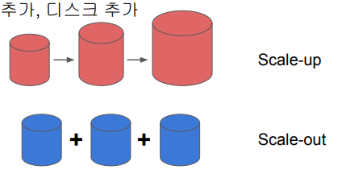

<br>

빅데이터의 정의 3

- 4V (Volume, Velocity, Variety, Varecity)
- Volume: 데이터의 크기가 대용량?
- Velocity: 데이터의 처리 속도가 중요?
- Variety: 구조화/비구조화 데이터 둘다?
- Veracity: 데이터의 품질이 좋은지?

<br>

빅데이터 예 - 디바이스 데이터

- 모바일 디바이스
  - 위치정보
- 스마트 TV
- 각종 센서 데이터 (IoT 센서)
- 네트워킹 디바이스
- …

<br>

빅데이터 예 - 웹

- 수십 조개 이상의 웹 페이지 존재 -> 온갖 종류의 지식의 바다
- 웹 검색엔진 개발은 진정한 대용량 데이터 처리
  - 웹 페이지를 크롤하여 중요한 페이지를 찾아내고 (페이지 랭크) 인덱싱하고 서빙
- 사용자 검색어와 클릭 정보 자체도 대용량
  - 이를 마이닝하여 개인화 혹은 별도 서비스 개발이 가능
    - 검색어를 바탕으로한 트렌드 파악, 통계 기반 번역, …

<br>
<br>
<br>

## <u>2. 빅데이터 처리가 갖는 특징</u>

### 빅데이터 처리가 갖는 특징

빅데이터 처리의 특징은?

- 먼저 큰 데이터를 손실없이 보관할 방법이 필요: **스토리지**
- 처리 시간이 오래 걸림: **병렬처리**
- 이런 데이터들은 비구조화된 데이터일 가능성이 높음: SQL만으로는 부족
  - 예를 들면 웹 로그 파일

<br>

해결 방안은?

- 큰 데이터를 손실없이 보관할 방법이 필요
  - 큰 데이터 저장이 가능한 분산 파일 시스템이 필요
- 시간이 오래 걸림
  - 병렬 처리가 가능한 분산 컴퓨팅 시스템이 필요
- 이런 데이터들은 비구조화된 데이터일 가능성이 높음
  - 비구조화 데이터를 처리할 방법이 필요

-> 결국 다수의 컴퓨터로 구성된 프레임웍이 필요

<br>

대용량 분산 시스템이란?

- 분산 환경 기반 (1대 혹은 그 이상의 서버로 구성)
  - 분산 파일 시스템과 분산 컴퓨팅 시스템이 필요
- Fault Tolerance
  - 소수의 서버가 고장나도 동작해야함
- 확장이 용이해야함
  - Scale Out이 되어야함

<br>
<br>
<br>

## <u>3. 하둡의 등장과 소개</u>

### 하둡의 등장과 소개

하둡(Hadoop)의 등장

- Doug Cutting이 구글랩 발표 논문들에 기반해 만든 오픈소스 프로젝트
  - 2003년 The Google File System
  - 2004년 MapReduce: Simplified Data Processing on Large Cluster
- 처음 시작은 Nutch라는 오픈소스 검색엔진의 하부 프로젝트
  - 하둡은 Doug Cutting의 아들의 코끼리 인형의 이름
  - 2006년에 아파치 톱레벨 별개 프로젝트로 떨어져나옴

<br>

하둡(Hadoop)이란?

- Hortonworks의 정의
  - An open source software platform for distributed storage \
    and distributed processing of very large data sets on \
    computer clusters built from commodity hardware
  - 분산 파일 시스템인 HDFS
  - 분산 컴퓨팅 시스템인 MapReduce
- 다수의 노드로 구성된 클러스터 시스템 (Cluster)
  - 마치 하나의 거대한 컴퓨터처럼 동작
  - 사실은 다수의 컴퓨터들이 복잡한 소프트웨어로 통제됨

<br>

하둡(Hadoop)의 발전

- 하둡 1.0은 HDFS위에 MapReduce라는 분산컴퓨팅 시스템이 도는 구조
  - MapReduce 위에서 다양한 컴퓨팅 언어들이 만들어짐

<br>

하둡(Hadoop)의 발전

- 하둡 2.0에서 아키텍처가 크게 변경됨

  - 하둡은 YARN이란 이름의 분산처리 시스템위에서 동작하는 애플리케이션이 됨
  - Spark은 YARN위에서 애플리케이션 레이어로 실행됨

    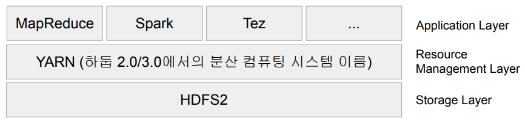

<br>

HDFS - 분산 파일 시스템

- 데이터를 블록단위로 나눠 저장
  - 블록의 크기는 128 MB (디폴트)
- 블록 복제 방식 (Replication)
  - 각 블록은 3 군데에 중복 저장됨
  - Fault tolerance를 보장할 수 있는 방식으로 이 블록들은 저장됨
- **하둡 2.0 내임노드 이중화 지원**

  - Active & Standby
    - 둘 사이에 share edit log가 존재
  - Secondary 내임노드는 여전히 존재

    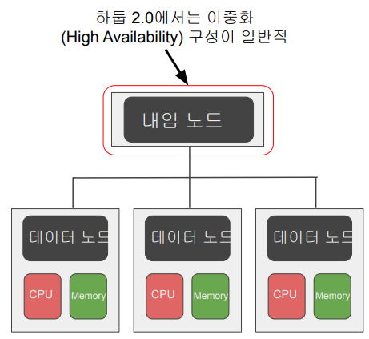

<br>

MapReduce: 분산 컴퓨팅 시스템

- 하둡 1.0
- 하나의 잡 트래커와 다수의 태스크 트래커로 구성됨
  - 잡 트래커가 일을 나눠서 다수의 태스크 트래커에게 분배
  - 태스크 트래커에서 병렬처리
- MapReduce만 지원

  - 제너럴한 시스템이 아님

    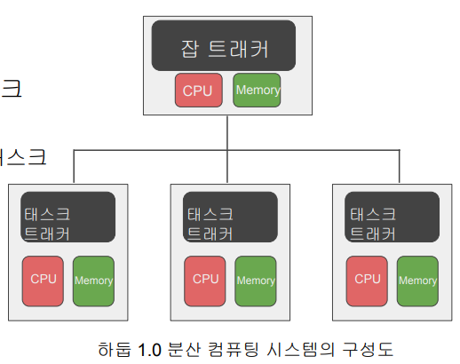

<br>
<br>
<br>

## <u>4. YARN의 동작방식</u>

### YARN의 동작 방식

분산 컴퓨팅 시스템: 하둡 2.0 (YARN 1.0)

- 세부 리소스 관리가 가능한 범용 컴퓨팅 프레임웍
  - 리소스 매니저
    - Job Scheduler, Application Manager
  - 노드 매니저
  - 컨테이너
    - 앱 마스터
    - 태스크
- Spark이 이 위에서 구현됨

  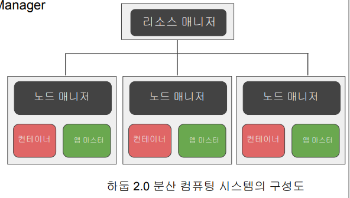

<br>

YARN의 동작

YARN의 동작

1. 실행하려는 코드와 환경 정보를 RM(Resource Manager)에게 넘김

- 실행에 필요한 파일들은 application ID에 해당하는 HDFS 폴더에 미리 복사됨

2. RM은 NM(Node Manager)으로부터 컨테이너를 받아 AM(Application Master) 실행

- AM은 프로그램 마다 하나씩 할당되는 프로그램 마스터에 해당

3. AM은 입력 데이터 처리에 필요한 리소스를 RM에게 요구

- RM은 data locality를 고려해서 리소스(컨테이너)를 할당

4. AM은 할당받은 리소스를 NM을 통해 컨테이너로 론치하고 그 안에서 코드를 실행

- 이 때 실행에 필요한 파일들이 HDFS에서 Container가 있는 서버로 먼저 복사

5. 각 태스크는 상황을 주기적으로 AM에게 보고 (heartbeat)

- 태스크가 실패하거나 보고가 오랜 시간 없으면 태스크를 다른 컨테이너로 재실행

<br>

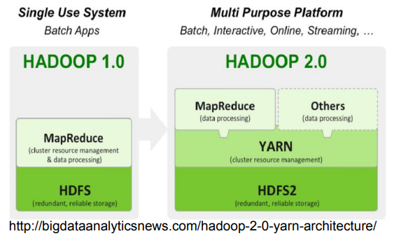

<br>

하둡 3.0의 특징

- YARN 2.0을 사용
  - YARN 프로그램들의 논리적인 그룹(플로우라고 부름)으로 나눠서 자원 \
    관리가 가능. 이를 통해 데이터 수집 프로세스와 데이터 서빙 프로세스를 나눠서 관리 가능
  - 타임라인 서버에서 HBase를 기본 스토리지로 사용 (하둡 2.1)
- 파일 시스템
  - 내임노드의 경우 다수의 스탠바이 내임노드를 지원
  - HDFS, S3, Azure Storage 이외에도 Azure Data Lake Storage 등을 지원

<br>
<br>
<br>

## <u>5. 맵리듀스 프로그래밍 소개</u>

### 맵리듀스 프로그래밍 소개

맵리듀스 프로그래밍의 특징

- 데이터 셋은 Key, Value의 집합이며 변경 불가(immutable)
- 데이터 조작은 map과 reduce 두 개의 오퍼레이션으로만 가능
  - 이 두 오퍼레이션은 항상 하나의 쌍으로 연속으로 실행됨
  - 이 두 오퍼레이션의 코드를 개발자가 채워야함
- 맵리듀스 시스템이 Map의 결과를 Reduce단으로 모아줌

  - 이 단계를 보통 셔플링이라 부르며 네트웍단을 통한 데이터 이동이 생김

    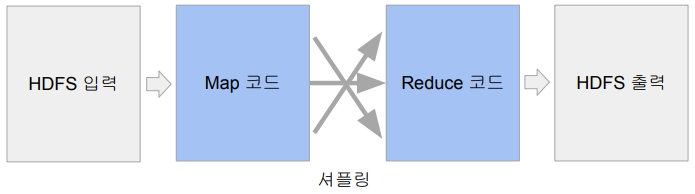

<br>

맵리듀스 프로그래밍의 핵심: 맵과 리듀스

- **Map: (k, v) -> [(k', v')*]**
  - 입력은 시스템에 의해 주어지며 입력으로 지정된 HDFS 파일에서 넘어옴
  - 키, 밸류 페어를 새로운 키, 밸류 페어 리스트로 변환 (transformation)
  - 출력: 입력과 동일한 키, 밸류 페어를 그대로 출력해도 되고 출력이 없어도 됨
- **Reduce: (k’, [v1’, v2’, v3’, v4’, …]) -> (k’’, v'')**
  - 입력은 시스템에 의해 주어짐
  - 맵의 출력 중 같은 키를 갖는 키/밸류 페어를 시스템이 묶어서 입력으로 넣어줌
  - 키와 밸류 리스트를 새로운 키,밸류 페어로 변환
  - SQL의 GROUP BY와 흡사
  - 출력이 HDFS에 저장됨

<br>

MapReduce 프로그램 동작 예시

- Word Count Mapper

```java
public static class TokenizerMapper
    extends Mapper<Object, Text, Text, IntWritable>{

  private final static IntWritable one = new IntWritable(1);
  private Text word = new Text();

  public void map(Object key, Text value, Context context
            ) throws IOException, InterruptedException {
    StringTokenizer itr = new StringTokenizer(value.toString());
    while (itr.hasMoreTokens()) {
      word.set(itr.nextToken());
      context.write(word, one);
    }
  }
}
```

Map: (k, v) -> [(k', v')*]

- Transformation
- 키,밸류 페어를 새로운 키,밸류 페어 리스트로 변환

Input: (100, “the brave yellow lion”)
Output:
[
(“the”, 1),
(“brave”, 1),
(“yellow”, 1),
(“lion”, 1)
]

<br>

Word Count Reducer

```java
public static class IntSumReducer
    extends Reducer<Text,IntWritable,Text,IntWritable> {
  private IntWritable result = new IntWritable();

  public void reduce(Text key, Iterable<IntWritable> values,
              Context context
              ) throws IOException, InterruptedException {
    int sum = 0;
    for (IntWritable val : values) {
      sum += val.get();
    }
    result.set(sum);
    context.write(key, result);
  }
}
```

Reduce: (k’, [v1’, v2’, v3’, v4’, …]) -> (k’’, v'')

- SQL의 GROUP BY와 동일
- 키,밸류 리스트를 새로운 키,밸류 페어로
  변환

Input: ("lion": [1, 1, 1])
Output: ("lion": 3)

<br>

MapReduce: Shuffling and Sorting

- Shuffling
  - Mapper의 출력을 Reducer로 보내주는 프로세스를 말함
  - 전송되는 데이터의 크기가 크면 네트웍 병목을 초래하고 시간이 오래 걸됨
- Sorting

  - 모든 Mapper의 출력을 Reducer가 받으면 이를 키별로 소팅

    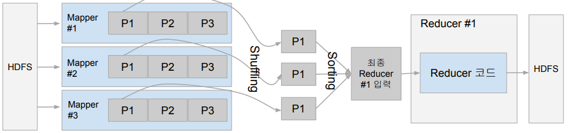

<br>

MapReduce: Data Skew

- 각 태스크가 처리하는 데이터 크기에 불균형이 존재한다면?
  - 병렬처리의 큰 의미가 없음. 가장 느린 태스크가 전체 처리 속도를 결정
  - 특히 Reducer로 오는 데이터 크기는 큰 차이가 있을 수 있음
    - Group By나 Join등에 이에 해당함
    - 처리 방식에 따라 Reducer의 수에 따라 메모리 에러등이 날 수 있음
  - 데이터 엔지니어가 고생하는 이유 중의 하나
    - 빅데이터 시스템에는 이 문제가 모두 존재

<br>

MapReduce 프로그래밍의 문제점

- 낮은 생산성
  - 프로그래밍 모델이 가진 융통성 부족 (2가지 오퍼레이션만 지원)
  - 튜닝/최적화가 쉽지 않음
    - 예) 데이터 분포가 균등하지 않은 경우
- 배치작업 중심
  - 기본적으로 Low Latency가 아니라 Throughput에 초점이 맞춰짐

<br>

MapReduce 대안들의 등장

- 더 범용적인 대용량 데이터 처리 프레임웍들의 등장
  - YARN, Spark
- SQL의 컴백: Hive, Presto등이 등장
  - Hive
    - MapReduce위에서 구현됨. Throughput에 초점. 대용량 ETL에 적합
  - Presto
    - Low latency에서 초점. 메모리를 주로 사용. Adhoc 쿼리에 적합
    - AWS Athena가 Presto 기반

<br>
<br>
<br>

## <u>6-1. 하둡설치 - 맵리듀스 프로그래밍 실행</u>

### 하둡 설치와 맵리듀스 프로그래밍 실습

하둡 설치

- 하둡 3.0을 의사분산 모드로 리눅스 서버에 설치
  - 의사분산 모드는 Hadoop 관련 프로세스들을 개별 JVM으로 실행
  - AWS 우분투 EC2 t2.medium 인스턴스 사용
    - 자바 8이 필요. 우분투 설치 문서 참조
- 데모

```bash
sudo apt update

sudo apt install openjdk-8-jdk -y

java -version; javac -version

sudo apt install openssh-server openssh-client -y

sudo adduser hdoop

su - hdoop

ssh-keygen -t rsa -P '' -f ~/.ssh/id_rsa

cat ~/.ssh/id_rsa.pub >> ~/.ssh/authorized_keys

chmod 0600 ~/.ssh/authorized_keys

ssh localhost

apt-get install -y openssh-server

export PATH=/usr/sbin:/usr/bin:/sbin:/bin

systemctl restart ssh

systemctl status ssh

service ssh start

service ssh status

ssh localhost

# /etc/ssh/sshd_config


# root 사용자 로그인을 허용
PermitRootLogin yes

# 암호 인증을 허용
PasswordAuthentication yes

# SSH 키 기반 인증 사용: 키 기반 인증을 사용하려면,
# 클라이언트의 공개 키를 컨테이너의 /root/.ssh/authorized_keys 파일에 추가


wget https://downloads.apache.org/hadoop/common/hadoop-3.3.4/hadoop-3.3.4.tar.gz

tar xvf hadoop-3.3.4.tar.gz

```

하둡 웹 UI - HDFS

- 내임노드 (포트번호: 9870)
- 데이터노드 (포트번호: 9864)

<br>
<br>
<br>

## <u>6-2. 맵리듀스 프로그래밍 실행</u>

### 맵리듀스 프로그래밍 - 단어수 세기

맵리듀스 프로그래밍 - 단어수 세기

- 앞서 살펴본 WordCount 프로그램 실행해보기
  - bin/hadoop jar hadoop-\*-examples.jar wordcount input output
  - bin/hadoop == bin/yarn
- HDFS 입력/출력 살펴보기
  - bin/hdfs dfs -ls input
  - bin/hdfs dfs -ls output
- 하둡 Web UI (Resource Manager)로 실행 결과 살펴보기
- 데모

```bash

cd ~/hadoop-3.3.4
bin/hdfs dfs -mkdir /user
bin/hdfs dfs -mkdir /user/hdoop
bin/hdfs dfs -mkdir input

# words.txt 파일을 오픈
# the brave yellow lion the lion ate the cow now the lion is happy

bin/hdfs dfs -put words.txt input

bin/hdfs dfs -ls input

bin/hadoop jar share/hadoop/mapreduce/hadoop-mapreduce-examples-3.3.4.jar wordcount input output

bin/hdfs dfs -ls output


bin/hdfs dfs -cat output/part-r-00000
ate	1
brave	1
cow	1
happy	1
is	1
lion	3
now	1
the	4
yellow	1


```

<br>

MapReduce 프로그래밍 문제점

- 생산성이 떨어짐. 데이터 모델과 오퍼레이션에 제약이 많음
- 모든 입출력이 디스크를 통해 이뤄짐
  - 큰 데이터 배치 프로세싱에 적합
- Shuffling 이후에 Data Skew가 발생하기 쉬움
  - Reduce 태스크 수를 개발자가 지정해주어야함

<br>
<br>
<br>

## <u>7. Spark 소개</u>

### Spark 소개

Spark의 등장

- 버클리 대학의 AMPLab에서 아파치 오픈소스 프로젝트로 2013년 시작
  - 나중에 Databricks라는 스타트업 창업
- 하둡의 뒤를 잇는 2세대 빅데이터 기술
  - YARN등을 분산환경으로 사용
  - Scala로 작성됨
- 빅데이터 처리 관련 _다양한_ 기능 제공!

<br>

Spark 3.0의 구성

- Spark Core
- Spark SQL
- Spark ML
  - Spark MLlib
- Spark Streaming
- Spark GraphX

  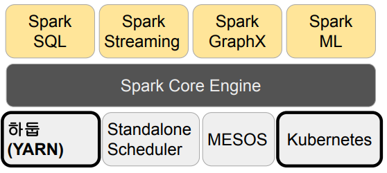

<br>

Spark vs. MapReduce

- Spark은 기본적으로 메모리 기반
  - 메모리가 부족해지면 디스크 사용
  - MapReduce는 디스크 기반
- MapReduce는 하둡(YARN)위에서만 동작
  - Spark은 하둡(YARN)이외에도 다른 분산 컴퓨팅 환경 지원 (K8s, Mesos)
- MapReduce는 키와 밸류 기반 데이터 구조만 지원
  - Spark은 판다스 데이터프레임과 개념적으로 동일한 데이터 구조 지원
- Spark은 다양한 방식의 컴퓨팅을 지원
  - 배치 데이터 처리, 스트림 데이터 처리, SQL, 머신 러닝, 그래프 분석
  - MapReduce는 배치 데이터 처리만

<br>

Spark 프로그래밍 API

- RDD (Resilient Distributed Dataset)
  - 로우레벨 프로그래밍 API로 세밀한 제어가 가능
  - 하지만 코딩 복잡도 증가
- DataFrame & Dataset (판다스의 데이터프레임과 흡사)
  - 하이레벨 프로그래밍 API로 점점 많이 사용되는 추세
  - 구조화 데이터 조작이라면 보통 Spark SQL을 사용
  - DataFrame/Dataset이 꼭 필요한 경우는?
    - ML 피쳐 엔지니어링을 하거나 Spark ML을 쓰는 경우
    - SQL만으로 할 수 없는 일의 경우

<br>

Spark SQL

- Spark SQL은 구조화된 데이터 처리를 SQL로 처리
- 데이터 프레임을 SQL로 처리 가능
  - 데이터프레임은 테이블처럼 sql로 처리 가능
  - 판다스도 동일 기능 제공
- Hive 쿼리 보다 최대 100배까지 빠른 성능을 보장
  - 사실은 그렇지 않음. Hive도 그 사이에 메모리를 쓰는 걸로 발전
    - Hive: 디스크 -> 메모리
    - Spark: 메모리 -> 디스크
    - Presto: 메모리 -> 디스크

<br>

Spark ML

- 머신러닝 관련 다양한 알고리즘, 유틸리티로 구성된 라이브러리
- Classification, Regression, Clustering, Collaborative Filtering, …
  - 전체 리스트는 [링크](https://spark.apache.org/docs/latest/ml-classification-regression.html) 참고. 딥러닝 지원은 미약
- RDD 기반과 데이터프레임 기반의 두 버전이 존재
  - spark.mllib vs. spark.ml
    - spark.mllib가 RDD 기반이고 spark.ml은 데이터프레임 기반
    - spark.mllib는 RDD위에서 동작하는 이전 라이브러리로 더 이상 업데이트가 안됨
  - 항상 spark.ml을 사용할 것!
    - import pyspark.ml(데이터프레임 기반) ~~(import pyspark.mllib)~~(RDD 기반)

<br>

Spark ML의 장점

- 원스톱 ML 프레임웍!
  - 데이터프레임과 SparkSQL등을 이용해 전처리
  - Spark ML을 이용해 모델 빌딩
  - ML Pipeline을 통해 모델 빌딩 자동화
  - MLflow로 모델 관리하고 서빙 (MLOps)
- 대용량 데이터도 처리 가능!

<br>

Spark 데이터 시스템 사용 예들

- 기본적으로 대용량 데이터 배치 처리, 스트림 처리, 모델 빌딩
  - 예 1) 대용량 비구조화된 데이터 처리하기 (ETL 혹은 ELT)
  - 예 2) ML 모델에 사용되는 대용량 피쳐 처리 (배치/스트림)
  - 예 3) Spark ML을 이용한 대용량 훈련 데이터 모델 학습

<br>

Spark 데이터 시스템 사용 예 1

- 대용량 비구조화된 데이터 처리하기 (Hive의 대체 기술)

  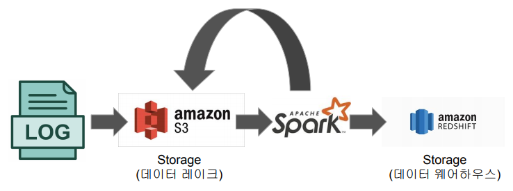

<br>

Spark 데이터 시스템 사용 예 2

- ML 모델에 사용되는 대용량 피쳐 처리

  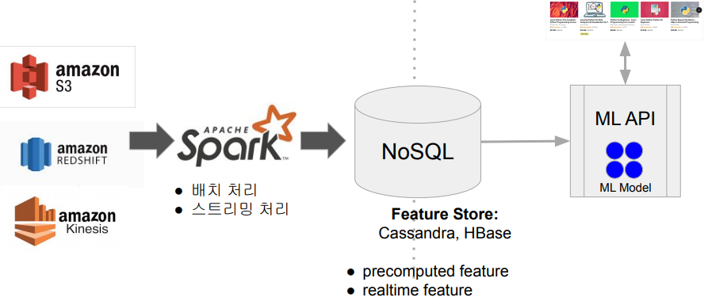

<br>
<br>
<br>

## <u>8. Spark 프로그램 실행 옵션</u>

### Spark 프로그램 실행 옵션

Spark 프로그램 실행 환경

- 개발/테스트/학습 환경 (Interactive Clients)
  - 노트북 (주피터, 제플린)
  - Spark Shell
- 프로덕션 환경 (Submit Job)
  - spark-submit (command-line utility): 가장 많이 사용됨
  - 데이터브릭스 노트북:
    - 노트북 코드를 주기적으로 실행해주는 것이 가능
  - REST API:
    - Spark Standalone 모드에서만 가능
    - API를 통해 Spark 잡을 실행
    - 실행코드는 미리 HDFS등의 파일 시스템에 적재되어 있어야함

<br>

Spark 프로그램의 구조

- Driver
  - 실행되는 코드의 마스터 역할 수행 (YARN의 Application Master)
- Executor
  - 실제 태스크를 실행해주는 역할 수행 (YARN의 컨테이너)

<br>

Spark 프로그램의 구조

- Driver:
  - 사용자 코드를 실행하며 실행 모드(client, cluster)에 따라 실행되는 곳이 달라짐
  - 코드를 실행하는데 필요한 리소스를 지정함
    - --num-executors, --executor-cores, --executor-memory
  - SparkSession을 만들어 Spark 클러스터와 통신 수행
    - Cluster Manager (YARN의 경우 Resource Manager)
    - Executor (YARN의 경우 Container)
  - 사용자 코드를 실제 Spark 태스크로 변환해 Spark 클러스터에서 실행
- Executor:
  - 실제 태스크를 실행해주는 역할 수행 (JVM): Transformations, Actions
  - YARN에서는 Container가 됨

<br>

Spark 클러스터 매니저 옵션

- **local[n]**
- **YARN**
- Kubernetes
- Mesos
- Standalone

<br>

Spark 클러스터 매니저 옵션

- local[n]:

  - 개발/테스트용
    - Spark Shell, IDE, 노트북
  - 하나의 JVM이 클러스터로 동작
  - Driver와 하나의 Executor 실행
  - n은 코어의 수: Executor의 스레드 수가 됨
  - local[*]는 무엇일까?
    - 컴퓨터에 있는 모든 코어 사용

  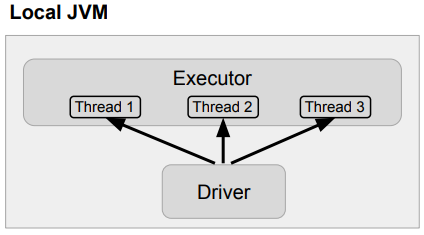

<br>

Spark 클러스터 매니저 옵션

- YARN

  - 두 개의 실행 모드가 존재: Client vs. Cluster
  - Client 모드: Driver가 Spark 클러스터 밖에서 동작
    - YARN 기반 Spark 클러스터를 바탕으로 개발/테스트 등을 할 때 사용
  - Cluster 모드: Driver가 Spark 클러스터 안에서 동작

    - 하나의 Container 슬롯을 차지
    - 실제 프로덕션 운영에 사용되는 모드

    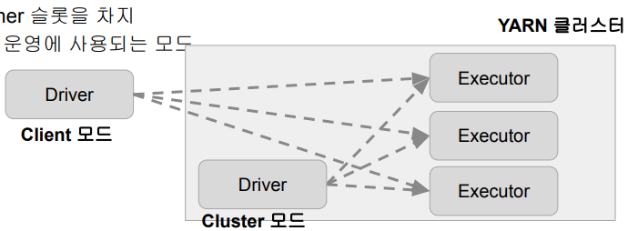

<br>

Spark 클러스터 매니저와 실행 모델 요약

| 클러스터 매니저 | 실행 모드 (deployed mode) | 프로그램 실행 방식       |
| --------------- | ------------------------- | ------------------------ |
| local[n]        | Client                    | Spark Shell, IDE, 노트북 |
| YARN            | Client                    | Spark Shell, 노트북      |
| YARN            | Cluster                   | spark-submit             |

<br>
<br>
<br>

## <u>특강</u>

###

<br>
<br>
<br>
<br>
<br>
<br>

- **Keyword**:

<br>
<br>
<br>
<br>
<br>
<br>
