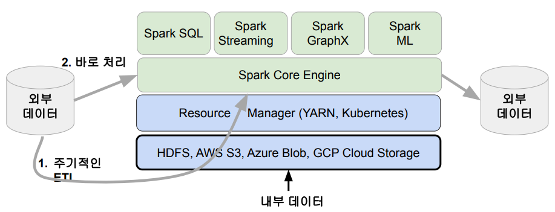
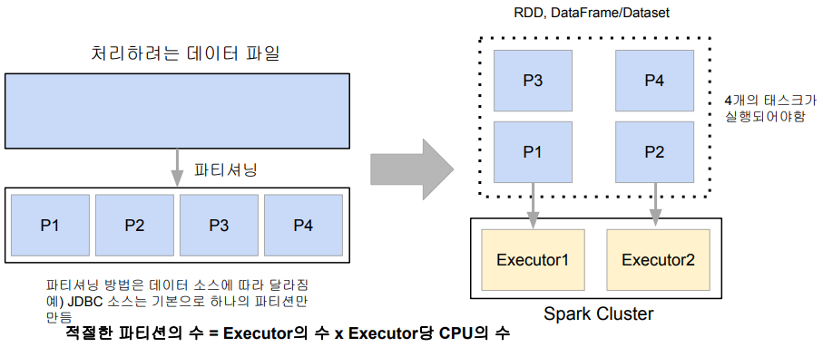
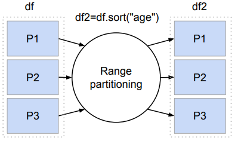
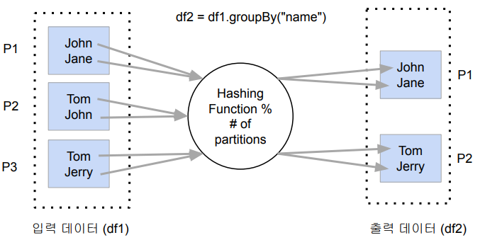
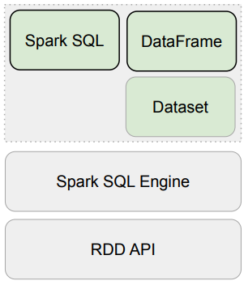
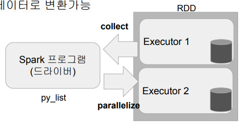
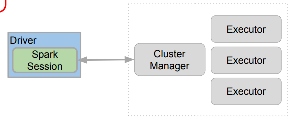
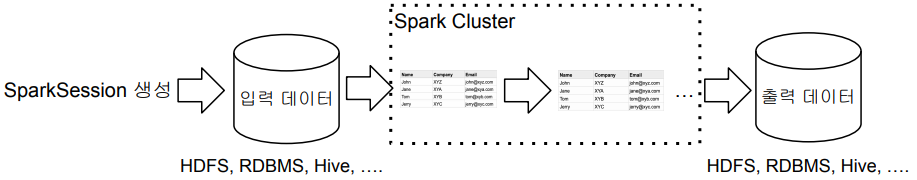
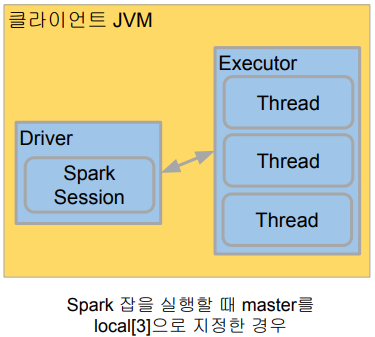

## <u>2주차 intro</u>

### Spark 프로그래밍: DataFrame

Contents

1. Spark 데이터 처리
2. Spark 데이터 구조: RDD, DataFrame, Dataset
3. 프로그램 구조
4. 개발/실습 환경 소개
5. Spark DataFrame 실습

<br>
<br>
<br>

## <u>2주차 Summary</u>

### 요약

- 데이터 처리에서 중요한 개념: Partition, Shuffling
- 데이터 구조: RDD, DataFrame, Dataset
- Spark Session 생성과 설정
- DataFrame 프로그래밍

<br>
<br>
<br>

## <u>1. Spark 데이터 처리</u>

### Spark 데이터 처리

Spark 데이터 시스템 아키텍처


<br>

데이터 병렬처리가 가능하려면?

- 데이터가 먼저 분산되어야함
  - 하둡 맵의 데이터 처리 단위는 디스크에 있는 데이터 블록 (128MB)
    - hdfs-site.xml에 있는 dfs.block.size 프로퍼티가 결정
  - Spark에서는 이를 파티션 (Partition)이라 부름. 파티션의 기본크기도 128MB
    - spark.sql.files.maxPartitionBytes: HDFS등에 있는 파일을 읽어올 때만 적용됨
- 다음으로 나눠진 데이터를 각각 따로 동시 처리
  - 맵리듀스에서 N개의 데이터 블록으로 구성된 파일 처리시 N개의 Map 태스크가 실행
  - Spark에서는 파티션 단위로 메모리로 로드되어 Executor가 배정됨

<br>

처리 데이터를 나누기 -> 파티션 -> 병렬처리



<br>

Spark 데이터 처리 흐름

- 데이터프레임은 작은 파티션들로 구성됨
  - 데이터프레임은 한번 만들어지면 수정 불가 (Immutable)
- 입력 데이터프레임을 원하는 결과 도출까지 다른 데이터 프레임으로 계속 변환
  - sort, group by, filter, map, join, …

<br>

셔플링: 파티션간에 데이터 이동이 필요한 경우 발생

- 셔플링이 발생하는 경우는?
  - 명시적 파티션을 새롭게 하는 경우 (예: 파티션 수를 줄이기)
  - 시스템에 의해 이뤄지는 셔플링
    - 예를 들면 그룹핑 등의 aggregation이나 sorting
- 셔플링이 발생할 때 네트웍을 타고 데이터가 이동하게 됨

  - 몇 개의 파티션이 결과로 만들어질까?
    - spark.sql.shuffle.partitions이 결정
      - 기본값은 200이며 이는 최대 파티션 수
    - 오퍼레이션에 따라 파티션 수가 결정됨
      - random, hashing partition, range partition 등등
      - sorting의 경우 range partition을 사용함
  - 또한 이때 Data Skew 발생 가능!

    

<br>

셔플링: hashing partition

- Aggregation 오퍼레이션

  

<br>

Data Skewness

- Data partitioning은 데이터 처리에 병렬성을 주지만 단점도 존재
  - 이는 데이터가 균등하게 분포하지 않는 경우
    - 주로 데이터 셔플링 후에 발생
  - 셔플링을 최소화하는 것이 중요하고 **파티션 최적화**를 하는 것이 중요.

<br>
<br>
<br>

## <u>2. Spark 데이터 구조</u>

### Spark 데이터 구조: RDD, DataFrame, Dataset

Spark 데이터 구조

- RDD, DataFrame, Dataset (Immutable Distributed Data)
  - 2016년에 DataFrame과 Dataset은 하나의 API로 통합됨
  - 모두 파티션으로 나뉘어 Spark에서 처리됨

|                      | RDD                                                           | DataFrame                       | Dataset                 |
| -------------------- | ------------------------------------------------------------- | ------------------------------- | ----------------------- |
| 무엇인지?            | Distributed collection of records (structured & unstructured) | RDD organized into named column | Extension of data frame |
| 언제 소개?           | 1.0                                                           | 1.3                             | 1.6                     |
| 컴파일타임 타입 체크 | No                                                            | No                              | Yes                     |
| 사용하기 쉬운 API    | No                                                            | Yes                             | Yes                     |
| SparkSQL 기반        | No                                                            | Yes                             | Yes                     |
| Catalyst Optimizer   | No                                                            | Yes                             | Yes                     |

<br>

Spark 데이터 구조

- RDD (Resilient Distributed Dataset)
  - 로우레벨 데이터로 클러스터내의 서버에 분산된 데이터를 지칭
  - 레코드별로 존재하지만 스키마가 존재하지 않음
    - 구조화된 데이터나 비구조화된 데이터 모두 지원
- DataFrame과 Dataset

  - RDD위에 만들어지는 RDD와는 달리 필드 정보를 갖고 있음 (테이블)
  - Dataset은 타입 정보가 존재하며 컴파일 언어에서 사용가능
    - 컴파일 언어: Scala/Java에서 사용가능
  - PySpark에서는 DataFrame을 사용

    

1. Code Analysis
2. Logical Optimization (Catalyst Optimizer)
3. Physical Planning
4. Code Generation (ProjectTungsten)

<br>

Spark 데이터 구조 - RDD

- 변경이 불가능한 분산 저장된 데이터
  - RDD는 다수의 파티션으로 구성
  - 로우레벨의 함수형 변환 지원 (map, filter, flatMap 등등)
- 일반 파이썬 데이터는 parallelize 함수로 RDD로 변환
  - 반대는 collect로 파이썬 데이터로 변환가능

```python
py_list = [
 (1, 2, 3, 'a b c'),
 (4, 5, 6, 'd e f'),
 (7, 8, 9, 'g h i')
]
rdd = sc.parallelize(py_list)
…
print(rdd.collect())
```



<br>

Spark 데이터 구조 - 데이터 프레임

- 변경이 불가한 분산 저장된 데이터
- RDD와는 다르게 관계형 데이터베이스 테이블처럼 컬럼으로 나눠 저장
  - 판다스의 데이터 프레임 혹은 관계형 데이터베이스의 테이블과 거의 흡사
  - 다양한 데이터소스 지원: HDFS, Hive, 외부 데이터베이스, RDD 등등
- 스칼라, 자바, 파이썬과 같은 언어에서 지원

<br>
<br>
<br>

## <u>3. Spark 프로그램 구조</u>

### 프로그램 구조

Spark Session 생성

- Spark 프로그램의 시작은 SparkSession을 만드는 것
  - 프로그램마다 하나를 만들어 Spark Cluster와 통신: Singleton 객체
  - Spark 2.0에서 처음 소개됨
- Spark Session을 통해 Spark이 제공해주는 다양한 기능을 사용

  - DataFrame, SQL, Streaming, ML API 모두 이 객체로 통신
  - config 메소드를 이용해 다양한 환경설정 가능
  - 단 RDD와 관련된 작업을 할때는 SparkSession 밑의 sparkContext 객체를 사용

- [Spark Session API 문서](https://spark.apache.org/docs/3.1.1/api/python/reference/api/pyspark.sql.SparkSession.html)

<br>

Spark 세션 생성 - PySpark 예제

```python
from pyspark.sql import SparkSession # Spark SQL Engine이 중심
# SparkSession은 싱글턴
spark = SparkSession.builder\
    .master("local[*]")\
    .appName('PySpark Tutorial')\
    .getOrCreate()
…
spark.stop()
```



<br>

Spark Session 환경 변수

- Spark Session을 만들 때 [다양한 환경 설정](https://spark.apache.org/docs/latest/configuration.html#spark-configuration)이 가능
- 몇 가지 예
  - executor별 메모리: spark.executor.memory (기본값: 1g)
  - executor별 CPU수: spark.executor.cores (YARN에서는 기본값 1)
  - driver 메모리: spark.driver.memory (기본값: 1g)
  - Shuffle후 Partition의 수: spark.sql.shuffle.partitions (기본값: 최대 200)
- 가능한 모든 환경변수 옵션은 [여기](https://spark.apache.org/docs/latest/configuration.html#application-properties)에서 찾을 수 있음
  - 사용하는 Resource Manager에 따라 환경변수가 많이 달라짐

<br>

Spark Session 환경 설정 방법 4가지

**충돌시 우선순위는 밑으로 갈수록 높음**

- 환경변수

```sh
$SPARK_HOME/conf/spark_defaults.conf # 보통 Spark Cluster 어드민이 관리
```

- spark-submit 명령의 커맨드라인 파라미터
  - 나중에 따로 설명
- SparkSession 만들때 지정
  - SparkConf

<br>

Spark 세션 환경 설정 (1)

- SparkSession 생성시 일일히 지정

```python
from pyspark.sql import SparkSession

# SparkSession은 싱글턴
spark = SparkSession.builder\
    .master("local[*]")\
    .appName('PySpark Tutorial')\
    .config("spark.some.config.option1", "some-value") \
    .config("spark.some.config.option2", "some-value") \
    .getOrCreate()
```

<br>

Spark 세션 환경 설정 (2)

- SparkConf 객체에 환경 설정하고 SparkSession에 지정

```python
from pyspark.sql import SparkSession
from pyspark import SparkConf

conf = SparkConf()
conf.set("spark.app.name", "PySpark Tutorial")
conf.set("spark.master", "local[*]")

# SparkSession은 싱글턴
spark = SparkSession.builder\
    .config(conf=conf) \
    .getOrCreate()
```

<br>

전체적인 플로우

- Spark 세션(SparkSession)을 만들기
- 입력 데이터 로딩
- 데이터 조작 작업 (판다스와 아주 흡사)
  - DataFrame API나 Spark SQL을 사용
  - 원하는 결과가 나올때까지 새로운 DataFrame을 생성
- 최종 결과 저장

  

<br>

Spark Session이 지원하는 데이터 소스

- spark.read(DataFrameReader)를 사용하여 데이터프레임으로 로드
- DataFrame.write(DataFrameWriter)을 사용하여 데이터프레임을 저장
- 많이 사용되는 데이터 소스들
  - HDFS 파일
    - CSV, JSON, Parquet, ORC, Text, Avro
      - Parquet/ORC/Avro에 대해서는 나중에 더 자세히 설명
    - Hive 테이블
  - JDBC 관계형 데이터베이스
  - 클라우드 기반 데이터 시스템
  - 스트리밍 시스템

<br>
<br>
<br>

## <u>4-1. 개발환경소개\_colab설정</u>

### 개발/실습 환경 소개

Spark 개발 환경 옵션

- Local Standalone Spark + Spark Shell
- Python IDE – PyCharm, Visual Studio
- Databricks Cloud – 커뮤니티 에디션을 무료로 사용
- 다른 노트북 – 주피터 노트북, 구글 Colab, 아나콘다 등등

<br>

Local Standalone Spark

- Spark Cluster Manager로 local[n] 지정
  - master를 local[n]으로 지정
  - master는 클러스터 매니저를 지정하는데 사용
- 주로 개발이나 간단한 테스트 용도
- 하나의 JVM에서 모든 프로세스를 실행
  - 하나의 Driver와 하나의 Executor가 실행됨
  - 1+ 쓰레드가 Executor안에서 실행됨
- Executor안에 생성되는 쓰레드 수

  - local:하나의 쓰레드만 생성
  - local[*]: 컴퓨터 CPU 수만큼 쓰레드를 생성

    

<br>

구글 Colab에서 Spark 사용

- PySpark + Py4J를 설치
  - 구글 Colab 가상서버 위에 로컬 모드 Spark을 실행
  - 개발 목적으로는 충분하지만 큰 데이터의 처리는 불가
  - Spark Web UI는 기본적으로는 접근 불가
    - ngrok을 통해 억지로 열 수는 있음
  - Py4J
    - 파이썬에서 JVM내에 있는 자바 객체를 사용가능하게 해줌

### 데모: Colab 예제

<br>
<br>
<br>

## <u>4-2. colab 코딩데모</u>

### 데모: Colab: Python <> RDD <> DataFrame

<br>
<br>
<br>

## <u>4-3. Local Standalone REP 데모</u>

### Mac에서 Local Standalone Spark 사용

- Mac Catalina 혹은 이후 버전 기준
  - Z쉘이 기본으로 사용됨 (그전에는 Bash 쉘)
- 자바 관련 설정
  - JDK8/11이 필요: 터미널에서 java -version 명령으로 체크
  - JAVA_HOME 환경변수를 Z쉘 시작 스크립트(~/.zshrc)에 등록
    - echo export "JAVA_HOME=\$(/usr/libexec/java_home)" >> ~/.zshrc
- Spark 다운로드
- 세부 설치 방법은 Github 문서 참고
- 데모

<br>
<br>
<br>

## <u>5-1. Spark DataFrame 실습1</u>

### Colab 실습 파일: Spark DataFrame 실습

pyspark.sql.types

- IntegerType
- LongType
- FloatType
- StringType
- BooleanType
- TimestampType
- DateType
- ArrayType
- StructType
- StructField
- MapType

<br>

DataFrame의 컬럼을 지칭하는 방식

```python
from pyspark.sql.functions import col, column
stationTemps = minTemps.select(
  "stationID", # 4가지 같은 표현
  col("stationID"),
  column("stationID"),
  minTemps.stationID
)
```

<br>
<br>
<br>

## <u>5-2. Spark DataFrame 실습2</u>

### Colab 실습 파일: Spark DataFrame 실습

<br>
<br>
<br>

## <u>5-3. Spark DataFrame 실습3</u>

### Colab 실습 파일: Spark DataFrame 실습

<br>
<br>
<br>

## <u>5-4. Spark DataFrame 실습4</u>

### Colab 실습 파일: Spark DataFrame 실습

<br>
<br>
<br>

## <u>5-5. Spark DataFrame 실습5</u>

### Colab 실습 파일: Spark DataFrame 실습

<br>
<br>
<br>
<br>
<br>
<br>

- **Keyword**:

<br>
<br>
<br>
<br>
<br>
<br>
