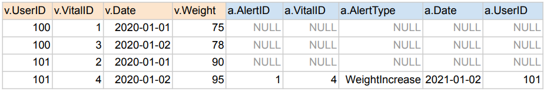
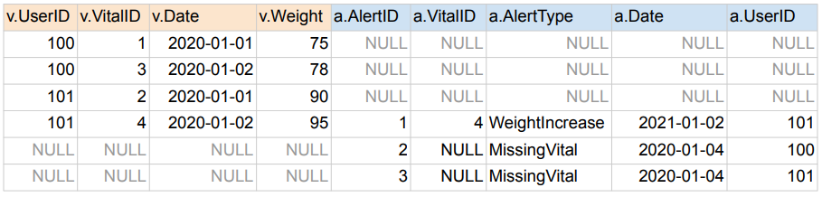
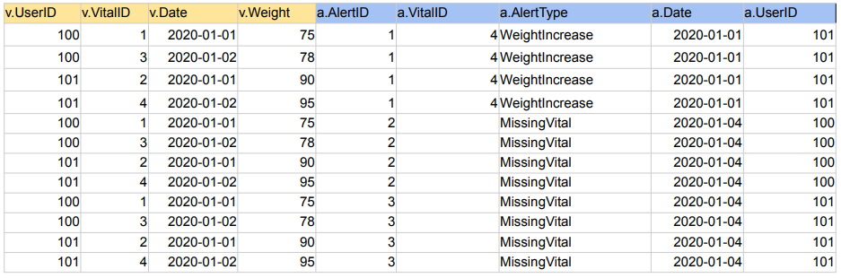
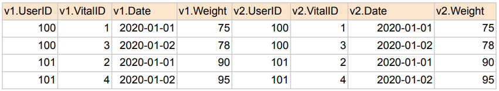
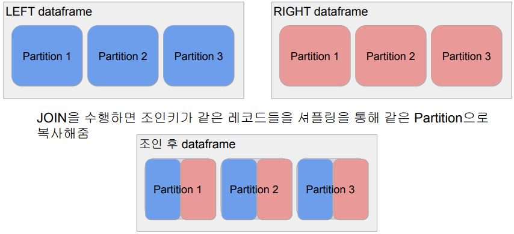
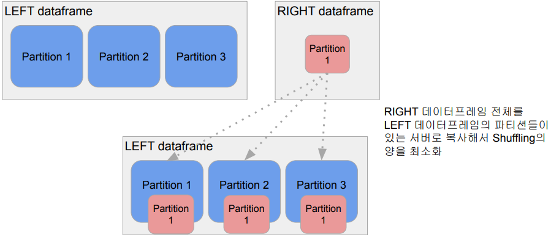
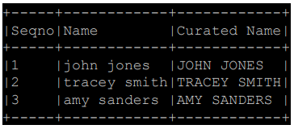
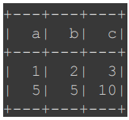
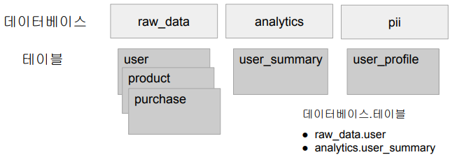
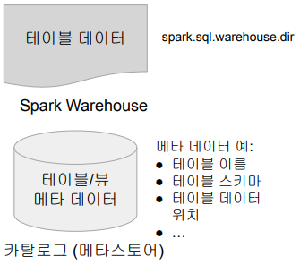

## <u>3주차 intro</u>

### Spark 프로그래밍: SQL

Contents

1. Spark SQL 소개
2. Aggregation, JOIN, UDF
3. Spark SQL 실습
4. Hive 메타스토어 사용하기
5. 유닛 테스트

<br>
<br>
<br>

## <u>1. SparkSQL 소개</u>

### Spark SQL 소개

데이터 분야에서 일하고자 하면 반드시 익혀야할 기본 기술

- 구조화된 데이터를 다루는한 SQL은 데이터 규모와 상관없이 쓰임
- 모든 대용량 데이터 웨어하우스는 SQL 기반
  - Redshift, Snowflake, BigQuery
  - Hive/Presto
- Spark도 예외는 아님
  - Spark SQL이 지원됨

<br>

Spark SQL이란?

- Spark SQL은 구조화된 데이터 처리를 위한 Spark 모듈
- 데이터 프레임 작업을 SQL로 처리 가능
  - 데이터프레임에 테이블 이름 지정 후 sql함수 사용가능
    - 판다스에도 pandasql 모듈의 sqldf 함수를 이용하는 동일한 패턴 존재
  - HQL(Hive Query Language)과 호환 제공
    - Hive 테이블들을 읽고 쓸 수 있음 (Hive Metastore)

<br>

Spark SQL vs. DataFrame

- 하지만 SQL로 가능한 작업이라면 DataFrame을 사용할 이유가 없음
  - 두 개를 동시에 사용할 수 있다는 점 분명히 기억

1. Familiarity/Readability

- SQL이 가독성이 더 좋고 더 많은 사람들이 사용가능

2. Optimization

- Spark SQL 엔진이 최적화하기 더 좋음 (SQL은 Declarative)
  - Catalyst Optimizer와 Project Tungsten

3. Interoperability/Data Management

- SQL이 포팅도 쉽고 접근권한 체크도 쉬움

<br>

Spark SQL 사용법 - SQL 사용 방법

- 데이터 프레임을 기반으로 테이블 뷰 생성: 테이블이 만들어짐
  - createOrReplaceTempView: spark Session이 살아있는 동안 존재
  - createOrReplaceGlobalTempView: Spark 드라이버가 살아있는 동안 존재
- Spark Session의 sql 함수로 SQL 결과를 데이터 프레임으로 받음

```python
namegender_df.createOrReplaceTempView("namegender")
namegender_group_df = spark.sql("""
  SELECT gender, count(1) FROM namegender GROUP BY 1
""")
print(namegender_group_df.collect())
```

<br>

SparkSession 사용 외부 데이터베이스 연결

- Spark Session의 read 함수를 호출(로그인 관련 정보와 읽어오고자
  하는 테이블 혹은 SQL을 지정). \
  결과가 데이터 프레임으로 리턴됨

```python
df_user_session_channel = spark.read \
  .format("jdbc") \
  .option("driver", "com.amazon.redshift.jdbc42.Driver") \
  .option("url", "jdbc:redshift://HOST:PORT/DB?user=ID&password=PASSWORD") \
  .option("dbtable", "raw_data.user_session_channel") \
                      # This can be a SELECT statement
  .load()
```

<br>
<br>
<br>

## <u>2-1. Aggregation-JOIN</u>

### Aggregation, JOIN, UDF

- [UDF](https://stackoverflow.com/questions/43484269/how-to-register-udf-to-use-in-sql-and-dataframe)

<br>

Aggregation 함수

- DataFrame이 아닌 SQL로 작성하는 것을 추천
- 뒤에서 실습시 예를 몇 가지 SQL로 살펴볼 예정

- Group By
- Window
- Rank

<br>

JOIN

- SQL 조인은 두 개 혹은 그 이상의 테이블들을 공통 필드를 가지고 머지
- 스타 스키마로 구성된 테이블들로 분산되어 있던 정보를 통합하는데 사용
- 왼쪽 테이블을 LEFT라고 하고 오른쪽 테이블을 RIGHT이라고 하면
  - JOIN의 결과는 방식에 따라 양쪽의 필드를 모두 가진 새로운 테이블을 생성
  - 조인의 방식에 따라 다음 두 가지가 달라짐
    - 어떤 레코드들이 선택되는지?
    - 어떤 필드들이 채워지는지?

<br>

1. INNER JOIN
2. FULL JOIN
3. CROSS JOIN
4. LEFT JOIN
5. RIGHT JOIN
6. SELF JOIN

<br>

JOIN 실습 - INNER JOIN

1. 양쪽 테이블에서 매치가 되는 레코드들만 리턴함
2. 양쪽 테이블의 필드가 모두 채워진 상태로 리턴됨

```SQL
SELECT * FROM Vital v
JOIN Alert a ON v.vitalID = a.vitalID;
```

<br>

JOIN 실습 - LEFT JOIN

1. 왼쪽 테이블(Base)의 모든 레코드들을 리턴함
2. 오른쪽 테이블의 필드는 왼쪽 레코드와 매칭되는 경우에만 채워진 상태로 리턴됨

```sql
SELECT * FROM raw_data.Vital v
LEFT JOIN raw_data.Alert a ON v.vitalID = a.vitalID;
```



<br>

JOIN 실습 - FULL JOIN

1. 왼쪽 테이블과 오른쪽 테이블의 모든 레코드들을 리턴함
2. 매칭되는 경우에만 양쪽 테이블들의 모든 필드들이 채워진 상태로 리턴됨

```sql
SELECT * FROM raw_data.Vital v
FULL JOIN raw_data.Alert a ON v.vitalID = a.vitalID;
```



<br>

JOIN 실습 - CROSS JOIN

1. 왼쪽 테이블과 오른쪽 테이블의 모든 레코드들의 조합을 리턴함

```sql
SELECT * FROM raw_data.Vital v CROSS JOIN raw_data.Alert a;
```



<br>

JOIN 실습 - SELF JOIN

1. 동일한 테이블을 alias를 달리해서 자기 자신과 조인함

```sql
SELECT * FROM raw_data.Vital v1
JOIN raw_data.Vital v2 ON v1.vitalID = v2.vitalID;
```



<br>

최적화 관점에서 본 조인의 종류들

- Shuffle JOIN
  - 일반 조인 방식
  - Bucket JOIN: 조인 키를 바탕으로 새로 파티션을 새로 만들고 조인을 하는 방식
- Broadcast JOIN
  - 큰 데이터와 작은 데이터 간의 조인
  - 데이터 프레임 하나가 충분히 작으면 작은 데이터 프레임을 다른 데이터 \
    프레임이 있는 서버들로 뿌리는 것 (broadcasting)
    - spark.sql.autoBroadcastJoinThreshold 파라미터로 충분히 작은지 여부 결정

<br>

JOIN을 그림으로 이해하기



JOIN을 수행하면 조인키가 같은 레코드들을 셔플링을 통해 같은 Partition으로 복사

<br>

Broadcast JOIN을 그림으로 이해하기



RIGHT 데이터프레임 전체를 LEFT 데이터프레임의 파티션들이 있는 \
서버로 복사해서 Shuffling의 양을 최소화

<br>
<br>
<br>

## <u>2-2. UDF(User Defined Function)</u>

### UDF란 무엇인가?

- User Defined Function
- DataFrame이나 SQL에서 적용할 수 있는 사용자 정의 함수
- Scalar 함수 vs. Aggregation 함수
  - Scalar 함수 예: UPPER, LOWER, …
  - Aggregation 함수 (UDAF) 예: SUM, MIN, MAX

<br>

UDF (User Defined Function) 사용해보기

- 데이터프레임의 경우 .withColumn 함수와 같이 사용하는 것이 일반적
  - Spark SQL에서도 사용 가능함
- Aggregation용 UDAF(User Defined Aggregation Funtion)도 존재
  - GROUP BY에서 사용되는 SUM, AVG와 같은 함수를 만드는 것
  - PySpark에서 지원되지 않음. Scalar/Java를 사용해야 함

<br>

UDF - DataFrame에 사용해보기 #1

```python
import pyspark.sql.functions as F
from pyspark.sql.types import *

upperUDF = F.udf(lambda z:z.upper())
df.withColumn("Curated Name", upperUDF("Name"))
```

<br>



UDF - SQL에 사용해보기 #1

```python
def upper(s):
    return s.upper()

# 먼저 테스트
upperUDF = spark.udf.register("upper", upper)
spark.sql("SELECT upper('aBcD')").show()

# DataFrame 기반 SQL에 적용
df.createOrReplaceTempView("test")
spark.sql("""SELECT name, upper(name) "Curated Name" FROM test""").show()
```

<br>

UDF - DataFram에 사용해보기 #2

```python
data = [
 {"a": 1, "b": 2},
 {"a": 5, "b": 5}
]
df = spark.createDataFrame(data)
df.withColumn("c", F.udf(lambda x, y: x + y)("a", "b"))
```



<br>

UDF - SQL에 사용해보기 #2

```python
def plus(x, y):
    return x + y

plusUDF = spark.udf.register("plus", plus)
spark.sql("SELECT plus(1, 2)").show()

df.createOrReplaceTempView("test")
spark.sql("SELECT a, b, plus(a, b) c FROM test").show()
```

<br>

UDF - Pandas UDF Scalar 함수 사용해보기

```python
from pyspark.sql.functions import pandas_udf
import pandas as pd

@pandas_udf(StringType())
def upper_udf2(s: pd.Series) -> pd.Series:
    return s.str.upper()

upperUDF = spark.udf.register("upper_udf", upper_udf2)

df.select("Name", upperUDF("Name")).show()
spark.sql("""SELECT name, upper_udf(name) `Curated Name` FROM test""").show()
```

<br>

UDF - DataFrame/SQL에 Aggregation 사용해보기

```python
from pyspark.sql.functions import pandas_udf
import pandas as pd

@pandas_udf(FloatType())
def average(v: pd.Series) -> float:
  return v.mean()

averageUDF = spark.udf.register('average', average)

spark.sql('SELECT average(b) FROM test').show()
df.agg(averageUDF("b").alias("count")).show()
```

<br>
<br>
<br>

## <u>2-3. UDF 실습</u>

### Colab: UDF 실습:

<br>
<br>
<br>

## <u>3-1. SparkSQL 실습1(JOIN)</u>

### Colab: JOIN 실습:

실습 문제들

- 실습 대상 테이블 설명

1. JOIN 실습
2. 매출 사용자 10명 알아내기 (Ranking)
3. 월별 채널별 매출과 방문자 정보 계산하기 (Grouping)
4. 사용자별로 처음 채널과 마지막 채널 알아내기 (Windowing)

<br>
<br>
<br>

## <u>3-2. SparkSQL 실습2(Ranking)</u>

### Colab: 총 매출이 가장 많은 사용자 10명 찾기:

<br>
<br>
<br>

## <u>3-3. SparkSQL 실습3(Grouping)</u>

### Colab: 총 매출이 가장 많은 사용자 10명 찾기:

user_session_channel, session_timestamp, session_transaction 테이블 사용

- 다음 형태의 결과를 만들어보기

3개의 테이블을 각기 데이터프레임으로 로딩

- 데이터프레임별로 테이블 이름 지정
- Spark SQL로 처리
  - 먼저 조인 방식 결정
    - 조인키
    - 조인방식 (INNER, LEFT, RIGHT, FULL)

<br>
<br>
<br>

## <u>3-4. SparkSQL 실습4(Windowing)</u>

### Colab: 사용자별로 처음 채널과 마지막 채널 알아내기:

사용자별로 처음 채널과 마지막 채널 알아내기

- 사용자 251번의 시간순으로 봤을 때 첫 번째 채널과 마지막 채널은 무엇인가?
  - 노가다를 하자면 아래 쿼리를 실행해서 처음과 마지막 채널을 보면 된다.

```SQL
SELECT ts, channel
FROM user_session_channel usc
JOIN session_timestamp st ON usc.sessionid = st.sessionid
WHERE userid = 251
ORDER BY 1
```

```sql
-- ROW_NUMBER를 이용해서 해보자
- ROW_NUMBER() OVER (PARTITION BY field1 ORDER BY field2) nn
-- vs. FIRST_VALUE/LAST_VALUE

```

```sql
-- Window 함수: ROWS BETWEEN AND 이해하기

SELECT value FROM rows_test;
SELECT
  SUM(value) OVER (
  order by value
  rows between 2 preceding and 2 following
  ) AS rolling_sum
FROM rows_test ;
```

<br>
<br>
<br>

## <u>4. Hive-메타스토어 사용하기</u>

### Hive 메타 스토어 사용하기

Spark 데이터베이스와 테이블 (1)

- 카탈로그: 테이블과 뷰에 관한 메타 데이터 관리
  - 기본으로 메모리 기반 카탈로그 제공 - 세션이 끝나면 사라짐
  - Hive와 호환되는 카탈로그 제공 - Persistent
- 테이블 관리 방식

  - 테이블들은 데이터베이스라 부르는 폴더와 같은 구조로 관리 (2단계)

    

<br>

Spark 데이터베이스와 테이블 (2)

- 메모리 기반 테이블/뷰:
  - 임시 테이블로 앞서 사용해봤음
- 스토리지 기반 테이블

  - 기본적으로 HDFS와 Parquet 포맷을 사용
  - Hive와 호환되는 메타스토어 사용
  - 두 종류의 테이블이 존재 (Hive와 동일한 개념)

    - Managed Table
      - Spark이 실제 데이터와 메타 데이터 모두 관리
    - Unmanaged (External) Table

      - Spark이 메타 데이터만 관리

      

<br>

Spark SQL - 스토리지 기반 카탈로그 사용 방법

- Hive와 호환되는 메타스토어 사용
- SparkSession 생성시 enableHiveSupport() 호출
  - 기본으로 “default”라는 이름의 데이터베이스 생성

```python
from pyspark.sql import SparkSession
spark = SparkSession \
 .builder \
 .appName("Python Spark Hive") \
 .enableHiveSupport() \
 .getOrCreate()
```

<br>

Spark SQL - Managed Table 사용 방법

- 두 가지 테이블 생성방법
  - dataframe.saveAsTable("테이블이름")
  - SQL 문법 사용 (CREATE TABLE, CTAS)
- spark.sql.warehouse.dir가 가리키는 위치에 데이터가 저장됨
  - PARQUET이 기본 데이터 포맷
- 선호하는 테이블 타입
- Spark 테이블로 처리하는 것의 장점 (파일로 저장하는 것과 비교시)
  - JDBC/ODBC등으로 Spark을 연결해서 접근 가능 (태블로, 파워BI)

<br>

Spark SQL - External Table 사용 방법

- 이미 HDFS에 존재하는 데이터에 스키마를 정의해서 사용
  - LOCATION이란 프로퍼티 사용
- 메타데이터만 카탈로그에 기록됨
  - 데이터는 이미 존재.
  - External Table은 삭제되어도 데이터는 그대로임

```python
CREATE TABLE table_name (
  column1 type1,
  column2 type2,
  column3 type3,
  …
)
USING PARQUET
LOCATION 'hdfs_path';
```

<br>

### 데모: 실습:

- DataFrame을 Managed Table로 저장하기
- “default”말고 새로운 데이터베이스 사용해보기
- Spark SQL로 Managed Table 사용해보기 (CTAS)

<br>
<br>
<br>

## <u>5. 유닛테스트</u>

### 유닛 테스트

유닛 테스트란?

- 코드 상의 특정 기능 (보통 메소드의 형태)을 테스트하기 위해 작성된 코드
- 보통 정해진 입력을 주고 예상된 출력이 나오는지 형태로 테스트
- CI/CD를 사용하려면 전체 코드의 테스트 커버러지가 굉장히 중요해짐
- 각 언어별로 정해진 테스트 프레임웍을 사용하는 것이 일반적
  - JUnit for Java
  - NUnit for .NET
  - unittest for Python
- unittest를 사용해볼 예정

### 데모: colab: CLI:

[유닛 테스트란?](https://github.com/LearningJournal/Spark-Programming-In-Python/blob/master/01-HelloSpark/test_utile.py)

<br>
<br>
<br>

## <u>3주차 Summary</u>

### 요약

- 데이터 분석에 SQL이 필수적
- Spark에는 Spark SQL 모듈이 존재
- 데이터프레임을 SQL로 처리 가능
- Hive 메타스토어와 같이 많이 사용
- 코드와 SQL 검증을 위한 유닛 테스트 작성

<br>
<br>
<br>
<br>
<br>
<br>

- **Keyword**:

<br>
<br>
<br>
<br>
<br>
<br>
