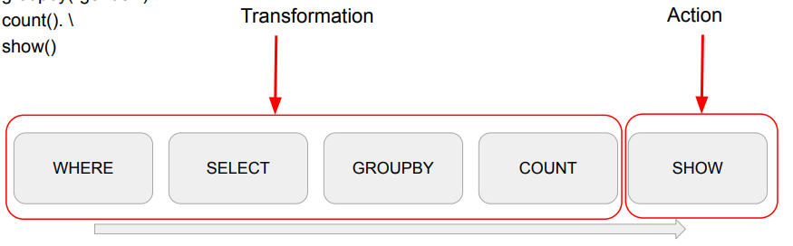

## <u>intro (Spark 내부동작)</u>

### Spark 내부동작

Contents

1. Spark 파일 포맷
2. Execution Plan
3. Bucketing과 Partitioning

<br>
<br>
<br>

## <u>1. Spark 파일포맷</u>

### Spark 파일포맷

데이터는 디스크에 파일로 저장됨: 일에 맞게 최적화 필요

| Unstructured | Semi-structured | Structured   |
| ------------ | --------------- | ------------ |
| Text         | JSON            | PARQUET      |
|              | XML             | AVRO         |
|              | CSV             | ORC          |
|              | CSV             | SequenceFile |

    HUMAN READABLE

<br>

Spark의 주요 파일 타입

| 특징                     | CSV  | Semi-JSON | PARQUET(2) | AVRO |
| ------------------------ | ---- | --------- | ---------- | ---- |
| 컬럼 스토리지            | X    | X         | Y          | X    |
| 압축 가능                | Y    | Y         | Y          | Y    |
| Splittable               | Y(1) | Y(1)      | Y          | Y    |
| Human readable           | Y    | Y         | X          | X    |
| Nested structure support | X    | Y         | Y          | Y    |
| Schema evolution         | X    | X         | Y          | Y    |

(1): 압축되면 Splittable 하지 않음 (압축 방식에 따라 다름 - snappy 압축이라면 Splittable)
(2): Spark의 기본 파일 포맷

gzip으로 압축된 CSV, JSON 파일은 Splittable하지 않기 때문에 \
하나의 executor가 일단 처리하게 되며 메모리 에러가 날 확률이 높음

<br>

Parquet: Spark의 기본 파일 포맷

- 트위터와 클라우데라에서 공동 개발 (Doug Cutting)

  

### 실습: colab:

DataFrame에서 다른 포맷 사용 방법 실습

- DataFrame.write.format("avro"). …
- DataFrame.write.format("parquet"). …

<br>

Schema Evolution 소개

- Parquet 파일 3개로 테스트

  - schema1.parquet
  - schema2.parquet
  - schema3.parquet

    

<br>
<br>
<br>

## <u>2-1. Spark 내부동작</u>

### Execution Plan

다음 데이터 프레임 연산을 자세히 보자

```python
spark.read.option("header", True).csv(“test.csv”). \
  where("gender <> 'F'"). \
  select("name", "gender"). \
  groupby("gender"). \
  count(). \
  show()
```



<br>

Transformations and Actions

- Transformations
  - Narrow Dependencies: 독립적인 Partition level 작업
    1. select, filter, map 등등
  - Wide Dependencies: Shuffling이 필요한 작업
    1. groupby, reduceby, partitionby, repartition 등등
- Actions
  - Read, Write, Show, Collect -> Job을 실행시킴 (실제 코드가 실행됨)
  - Lazy Execution
    1. 어떤 장점이 존재할까?
       - 더 많은 오퍼레이션을 볼 수 있기에 최적화를 더 잘할 수 있음. 그래서 SQL이 더 선호

<br>

Transformations and Actions 시각화

- 다음 DataFrame 조작 코드에 적용해보자

```python
spark.read.option("header", True).csv(“test.csv”). \
  where("gender <> 'F'"). \
  select("name", "gender"). \
  groupby("gender"). \
  count(). \
  show()
```


<br>

Jobs, Stages, Tasks

- Action -> Job -> 1+ Stages -> 1+ Tasks
- Action
  - Job을 하나 만들어내고 코드가 실제로 실행됨
- Job
  - 하나 혹은 그 이상의 Stage로 구성됨
  - Stage는 Shuffling이 발생하는 경우 새로 생김
- Stage
  - DAG의 형태로 구성된 Task들 존재
  - 여기 Task들은 병렬 실행이 가능
- Task

  - 가장 작은 실행 유닛으로 Executor에 의해 실행됨

      <figure style="text-align: center;">
        
        <figcaption style="display: inline-block;">Stage</figcaption>
      </figure>

<br>

Transformations and Actions 시각화

```python
spark.read.option("header", True). \
  csv(“test.csv”). \
  where("gender <> 'F'"). \
  select("name", "gender"). \
  groupby("gender"). \
  count(). \
  show()
```


.option("inferSchema", True)가 추가되면 JOB이 하나 더 추가됨

JOIN Query Visualization


<br>
<br>
<br>

## <u>2-2. Spark 내부동작 실습</u>

### WordCount 코드

```python
spark = SparkSession \
  .builder \
  .master("local[3]") \
  .appName("SparkSchemaDemo") \
  .config("spark.sql.adaptive.enabled", False) \
  .config("spark.sql.shuffle.partitions", 3) \
  .getOrCreate()

df = spark.read.text("shakespeare.txt")
df_count = df.select(explode(split(df.value, " ")).alias("word")).groupBy("word").count()

df_count.show()
```

<br>

- JOIN 코드

```python
spark = SparkSession \
  .builder \
  .master("local[3]") \
  .appName("SparkSchemaDemo") \
  .config("spark.sql.adaptive.enabled", False) \
  .config("spark.sql.shuffle.partitions", 3) \
  .getOrCreate()

df_large = spark.read.json("large_data/")
df_small = spark.read.json("small_data/")

join_expr = df_large.id == df_small.id
join_df = df_large.join(df_small, join_expr, "inner")

join_df.show()

```

<br>

BROADCAST JOIN 코드

```python
from pyspark.sql.functions import broadcast

spark = SparkSession \
  .builder \
  .master("local[3]") \
  .appName("SparkSchemaDemo") \
  .config("spark.sql.adaptive.enabled", False) \
  .config("spark.sql.shuffle.partitions", 3) \
  .getOrCreate()

df_large = spark.read.json("large_data/")
df_small = spark.read.json("small_data/")


join_expr = df_large.id == df_small.id
join_df = df_large.join(broadcast(df_small), join_expr, "inner")

join_df.show()
```

<br>

### 실습: CLI:

<br>
<br>
<br>

## <u>3. Bucketing과 Partitioning</u>

### Bucketing과 Partitioning

Bucketing과 File System Partitioning 소개

- 둘다 Hive 메타스토어의 사용이 필요: saveAsTable
- 데이터 저장을 이후 반복처리에 최적화된 방법으로 하는 것
- Bucketing
  - 먼저 Aggregation이나 Window 함수나 JOIN에서 많이 사용되는 컬럼이 있는지?
  - 있다면 데이터를 이 특정 컬럼(들)을 기준으로 테이블로 저장
    - 이 때의 버킷의 수도 지정
- File System Partitioning
  - 원래 Hive에서 많이 사용
  - 데이터의 특정 컬럼(들)을 기준으로 폴더 구조를 만들어 데이터 저장 최적화
    - 위의 컬럼들을 Partition Key라고 부름

<br>

Bucketing

- DataFrame을 특정 ID를 기준으로 나눠서 테이블로 저장

  - 다음부터는 이를 로딩하여 사용함으로써 반복 처리시 시간 단축
    - DataFrameWriter의 bucketBy 함수 사용
      - Bucket의 수와 기준 ID 지정
  - 데이터의 특성을 잘 알고 있는 경우 사용 가능

    

<br>

File System Partitioning

- 데이터를 Partition Key 기반 폴더 (“Partition") 구조로 물리적으로 나눠 저장
  - ~~DataFrame에서 이야기하는 Partition~~
  - Hive에서 사용하는 Partitioning을 말함
- Partitioning의 예와 잇점
  - 굉장히 큰 로그 파일을 데이터 생성시간 기반으로 데이터 읽기를 많이 한다면?
    1. 데이터 자체를 연도-월-일의 폴더 구조로 저장
    2. 보통 위의 구조로 이미 저장되는 경우가 많음
  - 이를 통해 데이터를 읽기 과정을 최적화 (스캐닝 과정이 줄어들거나 없어짐)
  - 데이터 관리도 쉬워짐 (Retention Policy 적용시)
- DataFrameWriter의 partitionBy 사용
  - Partition key를 잘못 선택하면 엄청나게 많은 파일들이 생성됨!

<br>

File System Partitioning

- 로그데이터 -> 연도 / 월 / 일 / 시간

### 실습: local standalone: colab:

<br>
<br>
<br>

## <u>4. Spark 내부동작 summary</u>

### 요약

- Spark 파일 포맷으로 가장 최적은 PARQUET
- Spark Job 최적화를 위해서는 Execution Plan 확인
- Bucketing과 Partitioning을 통해 입력 데이터 구조를 최적화

<br>
<br>
<br>

## <u>특강</u>

### [특강]데이터 기반의 의사결정 환경 구축기

<br>
<br>
<br>
<br>
<br>
<br>

- **Keyword**: spark transformation, actions, job, stage, HDFS, Bucketing, Partitioning

<br>
<br>
<br>
<br>
<br>
<br>
