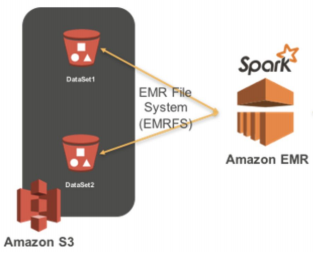

## <u>6. intro Spark 클라우드</u>

### 클라우드 기반 Spark 클러스터

Contents

1. AWS Spark 클러스터 론치
2. AWS Spark 클러스터 상에서 PySpark 잡 실행

 
 
 

## <u>6-1. Spark EMR 론치</u>

### AWS Spark 클러스터 론치

AWS에서 Spark을 실행하려면

- EMR (Elastic MapReduce) 위에서 실행하는 것이 일반적
- EMR이란?
  - AWS의 Hadoop 서비스 (On-demand Hadoop)
    - Hadoop (YARN), Spark, Hive, Notebook 등등이 설치되어 제공되는 서비스
  - EC2 서버들을 worker node로 사용하고 S3를 HDFS로 사용
  - AWS 내의 다른 서비스들과 연동이 쉬움 (Kinesis, DynamoDB, Redshift, …)

 

Spark on EMR 실행 및 사용 과정

- AWS의 EMR (Elastic MapReduce - 하둡) 클러스터 생성
- EMR 생성시 Spark을 실행 (옵션으로 선택)
  - S3를 기본 파일 시스템으로 사용
- EMR의 마스터 노드를 드라이버 노드로 사용

  - 마스터 노드를 SSH로 로그인
    - spark-submit를 사용
  - Spark의 Cluster 모드에 해당

    

 

| 클러스터 매니저 | 실행 모드 (deployed mode) | 프로그램 실행 방식       |
| --------------- | ------------------------- | ------------------------ |
| local[n]        | Client                    | Spark Shell, IDE, 노트북 |
| YARN            | Client                    | Spark Shell, 노트북      |
| YARN            | Cluster                   | spark-submit             |

 

- 스텝 1. EMR 서비스 페이지로 이동

1. AWS 콘솔에서 EMR을 선택
2. Create Cluster 선택

- 스텝 2: EMR 클러스터 생성하기 - 이름과 기술 스택 선택

3. Cluster name 적당히 지정
4. Software configuration

- Spark이 들어간 옵션 선택
- Zeppelin?

  - Zeppelin이란?
  - https://zeppelin.apache.org/: 노트북 (Spark, SQL, Python)

- 스텝 3: EMR 클러스터 생성하기 - 클러스터 사양 선택 후 생성

5. m5.xlarge 노드 3개 선택 -> 하루 $35 비용 발생

- 4 CPU x 2
- 16 GB x 2

6. Create Cluster 선택

- 스텝 4: EMR 클러스터 생성까지 대기

7. Cluster가 Waiting으로 변할 때까지 대기

- 마스터 노드의 포트번호 22번 열기(1)

  - EMR 클러스터 Summary 탭 선택
  - Security groups for Master 링크 선택

- 마스터 노드의 포트번호 22번 열기 (2)

  - Security Groups 페이지에서 마스터 노드의 security group ID를 클릭
  - Edit inbound rules 버튼 클릭 후 Add rule 버튼 선택
  - 포트번호로 22를 입력, Anywhere IP v4 선택, Save rules 버튼 선택

- 스텝 5: Spark History Server 보기

 

### 실습: AWS 웹 UI:

 
 
 

## <u>6-2. Spark EMR 데모 마무리</u>

### AWS Spark 클러스터 상에서 PySpark 잡 실행

PySpark 잡 실행 과정

- Spark 마스터노드에 SSH로 로그인
  - 이를 위해 마스터노드의 TCP 포트번호 22번을 오픈해야함
- spark-submit을 이용해서 실행하면서 디버깅
- 두 개의 잡을 AWS EMR 상에서 실행해 볼 예정

 

입력 데이터를 S3로 로딩

- Stackoverflow 2022년 개발자 서베이 CSV 파일을 S3 버킷으로 업로드
  - 익명화된 83,339개의 서베이 응답
- s3://spark-tutorial-dataset/survey_results_public.csv

 

PySpark 잡 코드 설명

- 입력 CSV 파일을 분석하여 그 결과를 S3에 다시 저장 (stackoverflow.py)
- 미국 개발자만 대상으로 코딩을 처음 어떻게 배웠는지 카운트해서 S3로 저장

 

PySpark 잡 실행

- Spark 마스터노드에 ssh로 로그인하여 spark-submit을 통해 실행
  - 앞서 다운로드받은 .pem 파일을 사용하여 SSH 로그인
  - spark-submit **--master yarn** stackoverflow.py

### 실습: AWS EMP: CLI:

- ssh 키로 접속 후 실행
- Zeppelin 사용법:
  - Application user interfaces
  - Enable an SSH Connection 클릭
  - SSH Tunnel, chrome/extensions 붙이고 작업
  - View web interfaces hosts on Amazon EMR clusters에 링크
    - https://master-public-dns-name:8890/

 
 
 

## <u>7. 강의 마무리 및 다음 스텝</u>

### 요약

- Spark: 2세대 빅데이터 처리 기술
  - 자체 분산 파일 시스템을 갖고 있지 않음
  - DataFrame, SQL, ML, Streaming, Graph와 같은 다양한 기능 지원
    - 빅데이터 처리 종합 선물세트
  - 구조화된 데이터 처리라면 SQL 사용
  - 주로 기능적인 부분 학습
  - Spark 고급 강의에서는 최적화에 관계된 부분의 심화 학습 예정

 

Spark의 다른 용도 (ETL 다음)

- ML Feature 계산
  - 이는 큰 스케일에서는 Feature 계산을 위한 용도
  - DataFrame과 SQL 사용. UDF를 많이 사용하게 됨
- Model Serving
  - MLflow와 연관
- 기타 분석 관련 파이프라인 작성
  - 마케팅 기여도 분석
  - A/B Test 분석

 

다음 스텝

- SQL 심화학습
- DBT 배우기
- Spark 최적화 관련 학습
  - Executor와 Driver의 메모리 사용
  - Spill이란 무엇이며 어떻게 막을 수 있나?
  - Data Skew를 막거나 줄이기 위한 방법들

 
 
 

## <u>1. Spark 데이터 처리</u>

### Spark 데이터 처리

 
 
 

 
 
 
 
 
 

- **Keyword**:

 
 
 
 
 
 
