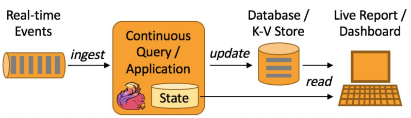

## <u>0. streaming-day1-0-과정소개</u>

### 스트리밍 데이터 처리 소개

Contents

1. 실시간 데이터 처리 소개
2. Udemy 데이터 시스템 발전 여정 소개
3. Kafka 소개
4. Kafka 기본 프로그래밍
5. Spark Streaming 소개
6. Spark Streaming + Kafka 프로그래밍
7. 마무리

 
 
 

## <u>1. streaming-day1-1-구글이 데이터 분야에 끼친 영향(1)</u>

### 1. 실시간 데이터 처리 소개

Contents

1. 구글이 데이터 분야에 끼친 영향
2. 데이터 처리의 발전 단계
3. 실시간 데이터 종류와 사용 사례
4. 실시간 데이터 처리 챌린지

 

구글이 데이터 분야에 끼친 영향

- 구글이 데이터 분야에 끼친 영향은 하둡등을 통한 배치 프로세싱부터 \
  시작해서 텐서플로우, K8s 등등

 

구글 검색 엔진의 등장 (1)

- 1995년 스탠포드 대학에서 박사과정으로 있던 래리 페이지와 세르게이 브린이 \
  1998년에 발표한 웹 검색 서비스

- 그 전까지의 검색 엔진은 기본적으로 웹 페이지 상의 텍스트를 보고 랭킹을 결정

  - 알타비스타, 야후, Ask Jeeves, …
  - 검색 결과 페이지에 온갖 종류의 스팸 웹 페이지들이 넘쳐나기 시작

- 구글은 웹 **페이지들간의 링크를 기반**으로 중요한 페이지를 찾아서 검색 순위 결정
  - 이 알고리즘을 래리 페이지의 이름을 따서 페이지 랭크라고 부름

 

구글 검색 엔진의 등장

- 기존의 강자들을 넘어서 2004년부터 세계 최고의 검색엔진으로 등장
  - 2004년 여름에 상장됨 ($23B)
  - 2021년 2월 기준 $1.41T으로 급성장
    - 검색 마케팅 플랫폼으로 확장 (Google Ads): 오버추어와 경쟁
    - 안드로이드 개발로 모바일 생태계 지배
    - Youtube 인수를 통한 스트리밍 시장 석권
- 다양한 논문 발표와 오픈소스 활동으로 개발자 커뮤니티에 큰 영향을 끼침

 

페이지 랭크 소개 (1)

- [The PageRank Citation Ranking: bringing order to the web](https://www.cis.upenn.edu/~mkearns/teaching/NetworkedLife/pagerank.pdf) (1998)
- 더 중요한 페이지는 더 많은 다른 사이트들로부터 링크를 받는다는 관찰에 기초
- 중요한 페이지가 링크를 건 페이지들 역시 상대적으로 중요한 페이지라는 관찰에 기초

  

 

페이지 랭크 소개 (2)

- 이를 기반으로 계산을 반복하면 웹상의 모든 페이지들에 중요도 점수를 부여할 수 있음
- 페이지 랭크의 계산은 대용량 컴퓨팅 인프라와 소프트웨어 없이는 불가능
- 나중에 구글 검색엔진 아키텍처를 논문으로 외부에 공개

  - ["The Anatomy of a Large-Scale Hypertextual Web Search Engine"](https://www.cis.upenn.edu/~mkearns/teaching/NetworkedLife/pagerank.pdf) (1998)
  - 웹 페이지 본문 텍스트가 아닌 링크 텍스트의 중요성 + 링크를 건 원문 페이지의 중요도 고려

 

검색엔진의 데이터 처리 - 주기적 검색 인덱스 빌딩

1. 웹페이지 접속
2. 웹페이지 콘텐츠 읽기
3. 데이터 저장
4. 페이지 랭크 계산과 검색 인덱스 빌딩 (분산컴퓨팅 시스템)
   - 검색 인덱스를 주기적으로 업데이트: 구글 댄스라고 부름
5. 검색 처리

 
 
 

## <u>2. streaming-day1-2-구글이 데이터 분야에 끼친 영향(2)</u>

### 기술적 진보와 공유 => 빅데이터 시대의 도래 (1)

- 검색엔진은 기본적으로 대량의 데이터를 처리하게 됨
- 수백 조개의 웹페이지를 크롤하고 거기서 나온 텍스트로부터 색인 추출
- 웹페이지 그래프를 기반으로 페이지랭크 계산
- 검색시 대용량 인덱스를 뒤져서 최적의 결과를 찾아내야함
- 다양한 언어 지원이 필요
- 사용자 검색어와 클릭로그를 기반으로 한 각종 마이닝
  - 동의어 찾기
  - 통계기반 번역 (statistical translation)
  - 검색입력 자동 완성(auto-completion)

 

기술적 진보와 공유 => 빅데이터 시대의 도래 (2)

- 구글 랩에서 두 개의 기념비적인 논문을 발표
  - 2003년 The Google File System
  - 2004년 MapReduce: Simplified Data Processing on Large Cluster
- 이를 바탕으로 하둡이라는 오픈소스 프로젝트가 시작됨
  - 이 기술이 빅데이터 처리를 가능하게 해줌
  - 또한 하둡을 시작으로 오픈소스 활동이 한층 더 활발해짐
  - 이런 기반 기술들이 머신러닝, 인공지능의 발전을 가속화함

 

검색 기술과 검색 마케팅의 결합 - 구글 애드워즈

- 구글은 오버추어가 시작한 웹 검색 광고를 발전시켜 구글 애드워즈(AdWords) 라고 명명

  - 지금은 이를 구글 애즈(Ads)라고 부름
  - 사실은 오버추어의 기술을 무단 복사
    - 오버추어가 2002년에 소송을 걸었고 2004년 야후(오버추어)의 승리로 마무리됨
    - 구글이 2백70만개의 주식을 야후로 주는 것으로 정리됨

- 구글과 오버추어의 검색 마케팅 방법의 차이점은?
  - 오버추어가 처음 시작했지만 검색어 경매 방식에 사람이 끼어들어야만 했기에 비효율적이었음
    - 시간이 오래 걸리고 검색어 광고의 성능을 염두에 두지 못함
  - 구글은 처음부터 웹기반 자동화를 염두에 두고 만들어 사람의 개입 없이 검색어 경매와 광고 시스템을 구축
    - 검색어 광고의 성능에 따라 노출 빈도도 결정됨

 

검색엔진 관련 논문 발표 이후 구글의 행보

- AlphaGo:
  - 2016년 3월 이세돌에 4대1로 승리
- TensorFlow:
  - "TensorFlow: Large-Scale Machine Learning on Heterogeneous Distributed Systems" (2016)
  - Paper link: TensorFlow Paper, Open-source project: TensorFlow GitHub
- Kubernetes:
  - "Kubernetes: Up and Running" (2017)
  - Paper link: Kubernetes Paper, Open-source project: Kubernetes GitHub
- Transformer Architecture
  - “Attention is All You Need” (2017)
  - Paper link: Attention is All You Need
- BERT:
  - "BERT: Pre-training of Deep Bidirectional Transformers for Language Understanding" (2018)
  - Paper link: BERT Paper

 
 
 

## <u>3. streaming-day1-3-빅데이터처리의발전단계(1)</u>

### 데이터 처리의 발전 단계

데이터 처리의 일반적인 단계

- 데이터 수집 (Data Collection)
- 데이터 저장 (Data Storage)
- 데이터 처리 (Data Processing)
  - 이 과정에서 서비스 효율을 높이거나 의사결정을 더 과학적으로 하게 됨

 

데이터 저장 시스템의 변천

| 1980년대 후반             | 2000년대 후반         | 2010년 중반                                         | 2021년      |
| ------------------------- | --------------------- | --------------------------------------------------- | ----------- |
| Data Warehouse (Top-down) | Data Lake (Bottom-up) | Cloud Data Platform Messaging Queue (Kafka/Kinesis) | Data Mesh   |
| 중앙 시스템               | 중앙 시스템           | 중앙 시스템                                         | 분산 시스템 |

 

처리량(Throughput) vs. 지연시간(Latency)

- 처리량은 주어진 단위 시간 동안 처리할 수 있는 데이터의 양
  - 클수록 처리할 수 있는 데이터의 양이 큼을 의미. 배치 시스템에서 더 중요 (예: 데이터 웨어하우스)
- 지연 시간은 데이터를 처리하는 데 걸리는 시간
  - 작을수록 응답이 빠름을 의미. 실시간 시스템에서 더 중요함 (예: 프로덕션 DB)
- 대역폭 (Bandwidth) = 처리량 x 지연시간

  

 

SLA (Service Level Agreement)

- 서비스 제공업체와 고객 간의 계약 또는 합의
  - 서비스 제공업체가 제공하는 서비스 품질, 성능 및 가용성의 합의된 수준을 개괄적으로 기술
  - SLA는 통신, 클라우드 컴퓨팅, 등 다양한 산업에서 사용됨
- 사내 시스템들간에도 SLA를 정의하기도 함
  - 이 경우 지연시간 (Latency)나 업타임(Uptime)등이 보통 SLA로 사용됨
    - 예를 들어 업타임이라면 99.9% = 8시간 45.6분
    - API라면 평균 응답 시간 혹은 99% 이상 0.5초 전에 응답이 되어야함 등이 예
  - 데이터 시스템이라면 데이터의 시의성 (Freshness)도 중요한 포인트

 
 
 

## <u>4. streaming-day1-4-빅데이터처리의발전단계(2)</u>

### 배치 처리

- 주기적으로 데이터를 한 곳에서 다른 곳으로 이동하거나 처리
- 처리량(Throughput)이 중요

  

- 배치처리: ~5분 Airflow

 

데이터 배치 처리

- 처리 주기는 보통 분에서 시간, 일 단위
- 데이터를 모아서 처리
- 처리 시스템 구조
  - 분산 파일 시스템(HDFS, S3)
  - 분산 처리 시스템(MapReduce, Hive/Presto, Spark DataFrame, Spark SQL)
  - 처리 작업 스케줄링에 보통 Airflow 사용

 

실시간 처리

- 연속적인 데이터 처리
  - realtime vs. semi-realtime (micro batch)
- 이 경우 **지연시간**(처리속도, Latency)이 중요

  

 

데이터 실시간 처리 (1)

- 배치 처리 다음의 고도화 단계
  - 시스템 관리 등의 복잡도가 증가
- 초단위의 계속적인 데이터 처리
  - 이런 데이터를 보통 Event라고 부르며 이벤트의 특징은 바뀌지 않는 데이터라는 점 (Immutable)
  - 계속해서 발생하는 Event들을 Event Stream이라고 부름
    - Event Stream -> topic(in kafka)

 

데이터 실시간 처리 (2)

- 다른 형태의 서비스들이 필요해지기 시작함
  - 이벤트 데이터를 저장하기 위한 메세지 큐들: Kafka, Kinesis, Pub/Sub, …
  - 이벤트 처리를 위한 처리 시스템: Spark Streaming, Samza, Flink, …
  - 이런 형태의 데이터 분석을 위한 애널리틱스/대시보드: Druid

 

데이터 실시간 처리 (3)

- 처리 시스템 구조 \
  a. Producer(Publisher)가 있어서 데이터 생성 \
  b. 생성된 데이터를 메세지 큐와 같은 시스템에 저장
  - Kafka, Kinesis, PubSub 등의 시스템 존재
  - 데이터 스트림(Kafka에서는 토픽이라 부름)마다 별도의 데이터 보유 기한 설정 \
    c. Consumer (Subscriber)가 있어서 큐로부터 데이터를 읽어서 처리
  - Consumer마다 별도 포인터 유지. 다수의 Consumer가 데이터 읽기를 공동 수행하기도 함

 

람다 아키텍처 (Lambda Architecture)

- 배치 레이어와 실시간 레이어 두 개를 별도로 운영
- 여기에도 다양한 아키텍처가 존재. 그 중 2개를 뒤에서 살펴볼 예정

 

람다 아키텍처 (Lambda Architecture)

 

데이터 실시간 처리의 장점

- 즉각적인 인사이트 발견
- 운영 효율성 향상
- 사고와 같은 이벤트에 대한 신속 대응
- 더 효율적인 개인화된 사용자 경험
- IoT 및 센서 데이터 활용
- 사기 탐지 및 보안
- 실시간 협업 및 커뮤니케이션

 

데이터 실시간 처리: Realtime vs. Semi-Realtime

- Realtime
  - 짧은 Latency
  - 연속적인 데이터 스트림
  - 이벤트 중심 아키텍처: 수신 데이터 이벤트에 의해 작업이나 계산이 트리거되는 구조
  - 동적 및 반응형: 데이터 스트림의 변화에 동적으로 대응하여 \
    실시간 분석, 모니터링 및 의사 결정을 수행
- Semi-Realtime
  - 합리적인 Latency
  - 배치와 유사한 처리 (Micro-batch)
  - 적시성과 효율성 사이의 균형: 처리 용량과 리소스 활용도를 \
    높이기 위해 일부 즉각성을 희생하기도 함
  - 주기적인 업데이트

 
 
 

 
 
 

 
 
 
 
 
 

- **Keyword**:

 
 
 
 
 
 
